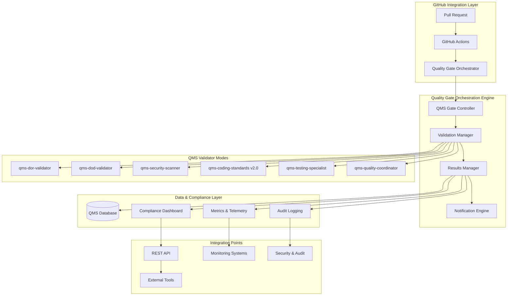
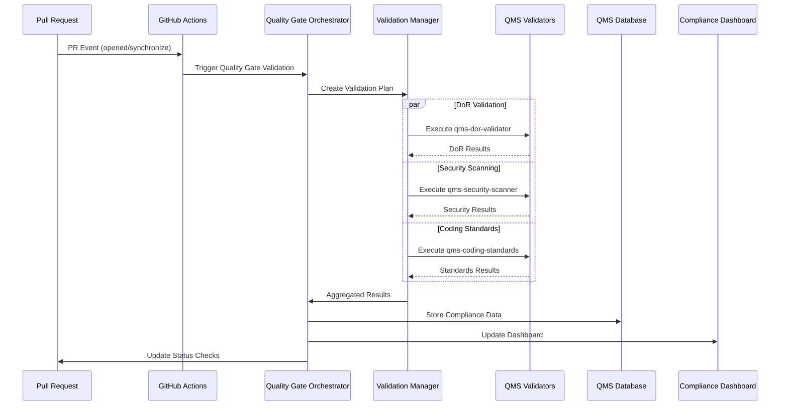

+++
# --- Basic Metadata ---
id = "qms-quality-gate-integration-arch-v1"
title = "QMS Quality Gate Integration Architecture v1.0"
context_type = "architecture"
scope = "QMS Phase 2.3 - Step 4: Comprehensive quality gate integration with automation and enforcement"
target_audience = ["devops", "qms", "development-leads", "security", "architects"]
granularity = "detailed"
status = "active"
created_date = "2025-08-16T22:36:00Z"
updated_date = "2025-08-16T22:36:00Z"
author = "lead-devops"
version = "1.0"
tags = ["qms", "quality-gates", "integration", "automation", "devops", "ci-cd", "compliance", "orchestration"]
related_context = [
    ".ruru/tasks/QMS_PHASE2/TASK-QMS-20250816-212102.md",
    ".ruru/docs/qms/workflows/4-step-qms-review-workflow-v1.md",
    ".ruru/docs/qms/github-integration/workflows/qms-dor-validation.yml", 
    ".ruru/docs/qms/workflows/review-delegation-system-v1.md",
    ".ruru/modes/qms-dor-validator/qms-dor-validator.mode.md",
    ".ruru/modes/qms-dod-validator/qms-dod-validator.mode.md",
    ".ruru/modes/qms-security-scanner/qms-security-scanner.mode.md",
    ".ruru/modes/qms-coding-standards/qms-coding-standards.mode.md",
    ".ruru/modes/qms-quality-coordinator/qms-quality-coordinator.mode.md"
]
relevance = "Critical: Defines the complete QMS quality gate integration and orchestration architecture"
+++

# QMS Quality Gate Integration Architecture v1.0

## Executive Summary

This document defines the comprehensive Quality Gate Integration Architecture that orchestrates all QMS validation modes, automates quality enforcement, provides real-time compliance monitoring, and integrates seamlessly with the existing 4-step QMS workflow, GitHub PR automation, and intelligent review delegation systems.

## Architecture Overview

### System Integration Map



### Core Principles

1. **Event-Driven Architecture**: All quality gates respond to GitHub PR lifecycle events
2. **Fail-Fast Strategy**: Early validation prevents wasted cycles on non-compliant changes
3. **Parallel Execution**: Independent validations run concurrently for speed
4. **Intelligent Routing**: Smart delegation based on change analysis and context
5. **Comprehensive Reporting**: Real-time status updates and historical compliance tracking
6. **Security-First**: Security scanning integrated at every validation level

## Component Architecture

### 1. Quality Gate Orchestration Engine

#### 1.1 QMS Gate Controller
**Purpose**: Central coordinator that manages the entire quality gate lifecycle

**Responsibilities**:
- Parse GitHub PR events and extract change metadata
- Determine required validation phases based on change analysis
- Coordinate validator mode execution with proper sequencing
- Manage blocking/non-blocking gate enforcement
- Handle escalation and override workflows

**Interface**:
```yaml
inputs:
  - github_event: PR lifecycle events (opened, synchronize, ready_for_review)
  - pr_metadata: Title, description, labels, files changed, reviewer requests
  - qms_config: Quality gate rules and thresholds
outputs:
  - validation_plan: Ordered list of required validations
  - gate_status: Overall quality gate pass/fail status
  - detailed_results: Per-validator detailed findings
```

#### 1.2 Validation Manager
**Purpose**: Executes individual QMS validator modes in parallel or sequence

**Responsibilities**:
- Instantiate and configure QMS validator modes
- Manage execution timeouts and retry logic
- Aggregate validation results from multiple modes
- Handle mode-specific error conditions and recovery

**Validator Integration Points**:
```yaml
qms-dor-validator:
  trigger: PR creation, title/description updates
  blocking: true
  timeout: 300s
  retry_count: 2
  
qms-security-scanner:
  trigger: Code changes in security-sensitive paths
  blocking: true
  timeout: 600s
  parallel_execution: true
  
qms-coding-standards:
  trigger: All code changes
  blocking: false  # Warning mode initially
  timeout: 180s
  
qms-dod-validator:
  trigger: PR marked ready for review
  blocking: true
  timeout: 300s
  depends_on: [dor-validation, security-scan]
```

#### 1.3 Results Manager  
**Purpose**: Consolidates validation results and manages status reporting

**Responsibilities**:
- Aggregate results from all executed validators
- Calculate overall compliance score and gate status
- Generate detailed compliance reports
- Update GitHub PR status checks and comments
- Store historical compliance data for trending analysis

### 2. Enhanced Validator Mode Integration

#### 2.1 DoR/DoD Integration Enhancement
**Current State**: Basic DoR/DoD validator modes exist
**Enhancement**: Deep integration with quality gate orchestration

```yaml
enhanced_integration:
  dor_validation:
    automated_triggers:
      - PR creation
      - Title/description changes
      - Label modifications
    validation_areas:
      - PR metadata compliance (title format, description requirements)
      - Issue linkage verification  
      - Acceptance criteria validation
      - Branch naming convention compliance
    blocking_behavior: "STRICT"
    
  dod_validation:
    automated_triggers:
      - PR marked ready for review
      - Final commit before merge
    validation_areas:
      - Test coverage thresholds
      - Documentation updates
      - Security scan completion
      - Performance regression checks
    blocking_behavior: "STRICT"
```

#### 2.2 Security Scanning Automation
**Integration with qms-security-scanner mode**:

```yaml
security_integration:
  scanning_triggers:
    - Code changes in security-sensitive directories
    - Dependency updates (package.json, requirements.txt, etc.)
    - Infrastructure configuration changes
    - Authentication/authorization code modifications
  
  scan_types:
    static_analysis:
      tools: [semgrep, bandit, eslint-security, gosec]
      severity_threshold: "MEDIUM"
      blocking: true
      
    dependency_scanning:
      tools: [snyk, dependabot, audit]
      vulnerability_threshold: "HIGH" 
      blocking: true
      
    secrets_detection:
      tools: [truffleHog, detect-secrets]
      blocking: true
      false_positive_handling: true
      
    infrastructure_scanning:
      tools: [checkov, tfsec, kube-score]
      policy_violations: "CRITICAL"
      blocking: true
```

#### 2.3 Enhanced Coding Standards (v2.0.0)
**Integration with qms-coding-standards mode**:

```yaml
coding_standards_integration:
  validation_scope:
    - Code formatting and style compliance
    - Architecture pattern adherence  
    - Documentation coverage
    - Code complexity metrics
    - Performance anti-patterns
    
  enforcement_levels:
    strict_mode:
      blocking: true
      auto_fix: false
      violation_threshold: 0
      
    warning_mode:
      blocking: false
      auto_fix: true  
      violation_threshold: 5
      
    learning_mode:
      blocking: false
      auto_fix: false
      reporting_only: true
```

### 3. Test Coverage Validation System

#### 3.1 Coverage Metrics Collection
```yaml
test_coverage_system:
  coverage_types:
    unit_tests:
      threshold: 80%
      blocking: true
      tools: [jest, pytest, go-test]
      
    integration_tests:
      threshold: 70%
      blocking: true
      tools: [cypress, selenium, postman]
      
    e2e_tests:
      threshold: 60%
      blocking: false
      critical_path_coverage: 100%
      
  coverage_calculation:
    line_coverage: true
    branch_coverage: true
    function_coverage: true
    statement_coverage: true
    
  reporting:
    format: [json, xml, html, lcov]
    storage: QMS database + file artifacts
    trending: 30-day historical analysis
```

#### 3.2 Automated Test Execution
```yaml
automated_testing:
  test_triggers:
    - Code changes in source directories
    - Test file modifications  
    - Configuration changes affecting test execution
    
  execution_strategy:
    parallel_execution: true
    test_selection: "affected_tests_only"
    timeout_per_suite: 600s
    retry_on_failure: 2
    
  test_environments:
    unit: "local_runner"
    integration: "docker_compose"
    e2e: "staging_environment"
```

### 4. Compliance Dashboard & Status Reporting

#### 4.1 Real-Time Dashboard Components
```yaml
dashboard_architecture:
  overview_panel:
    metrics:
      - Overall compliance score (percentage)
      - Active quality gate violations
      - PR processing throughput
      - Average validation time
      
  detailed_views:
    pr_status_view:
      - Per-PR validation status
      - Blocking vs non-blocking issues
      - Historical PR compliance trends
      
    validator_performance:
      - Per-validator success rates
      - Average execution times
      - Error frequency analysis
      
    compliance_trends:
      - Weekly/monthly compliance scores
      - Violation category breakdown
      - Team performance comparisons
```

#### 4.2 Notification & Alerting System
```yaml
notification_system:
  channels:
    github_comments:
      - Validation result summaries
      - Action required notifications
      - Auto-generated remediation suggestions
      
    slack_integration:
      - Team channel notifications for violations
      - Direct messages for assigned reviewers
      - Daily compliance summary reports
      
    email_alerts:
      - Critical security violations
      - Compliance threshold breaches
      - Weekly compliance reports for management
      
  escalation_rules:
    immediate_attention:
      - Security vulnerabilities (HIGH/CRITICAL)
      - DoR/DoD validation failures
      - System downtime events
      
    daily_summary:
      - Coding standards violations
      - Test coverage regressions
      - Performance metric changes
```

## Implementation Strategy

### Phase 1: Foundation (Current - Step 4)
1. ✅ Design quality gate integration architecture
2. 🔄 Implement quality gate orchestration engine
3. 🔄 Enhance DoR/DoD validator integration
4. 🔄 Integrate security scanning automation

### Phase 2: Advanced Validation (Next Sprint)
1. Connect enhanced coding standards validation (v2.0.0)
2. Implement comprehensive test coverage validation
3. Build compliance dashboard foundation
4. Create notification and alerting system

### Phase 3: Intelligence & Optimization (Future Sprint)
1. Add ML-based validation optimization
2. Implement predictive compliance analytics
3. Advanced performance monitoring integration
4. Self-healing validation system capabilities

## Data Flow Architecture

### 1. PR Lifecycle Integration


### 2. Data Storage Schema
```yaml
qms_database_schema:
  pr_validations:
    id: string (UUID)
    pr_number: integer
    repository: string
    validation_timestamp: datetime
    overall_status: enum [PASS, FAIL, WARNING]
    blocking_violations: integer
    non_blocking_violations: integer
    
  validation_results:
    validation_id: string (FK to pr_validations)
    validator_mode: string
    status: enum [PASS, FAIL, TIMEOUT, ERROR]
    execution_time_ms: integer
    detailed_findings: json
    
  compliance_metrics:
    date: date
    repository: string
    compliance_score: float (0-100)
    total_prs: integer
    passed_validations: integer
    failed_validations: integer
```

## Security & Compliance Considerations

### 1. Access Control
- QMS validator modes operate with minimal required permissions
- Secrets management via GitHub Actions secrets and HashiCorp Vault
- Audit logging for all quality gate decisions and overrides
- Role-based access for compliance dashboard and reporting

### 2. Data Privacy
- PR content scanning complies with data retention policies
- Sensitive data detection and redaction in logs
- Encrypted storage for compliance metrics and historical data
- GDPR compliance for user activity tracking

### 3. Reliability & Performance
- Circuit breaker patterns for external service integrations
- Graceful degradation when individual validators fail
- Performance monitoring and SLA tracking for validation times
- Automated rollback capabilities for quality gate configuration changes

## Integration Testing Strategy

### 1. Component Integration Tests
- Mock GitHub PR events for orchestration testing
- Validator mode integration with known test cases
- Database connectivity and data persistence verification
- Dashboard API endpoint testing

### 2. End-to-End Validation
- Full PR lifecycle simulation with actual QMS validator modes
- Performance testing under realistic load scenarios
- Failure recovery and escalation testing
- Cross-browser dashboard compatibility testing

## Monitoring & Observability

### 1. Key Performance Indicators (KPIs)
```yaml
qms_kpis:
  efficiency_metrics:
    - Average validation time per PR
    - Validator mode success rate (%)
    - False positive rate for blocking violations
    - Time to resolution for quality gate failures
    
  quality_metrics:
    - Overall compliance score trend
    - Security vulnerability detection rate
    - Test coverage improvement over time
    - Code quality score progression
    
  operational_metrics:
    - System uptime and availability
    - Validation throughput (PRs/hour)
    - Resource utilization (CPU/memory)
    - Error rate by component
```

### 2. Alerting Thresholds
```yaml
alerting_configuration:
  critical_alerts:
    - Validation system downtime > 5 minutes
    - Security scanner failure rate > 10%
    - Overall compliance score drop > 15%
    
  warning_alerts:
    - Average validation time > 10 minutes
    - False positive rate > 5%
    - Dashboard API response time > 2 seconds
```

## Conclusion

This Quality Gate Integration Architecture provides a comprehensive, scalable, and secure foundation for automated quality enforcement across the entire development lifecycle. By integrating seamlessly with existing QMS validator modes and GitHub workflows, it ensures consistent quality standards while maintaining developer productivity and system reliability.

The phased implementation approach allows for incremental rollout and validation, while the extensive monitoring and observability features provide the insights needed for continuous improvement and optimization.