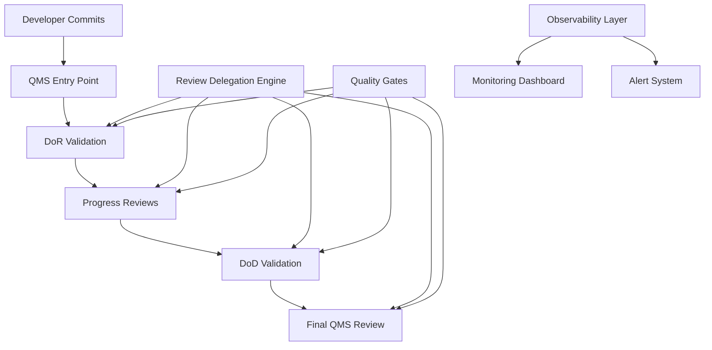

+++
# --- Document Metadata ---
id = "qms-comprehensive-developer-guide-v1"
title = "Comprehensive QMS Developer Guide v1.0"
context_type = "guide"
scope = "Complete developer guide for QMS 4-step review process integration"
target_audience = ["developers", "team-leads", "qms-coordinators", "new-team-members"]
granularity = "comprehensive"
status = "active"
last_updated = "2025-08-17T05:56:00Z"
version = "1.0.0"

# --- QMS Integration Metadata ---
quality_gates_integration = true
automation_level = "high"
github_integration = true
compliance_tracking = true
training_material = true

# --- Related Documentation ---
related_docs = [
    ".ruru/docs/qms/workflows/4-step-qms-review-workflow-v1.md",
    ".ruru/docs/qms/workflows/review-delegation-system-v1.md",
    ".ruru/docs/qms/observability/jaeger-tracing-configuration.md",
    ".ruru/docs/qms/observability/structured-logging-standards.md",
    ".ruru/templates/toml-md/25_qms_standards_review.md",
    ".ruru/templates/toml-md/27_qms_code_review.md"
]
tags = ["qms", "developer-guide", "4-step-workflow", "integration", "training", "comprehensive"]
+++

# Comprehensive QMS Developer Guide v1.0

## Table of Contents

1. [Introduction](#introduction)
2. [QMS Architecture Overview](#qms-architecture-overview)
3. [4-Step Review Workflow](#4-step-review-workflow)
4. [Developer Workflow Integration](#developer-workflow-integration)
5. [Quality Gates & Requirements](#quality-gates--requirements)
6. [Intelligent Review Delegation](#intelligent-review-delegation)
7. [Templates & Documentation](#templates--documentation)
8. [Observability & Monitoring](#observability--monitoring)
9. [Troubleshooting Common Issues](#troubleshooting-common-issues)
10. [Quick Reference](#quick-reference)

---

## Introduction

The **Quality Management System (QMS)** is an enterprise-grade, automated quality assurance framework that integrates seamlessly with GitHub to ensure consistent code quality, security compliance, and streamlined review processes. This guide provides developers with everything needed to work effectively within the QMS framework.

### Key Benefits

- ✅ **Automated Quality Gates**: Comprehensive validation at every stage
- 🔍 **Intelligent Review Assignment**: Smart routing based on code changes and expertise
- 📊 **Real-time Status Tracking**: Complete visibility into review progress
- 🛡️ **Security & Compliance**: Built-in security scanning and compliance checks
- 🚀 **Streamlined CI/CD**: Integrated deployment pipelines with quality validation
- 📖 **Comprehensive Documentation**: Standardized templates and processes

---

## QMS Architecture Overview

### Core Components



### Specialized QMS Modes

| Mode | Purpose | Triggers |
|------|---------|----------|
| **qms-quality-coordinator** | Overall QMS orchestration | All PRs |
| **qms-code-reviewer** | General code quality review | All code changes |
| **qms-security-scanner** | Security vulnerability analysis | Security-sensitive files |
| **qms-testing-specialist** | Test coverage and quality | Test files, low coverage |
| **qms-dor-validator** | Definition of Ready validation | PR creation |
| **qms-dod-validator** | Definition of Done validation | Pre-merge |
| **qms-compliance-coordinator** | Regulatory compliance | Compliance-tagged changes |

---

## 4-Step Review Workflow

The QMS implements a structured 4-step review process that ensures comprehensive quality validation:

### Step 1: DoR (Definition of Ready) Validation

**Purpose**: Verify that the PR meets basic requirements before review

**Automated Checks**:
- ✅ PR description completeness
- ✅ Issue linking verification
- ✅ Branch naming compliance
- ✅ Initial CI/CD pipeline success
- ✅ Basic security scans

**Quality Gates**:
```yaml
dor_requirements:
  pr_description:
    min_length: 100
    required_sections: ["Description", "Testing", "Breaking Changes"]
  
  linked_issues:
    required: true
    formats: ["#123", "fixes #123", "closes #123"]
  
  branch_naming:
    patterns:
      - "feature/**"
      - "bugfix/**"
      - "hotfix/**"
      - "release/**"
  
  security_scan:
    required_tools: ["semgrep", "bandit", "gosec"]
    max_high_severity: 0
    max_medium_severity: 5
```

### Step 2: Progress Reviews

**Purpose**: Ongoing technical review and collaboration

**Review Types**:
- 📝 **Code Quality Review**: Architecture, maintainability, standards
- 🔍 **Technical Review**: Implementation correctness, performance
- 🏗️ **Design Review**: System design and integration patterns
- 📚 **Documentation Review**: Code comments, API docs, user guides

**Smart Assignment Algorithm**:
```yaml
assignment_criteria:
  file_patterns:
    security_files: ["**/*auth*/**", "**/security/**", "**/middleware/**"]
    performance_critical: ["**/performance/**", "**/cache/**", "**/async/**"]
    data_layer: ["**/models/**", "**/migrations/**", "**/database/**"]
    testing: ["**/test/**", "**/spec/**", "**/*test*"]
  
  expertise_matching:
    weight_factors:
      - past_review_history: 0.3
      - domain_expertise: 0.4
      - current_workload: 0.2
      - availability: 0.1
```

### Step 3: DoD (Definition of Done) Validation

**Purpose**: Final validation before merge approval

**Comprehensive Checks**:
- ✅ All conversations resolved
- ✅ Test coverage requirements met
- ✅ Performance benchmarks passed
- ✅ Security vulnerabilities resolved
- ✅ Documentation updated
- ✅ Breaking changes documented

**Quality Metrics**:
```yaml
dod_requirements:
  code_coverage:
    minimum_threshold: 80
    exclude_patterns: ["**/vendor/**", "**/node_modules/**"]
  
  performance:
    max_build_time: "10m"
    max_test_time: "5m"
    memory_usage_limit: "1GB"
  
  security:
    zero_high_vulnerabilities: true
    max_medium_vulnerabilities: 0
    secrets_scan: required
  
  documentation:
    api_docs: required_for_public_apis
    readme_updates: required_for_breaking_changes
    changelog_entry: required
```

### Step 4: Final QMS Review

**Purpose**: Executive approval and merge authorization

**Final Validations**:
- 🎯 Business requirements alignment
- 📊 Quality metrics compliance
- 🔒 Security clearance verification
- 📋 Compliance audit trail
- 🚀 Deployment readiness check

---

## Developer Workflow Integration

### Getting Started with QMS

#### 1. Repository Setup

Ensure your repository has QMS integration enabled:

```bash
# Check QMS configuration
ls .github/workflows/qms-*

# Expected files:
# - qms-dor-validation.yml
# - qms-progress-review.yml
# - qms-dod-validation.yml
# - qms-final-review.yml
```

#### 2. Creating QMS-Compliant PRs

Use the QMS PR template for consistent structure:

```markdown
## Description
<!-- Detailed description of changes -->

## Testing
- [ ] Unit tests added/updated
- [ ] Integration tests passed
- [ ] Manual testing completed

## QMS Checklist
- [ ] Code follows established patterns
- [ ] Security considerations addressed
- [ ] Performance impact assessed
- [ ] Documentation updated

## Breaking Changes
<!-- List any breaking changes -->

## Related Issues
Fixes #123
Closes #456
```

#### 3. Working with QMS Quality Gates

Monitor quality gate status in your PR:

```yaml
# Example quality gate configuration
quality_gates:
  code_coverage:
    threshold: 80%
    status: "✅ PASSED (85.3%)"
  
  security_scan:
    vulnerabilities: 0
    status: "✅ PASSED"
  
  performance:
    build_time: "8m 32s"
    status: "✅ PASSED (< 10m)"
  
  linting:
    errors: 0
    warnings: 2
    status: "⚠️ WARNING"
```

---

## Quality Gates & Requirements

### Code Quality Gates

#### Coverage Requirements
- **Unit Test Coverage**: ≥ 80% line coverage
- **Integration Test Coverage**: ≥ 60% feature coverage
- **Critical Path Coverage**: 100% for security-sensitive code

#### Code Quality Metrics
```yaml
quality_metrics:
  cyclomatic_complexity:
    max_function_complexity: 10
    max_class_complexity: 50
  
  maintainability:
    min_maintainability_index: 70
    max_cognitive_complexity: 15
  
  duplication:
    max_duplicate_lines: 50
    max_duplicate_percentage: 5
```

### Security Gates

#### Vulnerability Scanning
```yaml
security_gates:
  static_analysis:
    tools: ["semgrep", "bandit", "gosec", "eslint-security"]
    max_high_severity: 0
    max_medium_severity: 2
  
  dependency_scanning:
    tools: ["snyk", "audit", "nancy"]
    auto_fix_minor: true
    block_high_severity: true
  
  secrets_scanning:
    tools: ["trufflehog", "detect-secrets"]
    block_any_secrets: true
```

### Performance Gates

#### Performance Benchmarks
```yaml
performance_gates:
  build_performance:
    max_build_time: "10m"
    max_docker_image_size: "500MB"
  
  runtime_performance:
    max_startup_time: "30s"
    max_memory_usage: "1GB"
    min_throughput: "1000 rps"
  
  test_performance:
    max_test_suite_time: "5m"
    max_individual_test_time: "10s"
```

---

## Intelligent Review Delegation

### How Review Assignment Works

The QMS uses an intelligent algorithm to assign the most appropriate reviewers:

#### 1. Code Change Analysis
```yaml
analysis_dimensions:
  file_patterns:
    - security_sensitive: ["**/*auth*/**", "**/*security*/**"]
    - infrastructure: ["**/docker/**", "**/k8s/**", "**/.github/workflows/**"]
    - data_layer: ["**/models/**", "**/migrations/**", "**/database/**"]
    - performance_critical: ["**/cache/**", "**/async/**", "**/performance/**"]
```

#### 2. Reviewer Expertise Mapping
```yaml
expertise_profiles:
  security_specialists:
    - domains: ["authentication", "authorization", "cryptography"]
    - file_patterns: ["**/*auth*/**", "**/*security*/**", "**/middleware/**"]
    - required_for: ["high_security_impact"]
  
  performance_engineers:
    - domains: ["optimization", "caching", "async_processing"]
    - file_patterns: ["**/performance/**", "**/cache/**", "**/async/**"]
    - required_for: ["performance_critical_changes"]
```

#### 3. Load Balancing Algorithm
```yaml
load_balancing:
  factors:
    current_review_load: 40%  # Number of active reviews
    expertise_match: 35%      # Domain knowledge relevance
    historical_performance: 15%  # Past review quality/speed
    availability_status: 10%  # Current availability
  
  constraints:
    max_concurrent_reviews: 5
    min_turnaround_time: "24h"
    expertise_threshold: 0.7
```

### Review Assignment Examples

#### Security-Sensitive Changes
```yaml
# Example: Authentication module changes
changed_files:
  - "src/auth/jwt_handler.py"
  - "src/middleware/auth_middleware.py"

assigned_reviewers:
  primary: "qms-security-scanner"
  secondary: "qms-code-reviewer"
  
reasoning:
  - "Security-sensitive file patterns detected"
  - "JWT authentication expertise required"
  - "Security compliance validation needed"
```

#### Performance-Critical Changes
```yaml
# Example: Cache layer optimization
changed_files:
  - "src/cache/redis_manager.py"
  - "src/performance/metrics.py"

assigned_reviewers:
  primary: "util-performance"
  secondary: "qms-code-reviewer"
  
reasoning:
  - "Performance-critical patterns detected"
  - "Cache optimization expertise required"
  - "Performance benchmarking needed"
```

---

## Templates & Documentation

### Available QMS Templates

The QMS provides standardized templates for consistent documentation:

| Template | Purpose | Path |
|----------|---------|------|
| **QMS Standards Review** | Quality standards validation | `.ruru/templates/toml-md/25_qms_standards_review.md` |
| **QMS Code Review** | Code review documentation | `.ruru/templates/toml-md/27_qms_code_review.md` |
| **QMS DoD/DoR Validation** | Definition validation | `.ruru/templates/toml-md/28_qms_dod_dor_validation.md` |
| **QMS Security Review** | Security assessment | `.ruru/templates/toml-md/30_qms_security_review.md` |
| **QMS Performance Review** | Performance evaluation | `.ruru/templates/toml-md/31_qms_performance_review.md` |

### Using QMS Templates

#### Example: Code Review Documentation
```markdown
+++
# TOML frontmatter for structured metadata
review_type = "code_quality"
severity = "medium"
status = "approved"
reviewer = "qms-code-reviewer"
+++

## Code Review Summary

**Files Reviewed**: `src/api/user_handler.go`
**Review Type**: Code Quality & Standards
**Status**: ✅ Approved with minor recommendations

### Findings

#### ✅ Strengths
- Clean separation of concerns
- Comprehensive error handling
- Good test coverage (87%)

#### ⚠️ Recommendations
- Consider extracting validation logic to separate module
- Add JSDoc comments for public API methods

#### 🔒 Security Notes
- Input validation properly implemented
- SQL injection protection in place
```

---

## Observability & Monitoring

### QMS Observability Stack

#### Structured Logging
```yaml
# Logging configuration
logging:
  level: "info"
  format: "json"
  fields:
    - timestamp
    - level
    - service
    - trace_id
    - user_id
    - action
    - duration
    - status
```

#### Distributed Tracing
```yaml
# Jaeger tracing setup
tracing:
  service_name: "qms-review-system"
  jaeger_endpoint: "http://jaeger:14268/api/traces"
  sample_rate: 0.1
  
  span_types:
    - "qms.review.started"
    - "qms.validation.executed"
    - "qms.approval.granted"
    - "qms.merge.completed"
```

#### Metrics & Monitoring
```yaml
# Key QMS metrics
metrics:
  review_metrics:
    - "qms_review_duration_seconds"
    - "qms_review_queue_size"
    - "qms_approval_rate"
    - "qms_quality_gate_failures"
  
  performance_metrics:
    - "qms_processing_time_seconds"
    - "qms_throughput_reviews_per_hour"
    - "qms_error_rate"
    - "qms_sla_compliance_percentage"
```

### Monitoring Dashboards

#### QMS Health Dashboard
- 📊 **Review Queue Status**: Current queue depth and processing time
- ⚡ **Performance Metrics**: Throughput, latency, error rates
- 🎯 **Quality Metrics**: Approval rates, gate failure patterns
- 👥 **Reviewer Workload**: Distribution and availability status

#### Developer Experience Dashboard
- 🔄 **PR Status Tracking**: Real-time progress through QMS stages
- ⏱️ **Time to Review**: Average review cycle times
- 🏆 **Quality Trends**: Code quality improvement over time
- 📈 **Team Productivity**: Delivery velocity with quality maintained

---

## Troubleshooting Common Issues

### QMS Review Stuck in Queue

**Symptoms**: PR showing "In Review" status for extended period

**Diagnostic Steps**:
1. Check reviewer availability status
2. Verify quality gate requirements are met
3. Review automated checks completion
4. Check for conflicting PR dependencies

**Resolution**:
```bash
# Check QMS status
gh pr view 123 --json statusCheckRollup

# Trigger manual review assignment
gh pr comment 123 --body "@qms-bot reassign-reviewers"

# Force quality gate re-evaluation
gh pr comment 123 --body "@qms-bot recheck-gates"
```

### Quality Gate Failures

**Common Failure Types**:

#### Code Coverage Below Threshold
```bash
# Check current coverage
npm run test:coverage

# Identify uncovered lines
npm run test:coverage -- --reporter=lcov

# Add missing tests for critical paths
```

#### Security Vulnerabilities Detected
```bash
# Run security scan locally
npm audit
snyk test

# Fix high-severity vulnerabilities
npm audit fix --force

# Update dependencies
npm update --save
```

#### Performance Regression
```bash
# Run performance benchmarks
npm run benchmark

# Profile performance bottlenecks
npm run profile

# Compare with baseline metrics
npm run perf:compare
```

### Review Assignment Issues

**Issue**: Wrong reviewer assigned or no reviewer assigned

**Solutions**:
```yaml
# Manual reviewer assignment
assignees:
  - "@security-team"  # For security changes
  - "@performance-team"  # For performance changes
  - "@architecture-team"  # For design changes

# Override automatic assignment
qms_config:
  manual_assignment: true
  required_reviewers:
    - "domain-expert"
    - "security-specialist"
```

---

## Quick Reference

### QMS Commands

```bash
# Check QMS status
@qms-bot status

# Reassign reviewers
@qms-bot reassign

# Force gate recheck
@qms-bot recheck

# Skip non-critical gates (with justification)
@qms-bot skip-gate coverage --reason="Legacy code, will be refactored"

# Request expedited review
@qms-bot priority high --reason="Critical security fix"
```

### Quality Gate Requirements Summary

| Gate | Requirement | Threshold |
|------|-------------|-----------|
| **Code Coverage** | Unit test coverage | ≥ 80% |
| **Security Scan** | High vulnerabilities | 0 |
| **Performance** | Build time | < 10 minutes |
| **Linting** | Code style violations | 0 errors |
| **Documentation** | API documentation | Required for public APIs |
| **Testing** | Integration tests | Required for new features |

### Review Timeline Expectations

| Review Type | Expected SLA | Escalation After |
|-------------|-------------|------------------|
| **Hot Fix** | 2 hours | 4 hours |
| **Security Fix** | 4 hours | 8 hours |
| **Feature Review** | 24 hours | 48 hours |
| **Architecture Review** | 48 hours | 72 hours |

### Emergency Procedures

#### Critical Security Issue
1. Create hotfix branch from main
2. Apply minimal fix
3. Tag PR with `security:critical`
4. Request expedited QMS review
5. Deploy immediately after approval

#### Production Outage
1. Create emergency hotfix
2. Skip non-critical quality gates
3. Require security + senior engineer approval
4. Deploy with rollback plan ready
5. Create follow-up PR for proper testing

---

## Support & Contact

### QMS Team Contacts
- **QMS Architecture**: `@architecture-team`
- **Security Reviews**: `@security-team`  
- **Performance Issues**: `@performance-team`
- **Process Questions**: `@qms-coordinators`

### Documentation & Resources
- **QMS Workflow Details**: `.ruru/docs/qms/workflows/`
- **Quality Standards**: `.ruru/docs/qms/standards/`
- **Templates & Examples**: `.ruru/templates/toml-md/`
- **Monitoring Dashboards**: `https://monitoring.example.com/qms`

### Getting Help
- **Slack**: `#qms-support`
- **Issues**: Create issue with `qms` label
- **Documentation**: This guide and related QMS docs
- **Training**: Schedule QMS onboarding session

---

*This comprehensive guide provides everything developers need to work effectively with the QMS. For specific technical details, refer to the related documentation linked throughout this guide.*