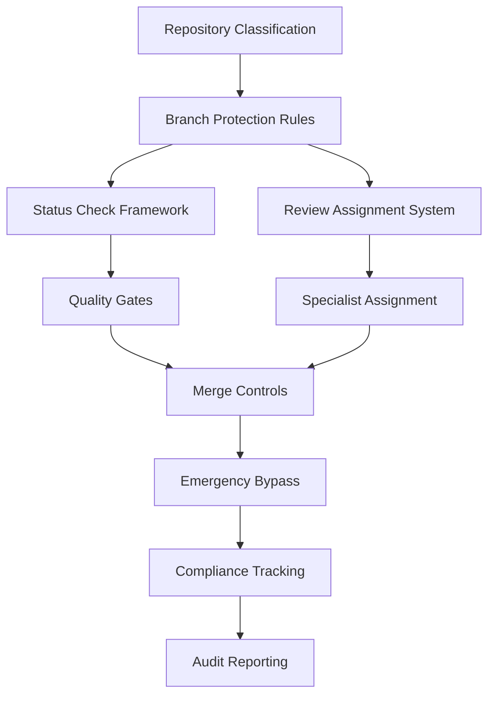

+++
# --- Basic Metadata ---
id = "QMS-BRANCH-PROTECTION-INTEGRATION-FRAMEWORK-V1"
title = "QMS Branch Protection Integration Framework v1.0"
context_type = "technical_specification"
scope = "Comprehensive integration framework for implementing QMS branch protection across GitHub repositories"
target_audience = ["devops", "qms-coordinators", "repository-administrators", "development-teams"]
granularity = "detailed"
status = "active"
last_updated = "2025-08-17"
version = "1.0"
tags = ["qms", "branch-protection", "github-integration", "automation", "framework", "implementation"]
related_context = [
    ".ruru/docs/qms/github-integration/branch-protection/qms-status-checks-specification-v1.md",
    ".ruru/docs/qms/github-integration/branch-protection/qms-merge-restriction-policies-v1.md",
    ".ruru/docs/qms/github-integration/review-assignment/qms-review-assignment-configuration-v1.md",
    ".ruru/docs/qms/github-integration/branch-protection/qms-emergency-bypass-procedures-v1.md"
]
template_schema_doc = ".ruru/templates/toml-md/13_technical_specification.README.md"
relevance = "Critical: Defines complete implementation approach for QMS branch protection automation"
+++

# QMS Branch Protection Integration Framework v1.0

## 1. Executive Summary

This framework provides comprehensive guidance for implementing QMS (Quality Management System) branch protection across GitHub repositories, transforming manual quality gates into intelligent automated systems while maintaining enterprise-grade compliance and audit capabilities.

### 1.1 Framework Scope

- **Repository Tiering**: Automated classification and differential protection policies
- **Status Check Integration**: 18 comprehensive quality gates with intelligent bypass controls
- **Review Assignment Automation**: Algorithm-based specialist assignment system
- **Emergency Response**: 4-level authorization system for critical incidents
- **Compliance Tracking**: Complete audit trails and regulatory reporting integration

### 1.2 Integration Architecture



## 2. Implementation Strategy

### 2.1 Phase 1: Repository Assessment and Classification

**Objective**: Systematically classify repositories into QMS tiers and assess current protection levels.

#### 2.1.1 Repository Discovery
```yaml
# Repository Classification Criteria
mission_critical:
  - Core business logic repositories
  - Customer-facing applications
  - Financial/payment systems
  - Security infrastructure
  
business_critical:
  - Internal tools with business impact
  - Integration systems
  - Reporting and analytics platforms
  - Customer support systems
  
standard:
  - Feature development repositories
  - Documentation systems
  - Configuration repositories
  - Testing frameworks
  
experimental:
  - Research and development
  - Proof of concept projects
  - Training repositories
  - Sandbox environments
```

#### 2.1.2 Current State Analysis
```bash
# Repository Assessment Script Template
#!/bin/bash

# Assess current branch protection status
gh api repos/:owner/:repo/branches/main/protection \
  --jq '{
    "required_status_checks": .required_status_checks,
    "enforce_admins": .enforce_admins.enabled,
    "required_pull_request_reviews": .required_pull_request_reviews,
    "restrictions": .restrictions
  }'

# Generate gap analysis report
echo "Repository: $REPO_NAME"
echo "Current Protection Level: $(get_protection_level)"
echo "Target QMS Tier: $(determine_qms_tier)"
echo "Required Changes: $(calculate_gap)"
```

### 2.2 Phase 2: Core Infrastructure Setup

**Objective**: Establish foundational QMS automation infrastructure.

#### 2.2.1 GitHub Apps and Permissions
```json
{
  "qms_automation_app": {
    "permissions": {
      "repository_administration": "write",
      "pull_requests": "write",
      "checks": "write",
      "contents": "read",
      "metadata": "read",
      "members": "read"
    },
    "events": [
      "pull_request",
      "push",
      "check_run",
      "check_suite",
      "status"
    ]
  }
}
```

#### 2.2.2 Status Check Services Infrastructure
```yaml
# QMS Status Check Services Configuration
apiVersion: v1
kind: ConfigMap
metadata:
  name: qms-status-checks-config
data:
  dor_validation_service: "qms-dor-validator.internal"
  security_scanning_service: "qms-security-scanner.internal"
  code_quality_service: "qms-code-quality.internal"
  compliance_audit_service: "qms-compliance.internal"
  dod_validation_service: "qms-dod-validator.internal"
  
---
apiVersion: apps/v1
kind: Deployment
metadata:
  name: qms-status-orchestrator
spec:
  replicas: 3
  selector:
    matchLabels:
      app: qms-status-orchestrator
  template:
    spec:
      containers:
      - name: orchestrator
        image: qms/status-orchestrator:v1.0
        env:
        - name: GITHUB_APP_ID
          valueFrom:
            secretKeyRef:
              name: github-app-credentials
              key: app-id
        - name: GITHUB_PRIVATE_KEY
          valueFrom:
            secretKeyRef:
              name: github-app-credentials
              key: private-key
```

### 2.3 Phase 3: Status Check Implementation

**Objective**: Deploy comprehensive 18-check quality gate system.

#### 2.3.1 Status Check Deployment Matrix

| Check Category | Implementation Priority | Dependencies | Rollout Strategy |
|----------------|------------------------|--------------|------------------|
| **Critical Security** | P0 | Security scanning tools | Mission-Critical first |
| **DoR Validation** | P0 | Requirements validation | All tiers simultaneously |
| **Code Quality** | P1 | Static analysis tools | Tier-by-tier rollout |
| **Compliance Audit** | P1 | Audit frameworks | Business-Critical first |
| **DoD Validation** | P2 | Testing infrastructure | Standard tier pilot |

#### 2.3.2 Check Implementation Template
```typescript
// QMS Status Check Implementation Template
interface QMSStatusCheck {
  name: string;
  category: 'critical' | 'warning' | 'contextual';
  tier_applicability: RepositoryTier[];
  bypass_controls: BypassConfiguration;
  escalation_policy: EscalationPolicy;
}

class QMSStatusCheckOrchestrator {
  async executeCheck(
    check: QMSStatusCheck,
    context: PullRequestContext
  ): Promise<CheckResult> {
    // 1. Validate check applicability
    if (!this.isApplicable(check, context.repository.tier)) {
      return this.skipCheck(check, 'Not applicable for repository tier');
    }

    // 2. Execute check logic
    const result = await this.runCheckLogic(check, context);

    // 3. Apply bypass controls if necessary
    if (result.status === 'failure' && context.bypassRequest) {
      return await this.handleBypassRequest(check, context, result);
    }

    // 4. Update compliance tracking
    await this.updateComplianceRecord(check, context, result);

    return result;
  }

  private async handleBypassRequest(
    check: QMSStatusCheck,
    context: PullRequestContext,
    result: CheckResult
  ): Promise<CheckResult> {
    const bypass = await this.validateBypassAuthorization(
      context.bypassRequest,
      check.bypass_controls
    );

    if (bypass.approved) {
      // Log bypass decision
      await this.logBypassDecision(check, context, bypass);
      
      // Create post-merge compliance task
      await this.createComplianceTask(check, context, result);
      
      return {
        ...result,
        status: 'neutral',
        title: `Bypassed: ${result.title}`,
        summary: `Check bypassed by ${bypass.approver} - ${bypass.justification}`
      };
    }

    return result;
  }
}
```

### 2.4 Phase 4: Review Assignment Integration

**Objective**: Implement intelligent specialist assignment system.

#### 2.4.1 Assignment Algorithm Configuration
```yaml
# QMS Review Assignment Configuration
assignment_algorithm:
  weights:
    expertise_match: 0.40
    workload_balance: 0.30
    availability: 0.20
    context_preservation: 0.10

  expertise_mapping:
    security_changes:
      primary: ["security-specialist", "senior-developer"]
      secondary: ["qms-security-scanner", "architect"]
      
    database_changes:
      primary: ["database-specialist", "senior-developer"]
      secondary: ["qms-dod-validator", "architect"]
      
    infrastructure_changes:
      primary: ["devops-specialist", "infrastructure-architect"]
      secondary: ["security-specialist", "senior-developer"]

  workload_tracking:
    max_concurrent_reviews: 5
    priority_weighting: true
    review_complexity_scoring: true
    
  availability_integration:
    calendar_system: "google_calendar"
    timezone_awareness: true
    working_hours_respect: true
```

#### 2.4.2 Assignment Service Implementation
```python
# QMS Review Assignment Service
class QMSReviewAssignmentService:
    def __init__(self, config: AssignmentConfig):
        self.config = config
        self.workload_tracker = WorkloadTracker()
        self.expertise_analyzer = ExpertiseAnalyzer()
        self.availability_service = AvailabilityService()

    async def assign_reviewers(
        self, 
        pull_request: PullRequest
    ) -> ReviewAssignment:
        # Analyze change characteristics
        change_analysis = await self.analyze_changes(pull_request)
        
        # Get available specialists
        available_specialists = await self.get_available_specialists(
            change_analysis.required_expertise
        )
        
        # Calculate assignment scores
        assignment_scores = {}
        for specialist in available_specialists:
            score = await self.calculate_assignment_score(
                specialist, 
                change_analysis,
                pull_request
            )
            assignment_scores[specialist] = score
        
        # Select optimal assignment
        assignment = self.select_optimal_assignment(assignment_scores)
        
        # Update tracking systems
        await self.update_workload_tracking(assignment)
        await self.log_assignment_decision(assignment, assignment_scores)
        
        return assignment

    async def calculate_assignment_score(
        self,
        specialist: Specialist,
        change_analysis: ChangeAnalysis,
        pull_request: PullRequest
    ) -> float:
        # Expertise matching (40%)
        expertise_score = await self.expertise_analyzer.calculate_match(
            specialist.expertise,
            change_analysis.required_expertise
        )
        
        # Workload balance (30%)
        workload_score = await self.workload_tracker.calculate_availability(
            specialist,
            pull_request.priority
        )
        
        # Availability (20%)
        availability_score = await self.availability_service.calculate_availability(
            specialist,
            pull_request.estimated_review_time
        )
        
        # Context preservation (10%)
        context_score = await self.calculate_context_preservation(
            specialist,
            pull_request.repository,
            change_analysis
        )
        
        # Weighted final score
        return (
            expertise_score * self.config.weights.expertise_match +
            workload_score * self.config.weights.workload_balance +
            availability_score * self.config.weights.availability +
            context_score * self.config.weights.context_preservation
        )
```

### 2.5 Phase 5: Emergency Bypass System

**Objective**: Implement 4-level emergency authorization framework.

#### 2.5.1 Authorization Level Configuration
```yaml
# Emergency Bypass Authorization Levels
bypass_authorization_levels:
  level_1_lead:
    roles: ["devops-lead", "team-lead", "senior-developer"]
    conditions:
      - incident_severity: ["low", "medium"]
      - business_hours: true
      - standard_approval_time: "< 2 hours"
    approval_requirements:
      signatures_required: 1
      documentation_level: "basic"
      
  level_2_architect:
    roles: ["technical-architect", "principal-engineer"]
    conditions:
      - incident_severity: ["medium", "high"]
      - business_impact: ["moderate", "significant"]
      - approval_time: "< 1 hour"
    approval_requirements:
      signatures_required: 1
      documentation_level: "detailed"
      stakeholder_notification: true
      
  level_3_qms_coordinator:
    roles: ["qms-quality-coordinator", "qms-compliance-coordinator"]
    conditions:
      - incident_severity: ["high", "critical"]
      - compliance_risk: ["medium", "high"]
      - regulatory_impact: true
    approval_requirements:
      signatures_required: 2
      documentation_level: "comprehensive"
      stakeholder_notification: true
      executive_notification: true
      
  emergency_commander:
    roles: ["roo-commander", "cto", "engineering-director"]
    conditions:
      - incident_severity: "critical"
      - business_impact: "critical"
      - immediate_action_required: true
    approval_requirements:
      signatures_required: 1
      documentation_level: "incident_report"
      immediate_stakeholder_notification: true
      post_incident_review: true
```

#### 2.5.2 Bypass Request Processing
```typescript
// Emergency Bypass Request Processing
class EmergencyBypassProcessor {
  async processRequest(
    bypassRequest: BypassRequest
  ): Promise<BypassDecision> {
    // 1. Validate incident classification
    const incidentClassification = await this.classifyIncident(
      bypassRequest.incident
    );
    
    // 2. Determine required authorization level
    const requiredLevel = this.determineAuthorizationLevel(
      incidentClassification,
      bypassRequest.context
    );
    
    // 3. Validate requestor authorization
    const authorizationValid = await this.validateAuthorization(
      bypassRequest.requestor,
      requiredLevel
    );
    
    if (!authorizationValid) {
      return this.createRejection(
        'Insufficient authorization level for incident severity'
      );
    }
    
    // 4. Process approval workflow
    const approvalResult = await this.processApprovalWorkflow(
      bypassRequest,
      requiredLevel
    );
    
    if (approvalResult.approved) {
      // 5. Create post-merge compliance tasks
      await this.createComplianceTasks(bypassRequest, approvalResult);
      
      // 6. Set up monitoring and tracking
      await this.setupPostBypassMonitoring(bypassRequest);
      
      // 7. Send notifications
      await this.sendBypassNotifications(bypassRequest, approvalResult);
    }
    
    return approvalResult;
  }

  private async createComplianceTasks(
    bypassRequest: BypassRequest,
    approvalResult: ApprovalResult
  ): Promise<void> {
    const tasks = [];
    
    // Create remediation tasks for each bypassed check
    for (const check of bypassRequest.bypassedChecks) {
      tasks.push({
        type: 'post_merge_remediation',
        check_id: check.id,
        priority: this.calculateRemediationPriority(check),
        due_date: this.calculateDueDate(check, approvalResult.urgency),
        assigned_to: await this.determineRemediationAssignee(check),
        tracking_id: `REMEDIATION-${bypassRequest.id}-${check.id}`
      });
    }
    
    // Create compliance audit task
    tasks.push({
      type: 'compliance_audit',
      scope: 'bypass_decision_review',
      due_date: this.calculateAuditDueDate(approvalResult.urgency),
      assigned_to: 'qms-compliance-coordinator',
      tracking_id: `AUDIT-${bypassRequest.id}`
    });
    
    await this.createMDTMTasks(tasks);
  }
}
```

## 3. Implementation Roadmap

### 3.1 Pre-Implementation Phase (Week 1)

**Objectives**: Foundation setup and stakeholder alignment

#### 3.1.1 Infrastructure Preparation
- [ ] Provision QMS automation infrastructure
- [ ] Configure GitHub Apps and permissions
- [ ] Set up monitoring and logging systems
- [ ] Establish secure credential management

#### 3.1.2 Stakeholder Communication
- [ ] Conduct QMS implementation kickoff meeting
- [ ] Distribute implementation timeline to development teams
- [ ] Schedule training sessions for QMS coordinators
- [ ] Prepare rollback procedures and contingency plans

### 3.2 Phase 1: Pilot Implementation (Weeks 2-3)

**Objectives**: Limited scope validation with experimental tier repositories

#### 3.2.1 Pilot Repository Selection
```yaml
pilot_repositories:
  - name: "qms-testing-sandbox"
    tier: "experimental"
    team: "qms-team"
    expected_pr_volume: "5-10/week"
    
  - name: "documentation-system"
    tier: "standard"  
    team: "technical-writing"
    expected_pr_volume: "3-5/week"
```

#### 3.2.2 Limited Feature Set
- Basic status checks (5 core checks)
- Simple review assignment (expertise matching only)
- Level 1 emergency bypass only
- Basic compliance logging

### 3.3 Phase 2: Standard Tier Rollout (Weeks 4-6)

**Objectives**: Full feature deployment to standard tier repositories

#### 3.3.1 Feature Expansion
- All 18 status checks active
- Complete review assignment algorithm
- Levels 1-2 emergency bypass
- Enhanced compliance tracking

#### 3.3.2 Performance Validation
- Status check execution time monitoring
- Review assignment accuracy measurement
- System load testing under normal PR volume

### 3.4 Phase 3: Business-Critical Rollout (Weeks 7-9)

**Objectives**: Deployment to business-critical repositories with enhanced monitoring

#### 3.4.1 Enhanced Configuration
- Stricter merge restrictions
- Expanded compliance requirements  
- Level 3 emergency bypass activation
- Advanced audit reporting

#### 3.4.2 Risk Mitigation
- 24/7 monitoring setup
- Automated rollback triggers
- Enhanced support procedures
- Stakeholder communication protocols

### 3.5 Phase 4: Mission-Critical Rollout (Weeks 10-12)

**Objectives**: Full deployment to mission-critical repositories

#### 3.5.1 Maximum Security Configuration
- All security controls active
- Zero-tolerance merge policies
- Emergency commander bypass level
- Real-time compliance monitoring

#### 3.5.2 Operational Excellence
- Comprehensive monitoring dashboards
- Automated alerting systems
- Incident response procedures
- Regular audit schedules

## 4. Configuration Management

### 4.1 Repository-Specific Configuration

Each repository requires a QMS configuration file defining its protection profile:

```yaml
# .qms/branch-protection.yml
repository:
  name: "core-payment-system"
  tier: "mission_critical"
  
branch_protection:
  target_branches: ["main", "release/*", "hotfix/*"]
  
status_checks:
  enabled_checks:
    - "qms/dor-validation"
    - "qms/security-scan-critical"
    - "qms/code-quality-gate"
    - "qms/compliance-audit"
    - "qms/dod-validation"
  
  bypass_controls:
    level_1_enabled: false
    level_2_enabled: true
    level_3_enabled: true
    emergency_enabled: true
    
review_requirements:
  required_reviewers: 2
  require_code_owner_reviews: true
  specialty_assignment: true
  
merge_restrictions:
  require_up_to_date: true
  require_linear_history: true
  allow_squash_merge: false
  allow_merge_commit: true
  allow_rebase_merge: false

emergency_contacts:
  primary: "payment-team-lead"
  escalation: ["payment-architect", "security-lead"]
  executive: "cto"
```

### 4.2 Global QMS Policies

System-wide policies that apply across all repositories:

```yaml
# Global QMS Configuration
global_policies:
  compliance_requirements:
    audit_retention_period: "7_years"
    regulatory_frameworks: ["SOX", "PCI-DSS", "GDPR"]
    required_documentation: ["change_justification", "risk_assessment"]
    
  security_baselines:
    mandatory_checks: ["security-scan-critical", "dependency-audit"]
    vulnerability_thresholds:
      critical: 0
      high: 0
      medium: 5
      low: 20
      
  performance_standards:
    max_check_duration: "10_minutes"
    max_review_assignment_time: "30_seconds"
    availability_target: "99.9%"
    
monitoring:
  metrics_collection: true
  alerting_enabled: true
  dashboard_updates: "real_time"
  
integration:
  slack_notifications: true
  email_alerts: true
  jira_integration: true
  audit_log_export: true
```

## 5. Monitoring and Observability

### 5.1 Key Performance Indicators

```yaml
# QMS Performance Monitoring
kpis:
  system_performance:
    - metric: "status_check_execution_time"
      target: "< 5 minutes"
      alert_threshold: "> 8 minutes"
      
    - metric: "review_assignment_accuracy"
      target: "> 95%"
      measurement: "specialist_acceptance_rate"
      
    - metric: "emergency_bypass_frequency"
      target: "< 5 per month"
      trend_monitoring: true
      
  quality_metrics:
    - metric: "defect_escape_rate"
      target: "< 2%"
      measurement: "post_release_issues"
      
    - metric: "compliance_violation_rate"
      target: "0%"
      severity: "critical_alert"
      
    - metric: "mean_time_to_review"
      target: "< 4 hours"
      business_hours_only: true

  business_impact:
    - metric: "deployment_frequency"
      target: "maintain_current_velocity"
      acceptable_variance: "±10%"
      
    - metric: "lead_time_for_changes"
      target: "< 48 hours"
      measurement: "pr_creation_to_merge"
```

### 5.2 Alerting Framework

```yaml
# QMS Alerting Configuration  
alerts:
  critical:
    - condition: "system_availability < 99%"
      notification: ["ops-team", "qms-coordinator"]
      escalation_time: "5_minutes"
      
    - condition: "security_check_failure_rate > 10%"
      notification: ["security-team", "qms-security-lead"]
      escalation_time: "immediate"
      
  warning:
    - condition: "review_assignment_time > 2_minutes"
      notification: ["qms-team"]
      escalation_time: "15_minutes"
      
    - condition: "bypass_request_frequency_spike"
      notification: ["qms-coordinator", "team-leads"]
      escalation_time: "30_minutes"
      
  informational:
    - condition: "daily_metrics_summary"
      notification: ["stakeholders"]
      schedule: "daily_8am"
      
    - condition: "weekly_compliance_report"
      notification: ["compliance-team", "audit-team"]
      schedule: "weekly_monday_9am"
```

## 6. Training and Change Management

### 6.1 Training Program Structure

#### 6.1.1 QMS Coordinator Training (16 hours)
- **Module 1**: QMS Framework Overview (4 hours)
- **Module 2**: Status Check Configuration (4 hours)  
- **Module 3**: Emergency Bypass Procedures (4 hours)
- **Module 4**: Compliance and Audit Management (4 hours)

#### 6.1.2 Development Team Training (8 hours)
- **Module 1**: New PR Workflow (2 hours)
- **Module 2**: Review Assignment System (2 hours)
- **Module 3**: Emergency Procedures (2 hours) 
- **Module 4**: Compliance Requirements (2 hours)

#### 6.1.3 Leadership Briefing (2 hours)
- **Module 1**: Business Impact and Benefits (1 hour)
- **Module 2**: Governance and Oversight (1 hour)

### 6.2 Change Management Strategy

```yaml
change_management:
  communication_plan:
    announcement: "2 weeks before pilot"
    training_schedule: "1 week before rollout"
    go_live_notification: "day_of_rollout"
    
  support_structure:
    dedicated_support_team: "qms-implementation-team"
    support_hours: "business_hours_extended"
    escalation_path: ["qms-coordinator", "technical-architect", "roo-commander"]
    
  feedback_collection:
    channels: ["slack", "email", "surveys"]
    frequency: "weekly_during_rollout"
    review_meetings: "bi_weekly"
    
  success_metrics:
    user_adoption_rate: "> 90%"
    support_ticket_volume: "< 10 per week"
    user_satisfaction: "> 4.0/5.0"
```

## 7. Risk Management

### 7.1 Risk Assessment Matrix

| Risk Category | Risk Level | Impact | Mitigation Strategy |
|---------------|------------|---------|-------------------|
| **System Downtime** | Medium | High | Redundant infrastructure, automated failover |
| **False Positive Checks** | High | Medium | Tuning periods, bypass procedures |
| **Developer Resistance** | Medium | Medium | Training, gradual rollout, feedback loops |
| **Compliance Gaps** | Low | Critical | Comprehensive testing, audit reviews |
| **Performance Impact** | Medium | Medium | Performance testing, optimization |

### 7.2 Contingency Plans

#### 7.2.1 System Failure Response
```yaml
system_failure_response:
  immediate_actions:
    - disable_failing_checks: "< 5 minutes"
    - notify_stakeholders: "immediate"
    - activate_manual_procedures: "< 15 minutes"
    
  recovery_procedures:
    - identify_root_cause: "< 30 minutes"
    - implement_fix: "< 2 hours"
    - validate_resolution: "< 1 hour"
    - resume_normal_operations: "phased_approach"
    
  communication:
    - status_page_updates: "real_time"
    - stakeholder_notifications: "every_30_minutes"
    - post_incident_report: "within_24_hours"
```

#### 7.2.2 Rollback Procedures
```bash
#!/bin/bash
# QMS Rollback Script

# Emergency QMS rollback procedure
qms_emergency_rollback() {
    echo "Initiating emergency QMS rollback..."
    
    # 1. Disable all QMS status checks
    disable_all_qms_checks
    
    # 2. Restore previous branch protection rules
    restore_previous_branch_protection
    
    # 3. Notify all stakeholders
    send_rollback_notification
    
    # 4. Create incident tracking ticket
    create_incident_ticket "QMS_EMERGENCY_ROLLBACK"
    
    echo "Emergency rollback completed. Manual review required."
}
```

## 8. Success Criteria and Validation

### 8.1 Technical Success Metrics

```yaml
technical_success_criteria:
  system_reliability:
    - uptime: "> 99.5%"
    - check_success_rate: "> 98%"
    - false_positive_rate: "< 5%"
    
  performance:
    - average_check_duration: "< 3 minutes"
    - review_assignment_time: "< 30 seconds"
    - system_response_time: "< 2 seconds"
    
  accuracy:
    - review_assignment_accuracy: "> 95%"
    - security_detection_rate: "> 99%"
    - compliance_coverage: "100%"
```

### 8.2 Business Success Metrics

```yaml
business_success_criteria:
  quality_improvement:
    - defect_reduction: "> 30%"
    - security_incident_reduction: "> 50%"
    - compliance_violation_reduction: "100%"
    
  efficiency_gains:
    - review_time_reduction: "> 20%"
    - deployment_frequency_maintained: "±5%"
    - manual_overhead_reduction: "> 40%"
    
  user_satisfaction:
    - developer_satisfaction: "> 4.0/5.0"
    - qms_coordinator_satisfaction: "> 4.5/5.0"
    - stakeholder_confidence: "> 90%"
```

## 9. Post-Implementation Support

### 9.1 Ongoing Maintenance Schedule

```yaml
maintenance_schedule:
  daily:
    - system_health_monitoring
    - alert_review_and_response
    - performance_metrics_collection
    
  weekly:
    - configuration_backup
    - security_update_review
    - user_feedback_analysis
    
  monthly:
    - comprehensive_system_review
    - policy_update_evaluation
    - training_effectiveness_assessment
    
  quarterly:
    - full_system_audit
    - business_value_assessment
    - roadmap_planning_review
```

### 9.2 Continuous Improvement Process

The QMS Branch Protection system requires ongoing refinement based on operational experience, changing business needs, and technological advances.

#### 9.2.1 Feedback Integration
- Regular user surveys and feedback collection
- Performance data analysis and optimization
- Security threat landscape adaptation
- Compliance requirement updates

#### 9.2.2 System Evolution
- Machine learning integration for better review assignment
- Advanced security check capabilities
- Enhanced automation and orchestration
- Integration with additional development tools

## 10. Conclusion

This integration framework provides a comprehensive approach to implementing QMS branch protection across GitHub repositories, ensuring enterprise-grade quality management while maintaining development velocity and team productivity. The phased rollout approach minimizes risk while maximizing value delivery, and the extensive monitoring and support infrastructure ensures long-term success and continuous improvement.

The framework's modular design allows for customization based on specific organizational needs while maintaining consistency with QMS principles and industry best practices. Success depends on careful planning, thorough training, and ongoing commitment to quality and compliance excellence.