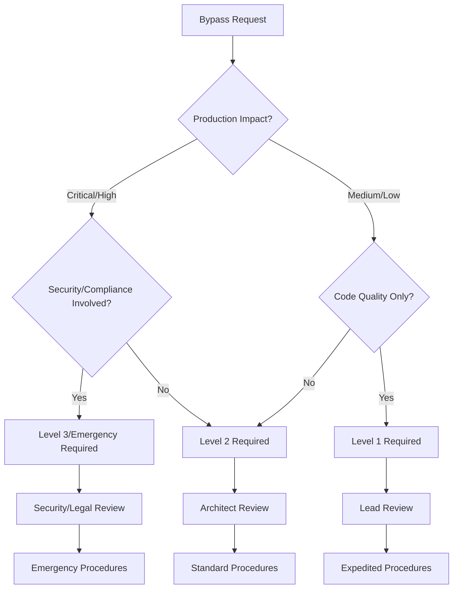

+++
# Document Metadata
id = "qms-emergency-bypass-procedures-v1"
title = "QMS Emergency Bypass Procedures v1.0"
context_type = "procedure_specification"
scope = "Emergency bypass workflows for QMS quality gates with post-merge compliance tracking"
target_audience = ["devops", "incident-commanders", "qms-coordinators", "development-leads", "security-teams"]
granularity = "detailed"
status = "active"
created_date = "2025-08-17T05:22:00Z"
updated_date = "2025-08-17T05:22:00Z"

# Technical Context
[technical_context]
integration_phase = "2.3"
procedure_scope = ["emergency-bypasses", "compliance-tracking", "incident-management"]
authorization_levels = 4
audit_retention = "7_years"

# Related Documentation
related_docs = [
    ".ruru/docs/qms/github-integration/branch-protection/qms-merge-restriction-policies-v1.md",
    ".ruru/docs/qms/github-integration/branch-protection/qms-status-checks-specification-v1.md",
    ".ruru/docs/qms/workflows/4-step-qms-review-workflow-v1.md",
    ".ruru/modes/qms-compliance-coordinator/qms-compliance-coordinator.mode.md"
]
tags = ["qms", "emergency-procedures", "bypass", "compliance-tracking", "incident-management", "audit"]
+++

# QMS Emergency Bypass Procedures v1.0

## Overview

This document defines comprehensive emergency bypass procedures that enable rapid deployment of critical fixes while ensuring complete post-merge compliance tracking and remediation. These procedures support the 4-level bypass authorization system and provide detailed workflows for incident management integration, audit documentation, and systematic remediation of bypassed quality gates.

## Emergency Response Framework

### Incident Classification Matrix

| Severity | Definition | Response Time | Bypass Authorization | Post-Incident Actions |
|----------|------------|---------------|---------------------|----------------------|
| **S1 - Critical** | Complete service outage, data loss, security breach | ≤ 15 minutes | Emergency (Commander) | Immediate review + Board notification |
| **S2 - High** | Major functionality impaired, significant user impact | ≤ 1 hour | Level 3 (QMS Coordinator) | 24-hour review + Executive summary |
| **S3 - Medium** | Minor functionality impaired, limited user impact | ≤ 4 hours | Level 2 (Architect) | 3-day review + Team notification |
| **S4 - Low** | Cosmetic issues, no user impact | ≤ 24 hours | Level 1 (Lead) | 5-day review + Technical debt tracking |

### Bypass Decision Tree



## Level 1 Bypass: Non-Critical Quality Issues

### Authorization Requirements
- **Authorized Roles**: Development Leads (lead-devops, lead-frontend, lead-backend, lead-qa)
- **Bypassable Checks**: Code quality minor, documentation coverage, performance regression warnings
- **Approval Process**: Single lead approval with justification

### Initiation Workflow
```yaml
level_1_bypass_workflow:
  trigger_conditions:
    - non_blocking_quality_check_failure
    - development_velocity_impact
    - cosmetic_or_documentation_issues
  
  required_information:
    - bypass_reason: "Detailed justification for bypass"
    - impact_assessment: "Business/technical impact analysis"
    - remediation_timeline: "Proposed fix timeline (max 5 business days)"
    - risk_evaluation: "Low/minimal risk assessment"
  
  approval_process:
    step_1: "Developer creates bypass request issue"
    step_2: "Lead reviews and approves within 2 hours"
    step_3: "Automatic bypass activation"
    step_4: "Post-merge tracking initiated"
```

### Documentation Template
```markdown
# Level 1 Bypass Request - [BRIEF_DESCRIPTION]

## Bypass Information
- **Request ID**: BYPASS-L1-[YYYYMMDD-HHMMSS]
- **Requestor**: [Developer Name]
- **Approver**: [Lead Name]  
- **Repository**: [repo-name]
- **PR Number**: #[number]
- **Failing Checks**: [list of bypassed checks]

## Justification
### Business Impact
[Describe business reasons for bypass]

### Technical Details
[Technical explanation of the issue]

### Risk Assessment
- **Risk Level**: Low
- **Potential Impact**: [description]
- **Mitigation Measures**: [steps taken to minimize risk]

## Remediation Plan
- **Target Resolution Date**: [within 5 business days]
- **Assigned Developer**: [name]
- **Tracking Issue**: [link to follow-up issue]
- **Success Criteria**: [how completion will be measured]
```

### Post-Bypass Actions
```yaml
level_1_post_bypass:
  immediate_actions:
    - create_technical_debt_issue
    - notify_qms_coordinator
    - schedule_remediation_review
    - update_bypass_metrics
  
  tracking_requirements:
    - daily_progress_updates
    - remediation_deadline_monitoring
    - completion_verification
    - lessons_learned_capture
  
  escalation_triggers:
    - remediation_deadline_missed
    - additional_issues_discovered
    - pattern_of_repeated_bypasses
```

## Level 2 Bypass: Standard Quality Gates

### Authorization Requirements
- **Authorized Roles**: Core Architect, QMS Quality Coordinator
- **Bypassable Checks**: DoR/DoD validation, major code quality issues, high-severity security findings
- **Approval Process**: Architect + QMS coordination with detailed impact assessment

### Initiation Workflow
```yaml
level_2_bypass_workflow:
  trigger_conditions:
    - standard_quality_gate_failure
    - moderate_business_impact
    - development_timeline_critical_path
  
  required_documentation:
    - detailed_impact_assessment
    - technical_risk_analysis
    - business_justification_document
    - proposed_remediation_plan
    - stakeholder_notification_plan
  
  approval_process:
    step_1: "Developer/Lead creates comprehensive bypass request"
    step_2: "Core Architect technical review (4 hours max)"
    step_3: "QMS Quality Coordinator compliance review"
    step_4: "Joint approval decision"
    step_5: "Bypass activation with enhanced monitoring"
```

### Risk Assessment Framework
```yaml
level_2_risk_assessment:
  technical_factors:
    complexity_score: "1-10 scale based on code complexity"
    test_coverage_impact: "Percentage of uncovered code paths"
    integration_risk: "Impact on downstream systems"
    rollback_feasibility: "Difficulty of reverting changes"
  
  business_factors:
    user_impact_scope: "Number of users affected"
    revenue_impact: "Financial implications"
    compliance_implications: "Regulatory considerations"
    reputation_risk: "Brand/customer trust impact"
  
  mitigation_requirements:
    enhanced_monitoring: "Additional observability during deployment"
    phased_rollout: "Gradual deployment strategy"
    quick_rollback: "Immediate revert capability"
    stakeholder_communication: "Proactive notification strategy"
```

### Post-Bypass Compliance Tracking
```yaml
level_2_compliance_tracking:
  immediate_requirements:
    - compliance_incident_created
    - risk_register_updated
    - development_team_notification
    - enhanced_monitoring_activated
  
  ongoing_monitoring:
    - daily_compliance_status_reports
    - weekly_remediation_progress_reviews
    - impact_assessment_updates
    - stakeholder_communication_log
  
  completion_criteria:
    - all_bypassed_checks_resolved
    - compliance_audit_passed
    - documentation_updated
    - lessons_learned_documented
```

## Level 3 Bypass: Security and Compliance Gates

### Authorization Requirements
- **Authorized Roles**: QMS Compliance Coordinator (with Security Lead consultation)
- **Bypassable Checks**: Critical security vulnerabilities, GDPR/PCI compliance failures, regulatory violations
- **Approval Process**: QMS Coordinator + Security Lead + Legal consultation for compliance issues

### Initiation Workflow
```yaml
level_3_bypass_workflow:
  trigger_conditions:
    - critical_security_vulnerability_blocking
    - compliance_deadline_pressure
    - regulatory_requirement_conflict
  
  mandatory_consultations:
    - security_lead_technical_review
    - legal_team_compliance_assessment
    - business_stakeholder_approval
    - c_level_notification
  
  documentation_requirements:
    - comprehensive_security_impact_analysis
    - legal_compliance_risk_assessment
    - detailed_remediation_roadmap
    - incident_response_plan
    - communication_strategy
  
  approval_timeline:
    - initial_review: "within 2 hours"
    - security_consultation: "within 4 hours"
    - legal_review: "within 8 hours"
    - final_approval: "within 12 hours"
```

### Security Review Protocol
```yaml
security_review_requirements:
  vulnerability_assessment:
    - current_exposure_analysis
    - attack_vector_evaluation
    - potential_impact_scope
    - existing_controls_effectiveness
  
  mitigation_strategies:
    - immediate_compensating_controls
    - monitoring_enhancement
    - access_restrictions
    - incident_detection_improvements
  
  approval_criteria:
    - security_risk_acceptable_with_controls
    - legal_compliance_impact_manageable
    - business_justification_compelling
    - remediation_plan_comprehensive
```

### Post-Bypass Security Monitoring
```yaml
level_3_security_monitoring:
  enhanced_surveillance:
    - real_time_security_monitoring
    - anomaly_detection_activation
    - access_pattern_analysis
    - threat_intelligence_correlation
  
  incident_response_preparation:
    - response_team_on_standby
    - escalation_procedures_active
    - communication_channels_open
    - rollback_plans_validated
  
  compliance_documentation:
    - detailed_audit_trail
    - decision_rationale_recording
    - control_effectiveness_monitoring
    - regulatory_notification_preparation
```

## Emergency Bypass: All Quality Gates (Production Incidents)

### Authorization Requirements
- **Authorized Roles**: Roo Commander (Executive Authority)
- **Bypassable Checks**: All quality gates and restrictions
- **Approval Process**: Commander authorization + Incident Commander confirmation + C-level notification

### Emergency Activation Criteria
```yaml
emergency_bypass_criteria:
  severity_1_incidents:
    - complete_production_outage
    - active_security_breach_response
    - data_loss_prevention_required
    - regulatory_compliance_emergency
  
  business_critical_scenarios:
    - revenue_impacting_system_failure
    - customer_data_exposure_risk
    - legal_regulatory_deadline_critical
    - brand_reputation_threat_immediate
  
  operational_triggers:
    - disaster_recovery_scenario
    - business_continuity_activation
    - emergency_maintenance_window
    - critical_third_party_integration_failure
```

### Emergency Response Protocol
```yaml
emergency_response_workflow:
  immediate_actions:
    step_1: "Incident Commander declares emergency"
    step_2: "Roo Commander authorization requested"
    step_3: "C-level executive notification sent"
    step_4: "Emergency bypass activated immediately"
    step_5: "War room established"
    step_6: "Enhanced monitoring activated"
  
  concurrent_requirements:
    - incident_command_post_activation
    - stakeholder_communication_initiated
    - media_relations_preparation
    - legal_regulatory_notification
    - customer_communication_preparation
  
  documentation_during_incident:
    - real_time_decision_logging
    - action_timeline_recording
    - communication_transcript_capture
    - system_state_documentation
```

### Post-Emergency Procedures
```yaml
post_emergency_requirements:
  immediate_aftermath:
    - incident_stabilization_confirmation
    - emergency_bypass_deactivation
    - preliminary_impact_assessment
    - stakeholder_status_communication
  
  24_hour_requirements:
    - comprehensive_post_incident_review
    - root_cause_analysis_initiation
    - compliance_impact_assessment
    - regulatory_notification_completion
  
  72_hour_deliverables:
    - detailed_incident_report
    - comprehensive_remediation_plan
    - process_improvement_recommendations
    - board_level_presentation_materials
```

## Compliance Tracking and Audit Framework

### Centralized Tracking System
```yaml
compliance_tracking_system:
  bypass_registry:
    - unique_bypass_identifier
    - authorization_level_recorded
    - approver_identity_logged
    - timestamp_precise_recording
    - bypassed_checks_enumerated
  
  remediation_tracking:
    - target_completion_dates
    - actual_completion_dates
    - remediation_effectiveness_metrics
    - compliance_verification_status
    - lessons_learned_documentation
  
  audit_trail_requirements:
    - immutable_decision_records
    - complete_communication_logs
    - approval_workflow_documentation
    - compliance_verification_evidence
```

### Metrics and KPIs
```yaml
bypass_effectiveness_metrics:
  frequency_metrics:
    - bypasses_per_repository_per_month
    - bypass_level_distribution
    - repeat_bypass_patterns
    - seasonal_bypass_trends
  
  quality_impact_metrics:
    - post_bypass_defect_rates
    - security_incident_correlation
    - compliance_violation_frequency
    - customer_impact_incidents
  
  remediation_effectiveness:
    - average_remediation_time
    - remediation_completion_rate
    - re_occurrence_prevention_success
    - process_improvement_adoption
```

### Audit Report Generation
```yaml
automated_audit_reporting:
  daily_reports:
    - active_bypass_status
    - overdue_remediations
    - new_bypass_requests
    - critical_escalations
  
  weekly_summaries:
    - bypass_trend_analysis
    - remediation_progress
    - compliance_gap_assessment
    - stakeholder_notifications
  
  monthly_comprehensive_reports:
    - executive_dashboard_metrics
    - compliance_posture_assessment
    - process_effectiveness_analysis
    - improvement_recommendations
```

## Integration with Existing Systems

### GitHub API Integration
```yaml
github_integration_points:
  bypass_activation:
    - branch_protection_rule_modification
    - status_check_override_implementation
    - pull_request_label_assignment
    - automated_tracking_issue_creation
  
  monitoring_hooks:
    - merge_event_capture
    - bypass_usage_logging
    - compliance_status_tracking
    - remediation_progress_updates
```

### Incident Management Integration
```yaml
incident_management_workflow:
  ticketing_system_integration:
    - automatic_incident_ticket_creation
    - bypass_request_linking
    - escalation_path_automation
    - resolution_tracking_sync
  
  communication_platforms:
    - slack_notification_automation
    - email_alert_distribution
    - dashboard_status_updates
    - stakeholder_portal_updates
```

### Compliance Management Integration
```yaml
compliance_system_integration:
  regulatory_reporting:
    - automated_compliance_report_generation
    - regulatory_filing_preparation
    - audit_evidence_compilation
    - violation_notification_automation
  
  risk_management:
    - risk_register_automatic_updates
    - control_effectiveness_monitoring
    - threat_landscape_integration
    - business_impact_assessment_updates
```

## Training and Awareness

### Role-Based Training Requirements
```yaml
training_matrix:
  development_leads:
    - level_1_bypass_procedures
    - risk_assessment_basics
    - documentation_requirements
    - escalation_procedures
  
  architects_qms_coordinators:
    - level_2_3_bypass_procedures
    - compliance_impact_assessment
    - risk_mitigation_strategies
    - stakeholder_communication
  
  incident_commanders:
    - emergency_bypass_procedures
    - crisis_communication
    - post_incident_requirements
    - regulatory_obligations
```

### Certification Requirements
```yaml
certification_program:
  mandatory_certifications:
    - qms_bypass_procedures_basic
    - incident_response_protocols
    - compliance_awareness_training
    - security_impact_assessment
  
  recertification_schedule:
    - annual_procedure_updates
    - quarterly_scenario_exercises
    - monthly_compliance_briefings
    - continuous_improvement_workshops
```

## Continuous Improvement Framework

### Performance Review Process
```yaml
continuous_improvement:
  regular_assessments:
    - monthly_procedure_effectiveness_review
    - quarterly_stakeholder_feedback_collection
    - annual_comprehensive_audit
    - ongoing_metric_analysis
  
  improvement_triggers:
    - bypass_frequency_threshold_exceeded
    - remediation_timeline_consistently_missed
    - compliance_violation_pattern_detected
    - stakeholder_satisfaction_decline
  
  enhancement_implementation:
    - procedure_update_workflow
    - training_material_revision
    - system_integration_improvements
    - communication_process_optimization
```

This comprehensive emergency bypass procedure framework ensures that critical fixes can be deployed rapidly while maintaining complete compliance tracking, audit trails, and systematic remediation of all bypassed quality gates.