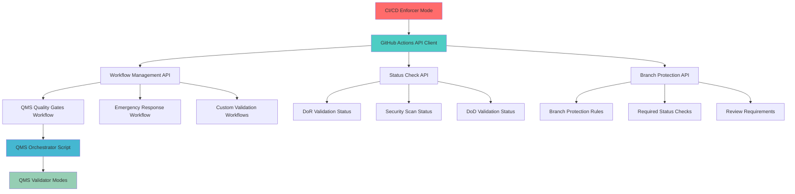

+++
# --- Basic Metadata ---
id = "qms-github-actions-api-integration-design-v1"
title = "QMS GitHub Actions API Integration Design v1.0"
context_type = "design"
scope = "Phase 3.1: API integration layer for programmatic GitHub Actions and CI/CD workflow management"
target_audience = ["lead-devops", "cicd-specialist", "qms-coordinators"]
granularity = "detailed"
status = "active"
created_date = "2025-08-18T16:20:29Z"
updated_date = "2025-08-18T16:20:29Z"
author = "lead-devops"
version = "1.0"
tags = ["qms", "github-actions", "api", "cicd", "integration", "phase-3-1", "automation"]
related_context = [
    ".ruru/docs/qms/orchestration/quality-gate-orchestrator-v1.md",
    ".ruru/docs/qms/github-integration/branch-protection/qms-branch-protection-integration-framework-v1.md",
    ".ruru/docs/qms/workflows/4-step-qms-review-workflow-v1.md",
    ".ruru/tasks/QMS_PHASE3/TASK-CICD-20250818-152511.md"
]
relevance = "Critical: Enables programmatic control of existing QMS GitHub Actions infrastructure"
+++

# QMS GitHub Actions API Integration Design v1.0

## 1. Executive Summary

This design document defines the GitHub Actions API integration layer that enables the **CI/CD Enforcer mode** to programmatically manage and coordinate the existing QMS GitHub Actions infrastructure. Building upon the comprehensive Phase 2 implementation, this integration provides intelligent workflow management, real-time status coordination, and automated quality gate enforcement.

### 1.1 Integration Architecture



## 2. Core API Integration Components

### 2.1 GitHub Actions Workflow Management API

**Objective**: Programmatic control over existing QMS workflow execution and monitoring.

#### 2.1.1 Workflow Trigger Interface
```typescript
interface WorkflowTriggerAPI {
  /**
   * Trigger QMS quality gates workflow for a specific PR
   */
  triggerQualityGatesWorkflow(request: QualityGatesWorkflowRequest): Promise<WorkflowRun>;
  
  /**
   * Trigger emergency response workflow for critical incidents
   */
  triggerEmergencyWorkflow(request: EmergencyWorkflowRequest): Promise<WorkflowRun>;
  
  /**
   * Cancel running workflows if conditions change
   */
  cancelWorkflow(runId: number, reason: string): Promise<void>;
  
  /**
   * Re-run failed workflow with updated parameters
   */
  rerunWorkflow(runId: number, options?: RerunOptions): Promise<WorkflowRun>;
}

interface QualityGatesWorkflowRequest {
  repository: string;
  prNumber: number;
  headSha: string;
  baseBranch: string;
  forcedValidations?: QualityGateType[];
  bypassControls?: BypassConfiguration;
  trackingId: string;
  priority: 'low' | 'medium' | 'high' | 'emergency';
}

interface EmergencyWorkflowRequest {
  repository: string;
  incident: IncidentDetails;
  authorizationLevel: 1 | 2 | 3 | 4;
  approver: string;
  justification: string;
}
```

#### 2.1.2 Workflow Monitoring Interface
```typescript
interface WorkflowMonitoringAPI {
  /**
   * Get real-time status of QMS workflow execution
   */
  getWorkflowStatus(runId: number): Promise<WorkflowStatus>;
  
  /**
   * Stream workflow logs in real-time
   */
  streamWorkflowLogs(runId: number): AsyncGenerator<LogEntry>;
  
  /**
   * Get detailed step-by-step execution results
   */
  getWorkflowSteps(runId: number): Promise<WorkflowStep[]>;
  
  /**
   * Get QMS-specific validation results
   */
  getQMSValidationResults(runId: number): Promise<QMSValidationResults>;
}

interface WorkflowStatus {
  id: number;
  status: 'queued' | 'in_progress' | 'completed' | 'cancelled' | 'failure';
  conclusion?: 'success' | 'failure' | 'cancelled' | 'timed_out';
  startedAt: Date;
  completedAt?: Date;
  qmsStage: 'initialization' | 'dor' | 'security_coding' | 'dod' | 'aggregation';
  progress: {
    total: number;
    completed: number;
    failed: number;
    skipped: number;
  };
}
```

### 2.2 Status Check Coordination API

**Objective**: Real-time coordination of QMS status checks with GitHub's commit status API.

#### 2.2.1 Status Check Management
```typescript
interface StatusCheckAPI {
  /**
   * Create initial QMS status checks for a PR
   */
  initializeQMSStatusChecks(request: StatusCheckInitRequest): Promise<void>;
  
  /**
   * Update individual quality gate status
   */
  updateQualityGateStatus(update: QualityGateStatusUpdate): Promise<void>;
  
  /**
   * Set overall QMS compliance status
   */
  setOverallComplianceStatus(request: ComplianceStatusRequest): Promise<void>;
  
  /**
   * Handle status check bypass requests
   */
  requestStatusCheckBypass(request: BypassRequest): Promise<BypassResponse>;
}

interface StatusCheckInitRequest {
  repository: string;
  sha: string;
  prNumber: number;
  requiredChecks: QualityGateType[];
  classification: 'LOW_RISK' | 'MEDIUM_RISK' | 'HIGH_RISK';
  trackingId: string;
}

interface QualityGateStatusUpdate {
  repository: string;
  sha: string;
  checkName: string;
  state: 'pending' | 'success' | 'failure' | 'error';
  description: string;
  targetUrl?: string;
  details?: QualityGateDetails;
  bypassAvailable?: boolean;
}

interface ComplianceStatusRequest {
  repository: string;
  sha: string;
  overallStatus: 'success' | 'failure' | 'pending';
  summary: ComplianceSummary;
  actionRequired?: string;
}
```

#### 2.2.2 Real-time Status Synchronization
```typescript
interface StatusSyncAPI {
  /**
   * Sync QMS validator mode results with GitHub status checks
   */
  syncValidatorResults(results: ValidatorResults[]): Promise<void>;
  
  /**
   * Handle status check timeout scenarios
   */
  handleStatusTimeout(checkName: string, context: TimeoutContext): Promise<void>;
  
  /**
   * Batch update multiple status checks for efficiency
   */
  batchUpdateStatuses(updates: QualityGateStatusUpdate[]): Promise<BatchUpdateResult>;
  
  /**
   * Subscribe to status check events via webhooks
   */
  subscribeToStatusEvents(callback: StatusEventCallback): void;
}
```

### 2.3 Branch Protection Automation API

**Objective**: Intelligent management of branch protection rules based on repository classification and QMS requirements.

#### 2.3.1 Branch Protection Management
```typescript
interface BranchProtectionAPI {
  /**
   * Apply QMS branch protection rules based on repository tier
   */
  applyQMSBranchProtection(request: BranchProtectionRequest): Promise<void>;
  
  /**
   * Update required status checks dynamically
   */
  updateRequiredStatusChecks(request: StatusCheckUpdateRequest): Promise<void>;
  
  /**
   * Configure review requirements based on change classification
   */
  configureReviewRequirements(request: ReviewRequirementRequest): Promise<void>;
  
  /**
   * Handle emergency bypass configuration
   */
  configureEmergencyBypass(request: EmergencyBypassRequest): Promise<void>;
}

interface BranchProtectionRequest {
  repository: string;
  branch: string;
  tier: 'mission_critical' | 'business_critical' | 'standard' | 'experimental';
  enforcementLevel: 'strict' | 'balanced' | 'flexible';
  customRules?: CustomProtectionRules;
}

interface StatusCheckUpdateRequest {
  repository: string;
  branch: string;
  requiredChecks: string[];
  dismissStaleReviews: boolean;
  requireBranchesToBeUpToDate: boolean;
}
```

### 2.4 Quality Gate Orchestration Interface

**Objective**: High-level orchestration of the existing QMS quality gate system with intelligent routing and coordination.

#### 2.4.1 Quality Gate Coordinator
```typescript
interface QualityGateCoordinator {
  /**
   * Orchestrate complete QMS validation flow for a PR
   */
  orchestrateQMSValidation(request: QMSValidationRequest): Promise<QMSValidationOrchestration>;
  
  /**
   * Handle quality gate failures with appropriate escalation
   */
  handleQualityGateFailure(failure: QualityGateFailure): Promise<FailureResolution>;
  
  /**
   * Coordinate parallel validation execution
   */
  coordinateParallelValidation(validations: ParallelValidationRequest[]): Promise<ParallelValidationResults>;
  
  /**
   * Manage quality gate bypass workflows
   */
  orchestrateBypassWorkflow(request: BypassWorkflowRequest): Promise<BypassWorkflowResult>;
}

interface QMSValidationRequest {
  repository: string;
  prNumber: number;
  requestedBy: string;
  priority: ValidationPriority;
  customValidations?: CustomValidationConfig[];
  skipValidations?: QualityGateType[];
  deadlines?: ValidationDeadlines;
}

interface QMSValidationOrchestration {
  orchestrationId: string;
  trackingId: string;
  workflowRunId: number;
  expectedCompletion: Date;
  validationPlan: ValidationExecutionPlan;
  progressCallback: (update: ValidationProgress) => void;
}
```

## 3. Implementation Architecture

### 3.1 CI/CD Enforcer Mode Integration

The CI/CD Enforcer mode serves as the intelligent controller that utilizes these APIs to manage the existing QMS infrastructure.

#### 3.1.1 Mode Responsibilities
- **Workflow Orchestration**: Trigger and monitor GitHub Actions workflows based on PR events
- **Status Coordination**: Manage real-time status updates and GitHub status checks
- **Quality Gate Management**: Coordinate validation execution with QMS specialist modes
- **Branch Protection**: Automatically apply and update branch protection rules
- **Emergency Response**: Handle bypass requests and emergency procedures
- **Audit Tracking**: Maintain complete audit trails of all CI/CD actions

#### 3.1.2 Integration Points with Existing Infrastructure
```typescript
class CICDEnforcerMode {
  private workflowAPI: WorkflowTriggerAPI;
  private statusAPI: StatusCheckAPI;
  private protectionAPI: BranchProtectionAPI;
  private qualityGateCoordinator: QualityGateCoordinator;
  
  /**
   * Handle new PR creation - trigger initial QMS validation
   */
  async handlePRCreated(pr: PullRequestEvent): Promise<void> {
    // 1. Classify PR risk level using existing logic
    const classification = await this.classifyPR(pr);
    
    // 2. Initialize status checks based on classification
    await this.statusAPI.initializeQMSStatusChecks({
      repository: pr.repository.full_name,
      sha: pr.pull_request.head.sha,
      prNumber: pr.pull_request.number,
      requiredChecks: this.determineRequiredChecks(classification),
      classification,
      trackingId: this.generateTrackingId()
    });
    
    // 3. Trigger QMS quality gates workflow
    const workflowRun = await this.workflowAPI.triggerQualityGatesWorkflow({
      repository: pr.repository.full_name,
      prNumber: pr.pull_request.number,
      headSha: pr.pull_request.head.sha,
      baseBranch: pr.pull_request.base.ref,
      priority: this.determinePriority(classification),
      trackingId: this.generateTrackingId()
    });
    
    // 4. Monitor workflow execution
    this.monitorWorkflowExecution(workflowRun.id);
  }
  
  /**
   * Handle QMS validator mode completion - update status checks
   */
  async handleValidatorCompletion(results: ValidatorResults): Promise<void> {
    // Sync validator results with GitHub status checks
    await this.statusAPI.syncValidatorResults([results]);
    
    // Check if all validations are complete
    const allComplete = await this.checkAllValidationsComplete(results.trackingId);
    if (allComplete) {
      await this.finalizeQMSValidation(results.trackingId);
    }
  }
}
```

### 3.2 Configuration Management

#### 3.2.1 Repository-Specific Configuration
```yaml
# .qms/github-integration-config.yml
github_actions_integration:
  workflow_triggers:
    qms_quality_gates: ".github/workflows/qms-quality-gates.yml"
    emergency_response: ".github/workflows/qms-emergency-response.yml"
  
  status_checks:
    required_contexts:
      - "qms/dor-validation"
      - "qms/security-scanning"
      - "qms/coding-standards"
      - "qms/dod-validation"
      - "qms/overall"
    
    timeout_minutes: 30
    retry_attempts: 2
  
  branch_protection:
    main:
      required_status_checks:
        strict: true
        contexts: ["qms/overall"]
      required_pull_request_reviews:
        required_approving_review_count: 2
        dismiss_stale_reviews: true
      enforce_admins: true
    
    develop:
      required_status_checks:
        strict: false
        contexts: ["qms/dor-validation", "qms/coding-standards"]
      required_pull_request_reviews:
        required_approving_review_count: 1
```

## 4. Integration with Existing QMS Infrastructure

### 4.1 Quality Gate Orchestrator Enhancement
The new API layer enhances the existing `scripts/qms-orchestrator.sh` by providing:
- **Programmatic Triggers**: API-driven workflow execution instead of manual triggers
- **Real-time Monitoring**: Live status updates and progress tracking
- **Intelligent Routing**: Smart decision-making based on PR classification
- **Error Handling**: Automated retry and fallback mechanisms

### 4.2 Status Check Service Integration
```typescript
// Integration with existing Kubernetes-deployed status check services
interface QMSStatusCheckService {
  validateDoR(request: DoRValidationRequest): Promise<ValidationResult>;
  scanSecurity(request: SecurityScanRequest): Promise<SecurityResults>;
  validateCodingStandards(request: CodingStandardsRequest): Promise<StandardsResults>;
  validateDoD(request: DoDValidationRequest): Promise<ValidationResult>;
}

// The API layer provides a unified interface to these services
class QMSServiceIntegration {
  constructor(
    private dorService: QMSStatusCheckService,
    private securityService: QMSStatusCheckService,
    private standardsService: QMSStatusCheckService,
    private dodService: QMSStatusCheckService
  ) {}
  
  async executeValidation(type: QualityGateType, request: any): Promise<ValidationResult> {
    switch (type) {
      case 'dor':
        return this.dorService.validateDoR(request);
      case 'security':
        return this.securityService.scanSecurity(request);
      case 'coding_standards':
        return this.standardsService.validateCodingStandards(request);
      case 'dod':
        return this.dodService.validateDoD(request);
    }
  }
}
```

## 5. Success Metrics and KPIs

### 5.1 Integration Performance
- **API Response Time**: < 200ms for status updates, < 2s for workflow triggers
- **Workflow Execution Time**: < 15min for standard PRs, < 30min for high-risk PRs
- **Status Check Accuracy**: 99.9% accuracy in status synchronization
- **Error Rate**: < 0.1% API call failure rate

### 5.2 Quality Assurance
- **100% Compatibility**: Seamless integration with existing QMS modes and workflows
- **Zero Downtime**: Hot deployment without service interruption
- **Audit Compliance**: Complete traceability of all API actions
- **Security**: Enterprise-grade security with GitHub App authentication

## 6. Next Steps

1. **API Implementation**: Develop the TypeScript/Node.js API layer with GitHub Actions SDK
2. **CI/CD Enforcer Mode**: Create the mode that utilizes these APIs for workflow management
3. **Integration Testing**: Comprehensive testing with existing QMS infrastructure
4. **Performance Optimization**: Optimize for high-throughput PR processing
5. **Documentation**: Complete API documentation and usage guides

This design provides the missing programmatic control layer over the existing comprehensive QMS GitHub Actions infrastructure, enabling intelligent automation and seamless integration with the Phase 2 quality gates and validation systems.