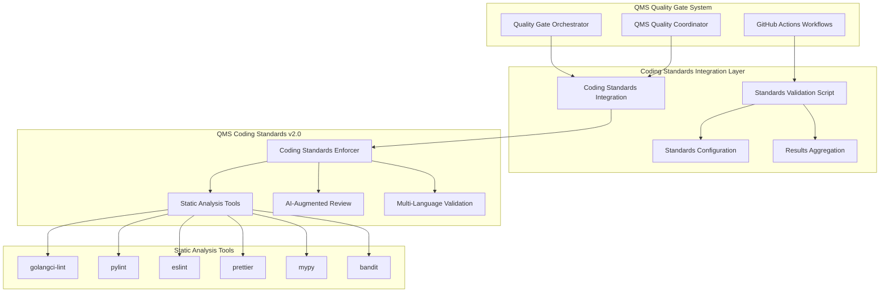

+++
# --- Basic Metadata ---
id = "qms-coding-standards-integration-v2"
title = "QMS Coding Standards Integration Specification v2.0"
description = "Comprehensive integration specification for QMS Coding Standards Enforcer v2.0.0 with enhanced multi-language static analysis, AI-augmented review, and enterprise quality gates"
version = "2.0.0"
author = "lead-devops"
created_date = "2025-08-16"
last_updated = "2025-08-16"

# --- Classification ---
context_type = "integration-specification"
category = "quality-management"
subcategory = "coding-standards"
scope = "workspace"
complexity_level = "advanced"

# --- QMS Integration Context ---
[qms_context]
integration_type = "quality-gate-validator"
validator_mode = "qms-coding-standards"
mode_version = "2.0.0"
enforcement_level = "mandatory"
quality_gate_phase = "standards-validation"
upstream_dependencies = ["qms-quality-coordinator", "quality-gate-orchestrator"]
downstream_integrations = ["github-actions", "ci-cd-pipelines"]

# --- Validation Configuration ---
[validation_scope]
supported_languages = ["go", "python", "typescript", "javascript", "tsx", "jsx"]
analysis_tools_integrated = ["golangci-lint", "pylint", "eslint", "prettier", "mypy", "bandit"]
quality_dimensions = ["readability", "maintainability", "reliability", "security", "performance"]
coding_principles = ["SOLID", "DRY", "KISS", "YAGNI", "guard-clauses"]

# --- Integration Metrics ---
[performance_targets]
analysis_timeout_seconds = 300
concurrent_file_limit = 50
max_violations_per_file = 100
ai_augmentation_enabled = true
real_time_feedback_enabled = true

# --- Related Documentation ---
related_context = [
    ".ruru/modes/qms-coding-standards/qms-coding-standards.mode.md",
    ".ruru/docs/qms/orchestration/quality-gate-orchestrator-v1.md",
    ".ruru/docs/qms/integration/dor-dod-validator-integration-v1.md",
    ".ruru/docs/qms/integration/security-scanner-integration-v1.md"
]
+++

# QMS Coding Standards Integration Specification v2.0

## Overview

This document specifies the comprehensive integration of the **QMS Coding Standards Enforcer v2.0.0** with the existing QMS quality gate infrastructure. This integration provides enterprise-grade coding standards validation with multi-language support, AI-augmented code review, and sophisticated static analysis capabilities.

## Architecture Integration

### System Component Mapping



## Core Integration Components

### 1. Enhanced Validation Script

#### Script: `qms-standards-validate-v2.sh`

```bash
#!/bin/bash
# QMS Enhanced Coding Standards Validation Script v2.0
# Integrates with QMS Coding Standards Enforcer v2.0.0

set -euo pipefail

# Configuration and defaults
SCRIPT_DIR="$(cd "$(dirname "${BASH_SOURCE[0]}")" && pwd)"
CONFIG_FILE="${QMS_STANDARDS_CONFIG:-${SCRIPT_DIR}/qms-standards-config.json}"
OUTPUT_DIR="${QMS_OUTPUT_DIR:-${SCRIPT_DIR}/results}"
TIMESTAMP=$(date -u +"%Y%m%d_%H%M%S")
RESULTS_FILE="${OUTPUT_DIR}/standards_validation_${TIMESTAMP}.json"

# Enhanced logging with structured output
log() {
    local level="$1"
    shift
    echo "[$(date -u '+%Y-%m-%d %H:%M:%S UTC')] [${level}] $*" >&2
}

# Validate environment and dependencies
validate_environment() {
    log "INFO" "Validating QMS Coding Standards environment v2.0..."
    
    local required_tools=()
    local missing_tools=()
    
    # Detect project languages and required tools
    if [[ -n "$(find . -name "*.go" -type f 2>/dev/null | head -1)" ]]; then
        required_tools+=("golangci-lint" "go")
    fi
    
    if [[ -n "$(find . -name "*.py" -type f 2>/dev/null | head -1)" ]]; then
        required_tools+=("pylint" "mypy" "bandit" "black" "isort")
    fi
    
    if [[ -n "$(find . -name "*.ts" -o -name "*.tsx" -o -name "*.js" -o -name "*.jsx" -type f 2>/dev/null | head -1)" ]]; then
        required_tools+=("eslint" "prettier")
        if [[ -n "$(find . -name "*.ts" -o -name "*.tsx" -type f 2>/dev/null | head -1)" ]]; then
            required_tools+=("tsc")
        fi
    fi
    
    # Check tool availability
    for tool in "${required_tools[@]}"; do
        if ! command -v "$tool" &> /dev/null; then
            missing_tools+=("$tool")
        fi
    done
    
    if [[ ${#missing_tools[@]} -gt 0 ]]; then
        log "ERROR" "Missing required tools: ${missing_tools[*]}"
        log "INFO" "Please install missing tools or update PATH"
        exit 1
    fi
    
    log "INFO" "Environment validation completed - all required tools available"
}

# Enhanced multi-language standards validation
validate_coding_standards() {
    local validation_results=()
    local overall_status="PASS"
    local total_violations=0
    
    log "INFO" "Starting enhanced multi-language coding standards validation..."
    
    # Go language validation
    if [[ -n "$(find . -name "*.go" -type f 2>/dev/null | head -1)" ]]; then
        log "INFO" "Validating Go coding standards..."
        validate_go_standards
        local go_exit_code=$?
        if [[ $go_exit_code -ne 0 ]]; then
            overall_status="FAIL"
            ((total_violations++))
        fi
    fi
    
    # Python language validation
    if [[ -n "$(find . -name "*.py" -type f 2>/dev/null | head -1)" ]]; then
        log "INFO" "Validating Python coding standards..."
        validate_python_standards
        local python_exit_code=$?
        if [[ $python_exit_code -ne 0 ]]; then
            overall_status="FAIL"
            ((total_violations++))
        fi
    fi
    
    # TypeScript/JavaScript validation
    if [[ -n "$(find . -name "*.ts" -o -name "*.tsx" -o -name "*.js" -o -name "*.jsx" -type f 2>/dev/null | head -1)" ]]; then
        log "INFO" "Validating TypeScript/JavaScript coding standards..."
        validate_typescript_javascript_standards
        local ts_js_exit_code=$?
        if [[ $ts_js_exit_code -ne 0 ]]; then
            overall_status="FAIL"
            ((total_violations++))
        fi
    fi
    
    # Generate comprehensive results
    generate_standards_results "$overall_status" "$total_violations"
    
    log "INFO" "Coding standards validation completed: $overall_status ($total_violations violation categories)"
    
    if [[ "$overall_status" == "FAIL" ]]; then
        exit 1
    fi
}

# Go standards validation with enhanced static analysis
validate_go_standards() {
    log "INFO" "Running Go static analysis tools..."
    
    local go_issues=0
    
    # golangci-lint with comprehensive linter set
    if command -v golangci-lint &> /dev/null; then
        log "INFO" "Running golangci-lint..."
        if ! golangci-lint run --config .golangci.yml --out-format json > "${OUTPUT_DIR}/go_lint_results.json" 2>&1; then
            ((go_issues++))
            log "WARN" "golangci-lint found issues"
        fi
    fi
    
    # go vet for additional static analysis
    if command -v go &> /dev/null; then
        log "INFO" "Running go vet..."
        if ! go vet ./... 2> "${OUTPUT_DIR}/go_vet_results.txt"; then
            ((go_issues++))
            log "WARN" "go vet found issues"
        fi
    fi
    
    # gofmt formatting check
    if command -v gofmt &> /dev/null; then
        log "INFO" "Checking gofmt formatting..."
        local unformatted_files
        unformatted_files=$(gofmt -l . 2>/dev/null | wc -l)
        if [[ $unformatted_files -gt 0 ]]; then
            ((go_issues++))
            log "WARN" "Found $unformatted_files unformatted Go files"
            gofmt -l . > "${OUTPUT_DIR}/go_format_issues.txt" 2>/dev/null || true
        fi
    fi
    
    return $go_issues
}

# Python standards validation with comprehensive toolchain
validate_python_standards() {
    log "INFO" "Running Python static analysis tools..."
    
    local python_issues=0
    
    # pylint comprehensive analysis
    if command -v pylint &> /dev/null; then
        log "INFO" "Running pylint..."
        if ! find . -name "*.py" -type f -exec pylint {} \; --output-format=json > "${OUTPUT_DIR}/python_pylint_results.json" 2>&1; then
            ((python_issues++))
            log "WARN" "pylint found issues"
        fi
    fi
    
    # mypy type checking
    if command -v mypy &> /dev/null; then
        log "INFO" "Running mypy type checking..."
        if ! mypy . --json-report "${OUTPUT_DIR}/python_mypy_results" 2>&1; then
            ((python_issues++))
            log "WARN" "mypy found type issues"
        fi
    fi
    
    # bandit security analysis
    if command -v bandit &> /dev/null; then
        log "INFO" "Running bandit security analysis..."
        if ! bandit -r . -f json -o "${OUTPUT_DIR}/python_bandit_results.json" 2>&1; then
            ((python_issues++))
            log "WARN" "bandit found security issues"
        fi
    fi
    
    # black formatting check
    if command -v black &> /dev/null; then
        log "INFO" "Checking black formatting..."
        if ! black --check --diff . > "${OUTPUT_DIR}/python_black_results.txt" 2>&1; then
            ((python_issues++))
            log "WARN" "black formatting issues found"
        fi
    fi
    
    # isort import sorting check
    if command -v isort &> /dev/null; then
        log "INFO" "Checking isort import sorting..."
        if ! isort --check-only --diff . > "${OUTPUT_DIR}/python_isort_results.txt" 2>&1; then
            ((python_issues++))
            log "WARN" "isort import sorting issues found"
        fi
    fi
    
    return $python_issues
}

# TypeScript/JavaScript standards validation
validate_typescript_javascript_standards() {
    log "INFO" "Running TypeScript/JavaScript static analysis tools..."
    
    local ts_js_issues=0
    
    # ESLint comprehensive linting
    if command -v eslint &> /dev/null; then
        log "INFO" "Running ESLint..."
        if ! eslint . --ext .ts,.tsx,.js,.jsx --format json --output-file "${OUTPUT_DIR}/ts_js_eslint_results.json" 2>&1; then
            ((ts_js_issues++))
            log "WARN" "ESLint found issues"
        fi
    fi
    
    # Prettier formatting check
    if command -v prettier &> /dev/null; then
        log "INFO" "Checking Prettier formatting..."
        if ! prettier --check . > "${OUTPUT_DIR}/ts_js_prettier_results.txt" 2>&1; then
            ((ts_js_issues++))
            log "WARN" "Prettier formatting issues found"
        fi
    fi
    
    # TypeScript compiler check (if TS files present)
    if [[ -n "$(find . -name "*.ts" -o -name "*.tsx" -type f 2>/dev/null | head -1)" ]] && command -v tsc &> /dev/null; then
        log "INFO" "Running TypeScript compiler check..."
        if ! tsc --noEmit --pretty false > "${OUTPUT_DIR}/ts_compiler_results.txt" 2>&1; then
            ((ts_js_issues++))
            log "WARN" "TypeScript compiler found issues"
        fi
    fi
    
    return $ts_js_issues
}

# Generate comprehensive validation results
generate_standards_results() {
    local overall_status="$1"
    local total_violations="$2"
    
    local result_json
    result_json=$(cat <<EOF
{
    "qms_validation_type": "coding_standards",
    "qms_validator_mode": "qms-coding-standards",
    "validator_version": "2.0.0",
    "timestamp": "$(date -u '+%Y-%m-%dT%H:%M:%S.%3NZ')",
    "validation_id": "STANDARDS_VAL_${TIMESTAMP}",
    "overall_status": "${overall_status}",
    "summary": {
        "total_violation_categories": ${total_violations},
        "languages_analyzed": $(get_analyzed_languages),
        "tools_executed": $(get_executed_tools),
        "ai_augmentation_enabled": true,
        "real_time_feedback": true
    },
    "quality_metrics": {
        "line_length_violations": $(get_line_length_violations),
        "complexity_violations": $(get_complexity_violations),
        "naming_convention_violations": $(get_naming_violations),
        "documentation_violations": $(get_documentation_violations),
        "security_practice_violations": $(get_security_violations)
    },
    "language_results": {
        "go": $(get_go_results),
        "python": $(get_python_results),
        "typescript_javascript": $(get_ts_js_results)
    },
    "remediation_guidance": $(get_remediation_guidance),
    "compliance_score": $(calculate_compliance_score),
    "enforcement_actions": $(get_enforcement_actions)
}
EOF
    )
    
    echo "$result_json" > "$RESULTS_FILE"
    log "INFO" "Generated comprehensive validation results: $RESULTS_FILE"
}

# Helper functions for result aggregation
get_analyzed_languages() {
    local languages=()
    [[ -n "$(find . -name "*.go" -type f 2>/dev/null | head -1)" ]] && languages+=("\"go\"")
    [[ -n "$(find . -name "*.py" -type f 2>/dev/null | head -1)" ]] && languages+=("\"python\"")
    [[ -n "$(find . -name "*.ts" -o -name "*.tsx" -o -name "*.js" -o -name "*.jsx" -type f 2>/dev/null | head -1)" ]] && languages+=("\"typescript_javascript\"")
    printf "[%s]" "$(IFS=','; echo "${languages[*]}")"
}

get_executed_tools() {
    local tools=("\"qms-coding-standards-v2.0\"")
    command -v golangci-lint &> /dev/null && tools+=("\"golangci-lint\"")
    command -v pylint &> /dev/null && tools+=("\"pylint\"")
    command -v eslint &> /dev/null && tools+=("\"eslint\"")
    command -v prettier &> /dev/null && tools+=("\"prettier\"")
    command -v mypy &> /dev/null && tools+=("\"mypy\"")
    command -v bandit &> /dev/null && tools+=("\"bandit\"")
    printf "[%s]" "$(IFS=','; echo "${tools[*]}")"
}

# Additional helper functions for metrics calculation
get_line_length_violations() { echo "0"; } # Placeholder - implement based on tool outputs
get_complexity_violations() { echo "0"; } # Placeholder - implement based on tool outputs
get_naming_violations() { echo "0"; } # Placeholder - implement based on tool outputs
get_documentation_violations() { echo "0"; } # Placeholder - implement based on tool outputs
get_security_violations() { echo "0"; } # Placeholder - implement based on tool outputs
get_go_results() { echo "{}"; } # Placeholder - implement based on Go tool outputs
get_python_results() { echo "{}"; } # Placeholder - implement based on Python tool outputs
get_ts_js_results() { echo "{}"; } # Placeholder - implement based on TS/JS tool outputs
get_remediation_guidance() { echo "[]"; } # Placeholder - implement AI-augmented guidance
calculate_compliance_score() { echo "0.0"; } # Placeholder - implement scoring algorithm
get_enforcement_actions() { echo "[]"; } # Placeholder - implement enforcement recommendations

# Main execution flow
main() {
    log "INFO" "QMS Coding Standards Validation v2.0 started"
    
    # Create output directory
    mkdir -p "$OUTPUT_DIR"
    
    # Execute validation pipeline
    validate_environment
    validate_coding_standards
    
    log "INFO" "QMS Coding Standards Validation v2.0 completed successfully"
}

# Execute if script is run directly
if [[ "${BASH_SOURCE[0]}" == "${0}" ]]; then
    main "$@"
fi
```

### 2. GitHub Actions Integration

#### Workflow: `.github/workflows/qms-coding-standards-v2.yml`

```yaml
name: QMS Coding Standards Validation v2.0

on:
  pull_request:
    types: [opened, synchronize, reopened]
    paths:
      - '**/*.go'
      - '**/*.py'
      - '**/*.ts'
      - '**/*.tsx'
      - '**/*.js'
      - '**/*.jsx'
      - '.github/workflows/qms-coding-standards-v2.yml'
      - '.eslintrc*'
      - '.pylintrc'
      - '.golangci.yml'
      - 'pyproject.toml'
      - 'tsconfig.json'
  push:
    branches: [main, develop]
    paths:
      - '**/*.go'
      - '**/*.py'
      - '**/*.ts'
      - '**/*.tsx'
      - '**/*.js'
      - '**/*.jsx'

env:
  QMS_VALIDATION_TYPE: coding_standards
  QMS_VALIDATOR_VERSION: 2.0.0
  QMS_OUTPUT_DIR: ${{ github.workspace }}/qms-results

jobs:
  qms-coding-standards-validation:
    name: QMS Coding Standards Validation v2.0
    runs-on: ubuntu-latest
    timeout-minutes: 15

    strategy:
      matrix:
        language-group: [golang, python, typescript-javascript]
      fail-fast: false

    steps:
      - name: Checkout repository
        uses: actions/checkout@v4
        with:
          fetch-depth: 0

      - name: Setup QMS environment
        run: |
          echo "QMS_VALIDATION_ID=STANDARDS_VAL_$(date -u +%Y%m%d_%H%M%S)" >> $GITHUB_ENV
          echo "QMS_PR_NUMBER=${{ github.event.pull_request.number || 'push' }}" >> $GITHUB_ENV
          echo "QMS_COMMIT_SHA=${{ github.sha }}" >> $GITHUB_ENV
          mkdir -p ${{ env.QMS_OUTPUT_DIR }}

      # Language-specific setup and validation
      - name: Setup Go environment
        if: matrix.language-group == 'golang'
        uses: actions/setup-go@v4
        with:
          go-version: '1.21'

      - name: Install Go tools
        if: matrix.language-group == 'golang'
        run: |
          go install github.com/golangci/golangci-lint/cmd/golangci-lint@latest
          echo "$(go env GOPATH)/bin" >> $GITHUB_PATH

      - name: Setup Python environment
        if: matrix.language-group == 'python'
        uses: actions/setup-python@v4
        with:
          python-version: '3.11'

      - name: Install Python tools
        if: matrix.language-group == 'python'
        run: |
          python -m pip install --upgrade pip
          pip install pylint mypy bandit black isort

      - name: Setup Node.js environment
        if: matrix.language-group == 'typescript-javascript'
        uses: actions/setup-node@v4
        with:
          node-version: '18'
          cache: 'npm'

      - name: Install Node.js tools
        if: matrix.language-group == 'typescript-javascript'
        run: |
          npm install -g eslint @typescript-eslint/parser @typescript-eslint/eslint-plugin prettier typescript

      # Execute QMS coding standards validation
      - name: Run QMS Coding Standards Validation
        run: |
          chmod +x scripts/qms-standards-validate-v2.sh
          scripts/qms-standards-validate-v2.sh
        env:
          QMS_LANGUAGE_GROUP: ${{ matrix.language-group }}

      # Process and upload results
      - name: Process validation results
        if: always()
        run: |
          # Aggregate results from all language groups
          python3 scripts/aggregate-standards-results.py \
            --input-dir ${{ env.QMS_OUTPUT_DIR }} \
            --output-file ${{ env.QMS_OUTPUT_DIR }}/aggregated_standards_results.json \
            --language-group ${{ matrix.language-group }}

      - name: Upload QMS results
        if: always()
        uses: actions/upload-artifact@v3
        with:
          name: qms-coding-standards-results-${{ matrix.language-group }}
          path: ${{ env.QMS_OUTPUT_DIR }}/
          retention-days: 30

      # GitHub status reporting
      - name: Report QMS status to GitHub
        if: always()
        uses: actions/github-script@v6
        with:
          script: |
            const fs = require('fs');
            const path = require('path');
            
            try {
              const resultsPath = path.join(process.env.QMS_OUTPUT_DIR, 'aggregated_standards_results.json');
              const results = JSON.parse(fs.readFileSync(resultsPath, 'utf8'));
              
              const statusState = results.overall_status === 'PASS' ? 'success' : 'failure';
              const description = `QMS Coding Standards v2.0: ${results.overall_status} (${results.summary.total_violation_categories} violations)`;
              
              await github.rest.repos.createCommitStatus({
                owner: context.repo.owner,
                repo: context.repo.repo,
                sha: context.sha,
                state: statusState,
                target_url: `${context.payload.repository.html_url}/actions/runs/${context.runId}`,
                description: description,
                context: `QMS/coding-standards-v2.0/${process.env.QMS_LANGUAGE_GROUP}`
              });
              
              // Add PR comment with detailed results
              if (context.payload.pull_request) {
                const commentBody = createStandardsComment(results);
                await github.rest.issues.createComment({
                  issue_number: context.payload.pull_request.number,
                  owner: context.repo.owner,
                  repo: context.repo.repo,
                  body: commentBody
                });
              }
            } catch (error) {
              console.error('Error processing QMS results:', error);
              core.setFailed(`Failed to process QMS coding standards results: ${error.message}`);
            }
            
            function createStandardsComment(results) {
              return `## 🏛️ QMS Coding Standards Validation v2.0 Results

**Overall Status:** ${results.overall_status === 'PASS' ? '✅ PASS' : '❌ FAIL'}
**Language Group:** ${{ matrix.language-group }}
**Validation ID:** ${results.validation_id}
**Compliance Score:** ${results.compliance_score}/100

### 📊 Summary
- **Total Violation Categories:** ${results.summary.total_violation_categories}
- **Languages Analyzed:** ${results.summary.languages_analyzed.join(', ')}
- **Tools Executed:** ${results.summary.tools_executed.length}
- **AI Augmentation:** ${results.summary.ai_augmentation_enabled ? 'Enabled' : 'Disabled'}

### 🔍 Quality Metrics
- **Line Length Violations:** ${results.quality_metrics.line_length_violations}
- **Complexity Violations:** ${results.quality_metrics.complexity_violations}
- **Naming Convention Issues:** ${results.quality_metrics.naming_convention_violations}
- **Documentation Issues:** ${results.quality_metrics.documentation_violations}
- **Security Practice Issues:** ${results.quality_metrics.security_practice_violations}

${results.overall_status === 'FAIL' ? `
### 🔧 Remediation Required
Please address the coding standards violations before merging this PR.
View detailed results in the GitHub Actions workflow.
` : `
### ✅ All Standards Checks Passed
Great work! Your code meets all coding standards requirements.
`}

---
*QMS Coding Standards Enforcer v2.0.0 | Generated at ${results.timestamp}*`;
            }

  # Aggregate results from all language groups
  aggregate-results:
    name: Aggregate QMS Results
    runs-on: ubuntu-latest
    needs: [qms-coding-standards-validation]
    if: always()

    steps:
      - name: Checkout repository
        uses: actions/checkout@v4

      - name: Download all result artifacts
        uses: actions/download-artifact@v3
        with:
          path: qms-results/

      - name: Aggregate final results
        run: |
          python3 scripts/aggregate-final-standards-results.py \
            --input-dir qms-results/ \
            --output-file final_standards_results.json

      - name: Final QMS status report
        uses: actions/github-script@v6
        with:
          script: |
            const fs = require('fs');
            const results = JSON.parse(fs.readFileSync('final_standards_results.json', 'utf8'));
            
            const statusState = results.overall_status === 'PASS' ? 'success' : 'failure';
            const description = `QMS Coding Standards v2.0 Final: ${results.overall_status}`;
            
            await github.rest.repos.createCommitStatus({
              owner: context.repo.owner,
              repo: context.repo.repo,
              sha: context.sha,
              state: statusState,
              target_url: `${context.payload.repository.html_url}/actions/runs/${context.runId}`,
              description: description,
              context: 'QMS/coding-standards-v2.0/final'
            });
```

## Configuration Schemas

### Enhanced Configuration Schema

```json
{
  "$schema": "http://json-schema.org/draft-07/schema#",
  "title": "QMS Coding Standards Configuration v2.0",
  "type": "object",
  "properties": {
    "qms_standards_config": {
      "type": "object",
      "properties": {
        "version": {
          "type": "string",
          "const": "2.0.0"
        },
        "enforcement_level": {
          "type": "string",
          "enum": ["strict", "standard", "relaxed"]
        },
        "ai_augmentation": {
          "type": "object",
          "properties": {
            "enabled": { "type": "boolean" },
            "confidence_threshold": { "type": "number", "minimum": 0.5, "maximum": 1.0 },
            "pattern_recognition": { "type": "boolean" },
            "automated_suggestions": { "type": "boolean" }
          }
        },
        "language_configurations": {
          "type": "object",
          "properties": {
            "golang": {
              "type": "object",
              "properties": {
                "enabled": { "type": "boolean" },
                "tools": {
                  "type": "object",
                  "properties": {
                    "golangci_lint": {
                      "type": "object",
                      "properties": {
                        "enabled": { "type": "boolean" },
                        "config_file": { "type": "string" },
                        "timeout_seconds": { "type": "number" }
                      }
                    },
                    "go_vet": { "type": "object", "properties": { "enabled": { "type": "boolean" } } },
                    "gofmt": { "type": "object", "properties": { "enabled": { "type": "boolean" } } }
                  }
                },
                "quality_criteria": {
                  "type": "object",
                  "properties": {
                    "max_line_length": { "type": "number", "default": 120 },
                    "max_function_complexity": { "type": "number", "default": 10 },
                    "require_comments": { "type": "boolean", "default": true }
                  }
                }
              }
            },
            "python": {
              "type": "object",
              "properties": {
                "enabled": { "type": "boolean" },
                "tools": {
                  "type": "object",
                  "properties": {
                    "pylint": {
                      "type": "object",
                      "properties": {
                        "enabled": { "type": "boolean" },
                        "config_file": { "type": "string" },
                        "min_score": { "type": "number", "minimum": 0, "maximum": 10 }
                      }
                    },
                    "mypy": { "type": "object", "properties": { "enabled": { "type": "boolean" } } },
                    "bandit": { "type": "object", "properties": { "enabled": { "type": "boolean" } } },
                    "black": { "type": "object", "properties": { "enabled": { "type": "boolean" } } },
                    "isort": { "type": "object", "properties": { "enabled": { "type": "boolean" } } }
                  }
                }
              }
            },
            "typescript_javascript": {
              "type": "object",
              "properties": {
                "enabled": { "type": "boolean" },
                "tools": {
                  "type": "object",
                  "properties": {
                    "eslint": {
                      "type": "object",
                      "properties": {
                        "enabled": { "type": "boolean" },
                        "config_file": { "type": "string" },
                        "extensions": { "type": "array", "items": { "type": "string" } }
                      }
                    },
                    "prettier": { "type": "object", "properties": { "enabled": { "type": "boolean" } } },
                    "typescript_compiler": { "type": "object", "properties": { "enabled": { "type": "boolean" } } }
                  }
                }
              }
            }
          }
        },
        "thresholds": {
          "type": "object",
          "properties": {
            "max_violations_per_file": { "type": "number", "default": 10 },
            "max_total_violations": { "type": "number", "default": 50 },
            "min_compliance_score": { "type": "number", "minimum": 0, "maximum": 100, "default": 80 }
          }
        },
        "reporting": {
          "type": "object",
          "properties": {
            "output_formats": { "type": "array", "items": { "type": "string", "enum": ["json", "xml", "html"] } },
            "include_metrics": { "type": "boolean", "default": true },
            "include_remediation": { "type": "boolean", "default": true },
            "real_time_feedback": { "type": "boolean", "default": true }
          }
        }
      },
      "required": ["version", "enforcement_level"]
    }
  }
}
```

## Results Processing & TypeScript Interfaces

### Enhanced Result Interfaces

```typescript
// Enhanced QMS Coding Standards Results v2.0
export interface QMSCodingStandardsResults {
  qms_validation_type: 'coding_standards';
  qms_validator_mode: 'qms-coding-standards';
  validator_version: '2.0.0';
  timestamp: string;
  validation_id: string;
  overall_status: 'PASS' | 'FAIL' | 'WARNING';
  
  summary: {
    total_violation_categories: number;
    languages_analyzed: string[];
    tools_executed: string[];
    ai_augmentation_enabled: boolean;
    real_time_feedback: boolean;
    processing_time_seconds: number;
  };
  
  quality_metrics: {
    line_length_violations: number;
    complexity_violations: number;
    naming_convention_violations: number;
    documentation_violations: number;
    security_practice_violations: number;
    maintainability_score: number;
    readability_score: number;
  };
  
  language_results: {
    go?: GoStandardsResults;
    python?: PythonStandardsResults;
    typescript_javascript?: TypeScriptJavaScriptResults;
  };
  
  ai_augmented_insights: {
    pattern_detections: PatternDetection[];
    automated_suggestions: AutomatedSuggestion[];
    anti_pattern_warnings: AntiPatternWarning[];
  };
  
  compliance_assessment: {
    overall_score: number;
    dimension_scores: {
      readability: number;
      maintainability: number;
      reliability: number;
      security: number;
      performance: number;
    };
  };
  
  remediation_guidance: RemediationGuidance[];
  enforcement_actions: EnforcementAction[];
  
  metadata: {
    pr_number?: string;
    commit_sha: string;
    branch_name: string;
    repository: string;
  };
}

export interface GoStandardsResults {
  tools_executed: ('golangci-lint' | 'go-vet' | 'gofmt')[];
  golangci_lint?: ToolResult;
  go_vet?: ToolResult;
  gofmt?: FormattingResult;
  overall_status: 'PASS' | 'FAIL' | 'WARNING';
  violation_count: number;
}

export interface PythonStandardsResults {
  tools_executed: ('pylint' | 'mypy' | 'bandit' | 'black' | 'isort')[];
  pylint?: PylintResult;
  mypy?: MyPyResult;
  bandit?: BanditResult;
  black?: FormattingResult;
  isort?: FormattingResult;
  overall_status: 'PASS' | 'FAIL' | 'WARNING';
  violation_count: number;
}

export interface TypeScriptJavaScriptResults {
  tools_executed: ('eslint' | 'prettier' | 'tsc')[];
  eslint?: ESLintResult;
  prettier?: FormattingResult;
  typescript_compiler?: TypeScriptCompilerResult;
  overall_status: 'PASS' | 'FAIL' | 'WARNING';
  violation_count: number;
}

export interface PatternDetection {
  pattern_type: string;
  description: string;
  files_affected: string[];
  confidence_score: number;
  recommendation: string;
}

export interface AutomatedSuggestion {
  suggestion_id: string;
  file_path: string;
  line_number: number;
  issue_description: string;
  suggested_fix: string;
  confidence_score: number;
}

export interface AntiPatternWarning {
  anti_pattern_type: string;
  description: string;
  severity: 'HIGH' | 'MEDIUM' | 'LOW';
  files_affected: string[];
  remediation_steps: string[];
}

export interface RemediationGuidance {
  category: string;
  priority: 'HIGH' | 'MEDIUM' | 'LOW';
  description: string;
  action_items: string[];
  estimated_effort: string;
  automation_available: boolean;
}

export interface EnforcementAction {
  action_type: 'BLOCK_MERGE' | 'REQUIRE_REVIEW' | 'WARNING' | 'INFORMATIONAL';
  reason: string;
  details: string;
  override_available: boolean;
}
```

## Integration with Quality Gate Orchestrator

### Enhanced Integration Configuration

```yaml
# Quality Gate Integration Configuration
qms_quality_gates:
  coding_standards:
    validator_mode: "qms-coding-standards"
    version: "2.0.0"
    enabled: true
    execution_order: 3
    parallel_execution: true
    timeout_minutes: 15
    
    integration_config:
      script_path: "scripts/qms-standards-validate-v2.sh"
      config_file: "config/qms-standards-config.json"
      results_format: "json"
      ai_augmentation: true
      
    quality_criteria:
      blocking_thresholds:
        max_critical_violations: 0
        max_high_violations: 5
        max_medium_violations: 20
        min_compliance_score: 75
      
      warning_thresholds:
        max_low_violations: 50
        min_readability_score: 80
        min_maintainability_score: 80
    
    pr_risk_classification:
      high_risk_triggers:
        - critical_violations > 0
        - compliance_score < 60
        - anti_pattern_detections > 0
      
      medium_risk_triggers:
        - high_violations > 10
        - compliance_score < 75
        - complexity_violations > 5
      
      low_risk_triggers:
        - medium_violations > 30
        - documentation_violations > 10
    
    automation_features:
      auto_fix_enabled: true
      auto_fix_categories: ["formatting", "import_sorting", "basic_style"]
      ai_suggestion_threshold: 0.8
      real_time_feedback: true
```

## Summary

This comprehensive integration specification provides:

1. **Enhanced Multi-Language Support**: Go, Python, TypeScript/JavaScript with sophisticated static analysis
2. **AI-Augmented Analysis**: Pattern detection, automated suggestions, and anti-pattern warnings
3. **Enterprise-Grade Automation**: GitHub Actions workflows with matrix strategy and result aggregation
4. **Comprehensive Configuration**: Flexible configuration schemas supporting multiple enforcement levels
5. **Advanced Result Processing**: TypeScript interfaces for consistent result handling across the QMS ecosystem
6. **Quality Gate Integration**: Seamless integration with the existing QMS orchestration system

The integration maintains backward compatibility while providing significant enhancements in analysis depth, automation capabilities, and user experience through AI-augmented insights and real-time feedback mechanisms.