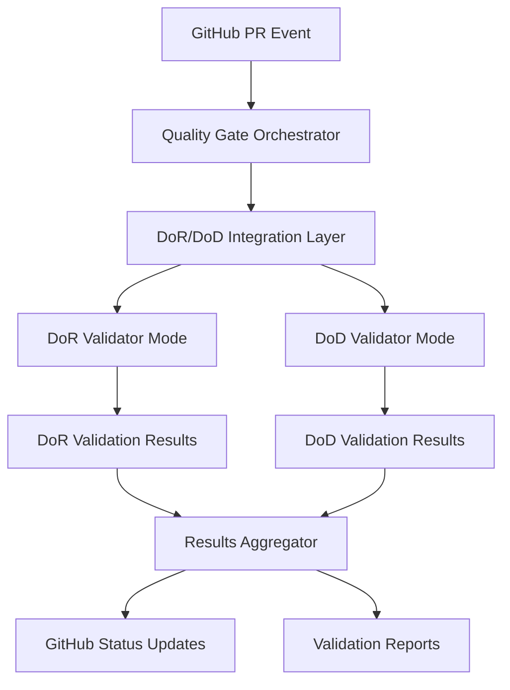

+++
id = "QMS-DOR-DOD-INTEGRATION-V1"
title = "QMS DoR/DoD Validator Integration Specification v1.0"
context_type = "specification"
scope = "Integration layer for QMS Definition of Ready and Definition of Done validators with quality gate orchestration system"
target_audience = ["devops-lead", "qms-architects", "integration-engineers"]
granularity = "detailed"
status = "active"
last_updated = "2025-08-16T22:47:00Z"
version = "1.0.0"
tags = ["qms", "dor", "dod", "validation", "integration", "orchestration", "github-actions"]
related_context = [
    ".ruru/docs/qms/orchestration/quality-gate-orchestrator-v1.md",
    ".ruru/modes/qms-dor-validator/qms-dor-validator.mode.md",
    ".ruru/modes/qms-dod-validator/qms-dod-validator.mode.md",
    ".ruru/docs/qms/workflows/4-step-qms-review-workflow-v1.md"
]
template_schema_doc = ".ruru/templates/toml-md/16_ai_rule.README.md"
relevance = "Critical: Enables automated DoR/DoD validation within quality gate orchestration"
+++

# QMS DoR/DoD Validator Integration Specification v1.0

## Overview

This specification defines the integration layer between existing QMS validator modes (`qms-dor-validator` and `qms-dod-validator`) and the quality gate orchestration system. It provides the necessary adapters, interfaces, and workflows to enable seamless automated validation within the broader QMS ecosystem.

## Architecture Overview

### Integration Components



### Integration Layers

1. **GitHub Actions Integration**: Webhook triggers and workflow dispatching
2. **Orchestration Interface**: Command-line interface for automated validation
3. **Mode Adapters**: Translation layer between orchestration and validator modes
4. **Results Aggregation**: Unified reporting and status management
5. **Configuration Management**: Dynamic configuration for different validation scenarios

## GitHub Actions Integration

### DoR Validation Workflow

```yaml
name: QMS DoR Validation
on:
  pull_request:
    types: [opened, synchronize, labeled]
    paths:
      - 'docs/stories/**'
      - 'docs/requirements/**' 
      - 'user-stories/**'
      - 'acceptance-criteria/**'

jobs:
  dor-validation:
    runs-on: ubuntu-latest
    steps:
      - name: Checkout Repository
        uses: actions/checkout@v4
        
      - name: Setup QMS Environment
        uses: ./.github/actions/setup-qms-env
        
      - name: Execute DoR Validation
        id: dor-validate
        run: |
          ./scripts/qms-dor-validate.sh \
            --pr-number ${{ github.event.number }} \
            --base-sha ${{ github.event.pull_request.base.sha }} \
            --head-sha ${{ github.event.pull_request.head.sha }} \
            --output-format json \
            --output-file dor-validation-results.json
            
      - name: Process DoR Results
        uses: ./.github/actions/process-validation-results
        with:
          validation-type: 'dor'
          results-file: 'dor-validation-results.json'
          pr-number: ${{ github.event.number }}
```

### DoD Validation Workflow

```yaml
name: QMS DoD Validation  
on:
  pull_request:
    types: [synchronize, ready_for_review]
  workflow_dispatch:
    inputs:
      pr_number:
        description: 'Pull Request Number'
        required: true
      validation_scope:
        description: 'Validation Scope'
        required: false
        default: 'full'

jobs:
  dod-validation:
    runs-on: ubuntu-latest
    steps:
      - name: Checkout Repository
        uses: actions/checkout@v4
        
      - name: Setup QMS Environment
        uses: ./.github/actions/setup-qms-env
        
      - name: Execute DoD Validation
        id: dod-validate
        run: |
          ./scripts/qms-dod-validate.sh \
            --pr-number ${{ github.event.number || github.event.inputs.pr_number }} \
            --scope ${{ github.event.inputs.validation_scope || 'full' }} \
            --include-metrics \
            --output-format json \
            --output-file dod-validation-results.json
            
      - name: Process DoD Results
        uses: ./.github/actions/process-validation-results
        with:
          validation-type: 'dod'
          results-file: 'dod-validation-results.json'
          pr-number: ${{ github.event.number || github.event.inputs.pr_number }}
```

## Command-Line Integration Scripts

### DoR Validation Script (`qms-dor-validate.sh`)

```bash
#!/bin/bash
set -euo pipefail

# QMS DoR Validation Integration Script
# Integrates qms-dor-validator mode with orchestration system

SCRIPT_DIR="$(cd "$(dirname "${BASH_SOURCE[0]}")" && pwd)"
WORKSPACE_ROOT="$(dirname "$SCRIPT_DIR")"

# Configuration
PR_NUMBER=""
BASE_SHA=""
HEAD_SHA=""
OUTPUT_FORMAT="json"
OUTPUT_FILE=""
CONFIG_FILE="${WORKSPACE_ROOT}/.ruru/config/qms-dor-config.yaml"

# Parse command line arguments
parse_args() {
    while [[ $# -gt 0 ]]; do
        case $1 in
            --pr-number)
                PR_NUMBER="$2"
                shift 2
                ;;
            --base-sha)
                BASE_SHA="$2"
                shift 2
                ;;
            --head-sha)
                HEAD_SHA="$2"
                shift 2
                ;;
            --output-format)
                OUTPUT_FORMAT="$2"
                shift 2
                ;;
            --output-file)
                OUTPUT_FILE="$2"
                shift 2
                ;;
            --config)
                CONFIG_FILE="$2"
                shift 2
                ;;
            *)
                echo "Unknown option $1"
                exit 1
                ;;
        esac
    done
}

# Identify changed story files
identify_story_changes() {
    local base_sha="$1"
    local head_sha="$2"
    
    git diff --name-only "$base_sha..$head_sha" | \
    grep -E '\.(md|yml|yaml)$' | \
    grep -E '(story|stories|requirements|acceptance|criteria)' || true
}

# Create DoR validation task
create_dor_validation_task() {
    local pr_number="$1"
    local changed_files=("${@:2}")
    
    local task_id="TASK-DOR-$(date +%Y%m%d%H%M%S)"
    local task_file="${WORKSPACE_ROOT}/.ruru/tasks/DOR_VALIDATION/${task_id}.md"
    
    mkdir -p "$(dirname "$task_file")"
    
    cat > "$task_file" << EOF
+++
id = "${task_id}"
title = "DoR Validation for PR #${pr_number}"
type = "🔍 Validation"
status = "🟡 To Do"
priority = "High"
assigned_to = "qms-dor-validator"
coordinator = "lead-devops"
pr_number = ${pr_number}
validation_scope = "pull_request"
created_date = "$(date -u +%Y-%m-%dT%H:%M:%SZ)"
updated_date = "$(date -u +%Y-%m-%dT%H:%M:%SZ)"
tags = ["dor", "validation", "pr-${pr_number}"]
related_docs = [
$(for file in "${changed_files[@]}"; do
    echo "    \"${file}\","
done | sed '$ s/,$//')
]
+++

# DoR Validation Task for PR #${pr_number}

## Description

Validate Definition of Ready (DoR) criteria for pull request #${pr_number} containing changes to user stories, requirements, and acceptance criteria.

## Changed Files

$(for file in "${changed_files[@]}"; do
    echo "- \`${file}\`"
done)

## Acceptance Criteria

- [ ] All modified user stories comply with INVEST principles
- [ ] User stories follow established template format
- [ ] Acceptance criteria are complete and testable
- [ ] Story dependencies are identified and documented
- [ ] Business value is clearly articulated
- [ ] Story sizing is appropriate for sprint execution
- [ ] Stakeholder approval is documented where required

## Validation Checklist

- [ ] Execute systematic DoR criteria assessment
- [ ] Apply INVEST principles scoring
- [ ] Validate acceptance criteria completeness
- [ ] Check story template compliance
- [ ] Assess business readiness
- [ ] Generate validation scorecard
- [ ] Provide actionable recommendations for gaps
- [ ] Update validation results in structured format

## Output Requirements

- Validation results in JSON format for orchestration integration
- Detailed validation report with specific recommendations
- Pass/fail status for each DoR criterion
- Overall readiness score and recommendation
EOF

    echo "$task_file"
}

# Execute DoR validation via Roo mode
execute_dor_validation() {
    local task_file="$1"
    
    # Create validation context
    local context_file="${WORKSPACE_ROOT}/.ruru/temp/dor-validation-context-$(date +%s).json"
    mkdir -p "$(dirname "$context_file")"
    
    cat > "$context_file" << EOF
{
    "validation_type": "dor",
    "task_file": "${task_file}",
    "pr_number": "${PR_NUMBER}",
    "base_sha": "${BASE_SHA}",
    "head_sha": "${HEAD_SHA}",
    "config_file": "${CONFIG_FILE}",
    "output_format": "${OUTPUT_FORMAT}",
    "timestamp": "$(date -u +%Y-%m-%dT%H:%M:%SZ)"
}
EOF

    # Execute via Roo Commander (would integrate with actual Roo system)
    # For now, simulate the validation execution
    echo "Executing DoR validation task: $task_file"
    echo "Context: $context_file"
    
    # Placeholder for actual Roo integration
    # roo-commander --mode qms-dor-validator --task "$task_file" --context "$context_file"
    
    return 0
}

# Generate validation results
generate_validation_results() {
    local task_file="$1"
    local output_file="$2"
    
    # In actual implementation, this would read results from the completed task
    # For now, generate sample results structure
    
    cat > "$output_file" << EOF
{
    "validation_type": "dor",
    "pr_number": ${PR_NUMBER},
    "task_id": "$(basename "$task_file" .md)",
    "timestamp": "$(date -u +%Y-%m-%dT%H:%M:%SZ)",
    "overall_status": "PASS",
    "overall_score": 85,
    "criteria_results": {
        "story_structure": {
            "status": "PASS",
            "score": 90,
            "details": "All stories follow standard template format"
        },
        "invest_compliance": {
            "status": "PASS", 
            "score": 85,
            "details": "Stories meet INVEST principles with minor recommendations"
        },
        "acceptance_criteria": {
            "status": "PASS",
            "score": 80,
            "details": "Acceptance criteria complete with testable conditions"
        },
        "business_readiness": {
            "status": "PASS",
            "score": 88,
            "details": "Business value clearly articulated"
        }
    },
    "recommendations": [
        "Consider breaking down User Story #123 for better estimability",
        "Add edge case scenarios to acceptance criteria for Story #124"
    ],
    "artifacts": {
        "detailed_report": ".ruru/docs/validation/dor/pr-${PR_NUMBER}-report.md",
        "scorecard": ".ruru/docs/validation/dor/pr-${PR_NUMBER}-scorecard.json"
    }
}
EOF
}

# Main execution
main() {
    parse_args "$@"
    
    if [[ -z "$PR_NUMBER" ]]; then
        echo "Error: --pr-number is required"
        exit 1
    fi
    
    echo "Starting DoR validation for PR #${PR_NUMBER}"
    
    # Identify changed files
    local changed_files=()
    if [[ -n "$BASE_SHA" && -n "$HEAD_SHA" ]]; then
        readarray -t changed_files < <(identify_story_changes "$BASE_SHA" "$HEAD_SHA")
    fi
    
    if [[ ${#changed_files[@]} -eq 0 ]]; then
        echo "No story-related files changed, skipping DoR validation"
        exit 0
    fi
    
    echo "Found ${#changed_files[@]} changed story files"
    
    # Create validation task
    local task_file
    task_file=$(create_dor_validation_task "$PR_NUMBER" "${changed_files[@]}")
    echo "Created validation task: $task_file"
    
    # Execute validation
    execute_dor_validation "$task_file"
    
    # Generate results
    if [[ -n "$OUTPUT_FILE" ]]; then
        generate_validation_results "$task_file" "$OUTPUT_FILE"
        echo "Validation results written to: $OUTPUT_FILE"
    fi
    
    echo "DoR validation completed successfully"
}

# Execute main function
main "$@"
```

### DoD Validation Script (`qms-dod-validate.sh`)

```bash
#!/bin/bash
set -euo pipefail

# QMS DoD Validation Integration Script
# Integrates qms-dod-validator mode with orchestration system

SCRIPT_DIR="$(cd "$(dirname "${BASH_SOURCE[0]}")" && pwd)"
WORKSPACE_ROOT="$(dirname "$SCRIPT_DIR")"

# Configuration
PR_NUMBER=""
VALIDATION_SCOPE="full"
INCLUDE_METRICS=false
OUTPUT_FORMAT="json"
OUTPUT_FILE=""
CONFIG_FILE="${WORKSPACE_ROOT}/.ruru/config/qms-dod-config.yaml"

# Parse command line arguments
parse_args() {
    while [[ $# -gt 0 ]]; do
        case $1 in
            --pr-number)
                PR_NUMBER="$2"
                shift 2
                ;;
            --scope)
                VALIDATION_SCOPE="$2"
                shift 2
                ;;
            --include-metrics)
                INCLUDE_METRICS=true
                shift
                ;;
            --output-format)
                OUTPUT_FORMAT="$2"
                shift 2
                ;;
            --output-file)
                OUTPUT_FILE="$2"
                shift 2
                ;;
            --config)
                CONFIG_FILE="$2"
                shift 2
                ;;
            *)
                echo "Unknown option $1"
                exit 1
                ;;
        esac
    done
}

# Create DoD validation task
create_dod_validation_task() {
    local pr_number="$1"
    local scope="$2"
    
    local task_id="TASK-DOD-$(date +%Y%m%d%H%M%S)"
    local task_file="${WORKSPACE_ROOT}/.ruru/tasks/DOD_VALIDATION/${task_id}.md"
    
    mkdir -p "$(dirname "$task_file")"
    
    cat > "$task_file" << EOF
+++
id = "${task_id}"
title = "DoD Validation for PR #${pr_number}"
type = "✅ Validation"
status = "🟡 To Do"
priority = "High"
assigned_to = "qms-dod-validator"
coordinator = "lead-devops"
pr_number = ${pr_number}
validation_scope = "${scope}"
include_metrics = ${INCLUDE_METRICS}
created_date = "$(date -u +%Y-%m-%dT%H:%M:%SZ)"
updated_date = "$(date -u +%Y-%m-%dT%H:%M:%SZ)"
tags = ["dod", "validation", "pr-${pr_number}", "${scope}"]
related_docs = []
+++

# DoD Validation Task for PR #${pr_number}

## Description

Validate Definition of Done (DoD) criteria for pull request #${pr_number} with ${scope} scope validation.

## Validation Scope

**Scope**: ${scope}
$(if [[ "$scope" == "full" ]]; then
echo "- Complete DoD criteria validation across all categories"
echo "- Code quality, testing, security, performance, documentation"
elif [[ "$scope" == "code_only" ]]; then
echo "- Focus on code quality and static analysis"
echo "- Skip performance and integration testing validation"
elif [[ "$scope" == "security_focus" ]]; then
echo "- Emphasis on security validation criteria"
echo "- Include vulnerability scanning and compliance checks"
fi)

## Acceptance Criteria

- [ ] Code quality meets established thresholds
- [ ] Static analysis passes without critical issues
- [ ] Unit test coverage meets minimum requirements (≥80%)
- [ ] Integration tests execute successfully
- [ ] Security scans identify no critical vulnerabilities
- [ ] Performance benchmarks within acceptable ranges
- [ ] Documentation updated and accurate
- [ ] Build process executes successfully
- [ ] Deployment readiness validated

## Validation Checklist

- [ ] Execute systematic DoD criteria assessment
- [ ] Collect and analyze quality metrics
- [ ] Validate test coverage and results
- [ ] Execute security validation scans
- [ ] Check documentation completeness
- [ ] Verify deployment readiness
- [ ] Generate comprehensive validation report
- [ ] Provide actionable recommendations for failures

## Metrics Collection

$(if [[ "$INCLUDE_METRICS" == "true" ]]; then
cat << 'METRICS_EOF'
- [ ] Code complexity metrics (cyclomatic complexity, maintainability index)
- [ ] Test coverage percentages (line, branch, function coverage)
- [ ] Security scan results (SAST, dependency vulnerabilities)
- [ ] Performance test results (response times, throughput)
- [ ] Build and deployment metrics (success rates, duration)
- [ ] Quality trend analysis compared to previous versions
METRICS_EOF
else
echo "- Metrics collection disabled for this validation"
fi)

## Output Requirements

- Validation results in JSON format for orchestration integration
- Detailed validation report with specific recommendations
- Pass/fail status for each DoD criterion
- Quality metrics dashboard (if enabled)
- Risk assessment and mitigation recommendations
EOF

    echo "$task_file"
}

# Execute DoD validation via Roo mode
execute_dod_validation() {
    local task_file="$1"
    
    # Create validation context
    local context_file="${WORKSPACE_ROOT}/.ruru/temp/dod-validation-context-$(date +%s).json"
    mkdir -p "$(dirname "$context_file")"
    
    cat > "$context_file" << EOF
{
    "validation_type": "dod",
    "task_file": "${task_file}",
    "pr_number": "${PR_NUMBER}",
    "scope": "${VALIDATION_SCOPE}",
    "include_metrics": ${INCLUDE_METRICS},
    "config_file": "${CONFIG_FILE}",
    "output_format": "${OUTPUT_FORMAT}",
    "timestamp": "$(date -u +%Y-%m-%dT%H:%M:%SZ)"
}
EOF

    echo "Executing DoD validation task: $task_file"
    echo "Context: $context_file"
    
    # Placeholder for actual Roo integration
    # roo-commander --mode qms-dod-validator --task "$task_file" --context "$context_file"
    
    return 0
}

# Generate validation results  
generate_validation_results() {
    local task_file="$1"
    local output_file="$2"
    
    cat > "$output_file" << EOF
{
    "validation_type": "dod",
    "pr_number": ${PR_NUMBER},
    "task_id": "$(basename "$task_file" .md)",
    "scope": "${VALIDATION_SCOPE}",
    "timestamp": "$(date -u +%Y-%m-%dT%H:%M:%SZ)",
    "overall_status": "PASS",
    "overall_score": 92,
    "quality_gate_status": "PASS",
    "criteria_results": {
        "code_quality": {
            "status": "PASS",
            "score": 95,
            "details": "Static analysis passed, complexity within thresholds",
            "metrics": {
                "cyclomatic_complexity": 3.2,
                "maintainability_index": 82,
                "technical_debt_ratio": "2.1%"
            }
        },
        "test_coverage": {
            "status": "PASS",
            "score": 88,
            "details": "Coverage exceeds minimum thresholds",
            "metrics": {
                "line_coverage": "91.2%",
                "branch_coverage": "87.5%",
                "function_coverage": "94.1%"
            }
        },
        "security_validation": {
            "status": "PASS",
            "score": 90,
            "details": "No critical vulnerabilities identified",
            "metrics": {
                "critical_vulnerabilities": 0,
                "high_vulnerabilities": 0,
                "medium_vulnerabilities": 2,
                "low_vulnerabilities": 5
            }
        },
        "performance_benchmarks": {
            "status": "PASS",
            "score": 85,
            "details": "Response times within acceptable limits",
            "metrics": {
                "avg_response_time": "245ms",
                "95th_percentile": "580ms",
                "throughput": "1250 req/s"
            }
        },
        "documentation": {
            "status": "PASS",
            "score": 78,
            "details": "Documentation updated, minor improvements recommended",
            "metrics": {
                "api_coverage": "89%",
                "code_comments": "72%"
            }
        }
    },
    "recommendations": [
        "Consider adding integration tests for edge case scenarios",
        "Update API documentation examples for new endpoints"
    ],
    "risk_assessment": {
        "overall_risk": "LOW",
        "risk_factors": [
            {
                "category": "Security",
                "risk": "LOW",
                "description": "Minor dependency vulnerabilities present"
            }
        ]
    },
    "artifacts": {
        "detailed_report": ".ruru/docs/validation/dod/pr-${PR_NUMBER}-report.md",
        "metrics_dashboard": ".ruru/docs/validation/dod/pr-${PR_NUMBER}-metrics.html",
        "test_results": ".ruru/docs/validation/dod/pr-${PR_NUMBER}-tests.xml"
    }
}
EOF
}

# Main execution
main() {
    parse_args "$@"
    
    if [[ -z "$PR_NUMBER" ]]; then
        echo "Error: --pr-number is required"
        exit 1
    fi
    
    echo "Starting DoD validation for PR #${PR_NUMBER} with scope: ${VALIDATION_SCOPE}"
    
    # Create validation task
    local task_file
    task_file=$(create_dod_validation_task "$PR_NUMBER" "$VALIDATION_SCOPE")
    echo "Created validation task: $task_file"
    
    # Execute validation
    execute_dod_validation "$task_file"
    
    # Generate results
    if [[ -n "$OUTPUT_FILE" ]]; then
        generate_validation_results "$task_file" "$OUTPUT_FILE"
        echo "Validation results written to: $OUTPUT_FILE"
    fi
    
    echo "DoD validation completed successfully"
}

# Execute main function
main "$@"
```

## Configuration Management

### DoR Configuration Schema

```yaml
# .ruru/config/qms-dor-config.yaml
dor_validation:
  # INVEST Principles Weights
  invest_weights:
    independent: 20
    negotiable: 15
    valuable: 25
    estimable: 20
    small: 15
    testable: 25
  
  # Story Structure Requirements
  story_structure:
    required_fields:
      - title
      - description
      - acceptance_criteria
      - business_value
      - priority
    template_compliance: true
    format_validation: true
  
  # Acceptance Criteria Standards
  acceptance_criteria:
    minimum_scenarios: 3
    format: "given_when_then"
    edge_cases_required: true
    testability_check: true
  
  # Scoring Thresholds
  scoring:
    passing_score: 80
    excellent_score: 90
    weight_distribution:
      structure: 25
      invest: 35
      criteria: 30
      readiness: 10
  
  # Validation Scope
  file_patterns:
    - "**/*story*.md"
    - "**/*requirement*.md"
    - "user-stories/**/*.md"
    - "acceptance-criteria/**/*.md"
    - "docs/stories/**/*.md"
```

### DoD Configuration Schema

```yaml
# .ruru/config/qms-dod-config.yaml
dod_validation:
  # Quality Gate Thresholds
  thresholds:
    code_quality:
      cyclomatic_complexity: 10
      maintainability_index: 60
      technical_debt_ratio: 5.0
    
    test_coverage:
      line_coverage: 80
      branch_coverage: 75
      function_coverage: 85
    
    security:
      critical_vulnerabilities: 0
      high_vulnerabilities: 0
      medium_vulnerabilities: 5
    
    performance:
      avg_response_time: 500
      95th_percentile: 1000
      error_rate: 0.1
  
  # Validation Categories
  categories:
    code_quality:
      enabled: true
      weight: 25
      tools:
        - eslint
        - sonarqube
        - code_climate
    
    testing:
      enabled: true  
      weight: 30
      types:
        - unit
        - integration
        - e2e
    
    security:
      enabled: true
      weight: 25
      scans:
        - sast
        - dependency
        - secrets
    
    performance:
      enabled: true
      weight: 20
      benchmarks:
        - load_testing
        - stress_testing
  
  # Scope Configurations
  scopes:
    full:
      categories: ["code_quality", "testing", "security", "performance", "documentation"]
    
    code_only:
      categories: ["code_quality", "testing"]
    
    security_focus:
      categories: ["security", "code_quality"]
      enhanced_security: true
```

## Results Aggregation Interface

### Unified Results Schema

```typescript
interface ValidationResult {
  validation_type: 'dor' | 'dod';
  pr_number: number;
  task_id: string;
  timestamp: string;
  overall_status: 'PASS' | 'FAIL' | 'WARNING';
  overall_score: number;
  quality_gate_status?: 'PASS' | 'FAIL';
  
  criteria_results: {
    [criterion: string]: {
      status: 'PASS' | 'FAIL' | 'WARNING';
      score: number;
      details: string;
      metrics?: Record<string, any>;
    };
  };
  
  recommendations: string[];
  risk_assessment?: {
    overall_risk: 'LOW' | 'MEDIUM' | 'HIGH';
    risk_factors: Array<{
      category: string;
      risk: 'LOW' | 'MEDIUM' | 'HIGH';
      description: string;
    }>;
  };
  
  artifacts: {
    detailed_report: string;
    [key: string]: string;
  };
}
```

## GitHub Actions Result Processing

### Validation Results Processor Action

```yaml
# .github/actions/process-validation-results/action.yml
name: 'Process QMS Validation Results'
description: 'Process and report QMS validation results to GitHub'

inputs:
  validation-type:
    description: 'Type of validation (dor/dod)'
    required: true
  results-file:
    description: 'Path to validation results JSON file'
    required: true
  pr-number:
    description: 'Pull request number'
    required: true

runs:
  using: 'composite'
  steps:
    - name: Parse Validation Results
      id: parse
      shell: bash
      run: |
        RESULTS_FILE="${{ inputs.results-file }}"
        if [[ ! -f "$RESULTS_FILE" ]]; then
          echo "❌ Results file not found: $RESULTS_FILE"
          exit 1
        fi
        
        # Extract key metrics
        OVERALL_STATUS=$(jq -r '.overall_status' "$RESULTS_FILE")
        OVERALL_SCORE=$(jq -r '.overall_score' "$RESULTS_FILE")
        VALIDATION_TYPE="${{ inputs.validation-type }}"
        
        echo "overall-status=$OVERALL_STATUS" >> $GITHUB_OUTPUT
        echo "overall-score=$OVERALL_SCORE" >> $GITHUB_OUTPUT
        echo "validation-type=$VALIDATION_TYPE" >> $GITHUB_OUTPUT
        
    - name: Update PR Status Check
      shell: bash
      env:
        GITHUB_TOKEN: ${{ github.token }}
      run: |
        STATUS="${{ steps.parse.outputs.overall-status }}"
        SCORE="${{ steps.parse.outputs.overall-score }}"
        TYPE="${{ steps.parse.outputs.validation-type }}"
        PR_NUMBER="${{ inputs.pr-number }}"
        
        if [[ "$STATUS" == "PASS" ]]; then
          GH_STATUS="success"
          DESCRIPTION="✅ ${TYPE^^} validation passed (Score: ${SCORE})"
        else
          GH_STATUS="failure" 
          DESCRIPTION="❌ ${TYPE^^} validation failed (Score: ${SCORE})"
        fi
        
        gh api repos/:owner/:repo/statuses/$(gh pr view $PR_NUMBER --json headRefOid -q .headRefOid) \
          --method POST \
          --field state="$GH_STATUS" \
          --field context="QMS/${TYPE^^} Validation" \
          --field description="$DESCRIPTION" \
          --field target_url="https://github.com/:owner/:repo/actions/runs/${{ github.run_id }}"
        
    - name: Comment on PR
      shell: bash
      env:
        GITHUB_TOKEN: ${{ github.token }}
      run: |
        RESULTS_FILE="${{ inputs.results-file }}"
        PR_NUMBER="${{ inputs.pr-number }}"
        TYPE="${{ steps.parse.outputs.validation-type }}"
        STATUS="${{ steps.parse.outputs.overall-status }}"
        SCORE="${{ steps.parse.outputs.overall-score }}"
        
        # Generate summary comment
        COMMENT="## 🔍 QMS ${TYPE^^} Validation Results\n\n"
        
        if [[ "$STATUS" == "PASS" ]]; then
          COMMENT+="✅ **Status**: PASSED (Score: ${SCORE}/100)\n\n"
        else
          COMMENT+="❌ **Status**: FAILED (Score: ${SCORE}/100)\n\n"
        fi
        
        # Add detailed results
        COMMENT+="### Validation Details\n\n"
        jq -r '.criteria_results | to_entries[] | "- **\(.key | gsub("_"; " ") | ascii_upcase)**: \(.value.status) (\(.value.score)/100) - \(.value.details)"' "$RESULTS_FILE" | while read line; do
          COMMENT+="$line\n"
        done
        
        # Add recommendations if any
        RECS=$(jq -r '.recommendations[]?' "$RESULTS_FILE")
        if [[ -n "$RECS" ]]; then
          COMMENT+="\n### 💡 Recommendations\n\n"
          echo "$RECS" | while read rec; do
            COMMENT+="- $rec\n"
          done
        fi
        
        COMMENT+="\n---\n*Generated by QMS Quality Gate Orchestration System*"
        
        # Post comment
        gh pr comment $PR_NUMBER --body "$COMMENT"
```

## Integration Testing

### End-to-End Integration Tests

```bash
#!/bin/bash
# test-dor-dod-integration.sh

# Test DoR Integration
test_dor_integration() {
    echo "Testing DoR integration..."
    
    # Create test story file
    cat > test-story.md << EOF
# User Story: Test Login Feature

**As a** registered user
**I want** to log into the system
**So that** I can access my personal dashboard

## Acceptance Criteria

**Given** I am a registered user with valid credentials
**When** I enter my username and password
**Then** I should be redirected to my dashboard

**Given** I enter invalid credentials
**When** I attempt to log in
**Then** I should see an error message
EOF

    # Execute DoR validation
    ./scripts/qms-dor-validate.sh \
        --pr-number 123 \
        --output-file test-dor-results.json
    
    # Verify results
    if [[ -f "test-dor-results.json" ]]; then
        echo "✅ DoR validation completed successfully"
        jq . test-dor-results.json
    else
        echo "❌ DoR validation failed"
        return 1
    fi
}

# Test DoD Integration
test_dod_integration() {
    echo "Testing DoD integration..."
    
    # Execute DoD validation
    ./scripts/qms-dod-validate.sh \
        --pr-number 124 \
        --scope full \
        --include-metrics \
        --output-file test-dod-results.json
    
    # Verify results
    if [[ -f "test-dod-results.json" ]]; then
        echo "✅ DoD validation completed successfully"
        jq . test-dod-results.json
    else
        echo "❌ DoD validation failed"
        return 1
    fi
}

# Run integration tests
main() {
    echo "Starting DoR/DoD integration tests..."
    
    test_dor_integration || exit 1
    test_dod_integration || exit 1
    
    echo "✅ All integration tests passed"
    
    # Cleanup
    rm -f test-story.md test-dor-results.json test-dod-results.json
}

main "$@"
```

## Deployment and Configuration

### Installation Script

```bash
#!/bin/bash
# install-dor-dod-integration.sh

WORKSPACE_ROOT="$(pwd)"

echo "Installing DoR/DoD integration components..."

# Create directory structure
mkdir -p .ruru/config
mkdir -p .ruru/tasks/{DOR_VALIDATION,DOD_VALIDATION}
mkdir -p .ruru/temp
mkdir -p scripts
mkdir -p .github/actions/{setup-qms-env,process-validation-results}

# Copy configuration files
echo "Setting up configuration files..."
# (Configuration files would be copied here)

# Set permissions
chmod +x scripts/qms-dor-validate.sh
chmod +x scripts/qms-dod-validate.sh

# Validate installation
echo "Validating installation..."
if [[ -x "scripts/qms-dor-validate.sh" ]] && [[ -x "scripts/qms-dod-validate.sh" ]]; then
    echo "✅ Integration components installed successfully"
else
    echo "❌ Installation validation failed"
    exit 1
fi

echo "🎉 DoR/DoD integration installation complete!"
echo ""
echo "Next steps:"
echo "1. Configure .ruru/config/qms-dor-config.yaml for your DoR requirements"
echo "2. Configure .ruru/config/qms-dod-config.yaml for your DoD criteria"  
echo "3. Set up GitHub Actions workflows in .github/workflows/"
echo "4. Run integration tests: ./test-dor-dod-integration.sh"
```

## Monitoring and Observability

### Validation Metrics Dashboard

```yaml
# monitoring/validation-metrics.yaml
apiVersion: v1
kind: ConfigMap
metadata:
  name: validation-metrics-dashboard
data:
  dashboard.json: |
    {
      "dashboard": {
        "title": "QMS DoR/DoD Validation Metrics",
        "panels": [
          {
            "title": "Validation Success Rate",
            "type": "stat",
            "targets": [
              {
                "expr": "sum(rate(qms_validation_total{status=\"PASS\"}[5m])) / sum(rate(qms_validation_total[5m]))"
              }
            ]
          },
          {
            "title": "Average Validation Score",
            "type": "gauge",
            "targets": [
              {
                "expr": "avg(qms_validation_score)"
              }
            ]
          },
          {
            "title": "Validation Duration",
            "type": "graph", 
            "targets": [
              {
                "expr": "avg(qms_validation_duration_seconds) by (validation_type)"
              }
            ]
          }
        ]
      }
    }
```

This comprehensive integration specification provides the complete framework for connecting the existing QMS DoR and DoD validator modes with the quality gate orchestration system, enabling automated validation as part of the CI/CD pipeline while maintaining the rich functionality and expertise of the individual validator modes.