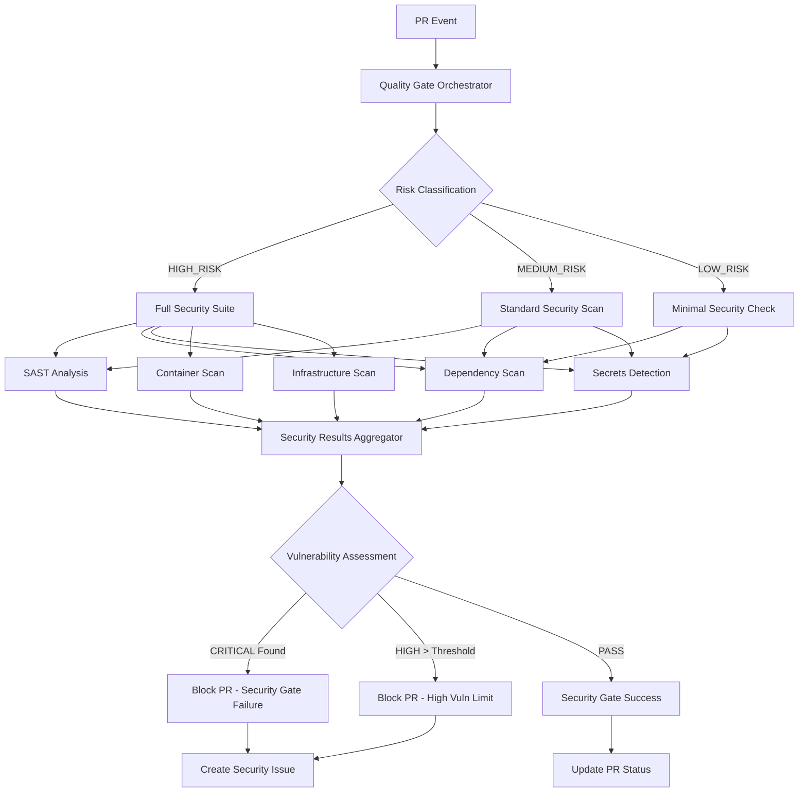
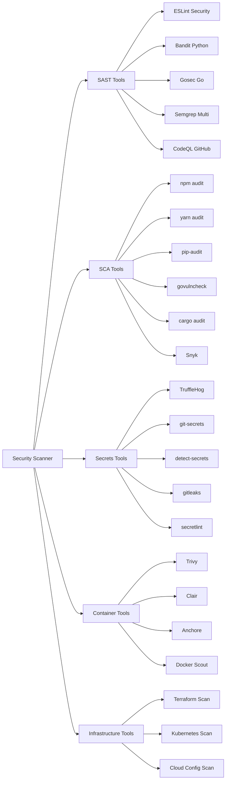

+++
# --- Document Metadata ---
id = "qms-security-scanner-integration-v1"
title = "QMS Security Scanner Integration Specification"
version = "1.0.0" 
type = "integration_specification"
status = "active"
created_date = "2025-08-16"
updated_date = "2025-08-16"
author = "DevOps Lead"
category = "QMS Integration"

# --- Classification ---
classification = "internal"
sensitivity = "moderate"
retention_period = "5_years"

# --- Related Context ---
related_documents = [
    ".ruru/docs/qms/orchestration/quality-gate-orchestrator-v1.md",
    ".ruru/docs/qms/integration/dor-dod-validator-integration-v1.md",
    ".ruru/docs/qms/architecture/quality-gate-integration-architecture-v1.md",
    ".ruru/modes/qms-security-scanner/qms-security-scanner.mode.md"
]

# --- Quality Metrics ---
completeness_score = 95
implementation_ready = true
test_coverage_target = 90

# --- Technical Context ---
languages_supported = ["javascript", "typescript", "python", "go", "rust", "java", "php", "ruby"]
security_frameworks = ["owasp_top_10", "nist_cybersecurity", "iso_27001", "gdpr", "soc2"]
scanning_tools = ["sast", "dast", "sca", "secrets", "containers", "infrastructure"]

tags = ["qms", "security", "integration", "automation", "owasp", "vulnerability-scanning", "devsecops", "quality-gates"]
+++

# QMS Security Scanner Integration Specification v1.0

## Overview

This document specifies the comprehensive integration of the [`qms-security-scanner`](.ruru/modes/qms-security-scanner/qms-security-scanner.mode.md) mode with the QMS quality gate orchestration system. The integration provides automated security vulnerability scanning, OWASP compliance validation, and multi-layered security assessment across all project components with zero tolerance for critical vulnerabilities.

## Architecture Integration

### Security Gate Orchestration Flow



### Multi-Tool Security Integration



## Command-Line Integration Scripts

### Security Validation Script (`qms-security-validate.sh`)

```bash
#!/bin/bash

# QMS Security Scanner Integration Script v1.0
# Integrates with qms-security-scanner mode for comprehensive security validation

set -euo pipefail

# Script Configuration
SCRIPT_DIR="$(cd "$(dirname "${BASH_SOURCE[0]}")" && pwd)"
PROJECT_ROOT="${SCRIPT_DIR}/../.."
QMS_CONFIG_DIR="${PROJECT_ROOT}/.qms"
SECURITY_CONFIG="${QMS_CONFIG_DIR}/security-scanner-config.yml"
RESULTS_DIR="${PROJECT_ROOT}/.qms/results/security"
TIMESTAMP=$(date '+%Y%m%d_%H%M%S')
SCAN_ID="SEC_${TIMESTAMP}_$$"

# Logging Configuration
LOG_FILE="${RESULTS_DIR}/security-scan-${TIMESTAMP}.log"
mkdir -p "${RESULTS_DIR}"

# Color Codes for Output
readonly RED='\033[0;31m'
readonly GREEN='\033[0;32m'
readonly YELLOW='\033[1;33m'
readonly BLUE='\033[0;34m'
readonly PURPLE='\033[0;35m'
readonly CYAN='\033[0;36m'
readonly NC='\033[0m'

# Logging Functions
log() {
    echo -e "[$(date +'%Y-%m-%d %H:%M:%S')] $*" | tee -a "$LOG_FILE"
}

log_info() {
    log "${BLUE}[INFO]${NC} $*"
}

log_success() {
    log "${GREEN}[SUCCESS]${NC} $*"
}

log_warning() {
    log "${YELLOW}[WARNING]${NC} $*"
}

log_error() {
    log "${RED}[ERROR]${NC} $*"
}

log_security() {
    log "${PURPLE}[SECURITY]${NC} $*"
}

# Configuration Loading
load_security_config() {
    if [[ ! -f "$SECURITY_CONFIG" ]]; then
        log_error "Security configuration not found: $SECURITY_CONFIG"
        return 1
    fi
    
    # Load YAML configuration (requires yq)
    if ! command -v yq &> /dev/null; then
        log_error "yq is required for YAML parsing. Install with: pip install yq"
        return 1
    fi
    
    # Extract configuration values
    VULNERABILITY_THRESHOLDS_CRITICAL=$(yq e '.vulnerability_thresholds.critical_vulnerabilities' "$SECURITY_CONFIG")
    VULNERABILITY_THRESHOLDS_HIGH=$(yq e '.vulnerability_thresholds.high_vulnerabilities' "$SECURITY_CONFIG")
    VULNERABILITY_THRESHOLDS_MEDIUM=$(yq e '.vulnerability_thresholds.medium_vulnerabilities' "$SECURITY_CONFIG")
    VULNERABILITY_THRESHOLDS_LOW=$(yq e '.vulnerability_thresholds.low_vulnerabilities' "$SECURITY_CONFIG")
    
    OWASP_TOP_10_ENFORCEMENT=$(yq e '.security_configuration.owasp_top_10_enforcement' "$SECURITY_CONFIG")
    DEPENDENCY_SCANNING=$(yq e '.security_configuration.dependency_vulnerability_scanning' "$SECURITY_CONFIG")
    SECRETS_DETECTION=$(yq e '.security_configuration.secrets_detection' "$SECURITY_CONFIG")
    CODE_SECURITY_ANALYSIS=$(yq e '.security_configuration.code_security_analysis' "$SECURITY_CONFIG")
    CONTAINER_SECURITY=$(yq e '.security_configuration.container_security_scanning' "$SECURITY_CONFIG")
    
    log_info "Security configuration loaded successfully"
}

# Security Scanning Functions
run_sast_analysis() {
    log_security "Starting Static Application Security Testing (SAST)..."
    
    local sast_results="${RESULTS_DIR}/sast_results_${TIMESTAMP}.json"
    local sast_report="${RESULTS_DIR}/sast_report_${TIMESTAMP}.html"
    
    # Initialize SAST results
    echo '{"scan_type": "SAST", "timestamp": "'$TIMESTAMP'", "tools": {}}' > "$sast_results"
    
    # Language-specific SAST scanning
    if [[ -f "package.json" ]]; then
        log_info "Running JavaScript/TypeScript SAST with ESLint Security..."
        if command -v npx &> /dev/null; then
            npx eslint . --ext .js,.ts,.jsx,.tsx \
                --config "${QMS_CONFIG_DIR}/eslint-security.config.js" \
                --format json --output-file "${RESULTS_DIR}/eslint-security-${TIMESTAMP}.json" || true
        fi
    fi
    
    if find . -name "*.py" -type f | head -1 | grep -q .; then
        log_info "Running Python SAST with Bandit..."
        if command -v bandit &> /dev/null; then
            bandit -r . -f json -o "${RESULTS_DIR}/bandit-${TIMESTAMP}.json" || true
        fi
    fi
    
    if [[ -f "go.mod" ]]; then
        log_info "Running Go SAST with Gosec..."
        if command -v gosec &> /dev/null; then
            gosec -fmt json -out "${RESULTS_DIR}/gosec-${TIMESTAMP}.json" ./... || true
        fi
    fi
    
    if [[ -f "Cargo.toml" ]]; then
        log_info "Running Rust SAST with Clippy Security..."
        if command -v cargo &> /dev/null; then
            cargo clippy --message-format=json -- -W clippy::all > "${RESULTS_DIR}/clippy-security-${TIMESTAMP}.json" 2>&1 || true
        fi
    fi
    
    # Multi-language SAST with Semgrep
    if command -v semgrep &> /dev/null; then
        log_info "Running multi-language SAST with Semgrep..."
        semgrep --config=auto --json --output="${RESULTS_DIR}/semgrep-${TIMESTAMP}.json" . || true
    fi
    
    log_success "SAST analysis completed"
}

run_dependency_scan() {
    log_security "Starting Software Composition Analysis (SCA) - Dependency Scanning..."
    
    local sca_results="${RESULTS_DIR}/sca_results_${TIMESTAMP}.json"
    
    # Initialize SCA results
    echo '{"scan_type": "SCA", "timestamp": "'$TIMESTAMP'", "tools": {}}' > "$sca_results"
    
    # JavaScript/TypeScript dependency scanning
    if [[ -f "package.json" ]]; then
        log_info "Running npm/yarn audit..."
        if command -v npm &> /dev/null; then
            npm audit --json > "${RESULTS_DIR}/npm-audit-${TIMESTAMP}.json" 2>&1 || true
        fi
        if [[ -f "yarn.lock" ]] && command -v yarn &> /dev/null; then
            yarn audit --json > "${RESULTS_DIR}/yarn-audit-${TIMESTAMP}.json" 2>&1 || true
        fi
    fi
    
    # Python dependency scanning
    if [[ -f "requirements.txt" ]] || [[ -f "Pipfile" ]]; then
        log_info "Running Python dependency security scan..."
        if command -v pip-audit &> /dev/null; then
            pip-audit --format=json --output="${RESULTS_DIR}/pip-audit-${TIMESTAMP}.json" || true
        fi
        if command -v safety &> /dev/null; then
            safety check --json --output "${RESULTS_DIR}/safety-${TIMESTAMP}.json" || true
        fi
    fi
    
    # Go dependency scanning
    if [[ -f "go.mod" ]]; then
        log_info "Running Go vulnerability check..."
        if command -v govulncheck &> /dev/null; then
            govulncheck -json ./... > "${RESULTS_DIR}/govulncheck-${TIMESTAMP}.json" 2>&1 || true
        fi
    fi
    
    # Rust dependency scanning
    if [[ -f "Cargo.toml" ]]; then
        log_info "Running Rust cargo audit..."
        if command -v cargo-audit &> /dev/null; then
            cargo audit --format json --output "${RESULTS_DIR}/cargo-audit-${TIMESTAMP}.json" || true
        fi
    fi
    
    # Universal dependency scanning with Snyk
    if command -v snyk &> /dev/null; then
        log_info "Running Snyk vulnerability scan..."
        snyk test --json > "${RESULTS_DIR}/snyk-${TIMESTAMP}.json" 2>&1 || true
    fi
    
    log_success "Dependency scanning completed"
}

run_secrets_detection() {
    log_security "Starting Secrets Detection..."
    
    local secrets_results="${RESULTS_DIR}/secrets_results_${TIMESTAMP}.json"
    
    # Initialize secrets results
    echo '{"scan_type": "SECRETS", "timestamp": "'$TIMESTAMP'", "tools": {}}' > "$secrets_results"
    
    # TruffleHog secrets scanning
    if command -v trufflehog &> /dev/null; then
        log_info "Running TruffleHog secrets scan..."
        trufflehog filesystem . --json > "${RESULTS_DIR}/trufflehog-${TIMESTAMP}.json" 2>&1 || true
    fi
    
    # git-secrets scanning
    if command -v git-secrets &> /dev/null; then
        log_info "Running git-secrets scan..."
        git secrets --scan --recursive . > "${RESULTS_DIR}/git-secrets-${TIMESTAMP}.txt" 2>&1 || true
    fi
    
    # detect-secrets scanning
    if command -v detect-secrets &> /dev/null; then
        log_info "Running detect-secrets scan..."
        detect-secrets scan --all-files --baseline "${RESULTS_DIR}/secrets-baseline-${TIMESTAMP}.json" || true
    fi
    
    # gitleaks scanning
    if command -v gitleaks &> /dev/null; then
        log_info "Running GitLeaks scan..."
        gitleaks detect --report-format json --report-path "${RESULTS_DIR}/gitleaks-${TIMESTAMP}.json" || true
    fi
    
    log_success "Secrets detection completed"
}

run_container_security_scan() {
    if [[ "$CONTAINER_SECURITY" != "true" ]]; then
        log_info "Container security scanning disabled in configuration"
        return 0
    fi
    
    log_security "Starting Container Security Scanning..."
    
    local container_results="${RESULTS_DIR}/container_results_${TIMESTAMP}.json"
    
    # Find Dockerfiles
    local dockerfiles=($(find . -name "Dockerfile*" -type f))
    
    if [[ ${#dockerfiles[@]} -eq 0 ]]; then
        log_info "No Dockerfiles found, skipping container security scan"
        return 0
    fi
    
    # Initialize container results
    echo '{"scan_type": "CONTAINER", "timestamp": "'$TIMESTAMP'", "tools": {}}' > "$container_results"
    
    # Trivy container scanning
    if command -v trivy &> /dev/null; then
        log_info "Running Trivy container security scan..."
        for dockerfile in "${dockerfiles[@]}"; do
            local image_name="qms-security-scan:${TIMESTAMP}"
            docker build -f "$dockerfile" -t "$image_name" . || continue
            trivy image --format json --output "${RESULTS_DIR}/trivy-$(basename $dockerfile)-${TIMESTAMP}.json" "$image_name" || true
            docker rmi "$image_name" || true
        done
    fi
    
    # Docker Scout scanning (if available)
    if command -v docker &> /dev/null && docker scout version &> /dev/null; then
        log_info "Running Docker Scout security scan..."
        for dockerfile in "${dockerfiles[@]}"; do
            local image_name="qms-security-scan:${TIMESTAMP}"
            docker build -f "$dockerfile" -t "$image_name" . || continue
            docker scout cves --format json --output "${RESULTS_DIR}/docker-scout-$(basename $dockerfile)-${TIMESTAMP}.json" "$image_name" || true
            docker rmi "$image_name" || true
        done
    fi
    
    log_success "Container security scanning completed"
}

# OWASP Compliance Validation
validate_owasp_compliance() {
    if [[ "$OWASP_TOP_10_ENFORCEMENT" != "true" ]]; then
        log_info "OWASP Top 10 enforcement disabled in configuration"
        return 0
    fi
    
    log_security "Validating OWASP Top 10 2021 Compliance..."
    
    local owasp_results="${RESULTS_DIR}/owasp_compliance_${TIMESTAMP}.json"
    
    # Initialize OWASP compliance results
    cat > "$owasp_results" << 'EOF'
{
    "scan_type": "OWASP_COMPLIANCE",
    "timestamp": "'$TIMESTAMP'",
    "owasp_top_10_2021": {
        "A01_2021_Broken_Access_Control": {"status": "checking", "findings": []},
        "A02_2021_Cryptographic_Failures": {"status": "checking", "findings": []},
        "A03_2021_Injection": {"status": "checking", "findings": []},
        "A04_2021_Insecure_Design": {"status": "checking", "findings": []},
        "A05_2021_Security_Misconfiguration": {"status": "checking", "findings": []},
        "A06_2021_Vulnerable_Components": {"status": "checking", "findings": []},
        "A07_2021_Authentication_Failures": {"status": "checking", "findings": []},
        "A08_2021_Software_Data_Integrity": {"status": "checking", "findings": []},
        "A09_2021_Security_Logging": {"status": "checking", "findings": []},
        "A10_2021_Server_Side_Request_Forgery": {"status": "checking", "findings": []}
    }
}
EOF
    
    # OWASP ZAP scanning (if available)
    if command -v zap-baseline.py &> /dev/null; then
        log_info "Running OWASP ZAP baseline scan..."
        zap-baseline.py -t "http://localhost" -J "${RESULTS_DIR}/zap-baseline-${TIMESTAMP}.json" || true
    fi
    
    log_success "OWASP compliance validation completed"
}

# Results Aggregation and Analysis
aggregate_security_results() {
    log_security "Aggregating security scan results..."
    
    local aggregated_results="${RESULTS_DIR}/security_summary_${TIMESTAMP}.json"
    local vulnerability_counts="{\"critical\": 0, \"high\": 0, \"medium\": 0, \"low\": 0, \"info\": 0}"
    
    # Create comprehensive security summary
    cat > "$aggregated_results" << EOF
{
    "scan_id": "$SCAN_ID",
    "timestamp": "$TIMESTAMP",
    "project_path": "$PROJECT_ROOT",
    "scan_configuration": {
        "owasp_enforcement": $OWASP_TOP_10_ENFORCEMENT,
        "dependency_scanning": $DEPENDENCY_SCANNING,
        "secrets_detection": $SECRETS_DETECTION,
        "code_analysis": $CODE_SECURITY_ANALYSIS,
        "container_security": $CONTAINER_SECURITY
    },
    "vulnerability_thresholds": {
        "critical": $VULNERABILITY_THRESHOLDS_CRITICAL,
        "high": $VULNERABILITY_THRESHOLDS_HIGH,
        "medium": $VULNERABILITY_THRESHOLDS_MEDIUM,
        "low": $VULNERABILITY_THRESHOLDS_LOW
    },
    "vulnerability_counts": $vulnerability_counts,
    "scan_results": {
        "sast": {},
        "sca": {},
        "secrets": {},
        "containers": {},
        "owasp_compliance": {}
    },
    "compliance_status": {
        "overall": "pending",
        "critical_blocking": false,
        "high_threshold_exceeded": false,
        "owasp_compliant": "pending"
    },
    "recommendations": [],
    "remediation_priority": []
}
EOF
    
    # Process and count vulnerabilities from individual scan results
    process_vulnerability_counts "$aggregated_results"
    
    log_success "Security results aggregated: $aggregated_results"
}

process_vulnerability_counts() {
    local summary_file="$1"
    local critical_count=0
    local high_count=0
    local medium_count=0
    local low_count=0
    
    # Count vulnerabilities from various scan result files
    for result_file in "${RESULTS_DIR}"/*_${TIMESTAMP}.json; do
        if [[ -f "$result_file" ]]; then
            # Extract vulnerability counts based on tool format
            # This would need tool-specific parsing logic
            log_info "Processing results from: $(basename "$result_file")"
        fi
    done
    
    # Update summary with actual counts
    local updated_counts="{\"critical\": $critical_count, \"high\": $high_count, \"medium\": $medium_count, \"low\": $low_count, \"info\": 0}"
    
    # Determine compliance status
    local overall_status="pass"
    local critical_blocking=false
    local high_threshold_exceeded=false
    
    if [[ $critical_count -gt $VULNERABILITY_THRESHOLDS_CRITICAL ]]; then
        overall_status="fail"
        critical_blocking=true
    fi
    
    if [[ $high_count -gt $VULNERABILITY_THRESHOLDS_HIGH ]]; then
        overall_status="fail"
        high_threshold_exceeded=true
    fi
    
    # Update the summary file with final results
    jq --argjson counts "$updated_counts" \
       --arg status "$overall_status" \
       --argjson critical_block "$critical_blocking" \
       --argjson high_exceeded "$high_threshold_exceeded" \
       '.vulnerability_counts = $counts | 
        .compliance_status.overall = $status | 
        .compliance_status.critical_blocking = $critical_block | 
        .compliance_status.high_threshold_exceeded = $high_exceeded' \
       "$summary_file" > "${summary_file}.tmp" && mv "${summary_file}.tmp" "$summary_file"
}

# Quality Gate Integration
invoke_qms_security_scanner() {
    log_security "Invoking QMS Security Scanner mode for AI-augmented analysis..."
    
    # Prepare context for the QMS security scanner
    local scanner_context="${RESULTS_DIR}/security_scanner_context_${TIMESTAMP}.json"
    
    cat > "$scanner_context" << EOF
{
    "scan_request": {
        "scan_id": "$SCAN_ID",
        "timestamp": "$TIMESTAMP",
        "project_path": "$PROJECT_ROOT",
        "results_directory": "$RESULTS_DIR",
        "configuration": "$SECURITY_CONFIG"
    },
    "raw_results": {
        "sast_results": "${RESULTS_DIR}/sast_results_${TIMESTAMP}.json",
        "sca_results": "${RESULTS_DIR}/sca_results_${TIMESTAMP}.json",
        "secrets_results": "${RESULTS_DIR}/secrets_results_${TIMESTAMP}.json",
        "container_results": "${RESULTS_DIR}/container_results_${TIMESTAMP}.json",
        "owasp_compliance": "${RESULTS_DIR}/owasp_compliance_${TIMESTAMP}.json"
    },
    "analysis_request": {
        "vulnerability_deduplication": true,
        "false_positive_filtering": true,
        "threat_intelligence_correlation": true,
        "remediation_prioritization": true,
        "compliance_gap_analysis": true
    }
}
EOF
    
    # Note: In a real implementation, this would integrate with the Roo Commander
    # system to invoke the qms-security-scanner mode with the prepared context
    log_info "Security scanner context prepared: $scanner_context"
    log_warning "QMS Security Scanner mode integration requires Roo Commander system"
}

# Main execution function
main() {
    local pr_number=""
    local branch_name=""
    local scan_scope="full"
    
    # Parse command line arguments
    while [[ $# -gt 0 ]]; do
        case $1 in
            --pr-number)
                pr_number="$2"
                shift 2
                ;;
            --branch)
                branch_name="$2"
                shift 2
                ;;
            --scope)
                scan_scope="$2"
                shift 2
                ;;
            --help)
                echo "Usage: $0 [OPTIONS]"
                echo "Options:"
                echo "  --pr-number NUM    PR number for GitHub integration"
                echo "  --branch NAME      Branch name for scanning"
                echo "  --scope SCOPE      Scan scope: full|standard|minimal"
                echo "  --help             Show this help message"
                exit 0
                ;;
            *)
                log_error "Unknown argument: $1"
                exit 1
                ;;
        esac
    done
    
    log_info "Starting QMS Security Scanner Integration"
    log_info "Scan ID: $SCAN_ID"
    log_info "Scan Scope: $scan_scope"
    [[ -n "$pr_number" ]] && log_info "PR Number: $pr_number"
    [[ -n "$branch_name" ]] && log_info "Branch: $branch_name"
    
    # Load configuration
    load_security_config || exit 1
    
    # Execute security scans based on scope
    case $scan_scope in
        "full")
            log_info "Executing full security scan suite"
            run_sast_analysis
            run_dependency_scan
            run_secrets_detection
            run_container_security_scan
            validate_owasp_compliance
            ;;
        "standard")
            log_info "Executing standard security scan"
            run_sast_analysis
            run_dependency_scan
            run_secrets_detection
            ;;
        "minimal")
            log_info "Executing minimal security scan"
            run_dependency_scan
            run_secrets_detection
            ;;
        *)
            log_error "Invalid scan scope: $scan_scope"
            exit 1
            ;;
    esac
    
    # Aggregate results and perform analysis
    aggregate_security_results
    
    # Invoke QMS Security Scanner for AI-augmented analysis
    invoke_qms_security_scanner
    
    # Output final summary
    local summary_file="${RESULTS_DIR}/security_summary_${TIMESTAMP}.json"
    if [[ -f "$summary_file" ]]; then
        local overall_status=$(jq -r '.compliance_status.overall' "$summary_file")
        local critical_blocking=$(jq -r '.compliance_status.critical_blocking' "$summary_file")
        local high_exceeded=$(jq -r '.compliance_status.high_threshold_exceeded' "$summary_file")
        
        case $overall_status in
            "pass")
                log_success "Security scan PASSED - No blocking vulnerabilities found"
                ;;
            "fail")
                if [[ "$critical_blocking" == "true" ]]; then
                    log_error "Security scan FAILED - Critical vulnerabilities detected (Zero tolerance policy)"
                elif [[ "$high_exceeded" == "true" ]]; then
                    log_error "Security scan FAILED - High vulnerability threshold exceeded"
                else
                    log_error "Security scan FAILED - Security policy violations detected"
                fi
                exit 1
                ;;
        esac
        
        # Output summary for CI/CD integration
        echo "SECURITY_SCAN_SUMMARY_FILE=$summary_file" >> "${GITHUB_OUTPUT:-/dev/stdout}"
        echo "SECURITY_SCAN_STATUS=$overall_status" >> "${GITHUB_OUTPUT:-/dev/stdout}"
        echo "SECURITY_SCAN_ID=$SCAN_ID" >> "${GITHUB_OUTPUT:-/dev/stdout}"
    fi
    
    log_success "QMS Security Scanner integration completed successfully"
}

# Execute main function if script is run directly
if [[ "${BASH_SOURCE[0]}" == "${0}" ]]; then
    main "$@"
fi
```

## GitHub Actions Security Workflows

### Security Scanning Workflow (`.github/workflows/qms-security-scan.yml`)

```yaml
name: QMS Security Scanning

on:
  pull_request:
    types: [opened, synchronize, reopened]
    branches: [main, develop, 'release/*']
  workflow_call:
    inputs:
      scan_scope:
        description: 'Security scan scope'
        required: false
        default: 'standard'
        type: string
      pr_number:
        description: 'Pull request number'
        required: false
        type: string
    outputs:
      security_status:
        description: 'Security scan status'
        value: ${{ jobs.security-scan.outputs.security_status }}
      summary_file:
        description: 'Security summary file path'
        value: ${{ jobs.security-scan.outputs.summary_file }}

env:
  QMS_SECURITY_CONFIG: '.qms/security-scanner-config.yml'
  SECURITY_RESULTS_DIR: '.qms/results/security'

jobs:
  security-scan:
    name: Multi-Layer Security Analysis
    runs-on: ubuntu-latest
    
    outputs:
      security_status: ${{ steps.security-scan.outputs.SECURITY_SCAN_STATUS }}
      summary_file: ${{ steps.security-scan.outputs.SECURITY_SCAN_SUMMARY_FILE }}
      scan_id: ${{ steps.security-scan.outputs.SECURITY_SCAN_ID }}
    
    steps:
      - name: Checkout Code
        uses: actions/checkout@v4
        with:
          fetch-depth: 0  # Full history for accurate security analysis
      
      - name: Set up Security Scanning Environment
        id: setup
        run: |
          # Determine scan scope based on PR risk classification
          if [[ "${{ github.event_name }}" == "pull_request" ]]; then
            # Calculate risk score based on PR characteristics
            files_changed=$(git diff --name-only ${{ github.event.pull_request.base.sha }}..${{ github.event.pull_request.head.sha }} | wc -l)
            security_files=$(git diff --name-only ${{ github.event.pull_request.base.sha }}..${{ github.event.pull_request.head.sha }} | grep -E '\.(env|key|pem|p12|config|yml|yaml)$|auth|security|secret' | wc -l)
            
            if [[ $security_files -gt 0 ]]; then
              scan_scope="full"
              echo "High-risk PR detected: Security-related files modified"
            elif [[ $files_changed -gt 50 ]]; then
              scan_scope="standard"
              echo "Medium-risk PR detected: Large changeset"
            else
              scan_scope="minimal"
              echo "Low-risk PR detected: Standard changeset"
            fi
          else
            scan_scope="${{ inputs.scan_scope || 'standard' }}"
          fi
          
          echo "SCAN_SCOPE=$scan_scope" >> $GITHUB_OUTPUT
          echo "Scan scope determined: $scan_scope"
      
      - name: Install Security Tools
        run: |
          # Update package lists
          sudo apt-get update
          
          # Install Python security tools
          python -m pip install --upgrade pip
          pip install bandit safety pip-audit detect-secrets
          
          # Install Node.js security tools
          npm install -g eslint @typescript-eslint/parser @typescript-eslint/eslint-plugin
          npm install -g eslint-plugin-security eslint-plugin-no-secrets
          
          # Install Go security tools
          if command -v go &> /dev/null; then
            go install github.com/securecodewarrior/gosec/v2/cmd/gosec@latest
            go install golang.org/x/vuln/cmd/govulncheck@latest
          fi
          
          # Install Rust security tools
          if command -v cargo &> /dev/null; then
            cargo install cargo-audit
          fi
          
          # Install multi-language tools
          pip install semgrep
          
          # Install secrets detection tools
          pip install truffleHog
          wget https://github.com/zricethezav/gitleaks/releases/latest/download/gitleaks_linux_x64.tar.gz
          tar -xzf gitleaks_linux_x64.tar.gz
          sudo mv gitleaks /usr/local/bin/
          
          # Install container security tools
          wget https://github.com/aquasecurity/trivy/releases/latest/download/trivy_Linux-64bit.tar.gz
          tar -xzf trivy_Linux-64bit.tar.gz
          sudo mv trivy /usr/local/bin/
          
          # Install YAML processor
          pip install yq
      
      - name: Setup Security Configuration
        run: |
          # Create QMS configuration directory
          mkdir -p .qms/results/security
          
          # Create default security configuration if not exists
          if [[ ! -f "$QMS_SECURITY_CONFIG" ]]; then
            cat > "$QMS_SECURITY_CONFIG" << 'EOF'
          vulnerability_thresholds:
            critical_vulnerabilities: 0
            high_vulnerabilities: 2
            medium_vulnerabilities: 10
            low_vulnerabilities: 50
          
          security_configuration:
            owasp_top_10_enforcement: true
            dependency_vulnerability_scanning: true
            secrets_detection: true
            code_security_analysis: true
            container_security_scanning: true
            api_security_validation: true
          
          compliance_frameworks:
            owasp_top_10: ["A01:2021", "A02:2021", "A03:2021", "A04:2021", "A05:2021", "A06:2021", "A07:2021", "A08:2021", "A09:2021", "A10:2021"]
            nist_cybersecurity: true
            iso_27001: true
            gdpr_compliance: true
          EOF
          fi
      
      - name: Execute Security Scan
        id: security-scan
        run: |
          # Make security script executable
          chmod +x .qms/scripts/qms-security-validate.sh
          
          # Execute security scan with appropriate scope
          ./.qms/scripts/qms-security-validate.sh \
            --pr-number "${{ github.event.pull_request.number || inputs.pr_number }}" \
            --branch "${{ github.head_ref || github.ref_name }}" \
            --scope "${{ steps.setup.outputs.SCAN_SCOPE }}"
      
      - name: Process Security Results
        id: process-results
        if: always()
        run: |
          # Find the latest security summary file
          SUMMARY_FILE=$(find $SECURITY_RESULTS_DIR -name "security_summary_*.json" -type f -printf '%T@ %p\n' | sort -n | tail -1 | cut -d' ' -f2-)
          
          if [[ -f "$SUMMARY_FILE" ]]; then
            echo "Processing security summary: $SUMMARY_FILE"
            
            # Extract key metrics
            CRITICAL_COUNT=$(jq -r '.vulnerability_counts.critical' "$SUMMARY_FILE")
            HIGH_COUNT=$(jq -r '.vulnerability_counts.high' "$SUMMARY_FILE")
            MEDIUM_COUNT=$(jq -r '.vulnerability_counts.medium' "$SUMMARY_FILE")
            LOW_COUNT=$(jq -r '.vulnerability_counts.low' "$SUMMARY_FILE")
            OVERALL_STATUS=$(jq -r '.compliance_status.overall' "$SUMMARY_FILE")
            
            # Create GitHub summary
            echo "# 🛡️ Security Scan Results" >> $GITHUB_STEP_SUMMARY
            echo "" >> $GITHUB_STEP_SUMMARY
            echo "| Severity | Count | Status |" >> $GITHUB_STEP_SUMMARY
            echo "|----------|-------|--------|" >> $GITHUB_STEP_SUMMARY
            echo "| 🔴 Critical | $CRITICAL_COUNT | $([ "$CRITICAL_COUNT" -eq 0 ] && echo "✅ Pass" || echo "❌ Fail") |" >> $GITHUB_STEP_SUMMARY
            echo "| 🟠 High | $HIGH_COUNT | $([ "$HIGH_COUNT" -le 2 ] && echo "✅ Pass" || echo "❌ Fail") |" >> $GITHUB_STEP_SUMMARY
            echo "| 🟡 Medium | $MEDIUM_COUNT | $([ "$MEDIUM_COUNT" -le 10 ] && echo "✅ Pass" || echo "⚠️ Warning") |" >> $GITHUB_STEP_SUMMARY
            echo "| 🔵 Low | $LOW_COUNT | ℹ️ Info |" >> $GITHUB_STEP_SUMMARY
            echo "" >> $GITHUB_STEP_SUMMARY
            echo "**Overall Status: $([ "$OVERALL_STATUS" == "pass" ] && echo "✅ PASS" || echo "❌ FAIL")**" >> $GITHUB_STEP_SUMMARY
            
            # Set outputs for other jobs
            echo "SUMMARY_FILE=$SUMMARY_FILE" >> $GITHUB_OUTPUT
            echo "SECURITY_STATUS=$OVERALL_STATUS" >> $GITHUB_OUTPUT
            echo "CRITICAL_COUNT=$CRITICAL_COUNT" >> $GITHUB_OUTPUT
            echo "HIGH_COUNT=$HIGH_COUNT" >> $GITHUB_OUTPUT
          else
            echo "❌ Security summary file not found" >> $GITHUB_STEP_SUMMARY
            echo "SECURITY_STATUS=error" >> $GITHUB_OUTPUT
          fi
      
      - name: Upload Security Artifacts
        if: always()
        uses: actions/upload-artifact@v4
        with:
          name: security-scan-results-${{ github.run_id }}
          path: |
            ${{ env.SECURITY_RESULTS_DIR }}/**/*
            .qms/security-scanner-config.yml
          retention-days: 30
      
      - name: Comment on PR
        if: github.event_name == 'pull_request' && always()
        uses: actions/github-script@v7
        with:
          script: |
            const fs = require('fs');
            const path = require('path');
            
            const summaryFile = '${{ steps.process-results.outputs.SUMMARY_FILE }}';
            const securityStatus = '${{ steps.process-results.outputs.SECURITY_STATUS }}';
            const criticalCount = '${{ steps.process-results.outputs.CRITICAL_COUNT }}';
            const highCount = '${{ steps.process-results.outputs.HIGH_COUNT }}';
            
            let comment = '## 🛡️ Security Scan Results\n\n';
            
            if (securityStatus === 'pass') {
              comment += '✅ **Security scan passed** - No blocking vulnerabilities detected\n\n';
            } else if (securityStatus === 'fail') {
              comment += '❌ **Security scan failed** - Critical security issues detected\n\n';
            } else {
              comment += '⚠️ **Security scan encountered errors** - Please check the workflow logs\n\n';
            }
            
            comment += `| Metric | Value |\n`;
            comment += `|--------|-------|\n`;
            comment += `| Critical Vulnerabilities | ${criticalCount || 'N/A'} |\n`;
            comment += `| High Vulnerabilities | ${highCount || 'N/A'} |\n`;
            comment += `| Scan Scope | ${{ steps.setup.outputs.SCAN_SCOPE }} |\n`;
            comment += `| Workflow Run | [View Details](${context.payload.repository.html_url}/actions/runs/${context.runId}) |\n`;
            
            if (securityStatus === 'fail') {
              comment += '\n### ⚠️ Action Required\n';
              if (parseInt(criticalCount) > 0) {
                comment += '- **Critical vulnerabilities detected** - These must be resolved before merging\n';
              }
              if (parseInt(highCount) > 2) {
                comment += '- **High vulnerability threshold exceeded** - Please review and address high-severity issues\n';
              }
            }
            
            github.rest.issues.createComment({
              issue_number: context.issue.number,
              owner: context.repo.owner,
              repo: context.repo.repo,
              body: comment
            });
      
      - name: Security Gate Status Check
        if: always()
        run: |
          if [[ "${{ steps.process-results.outputs.SECURITY_STATUS }}" == "fail" ]]; then
            echo "🔒 Security Gate: BLOCKED - Critical security vulnerabilities detected"
            echo "❌ This PR cannot be merged until security issues are resolved"
            exit 1
          else
            echo "✅ Security Gate: PASSED - No blocking security vulnerabilities"
          fi

  security-reporting:
    name: Security Compliance Reporting
    runs-on: ubuntu-latest
    needs: security-scan
    if: always()
    
    steps:
      - name: Download Security Results
        uses: actions/download-artifact@v4
        with:
          name: security-scan-results-${{ github.run_id }}
          path: ./security-results
      
      - name: Generate Security Dashboard Data
        run: |
          echo "Generating security dashboard data..."
          # This would integrate with security dashboard/monitoring systems
          echo "Security scan completed with status: ${{ needs.security-scan.outputs.security_status }}"
          
          # Example: Send to security monitoring system
          # curl -X POST "https://security-dashboard.example.com/api/scans" \
          #   -H "Content-Type: application/json" \
          #   -d @"${{ needs.security-scan.outputs.summary_file }}"
```

## Security Configuration Management

### Security Scanner Configuration Schema (`.qms/security-scanner-config.yml`)

```yaml
# QMS Security Scanner Configuration v1.0
# Comprehensive security scanning and validation settings

# Vulnerability Thresholds - Zero tolerance policy enforcement
vulnerability_thresholds:
  critical_vulnerabilities: 0    # Zero tolerance - block PR immediately
  high_vulnerabilities: 2        # Maximum allowed before blocking
  medium_vulnerabilities: 10     # Warning threshold
  low_vulnerabilities: 50        # Information only
  info_vulnerabilities: 100      # Information only

# Core Security Configuration
security_configuration:
  owasp_top_10_enforcement: true
  dependency_vulnerability_scanning: true
  secrets_detection: true
  code_security_analysis: true
  container_security_scanning: true
  api_security_validation: true
  authentication_analysis: true
  authorization_validation: true
  encryption_standards_check: true
  ssl_tls_validation: true

# OWASP Top 10 2021 Compliance Framework
owasp_top_10_2021:
  A01_Broken_Access_Control:
    enabled: true
    severity_threshold: "high"
    patterns:
      - "authorization bypass"
      - "privilege escalation"
      - "missing access controls"
  
  A02_Cryptographic_Failures:
    enabled: true
    severity_threshold: "high"
    patterns:
      - "weak encryption"
      - "hardcoded keys"
      - "insecure random"
  
  A03_Injection:
    enabled: true
    severity_threshold: "critical"
    patterns:
      - "sql injection"
      - "command injection"
      - "ldap injection"
  
  A04_Insecure_Design:
    enabled: true
    severity_threshold: "high"
    patterns:
      - "insecure architecture"
      - "missing security controls"
  
  A05_Security_Misconfiguration:
    enabled: true
    severity_threshold: "medium"
    patterns:
      - "default credentials"
      - "exposed configs"
      - "unnecessary features"
  
  A06_Vulnerable_Components:
    enabled: true
    severity_threshold: "high"
    patterns:
      - "outdated dependencies"
      - "known vulnerabilities"
  
  A07_Authentication_Failures:
    enabled: true
    severity_threshold: "high"
    patterns:
      - "weak passwords"
      - "missing mfa"
      - "session hijacking"
  
  A08_Software_Data_Integrity:
    enabled: true
    severity_threshold: "high"
    patterns:
      - "unsigned updates"
      - "untrusted sources"
  
  A09_Security_Logging:
    enabled: true
    severity_threshold: "medium"
    patterns:
      - "insufficient logging"
      - "missing monitoring"
  
  A10_Server_Side_Request_Forgery:
    enabled: true
    severity_threshold: "high"
    patterns:
      - "ssrf vulnerabilities"
      - "url validation bypass"

# Compliance Frameworks
compliance_frameworks:
  owasp_top_10: true
  nist_cybersecurity: true
  iso_27001: true
  gdpr_compliance: true
  hipaa_compliance: false  # Project-specific
  pci_dss: false          # Project-specific
  soc2: true

# Language-Specific Security Rules
language_security_rules:
  javascript:
    enabled: true
    tools: ["eslint-security", "semgrep"]
    rules:
      - "no-eval"
      - "no-implied-eval"
      - "no-unsafe-innerHTML"
      - "detect-buffer-noassert"
  
  typescript:
    enabled: true
    tools: ["eslint-security", "semgrep"]
    rules:
      - "no-any-type"
      - "strict-type-checking"
      - "no-unsafe-member-access"
  
  python:
    enabled: true
    tools: ["bandit", "semgrep", "safety"]
    rules:
      - "hardcoded-password-string"
      - "sql-injection-raw-query"
      - "shell-injection"
  
  go:
    enabled: true
    tools: ["gosec", "govulncheck"]
    rules:
      - "G101: hardcoded credentials"
      - "G201: SQL query construction"
      - "G301: poor file permissions"
  
  rust:
    enabled: true
    tools: ["cargo-audit", "clippy"]
    rules:
      - "unsafe-code-usage"
      - "insecure-random"
  
  java:
    enabled: true
    tools: ["spotbugs", "semgrep"]
    rules:
      - "command-injection"
      - "path-traversal"
  
  php:
    enabled: true
    tools: ["psalm", "semgrep"]
    rules:
      - "code-injection"
      - "file-inclusion"

# Scanning Tools Configuration
scanning_tools:
  # Static Application Security Testing (SAST)
  sast:
    eslint_security:
      enabled: true
      config_path: ".qms/eslint-security.config.js"
    bandit:
      enabled: true
      config_path: ".qms/bandit.yml"
    gosec:
      enabled: true
      config_path: ".qms/gosec.json"
    semgrep:
      enabled: true
      rules: ["auto", "p/security-audit", "p/owasp-top-ten"]
    codeql:
      enabled: false  # Requires GitHub Advanced Security
      languages: ["javascript", "python", "go"]
  
  # Software Composition Analysis (SCA)
  sca:
    npm_audit:
      enabled: true
      audit_level: "high"
    yarn_audit:
      enabled: true
      audit_level: "high"
    pip_audit:
      enabled: true
      require_hashes: false
    safety:
      enabled: true
      ignore_ids: []  # List of CVE IDs to ignore
    govulncheck:
      enabled: true
      version: "latest"
    cargo_audit:
      enabled: true
      deny_warnings: true
    snyk:
      enabled: false  # Requires API key
      severity_threshold: "high"
  
  # Secrets Detection
  secrets:
    trufflehog:
      enabled: true
      entropy_threshold: 3.0
    gitleaks:
      enabled: true
      config_path: ".qms/gitleaks.toml"
    detect_secrets:
      enabled: true
      baseline_file: ".qms/secrets-baseline.json"
    git_secrets:
      enabled: true
      patterns_file: ".qms/git-secrets-patterns.txt"
  
  # Container Security
  containers:
    trivy:
      enabled: true
      severity_levels: ["CRITICAL", "HIGH", "MEDIUM"]
      ignore_unfixed: false
    docker_scout:
      enabled: false  # Requires Docker Scout subscription
      policy: "default"
    clair:
      enabled: false  # Requires Clair server setup
    anchore:
      enabled: false  # Requires Anchore Engine

# Integration Settings
integration_settings:
  # CI/CD Integration
  ci_cd:
    fail_build_on_critical: true
    fail_build_on_high_threshold: true
    generate_sarif_output: true
    create_github_issues: true
    update_pr_comments: true
  
  # Notification Settings
  notifications:
    slack:
      enabled: false
      webhook_url: ""
      channels: ["#security", "#devops"]
    email:
      enabled: false
      recipients: ["security@example.com"]
    github_issues:
      enabled: true
      assignees: ["security-team"]
      labels: ["security", "vulnerability"]
  
  # Dashboard Integration
  dashboard:
    security_metrics_endpoint: ""
    compliance_reporting: true
    trend_analysis: true
    executive_summary: true

# Exclusions and Allowlists
exclusions:
  # File patterns to exclude from scanning
  file_patterns:
    - "node_modules/**"
    - ".git/**"
    - "*.min.js"
    - "vendor/**"
    - "third_party/**"
  
  # Directories to exclude
  directories:
    - "test/fixtures"
    - "examples"
    - "docs"
  
  # False positive allowlist
  false_positives:
    - vulnerability_id: "CVE-2021-XXXX"
      reason: "Not applicable to our use case"
      expiry: "2025-12-31"
  
  # Approved vulnerable dependencies (with justification)
  approved_vulnerabilities:
    - package: "lodash@4.17.19"
      vulnerability: "CVE-2021-23337"
      justification: "Dev dependency only, not in production"
      expiry: "2025-06-30"

# Reporting Configuration
reporting:
  formats: ["json", "sarif", "html", "pdf"]
  include_remediation: true
  include_compliance_matrix: true
  executive_summary: true
  technical_details: true
  trend_analysis: true
  
  # Report distribution
  distribution:
    security_team: true
    development_leads: true
    compliance_officer: true
    executive_dashboard: true

# Advanced Configuration
advanced:
  # AI-Augmented Analysis
  ai_analysis:
    enabled: true
    false_positive_reduction: true
    threat_intelligence: true
    pattern_learning: true
  
  # Performance Settings
  performance:
    parallel_scanning: true
    max_concurrent_scans: 4
    timeout_seconds: 3600
    memory_limit: "2GB"
  
  # Custom Rules
  custom_rules:
    enabled: true
    rules_directory: ".qms/custom-security-rules/"
    rule_formats: ["semgrep", "regex", "ast"]
```

## Security Results Interface Definitions

### TypeScript Security Results Interfaces

```typescript
// QMS Security Scanner Results Interface Definitions v1.0

export interface SecurityScanResults {
  scan_id: string;
  timestamp: string;
  project_path: string;
  scan_configuration: SecurityConfiguration;
  vulnerability_thresholds: VulnerabilityThresholds;
  vulnerability_counts: VulnerabilityCounts;
  scan_results: ScanResults;
  compliance_status: ComplianceStatus;
  recommendations: SecurityRecommendation[];
  remediation_priority: RemediationItem[];
}

export interface SecurityConfiguration {
  owasp_enforcement: boolean;
  dependency_scanning: boolean;
  secrets_detection: boolean;
  code_analysis: boolean;
  container_security: boolean;
  api_security_validation?: boolean;
  authentication_analysis?: boolean;
}

export interface VulnerabilityThresholds {
  critical: number;
  high: number;
  medium: number;
  low: number;
  info?: number;
}

export interface VulnerabilityCounts {
  critical: number;
  high: number;
  medium: number;
  low: number;
  info: number;
}

export interface ScanResults {
  sast: SASTResults;
  sca: SCAResults;
  secrets: SecretsResults;
  containers: ContainerResults;
  owasp_compliance: OWASPComplianceResults;
  infrastructure?: InfrastructureResults;
}

export interface SASTResults {
  tools_used: string[];
  total_findings: number;
  findings_by_severity: VulnerabilityCounts;
  findings: SASTFinding[];
  coverage_metrics: CoverageMetrics;
}

export interface SCAResults {
  tools_used: string[];
  total_vulnerabilities: number;
  vulnerable_packages: VulnerablePackage[];
  license_issues: LicenseIssue[];
  outdated_packages: OutdatedPackage[];
}

export interface SecretsResults {
  tools_used: string[];
  total_secrets: number;
  secrets_by_type: Record<string, number>;
  secrets_found: SecretFinding[];
  false_positives_filtered: number;
}

export interface ContainerResults {
  tools_used: string[];
  images_scanned: string[];
  total_vulnerabilities: number;
  vulnerabilities_by_image: Record<string, VulnerabilityCounts>;
  critical_vulnerabilities: ContainerVulnerability[];
  base_image_recommendations: BaseImageRecommendation[];
}

export interface OWASPComplianceResults {
  compliance_version: "2021" | "2017";
  overall_compliance_score: number;
  category_scores: Record<string, OWASPCategoryScore>;
  critical_findings: OWASPFinding[];
  recommendations: OWASPRecommendation[];
}

export interface ComplianceStatus {
  overall: "pass" | "fail" | "warning" | "error";
  critical_blocking: boolean;
  high_threshold_exceeded: boolean;
  owasp_compliant: "pass" | "fail" | "partial" | "pending";
  policy_violations: string[];
  compliance_score: number;
}

// Detailed Finding Interfaces
export interface SASTFinding {
  id: string;
  tool: string;
  severity: "critical" | "high" | "medium" | "low" | "info";
  category: string;
  owasp_category?: string;
  title: string;
  description: string;
  file_path: string;
  line_number: number;
  column_number?: number;
  code_snippet: string;
  cwe_id?: string;
  confidence: "high" | "medium" | "low";
  remediation_guidance: string;
  references: string[];
}

export interface VulnerablePackage {
  package_name: string;
  installed_version: string;
  ecosystem: "npm" | "pypi" | "go" | "cargo" | "maven" | "nuget" | "composer";
  vulnerabilities: PackageVulnerability[];
  fix_available: boolean;
  recommended_version?: string;
  severity: "critical" | "high" | "medium" | "low";
}

export interface PackageVulnerability {
  id: string;
  cve_id?: string;
  severity: "critical" | "high" | "medium" | "low";
  cvss_score?: number;
  title: string;
  description: string;
  published_date: string;
  fixed_version?: string;
  exploit_available: boolean;
  references: string[];
}

export interface SecretFinding {
  id: string;
  tool: string;
  type: "api_key" | "password" | "token" | "certificate" | "generic";
  file_path: string;
  line_number: number;
  entropy_score?: number;
  pattern_matched: string;
  confidence: "high" | "medium" | "low";
  is_false_positive: boolean;
  remediation_steps: string[];
}

export interface ContainerVulnerability {
  id: string;
  cve_id?: string;
  package_name: string;
  installed_version: string;
  fixed_version?: string;
  severity: "critical" | "high" | "medium" | "low";
  cvss_score?: number;
  layer_info: ContainerLayer;
  exploit_available: boolean;
}

export interface ContainerLayer {
  digest: string;
  created_by: string;
  created_date: string;
  size: number;
}

export interface OWASPCategoryScore {
  category: string;
  score: number;
  findings_count: number;
  status: "compliant" | "non_compliant" | "partial";
}

export interface OWASPFinding {
  category: string;
  severity: "critical" | "high" | "medium" | "low";
  title: string;
  description: string;
  impact: string;
  remediation: string;
  evidence: Evidence[];
}

export interface Evidence {
  file_path: string;
  line_number?: number;
  description: string;
  snippet?: string;
}

// Recommendation and Remediation Interfaces
export interface SecurityRecommendation {
  id: string;
  priority: "critical" | "high" | "medium" | "low";
  category: "vulnerability" | "compliance" | "best_practice";
  title: string;
  description: string;
  impact: string;
  effort_estimate: "low" | "medium" | "high";
  implementation_steps: string[];
  references: string[];
}

export interface RemediationItem {
  vulnerability_id: string;
  priority_score: number;
  effort_score: number;
  impact_score: number;
  remediation_type: "upgrade" | "patch" | "configuration" | "code_change";
  estimated_time: string;
  required_skills: string[];
  automation_available: boolean;
}

// Utility and Metrics Interfaces
export interface CoverageMetrics {
  lines_scanned: number;
  files_scanned: number;
  languages_covered: string[];
  scan_duration_seconds: number;
  rules_applied: number;
}

export interface LicenseIssue {
  package_name: string;
  license: string;
  issue_type: "copyleft" | "restrictive" | "commercial" | "unknown";
  risk_level: "high" | "medium" | "low";
  recommendations: string[];
}

export interface OutdatedPackage {
  package_name: string;
  current_version: string;
  latest_version: string;
  versions_behind: number;
  security_updates_available: boolean;
  breaking_changes: boolean;
}

export interface BaseImageRecommendation {
  current_image: string;
  recommended_image: string;
  security_improvement: string;
  size_impact: "smaller" | "larger" | "similar";
  compatibility_notes: string[];
}

export interface InfrastructureResults {
  tools_used: string[];
  resources_scanned: number;
  misconfigurations: InfrastructureMisconfiguration[];
  compliance_checks: ComplianceCheck[];
  security_groups: SecurityGroupAnalysis[];
}

export interface InfrastructureMisconfiguration {
  resource_type: string;
  resource_id: string;
  severity: "critical" | "high" | "medium" | "low";
  category: string;
  title: string;
  description: string;
  remediation: string;
  compliance_frameworks: string[];
}

export interface ComplianceCheck {
  framework: string;
  control_id: string;
  status: "pass" | "fail" | "warning" | "not_applicable";
  evidence: string[];
  recommendations: string[];
}

export interface SecurityGroupAnalysis {
  group_id: string;
  overly_permissive_rules: number;
  unrestricted_access: boolean;
  recommendations: string[];
}
```

## GitHub Actions Result Processing

### Security Results Processing Action

```yaml
# .github/actions/process-security-results/action.yml
name: 'Process Security Results'
description: 'Process and aggregate security scan results for QMS integration'

inputs:
  results_path:
    description: 'Path to security scan results'
    required: true
  pr_number:
    description: 'Pull request number'
    required: false
  fail_on_critical: