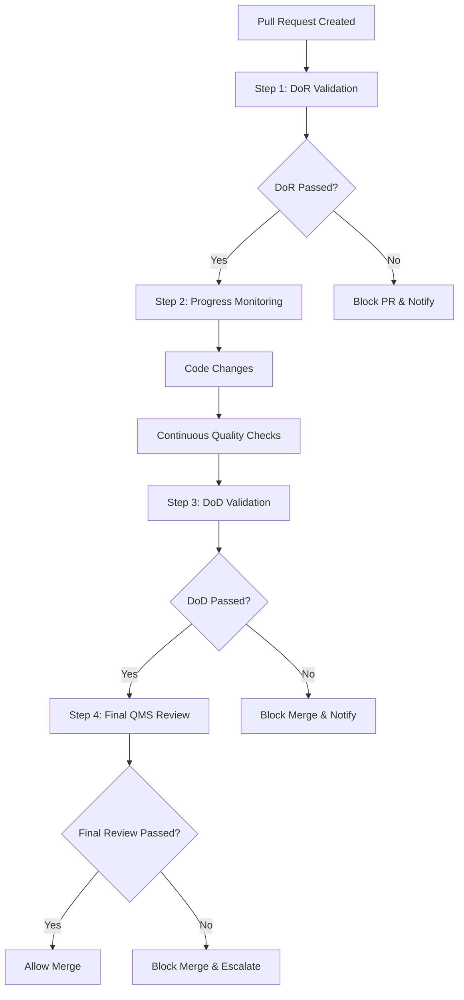

+++
# --- Basic Metadata ---
id = "qms-cicd-quality-gates-config-guide-v1"
title = "QMS CI/CD Quality Gates Configuration Guide v1.0"
context_type = "configuration_guide"
scope = "CI/CD pipeline configuration for QMS quality gate enforcement and automation"
target_audience = ["devops", "platform-engineers", "qms-coordinators", "ci-cd-specialists"]
granularity = "detailed"
status = "active"
created_date = "2025-08-17T23:26:00Z"
updated_date = "2025-08-17T23:26:00Z"
author = "util-writer"
version = "1.0"
tags = ["qms", "ci-cd", "quality-gates", "automation", "github-actions", "jenkins", "gitlab-ci"]
related_context = [
    ".ruru/docs/qms/kb/workflow-implementation/4-step-qms-workflow-implementation-guide-v1.md",
    ".ruru/docs/qms/kb/workflow-implementation/github-integration-setup-guide-v1.md"
]
relevance = "Critical: CI/CD pipeline configuration for automated quality gate enforcement"
+++

# QMS CI/CD Quality Gates Configuration Guide v1.0

## Overview

This guide provides comprehensive instructions for configuring CI/CD pipelines to enforce QMS quality gates automatically. It covers multiple CI/CD platforms and focuses on creating robust, automated quality enforcement mechanisms that integrate seamlessly with the QMS 4-Step Review Workflow.

## Quality Gate Architecture

### Quality Gate Hierarchy



### Quality Gate Categories

1. **Blocking Gates**: Must pass before progression (security, critical bugs)
2. **Warning Gates**: Generate alerts but don't block (performance degradation)
3. **Informational Gates**: Collect metrics and provide insights
4. **Conditional Gates**: Applied based on file changes or environment

## GitHub Actions Configuration

### 1. Quality Gate Matrix Configuration

**Create `.github/qms/quality-gates-matrix.yml`**:

```yaml
# QMS Quality Gates Matrix Configuration
quality_gates:
  
  # Step 1: DoR (Definition of Ready) Gates
  dor_gates:
    blocking:
      - name: "pr_metadata_validation"
        description: "Validates PR title, description, and linked issues"
        required: true
        timeout_minutes: 5
        
      - name: "branch_strategy_validation"  
        description: "Validates branch naming and target branch"
        required: true
        timeout_minutes: 3
        
      - name: "initial_lint_check"
        description: "Basic linting and syntax validation"
        required: true
        timeout_minutes: 10
        
      - name: "dependency_vulnerability_scan"
        description: "Scans for known security vulnerabilities in dependencies"
        required: true
        timeout_minutes: 8
        
    warning:
      - name: "file_size_check"
        description: "Warns about large file additions"
        required: false
        threshold: "10MB"
        
  # Step 2: Progress Monitoring Gates  
  progress_gates:
    blocking:
      - name: "build_validation"
        description: "Ensures code builds successfully"
        required: true
        timeout_minutes: 15
        
      - name: "unit_tests"
        description: "Unit test execution and coverage"
        required: true
        coverage_threshold: 80
        timeout_minutes: 20
        
      - name: "integration_tests"
        description: "Integration test execution"
        required: true
        timeout_minutes: 30
        
      - name: "security_scan"
        description: "SAST and dependency scanning"
        required: true
        timeout_minutes: 15
        
    warning:
      - name: "code_quality_trends"
        description: "Tracks code quality metrics over time"
        required: false
        sonarqube_rating: "B"
        
  # Step 3: DoD (Definition of Done) Gates
  dod_gates:
    blocking:
      - name: "comprehensive_test_suite"
        description: "Full test suite including E2E tests"
        required: true
        unit_coverage: 80
        integration_coverage: 70
        e2e_coverage: 50
        timeout_minutes: 45
        
      - name: "security_compliance_scan"
        description: "Comprehensive security and compliance validation"
        required: true
        timeout_minutes: 25
        
      - name: "performance_benchmarks"
        description: "Performance regression testing"
        required: true
        max_degradation_percent: 10
        timeout_minutes: 20
        
      - name: "documentation_validation"
        description: "Ensures adequate documentation coverage"
        required: true
        timeout_minutes: 10
        
    conditional:
      - name: "database_migration_validation"
        condition: "contains(github.event.pull_request.changed_files, 'migrations/')"
        required: true
        timeout_minutes: 15
        
      - name: "infrastructure_validation"
        condition: "contains(github.event.pull_request.changed_files, 'infrastructure/')"
        required: true
        timeout_minutes: 20
        
  # Step 4: Final QMS Review Gates
  final_gates:
    blocking:
      - name: "quality_score_calculation"
        description: "Calculates overall quality score"
        required: true
        minimum_score: 8.0
        timeout_minutes: 5
        
      - name: "compliance_audit"
        description: "Final compliance and regulatory check"
        required: true
        timeout_minutes: 15
        
      - name: "business_impact_assessment"
        description: "Evaluates business and operational impact"
        required: true
        timeout_minutes: 10
        
    manual:
      - name: "qms_coordinator_approval"
        description: "Manual approval from QMS coordinator"
        required: true
        approvers: ["@qms-quality-coordinator"]
```

### 2. Reusable Workflows

**Create `.github/workflows/qms-quality-gate.yml`**:

```yaml
name: QMS Quality Gate Executor

on:
  workflow_call:
    inputs:
      gate_type:
        required: true
        type: string
        description: 'Type of quality gate (dor, progress, dod, final)'
      gate_name:
        required: true
        type: string
        description: 'Specific gate name to execute'
      pr_number:
        required: true
        type: string
        description: 'Pull request number'
      blocking:
        required: false
        type: boolean
        default: true
        description: 'Whether this gate blocks progression'
    outputs:
      result:
        description: 'Gate execution result (pass/fail/warning)'
        value: ${{ jobs.execute-gate.outputs.result }}
      details:
        description: 'Detailed execution results'
        value: ${{ jobs.execute-gate.outputs.details }}
      metrics:
        description: 'Quality metrics collected'
        value: ${{ jobs.execute-gate.outputs.metrics }}

jobs:
  execute-gate:
    runs-on: ubuntu-latest
    timeout-minutes: 60
    
    outputs:
      result: ${{ steps.gate-execution.outputs.result }}
      details: ${{ steps.gate-execution.outputs.details }}
      metrics: ${{ steps.gate-execution.outputs.metrics }}
    
    steps:
      - name: Checkout Code
        uses: actions/checkout@v4
        with:
          fetch-depth: 0
      
      - name: Load QMS Configuration
        id: qms-config
        run: |
          if [ -f .github/qms/quality-gates-matrix.yml ]; then
            echo "config_found=true" >> $GITHUB_OUTPUT
          else
            echo "config_found=false" >> $GITHUB_OUTPUT
            echo "::error::QMS configuration not found"
            exit 1
          fi
      
      - name: Setup Environment
        uses: ./.github/actions/qms-setup-environment
        
      - name: Execute Quality Gate
        id: gate-execution
        uses: ./.github/actions/qms-gate-executor
        with:
          gate_type: ${{ inputs.gate_type }}
          gate_name: ${{ inputs.gate_name }}
          pr_number: ${{ inputs.pr_number }}
          blocking: ${{ inputs.blocking }}
          
      - name: Upload Results
        uses: actions/upload-artifact@v4
        with:
          name: qms-gate-results-${{ inputs.gate_type }}-${{ inputs.gate_name }}
          path: |
            .qms/results/
            .qms/reports/
            .qms/metrics/
          retention-days: 30
          
      - name: Update Status Check
        if: always()
        uses: ./.github/actions/qms-status-reporter
        with:
          context: "QMS ${{ inputs.gate_type }} - ${{ inputs.gate_name }}"
          state: ${{ steps.gate-execution.outputs.result }}
          description: ${{ steps.gate-execution.outputs.details }}
          pr_number: ${{ inputs.pr_number }}
```

### 3. Quality Gate Custom Actions

**Create `.github/actions/qms-gate-executor/action.yml`**:

```yaml
name: 'QMS Quality Gate Executor'
description: 'Executes specific QMS quality gates with comprehensive validation'
inputs:
  gate_type:
    description: 'Quality gate type (dor, progress, dod, final)'
    required: true
  gate_name:
    description: 'Specific gate name to execute'
    required: true
  pr_number:
    description: 'Pull request number'
    required: true
  blocking:
    description: 'Whether gate failure blocks progression'
    required: false
    default: 'true'

outputs:
  result:
    description: 'Gate execution result'
  details:
    description: 'Detailed execution information'
  metrics:
    description: 'Quality metrics collected'

runs:
  using: 'composite'
  steps:
    - name: Initialize Gate Environment
      shell: bash
      run: |
        mkdir -p .qms/{results,reports,metrics,cache}
        echo "GATE_START_TIME=$(date -u +%Y-%m-%dT%H:%M:%SZ)" >> $GITHUB_ENV
        echo "QMS_GATE_ID=${{ inputs.gate_type }}-${{ inputs.gate_name }}-$(date +%s)" >> $GITHUB_ENV
    
    - name: Load Gate Configuration
      id: load-config
      shell: bash
      run: |
        # Parse YAML configuration for specific gate
        GATE_CONFIG=$(yq eval ".quality_gates.${{ inputs.gate_type }}_gates[] | select(.name == \"${{ inputs.gate_name }}\") | @json" .github/qms/quality-gates-matrix.yml)
        echo "gate_config=$GATE_CONFIG" >> $GITHUB_OUTPUT
        
        # Extract timeout and requirements
        TIMEOUT=$(echo "$GATE_CONFIG" | jq -r '.timeout_minutes // 30')
        echo "timeout=$TIMEOUT" >> $GITHUB_OUTPUT
    
    - name: Execute DoR Gates
      if: inputs.gate_type == 'dor'
      shell: bash
      run: |
        case "${{ inputs.gate_name }}" in
          "pr_metadata_validation")
            echo "Executing PR metadata validation..."
            ./.github/scripts/qms/validate-pr-metadata.sh ${{ inputs.pr_number }}
            ;;
          "branch_strategy_validation")
            echo "Executing branch strategy validation..."
            ./.github/scripts/qms/validate-branch-strategy.sh
            ;;
          "initial_lint_check")
            echo "Executing initial linting..."
            npm run lint -- --format json --output-file .qms/results/lint-results.json
            ;;
          "dependency_vulnerability_scan")
            echo "Executing dependency vulnerability scan..."
            npm audit --audit-level moderate --json > .qms/results/audit-results.json
            ;;
          *)
            echo "Unknown DoR gate: ${{ inputs.gate_name }}"
            exit 1
            ;;
        esac
    
    - name: Execute Progress Gates
      if: inputs.gate_type == 'progress'
      shell: bash
      run: |
        case "${{ inputs.gate_name }}" in
          "build_validation")
            echo "Executing build validation..."
            npm run build 2>&1 | tee .qms/results/build-output.log
            ;;
          "unit_tests")
            echo "Executing unit tests..."
            npm run test:unit -- --coverage --ci --json --outputFile=.qms/results/unit-test-results.json
            ;;
          "integration_tests")
            echo "Executing integration tests..."
            npm run test:integration -- --ci --json --outputFile=.qms/results/integration-test-results.json
            ;;
          "security_scan")
            echo "Executing security scan..."
            ./.github/scripts/qms/security-scan.sh
            ;;
          *)
            echo "Unknown Progress gate: ${{ inputs.gate_name }}"
            exit 1
            ;;
        esac
    
    - name: Execute DoD Gates
      if: inputs.gate_type == 'dod'
      shell: bash
      run: |
        case "${{ inputs.gate_name }}" in
          "comprehensive_test_suite")
            echo "Executing comprehensive test suite..."
            npm run test:all -- --coverage --ci --json --outputFile=.qms/results/comprehensive-test-results.json
            ;;
          "security_compliance_scan")
            echo "Executing security compliance scan..."
            ./.github/scripts/qms/comprehensive-security-scan.sh
            ;;
          "performance_benchmarks")
            echo "Executing performance benchmarks..."
            npm run test:performance -- --json --outputFile=.qms/results/performance-results.json
            ;;
          "documentation_validation")
            echo "Executing documentation validation..."
            ./.github/scripts/qms/validate-documentation.sh
            ;;
          *)
            echo "Unknown DoD gate: ${{ inputs.gate_name }}"
            exit 1
            ;;
        esac
    
    - name: Execute Final Gates
      if: inputs.gate_type == 'final'
      shell: bash
      run: |
        case "${{ inputs.gate_name }}" in
          "quality_score_calculation")
            echo "Calculating quality score..."
            ./.github/scripts/qms/calculate-quality-score.sh
            ;;
          "compliance_audit")
            echo "Executing compliance audit..."
            ./.github/scripts/qms/compliance-audit.sh
            ;;
          "business_impact_assessment")
            echo "Executing business impact assessment..."
            ./.github/scripts/qms/business-impact-assessment.sh ${{ inputs.pr_number }}
            ;;
          *)
            echo "Unknown Final gate: ${{ inputs.gate_name }}"
            exit 1
            ;;
        esac
    
    - name: Process Gate Results
      id: process-results
      shell: bash
      run: |
        # Process all result files and determine overall status
        GATE_RESULT="pass"
        GATE_DETAILS=""
        GATE_METRICS=""
        
        # Check for result files and parse them
        if [ -f .qms/results/gate-result.json ]; then
          GATE_RESULT=$(jq -r '.result' .qms/results/gate-result.json)
          GATE_DETAILS=$(jq -r '.details' .qms/results/gate-result.json)
          GATE_METRICS=$(jq -r '.metrics' .qms/results/gate-result.json)
        else
          # Fallback: analyze exit codes and outputs
          if [ $? -eq 0 ]; then
            GATE_RESULT="pass"
            GATE_DETAILS="Gate executed successfully"
          else
            GATE_RESULT="fail"
            GATE_DETAILS="Gate execution failed"
          fi
        fi
        
        # Set outputs
        echo "result=$GATE_RESULT" >> $GITHUB_OUTPUT
        echo "details=$GATE_DETAILS" >> $GITHUB_OUTPUT  
        echo "metrics=$GATE_METRICS" >> $GITHUB_OUTPUT
        
        # Create summary report
        cat > .qms/reports/gate-summary.md << EOF
        # QMS Gate Report: ${{ inputs.gate_type }} - ${{ inputs.gate_name }}
        
        **Result**: $GATE_RESULT
        **Details**: $GATE_DETAILS
        **Execution Time**: $(date -u +%Y-%m-%dT%H:%M:%SZ)
        **Gate ID**: $QMS_GATE_ID
        
        ## Metrics
        \`\`\`json
        $GATE_METRICS
        \`\`\`
        EOF
    
    - name: Handle Gate Failure
      if: steps.process-results.outputs.result == 'fail' && inputs.blocking == 'true'
      shell: bash
      run: |
        echo "::error::QMS Quality Gate Failed - ${{ inputs.gate_type }}/${{ inputs.gate_name }}"
        echo "::error::Details: ${{ steps.process-results.outputs.details }}"
        
        # Create failure notification
        ./.github/scripts/qms/notify-gate-failure.sh \
          "${{ inputs.gate_type }}" \
          "${{ inputs.gate_name }}" \
          "${{ inputs.pr_number }}" \
          "${{ steps.process-results.outputs.details }}"
        
        exit 1
    
    - name: Record Gate Metrics
      if: always()
      shell: bash
      run: |
        # Record execution metrics for monitoring
        cat > .qms/metrics/gate-metrics.json << EOF
        {
          "gate_id": "$QMS_GATE_ID",
          "gate_type": "${{ inputs.gate_type }}",
          "gate_name": "${{ inputs.gate_name }}",
          "pr_number": "${{ inputs.pr_number }}",
          "result": "${{ steps.process-results.outputs.result }}",
          "start_time": "$GATE_START_TIME",
          "end_time": "$(date -u +%Y-%m-%dT%H:%M:%SZ)",
          "duration_seconds": $(($(date +%s) - $(date -d "$GATE_START_TIME" +%s))),
          "blocking": "${{ inputs.blocking }}",
          "repository": "$GITHUB_REPOSITORY",
          "commit_sha": "$GITHUB_SHA"
        }
        EOF
```

### 4. Quality Gate Scripts

**Create `.github/scripts/qms/validate-pr-metadata.sh`**:

```bash
#!/bin/bash
# QMS PR Metadata Validation Script

set -e

PR_NUMBER=$1
RESULTS_DIR=".qms/results"
METRICS_DIR=".qms/metrics"

mkdir -p "$RESULTS_DIR" "$METRICS_DIR"

echo "🔍 Validating PR metadata for PR #$PR_NUMBER..."

# Get PR details using GitHub CLI
PR_DATA=$(gh pr view "$PR_NUMBER" --json title,body,labels,assignees,reviewRequests,milestone,linkedBranches)

# Initialize validation results
VALIDATION_RESULTS=()
SCORE=0
MAX_SCORE=100

# Validate title format (Conventional Commits)
TITLE=$(echo "$PR_DATA" | jq -r '.title')
if echo "$TITLE" | grep -qE "^(feat|fix|docs|style|refactor|perf|test|chore)(\(.+\))?: .{10,}"; then
  VALIDATION_RESULTS+=("✅ Title follows conventional commit format")
  SCORE=$((SCORE + 25))
else
  VALIDATION_RESULTS+=("❌ Title must follow conventional commit format: type(scope): description")
fi

# Validate description length and content
BODY=$(echo "$PR_DATA" | jq -r '.body // ""')
BODY_LENGTH=${#BODY}

if [ "$BODY_LENGTH" -ge 50 ]; then
  VALIDATION_RESULTS+=("✅ Description is adequate ($BODY_LENGTH characters)")
  SCORE=$((SCORE + 20))
else
  VALIDATION_RESULTS+=("❌ Description too short ($BODY_LENGTH characters, minimum 50 required)")
fi

# Check for acceptance criteria
if echo "$BODY" | grep -qi "acceptance criteria"; then
  VALIDATION_RESULTS+=("✅ Acceptance criteria provided")
  SCORE=$((SCORE + 15))
else
  VALIDATION_RESULTS+=("⚠️  Acceptance criteria not found (recommended)")
fi

# Check for linked issues
if echo "$BODY" | grep -qE "(closes|fixes|resolves|related to) #[0-9]+"; then
  VALIDATION_RESULTS+=("✅ Linked to related issues")
  SCORE=$((SCORE + 15))
else
  VALIDATION_RESULTS+=("⚠️  No linked issues found (recommended)")
fi

# Validate labels
LABELS_COUNT=$(echo "$PR_DATA" | jq '.labels | length')
if [ "$LABELS_COUNT" -gt 0 ]; then
  VALIDATION_RESULTS+=("✅ Labels applied ($LABELS_COUNT labels)")
  SCORE=$((SCORE + 10))
else
  VALIDATION_RESULTS+=("⚠️  No labels applied (recommended)")
fi

# Check for milestone
MILESTONE=$(echo "$PR_DATA" | jq -r '.milestone.title // ""')
if [ -n "$MILESTONE" ] && [ "$MILESTONE" != "null" ]; then
  VALIDATION_RESULTS+=("✅ Milestone assigned: $MILESTONE")
  SCORE=$((SCORE + 10))
else
  VALIDATION_RESULTS+=("ℹ️  No milestone assigned")
fi

# Determine overall result
if [ "$SCORE" -ge 70 ]; then
  RESULT="pass"
  STATUS="✅ PASSED"
elif [ "$SCORE" -ge 50 ]; then
  RESULT="warning"
  STATUS="⚠️  WARNING"
else
  RESULT="fail"
  STATUS="❌ FAILED"
fi

# Generate results
cat > "$RESULTS_DIR/pr-metadata-validation.json" << EOF
{
  "result": "$RESULT",
  "score": $SCORE,
  "max_score": $MAX_SCORE,
  "details": "PR metadata validation completed with score $SCORE/$MAX_SCORE",
  "validations": $(printf '%s\n' "${VALIDATION_RESULTS[@]}" | jq -R . | jq -s .),
  "metrics": {
    "title_length": ${#TITLE},
    "body_length": $BODY_LENGTH,
    "labels_count": $LABELS_COUNT,
    "has_milestone": $([ -n "$MILESTONE" ] && [ "$MILESTONE" != "null" ] && echo "true" || echo "false"),
    "has_linked_issues": $(echo "$BODY" | grep -qE "(closes|fixes|resolves|related to) #[0-9]+" && echo "true" || echo "false")
  }
}
EOF

# Create gate result file
cat > "$RESULTS_DIR/gate-result.json" << EOF
{
  "result": "$RESULT",
  "details": "PR metadata validation: $STATUS (Score: $SCORE/$MAX_SCORE)",
  "metrics": {
    "validation_score": $SCORE,
    "validation_max_score": $MAX_SCORE,
    "validation_percentage": $(echo "scale=2; $SCORE * 100 / $MAX_SCORE" | bc -l)
  }
}
EOF

# Output results
echo ""
echo "📊 PR Metadata Validation Results:"
echo "=================================="
for validation in "${VALIDATION_RESULTS[@]}"; do
  echo "  $validation"
done
echo ""
echo "🎯 Final Score: $SCORE/$MAX_SCORE ($(echo "scale=1; $SCORE * 100 / $MAX_SCORE" | bc -l)%)"
echo "🏁 Result: $STATUS"

# Exit with appropriate code
if [ "$RESULT" = "fail" ]; then
  exit 1
elif [ "$RESULT" = "warning" ]; then
  exit 0  # Don't fail on warnings
else
  exit 0
fi
```

### 5. Pipeline Orchestration

**Create `.github/workflows/qms-pipeline-orchestrator.yml`**:

```yaml
name: QMS Pipeline Orchestrator

on:
  pull_request:
    types: [opened, edited, synchronize, ready_for_review]
  pull_request_review:
    types: [submitted]
  workflow_dispatch:
    inputs:
      pr_number:
        description: 'PR number to process'
        required: true
      force_step:
        description: 'Force specific step (dor, progress, dod, final)'
        required: false

concurrency:
  group: qms-${{ github.event.pull_request.number || github.event.inputs.pr_number }}
  cancel-in-progress: false

jobs:
  qms-orchestrator:
    name: QMS Pipeline Orchestrator
    runs-on: ubuntu-latest
    
    outputs:
      current_step: ${{ steps.determine-step.outputs.current_step }}
      gates_to_run: ${{ steps.determine-step.outputs.gates_to_run }}
      should_continue: ${{ steps.determine-step.outputs.should_continue }}
    
    steps:
      - name: Checkout
        uses: actions/checkout@v4
      
      - name: Determine Current QMS Step
        id: determine-step
        uses: ./.github/actions/qms-step-detector
        with:
          pr_number: ${{ github.event.pull_request.number || github.event.inputs.pr_number }}
          force_step: ${{ github.event.inputs.force_step }}
      
      - name: Load Quality Gates Configuration
        id: load-gates
        run: |
          # Load gates for current step
          CURRENT_STEP="${{ steps.determine-step.outputs.current_step }}"
          GATES=$(yq eval ".quality_gates.${CURRENT_STEP}_gates[].name" .github/qms/quality-gates-matrix.yml | jq -R . | jq -s .)
          echo "gates=$GATES" >> $GITHUB_OUTPUT

  # Step 1: DoR Validation Gates
  dor-validation:
    name: DoR Quality Gates
    needs: qms-orchestrator
    if: needs.qms-orchestrator.outputs.current_step == 'dor' && needs.qms-orchestrator.outputs.should_continue == 'true'
    strategy:
      fail-fast: false
      matrix:
        gate: ${{ fromJson(needs.qms-orchestrator.outputs.gates_to_run) }}
    uses: ./.github/workflows/qms-quality-gate.yml
    with:
      gate_type: "dor"
      gate_name: ${{ matrix.gate }}
      pr_number: ${{ github.event.pull_request.number || github.event.inputs.pr_number }}
      blocking: true
    secrets: inherit

  # Results Aggregation and Reporting
  qms-results:
    name: QMS Results Aggregation
    needs: [qms-orchestrator, dor-validation]
    if: always()
    runs-on: ubuntu-latest
    
    steps:
      - name: Checkout
        uses: actions/checkout@v4
      
      - name: Aggregate Results
        uses: ./.github/actions/qms-results-aggregator
        with:
          pr_number: ${{ github.event.pull_request.number || github.event.inputs.pr_number }}
          step: ${{ needs.qms-orchestrator.outputs.current_step }}
```

## Multi-Platform CI/CD Support

### Jenkins Pipeline Configuration

**Create `Jenkinsfile.qms`**:

```groovy
pipeline {
    agent any
    
    parameters {
        string(name: 'PR_NUMBER', defaultValue: '', description: 'Pull Request Number')
        choice(name: 'QMS_STEP', choices: ['auto', 'dor', 'progress', 'dod', 'final'], description: 'QMS Step to Execute')
    }
    
    environment {
        QMS_CONFIG = '.github/qms/quality-gates-matrix.yml'
        QMS_RESULTS_DIR = '.qms/results'
        QMS_REPORTS_DIR = '.qms/reports'
    }
    
    stages {
        stage('Initialize QMS') {
            steps {
                script {
                    sh '''
                        mkdir -p ${QMS_RESULTS_DIR} ${QMS_REPORTS_DIR}
                        echo "QMS_EXECUTION_ID=$(uuidgen)" >> $JENKINS_HOME/qms.env
                        echo "QMS_START_TIME=$(date -u +%Y-%m-%dT%H:%M:%SZ)" >> $JENKINS_HOME/qms.env
                    '''
                }
            }
        }
        
        stage('Execute Quality Gates') {
            parallel {
                stage('DoR Gates') {
                    when { environment name: 'CURRENT_QMS_STEP', value: 'dor' }
                    steps {
                        executeQualityGates('dor')
                    }
                }
            }
        }
    }
    
    post {
        always {
            archiveArtifacts artifacts: '.qms/**/*', allowEmptyArchive: true
            publishHTML([
                allowMissing: false,
                alwaysLinkToLastBuild: true,
                keepAll: true,
                reportDir: '.qms/reports',
                reportFiles: 'quality-report.html',
                reportName: 'QMS Quality Report'
            ])
        }
    }
}

def executeQualityGates(step) {
    def gates = sh(script: "yq eval '.quality_gates.${step}_gates[].name' ${QMS_CONFIG}", returnStdout: true).trim().split('\n')
    
    gates.each { gate ->
        stage("${step.toUpperCase()} - ${gate}") {
            try {
                sh """
                    echo "Executing ${step} gate: ${gate}"
                    ./.github/scripts/qms/execute-gate.sh ${step} ${gate} ${params.PR_NUMBER}
                """
            } catch (Exception e) {
                currentBuild.result = 'FAILURE'
                error("Quality gate failed: ${step}/${gate} - ${e.message}")
            }
        }
    }
}
```

### GitLab CI Configuration

**Create `.gitlab-ci.yml` for QMS**:

```yaml
# GitLab CI Configuration for QMS Quality Gates

stages:
  - qms-init
  - qms-dor
  - qms-progress
  - qms-dod
  - qms-final
  - qms-report

variables:
  QMS_RESULTS_DIR: ".qms/results"
  QMS_REPORTS_DIR: ".qms/reports"
  QMS_METRICS_DIR: ".qms/metrics"

.qms-base: &qms-base
  before_script:
    - mkdir -p ${QMS_RESULTS_DIR} ${QMS_REPORTS_DIR} ${QMS_METRICS_DIR}
    - export QMS_EXECUTION_ID=$(uuidgen)
    - export QMS_START_TIME=$(date -u +%Y-%m-%dT%H:%M:%SZ)
    - echo "QMS execution started at $QMS_START_TIME"
  
  artifacts:
    paths:
      - .qms/
    reports:
      junit:
        - .qms/results/*-junit.xml
      coverage_report:
        coverage_format: cobertura
        path: .qms/results/coverage.xml
    expire_in: 30 days
    when: always

# QMS Initialization
qms-init:
  <<: *qms-base
  stage: qms-init
  script:
    - echo "Initializing QMS pipeline..."
    - ./.github/scripts/qms/determine-qms-step.sh $CI_MERGE_REQUEST_IID
    - echo "Current QMS step determined"
  only:
    - merge_requests

# DoR Quality Gates
dor-metadata-validation:
  <<: *qms-base
  stage: qms-dor
  script:
    - ./.github/scripts/qms/validate-pr-metadata.sh $CI_MERGE_REQUEST_IID
  only:
    - merge_requests
```

## Quality Gate Monitoring and Observability

### Metrics Collection

**Create `.github/scripts/qms/collect-metrics.sh`**:

```bash
#!/bin/bash
# QMS Metrics Collection Script

METRICS_DIR=".qms/metrics"
RESULTS_DIR=".qms/results"

mkdir -p "$METRICS_DIR"

# Collect quality gate execution metrics
QUALITY_METRICS="{
  \"execution_timestamp\": \"$(date -u +%Y-%m-%dT%H:%M:%SZ)\",
  \"repository\": \"$GITHUB_REPOSITORY\",
  \"commit_sha\": \"$GITHUB_SHA\",
  \"pr_number\": \"$GITHUB_PR_NUMBER\",
  \"workflow_run_id\": \"$GITHUB_RUN_ID\",
  \"quality_gates\": ["

# Aggregate individual gate metrics
for result_file in "$RESULTS_DIR"/*/gate-metrics.json; do
  if [ -f "$result_file" ]; then
    QUALITY_METRICS="${QUALITY_METRICS}$(cat "$result_file"),"
  fi
done

# Remove trailing comma and close array
QUALITY_METRICS="${QUALITY_METRICS%,}]}"

# Save aggregated metrics
echo "$QUALITY_METRICS" > "$METRICS_DIR/quality-execution-metrics.json"

echo "Metrics collection completed"
```

## Troubleshooting and Optimization

### Performance Optimization Strategies

1. **Parallel Gate Execution**: Run independent quality gates in parallel
2. **Caching Strategies**: Cache dependencies, build artifacts, and scan results
3. **Incremental Analysis**: Only analyze changed files where possible
4. **Resource Optimization**: Right-size CI/CD resources based on gate requirements

### Common Issues and Solutions

#### Issue 1: Quality Gate Timeouts
```bash
# Increase timeout for specific gates
timeout_minutes: 60  # Increase from default 30

# Implement timeout handling
timeout 1800 npm run test:comprehensive || {
  echo "Tests timed out after 30 minutes"
  exit 1
}
```

#### Issue 2: Flaky Test Results
```yaml
# Implement retry logic
- name: Run Tests with Retry
  uses: nick-invision/retry@v2
  with:
    timeout_minutes: 30
    max_attempts: 3
    command: npm run test:integration
```

## Integration with External Tools

### SonarQube Integration

```bash
# SonarQube quality gate integration
sonar-scanner \
  -Dsonar.projectKey=$PROJECT_KEY \
  -Dsonar.sources=. \
  -Dsonar.qualitygate.wait=true \
  -Dsonar.qualitygate.timeout=300
```

## Conclusion

This comprehensive CI/CD configuration guide provides:

- **Automated Quality Enforcement**: All QMS steps are automatically enforced in CI/CD pipelines
- **Multi-Platform Support**: Compatible with GitHub Actions, Jenkins, and GitLab CI
- **Comprehensive Gate Coverage**: Security, testing, performance, and compliance validation
- **Monitoring and Observability**: Metrics collection and reporting for continuous improvement
- **Scalability**: Optimized for performance with parallel execution and caching strategies

The configuration ensures consistent quality standards across all development workflows while maintaining flexibility for different team needs and technical environments.