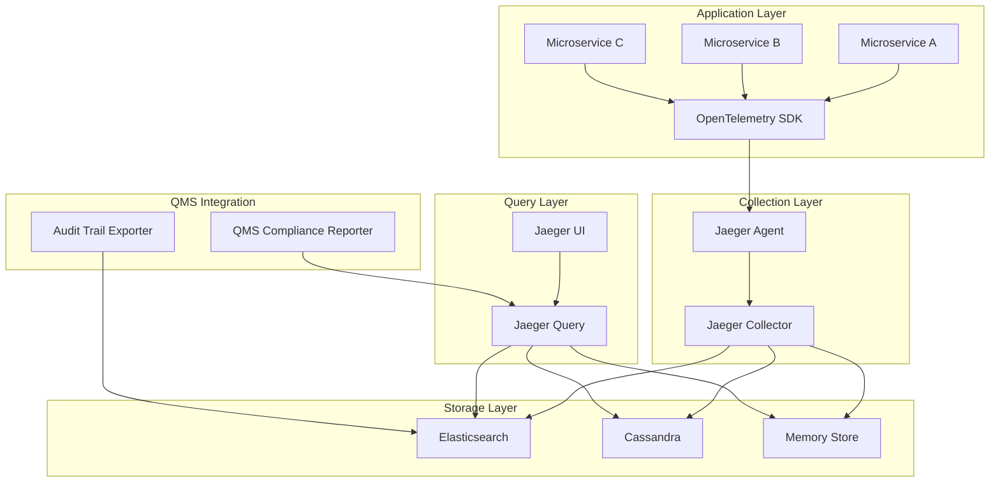

+++
# --- Basic Metadata ---
id = "QMS-JAEGER-TRACING-CONFIG-V1"
title = "Jaeger Tracing Configuration for QMS Phase 4: Observability & Traceability"
context_type = "technical_documentation"
scope = "QMS Phase 4 observability infrastructure - Jaeger distributed tracing deployment and configuration"
target_audience = ["qms-observability-engineer", "lead-devops", "infra-specialist", "qms-quality-coordinator", "util-senior-dev"]
granularity = "comprehensive"
status = "active"
created_date = "2025-08-16"
updated_date = "2025-08-16"
version = "1.0"
tags = ["qms", "phase-4", "observability", "jaeger", "tracing", "distributed-systems", "monitoring", "opentelemetry", "infrastructure", "deployment", "configuration"]

# --- Ownership & Context ---
author = "🧑‍💻 util-writer"
owner = "QMS Phase 4: Observability Team"
related_docs = [
    ".ruru/docs/qms/observability/opentelemetry-integration-guidelines.md",
    ".ruru/modes/lead-qms-observability/lead-qms-observability.mode.md",
    ".ruru/modes/qms-observability-engineer/qms-observability-engineer.mode.md"
]
related_tasks = []
parent_doc = ".ruru/docs/qms/qms-phase-4-implementation-plan.md"

# --- QMS Specific Fields ---
qms_phase = "4"
qms_domain = "observability"
compliance_level = "production"
security_classification = "internal"
audit_trail_required = true
quality_gates = ["security-review", "performance-validation", "compliance-check"]

# --- Technical Documentation Fields ---
difficulty = "advanced"
estimated_time = "~2-4 hours for full implementation"
prerequisites = [
    "Kubernetes cluster or Docker environment",
    "OpenTelemetry instrumentation knowledge",
    "Basic understanding of distributed tracing concepts",
    "QMS Phase 4 infrastructure setup"
]
learning_objectives = [
    "Deploy Jaeger in multiple environments (Docker, Kubernetes, standalone)",
    "Configure various storage backends for production use",
    "Integrate Jaeger with OpenTelemetry for trace collection",
    "Implement security controls and authentication",
    "Optimize performance through sampling strategies",
    "Monitor Jaeger health and troubleshoot common issues",
    "Ensure QMS compliance with audit trails and reporting"
]

# --- Integration & Deployment ---
supported_platforms = ["kubernetes", "docker", "standalone"]
supported_storage_backends = ["elasticsearch", "cassandra", "memory", "badger"]
opentelemetry_integration = true
qms_compliance_features = true
multi_environment_support = true
+++

# Jaeger Tracing Configuration for QMS Phase 4: Observability & Traceability

## Overview & Purpose 🎯

This comprehensive guide provides technical procedures for deploying and configuring Jaeger distributed tracing as part of QMS Phase 4: Observability & Traceability implementation. Jaeger enables end-to-end distributed request tracing across microservices, providing critical visibility for performance optimization, root cause analysis, and QMS compliance auditing.

### QMS Phase 4 Integration Benefits

- **Audit Trail Compliance**: Complete request tracing for regulatory requirements
- **Quality Gate Validation**: Performance metrics and SLA monitoring
- **Root Cause Analysis**: Distributed error tracking and debugging
- **Performance Optimization**: Bottleneck identification and latency analysis
- **Service Dependency Mapping**: Visualizing microservice interactions
- **Compliance Reporting**: Automated trace data extraction for QMS reports

## Architecture Overview 📊



## Deployment Options 🚀

### Docker Compose Deployment

#### Production Configuration

```yaml
# docker-compose.jaeger.yml
version: '3.8'

services:
  # Jaeger Collector
  jaeger-collector:
    image: jaegertracing/jaeger-collector:1.50
    container_name: jaeger-collector
    environment:
      - SPAN_STORAGE_TYPE=elasticsearch
      - ES_SERVER_URLS=https://elasticsearch:9200
      - ES_USERNAME=${ES_USERNAME}
      - ES_PASSWORD=${ES_PASSWORD}
      - ES_TLS_ENABLED=true
      - ES_TLS_SKIP_HOST_VERIFY=false
      - COLLECTOR_OTLP_ENABLED=true
      - COLLECTOR_GRPC_TLS_ENABLED=true
      - COLLECTOR_GRPC_TLS_CERT=/certs/server.crt
      - COLLECTOR_GRPC_TLS_KEY=/certs/server.key
    ports:
      - "14269:14269"  # Health check
      - "14268:14268"  # HTTP
      - "4317:4317"    # OTLP gRPC
      - "4318:4318"    # OTLP HTTP
    volumes:
      - ./certs:/certs:ro
    depends_on:
      - elasticsearch
    restart: unless-stopped
    deploy:
      resources:
        limits:
          memory: 512M
          cpus: '0.5'

  # Jaeger Query Service
  jaeger-query:
    image: jaegertracing/jaeger-query:1.50
    container_name: jaeger-query
    environment:
      - SPAN_STORAGE_TYPE=elasticsearch
      - ES_SERVER_URLS=https://elasticsearch:9200
      - ES_USERNAME=${ES_USERNAME}
      - ES_PASSWORD=${ES_PASSWORD}
      - ES_TLS_ENABLED=true
      - QUERY_BASE_PATH=/jaeger
      - QUERY_UI_CONFIG=/config/ui.json
    ports:
      - "16686:16686"
    volumes:
      - ./config:/config:ro
    depends_on:
      - elasticsearch
    restart: unless-stopped

  # Jaeger Agent (Optional - for legacy applications)
  jaeger-agent:
    image: jaegertracing/jaeger-agent:1.50
    container_name: jaeger-agent
    command:
      - --collector.grpc-server=jaeger-collector:14250
      - --agent.tags=deployment.name=docker,host.name=${HOSTNAME}
    ports:
      - "5775:5775/udp"
      - "6831:6831/udp"
      - "6832:6832/udp"
      - "5778:5778"
    depends_on:
      - jaeger-collector
    restart: unless-stopped

  # Elasticsearch for storage
  elasticsearch:
    image: docker.elastic.co/elasticsearch/elasticsearch:8.10.0
    container_name: jaeger-elasticsearch
    environment:
      - discovery.type=single-node
      - ES_JAVA_OPTS=-Xms2g -Xmx2g
      - xpack.security.enabled=true
      - xpack.security.http.ssl.enabled=true
      - xpack.security.http.ssl.key=certs/es.key
      - xpack.security.http.ssl.certificate=certs/es.crt
      - xpack.security.http.ssl.certificate_authorities=certs/ca.crt
      - ELASTIC_PASSWORD=${ES_PASSWORD}
    volumes:
      - jaeger_es_data:/usr/share/elasticsearch/data
      - ./certs:/usr/share/elasticsearch/config/certs:ro
    ports:
      - "9200:9200"
    restart: unless-stopped
    deploy:
      resources:
        limits:
          memory: 4G
          cpus: '2'

volumes:
  jaeger_es_data:
    driver: local
```

#### Environment Configuration

```bash
# .env file
ES_USERNAME=jaeger_user
ES_PASSWORD=your_secure_password_here
HOSTNAME=jaeger-production
```

### Kubernetes Deployment

#### Namespace and Resources

```yaml
# jaeger-namespace.yaml
apiVersion: v1
kind: Namespace
metadata:
  name: jaeger-system
  labels:
    name: jaeger-system
    qms.phase: "4"
    qms.domain: "observability"
---
# Storage Class for Elasticsearch
apiVersion: storage.k8s.io/v1
kind: StorageClass
metadata:
  name: jaeger-elasticsearch-ssd
  namespace: jaeger-system
provisioner: kubernetes.io/gce-pd
parameters:
  type: pd-ssd
  replication-type: regional-pd
```

#### Elasticsearch Cluster

```yaml
# elasticsearch-cluster.yaml
apiVersion: apps/v1
kind: StatefulSet
metadata:
  name: elasticsearch
  namespace: jaeger-system
spec:
  serviceName: elasticsearch
  replicas: 3
  selector:
    matchLabels:
      app: elasticsearch
  template:
    metadata:
      labels:
        app: elasticsearch
    spec:
      initContainers:
      - name: increase-vm-max-map
        image: busybox:1.35
        command: ['sh', '-c', 'sysctl -w vm.max_map_count=262144']
        securityContext:
          privileged: true
      containers:
      - name: elasticsearch
        image: docker.elastic.co/elasticsearch/elasticsearch:8.10.0
        env:
        - name: cluster.name
          value: "jaeger-cluster"
        - name: node.name
          valueFrom:
            fieldRef:
              fieldPath: metadata.name
        - name: discovery.seed_hosts
          value: "elasticsearch-0.elasticsearch,elasticsearch-1.elasticsearch,elasticsearch-2.elasticsearch"
        - name: cluster.initial_master_nodes
          value: "elasticsearch-0,elasticsearch-1,elasticsearch-2"
        - name: ES_JAVA_OPTS
          value: "-Xms2g -Xmx2g"
        - name: xpack.security.enabled
          value: "true"
        - name: xpack.security.http.ssl.enabled
          value: "true"
        - name: xpack.security.http.ssl.keystore.path
          value: "/usr/share/elasticsearch/config/certs/elastic-stack-ca.p12"
        - name: xpack.security.transport.ssl.enabled
          value: "true"
        - name: xpack.security.transport.ssl.keystore.path
          value: "/usr/share/elasticsearch/config/certs/elastic-stack-ca.p12"
        - name: xpack.security.transport.ssl.truststore.path
          value: "/usr/share/elasticsearch/config/certs/elastic-stack-ca.p12"
        - name: ELASTIC_PASSWORD
          valueFrom:
            secretRef:
              name: elasticsearch-credentials
              key: password
        ports:
        - containerPort: 9200
          name: http
        - containerPort: 9300
          name: transport
        volumeMounts:
        - name: elasticsearch-data
          mountPath: /usr/share/elasticsearch/data
        - name: elasticsearch-certs
          mountPath: /usr/share/elasticsearch/config/certs
          readOnly: true
        resources:
          requests:
            memory: 3Gi
            cpu: 1000m
          limits:
            memory: 4Gi
            cpu: 2000m
      volumes:
      - name: elasticsearch-certs
        secret:
          secretName: elasticsearch-certs
  volumeClaimTemplates:
  - metadata:
      name: elasticsearch-data
    spec:
      accessModes: ["ReadWriteOnce"]
      storageClassName: jaeger-elasticsearch-ssd
      resources:
        requests:
          storage: 100Gi
```

#### Jaeger Components

```yaml
# jaeger-components.yaml
apiVersion: apps/v1
kind: Deployment
metadata:
  name: jaeger-collector
  namespace: jaeger-system
spec:
  replicas: 3
  selector:
    matchLabels:
      app: jaeger-collector
  template:
    metadata:
      labels:
        app: jaeger-collector
    spec:
      containers:
      - name: jaeger-collector
        image: jaegertracing/jaeger-collector:1.50
        env:
        - name: SPAN_STORAGE_TYPE
          value: "elasticsearch"
        - name: ES_SERVER_URLS
          value: "https://elasticsearch:9200"
        - name: ES_USERNAME
          value: "jaeger_user"
        - name: ES_PASSWORD
          valueFrom:
            secretRef:
              name: elasticsearch-credentials
              key: jaeger_password
        - name: ES_TLS_ENABLED
          value: "true"
        - name: ES_TLS_CA
          value: "/certs/ca.crt"
        - name: COLLECTOR_OTLP_ENABLED
          value: "true"
        - name: COLLECTOR_GRPC_TLS_ENABLED
          value: "true"
        - name: COLLECTOR_GRPC_TLS_CERT
          value: "/certs/server.crt"
        - name: COLLECTOR_GRPC_TLS_KEY
          value: "/certs/server.key"
        - name: COLLECTOR_QUEUE_SIZE
          value: "2000"
        - name: COLLECTOR_NUM_WORKERS
          value: "50"
        ports:
        - containerPort: 14269
          name: health
        - containerPort: 14268
          name: http
        - containerPort: 4317
          name: otlp-grpc
        - containerPort: 4318
          name: otlp-http
        volumeMounts:
        - name: tls-certs
          mountPath: /certs
          readOnly: true
        livenessProbe:
          httpGet:
            path: /
            port: health
          initialDelaySeconds: 30
        readinessProbe:
          httpGet:
            path: /
            port: health
          initialDelaySeconds: 10
        resources:
          requests:
            memory: 256Mi
            cpu: 250m
          limits:
            memory: 512Mi
            cpu: 500m
      volumes:
      - name: tls-certs
        secret:
          secretName: jaeger-tls-certs
---
apiVersion: apps/v1
kind: Deployment
metadata:
  name: jaeger-query
  namespace: jaeger-system
spec:
  replicas: 2
  selector:
    matchLabels:
      app: jaeger-query
  template:
    metadata:
      labels:
        app: jaeger-query
    spec:
      containers:
      - name: jaeger-query
        image: jaegertracing/jaeger-query:1.50
        env:
        - name: SPAN_STORAGE_TYPE
          value: "elasticsearch"
        - name: ES_SERVER_URLS
          value: "https://elasticsearch:9200"
        - name: ES_USERNAME
          value: "jaeger_user"
        - name: ES_PASSWORD
          valueFrom:
            secretRef:
              name: elasticsearch-credentials
              key: jaeger_password
        - name: ES_TLS_ENABLED
          value: "true"
        - name: ES_TLS_CA
          value: "/certs/ca.crt"
        - name: QUERY_BASE_PATH
          value: "/jaeger"
        - name: QUERY_UI_CONFIG
          value: "/config/ui.json"
        ports:
        - containerPort: 16686
          name: http
        - containerPort: 16687
          name: health
        volumeMounts:
        - name: tls-certs
          mountPath: /certs
          readOnly: true
        - name: ui-config
          mountPath: /config
          readOnly: true
        livenessProbe:
          httpGet:
            path: /
            port: health
        readinessProbe:
          httpGet:
            path: /
            port: health
        resources:
          requests:
            memory: 128Mi
            cpu: 100m
          limits:
            memory: 256Mi
            cpu: 200m
      volumes:
      - name: tls-certs
        secret:
          secretName: jaeger-tls-certs
      - name: ui-config
        configMap:
          name: jaeger-ui-config
```

### Standalone Deployment

#### Binary Installation

```bash
#!/bin/bash
# install-jaeger-standalone.sh

# Download and install Jaeger binaries
JAEGER_VERSION="1.50.0"
OS="linux"
ARCH="amd64"

# Create directories
sudo mkdir -p /opt/jaeger/{bin,config,data,logs}
sudo mkdir -p /etc/jaeger
sudo mkdir -p /var/lib/jaeger

# Download binaries
wget -O jaeger.tar.gz \
  "https://github.com/jaegertracing/jaeger/releases/download/v${JAEGER_VERSION}/jaeger-${JAEGER_VERSION}-${OS}-${ARCH}.tar.gz"

tar -xzf jaeger.tar.gz
sudo mv jaeger-${JAEGER_VERSION}-${OS}-${ARCH}/* /opt/jaeger/bin/
rm -rf jaeger* 

# Set permissions
sudo chown -R jaeger:jaeger /opt/jaeger /etc/jaeger /var/lib/jaeger
sudo chmod +x /opt/jaeger/bin/*

# Create systemd service files
sudo tee /etc/systemd/system/jaeger-collector.service << EOF
[Unit]
Description=Jaeger Collector
After=network.target

[Service]
Type=simple
User=jaeger
Group=jaeger
ExecStart=/opt/jaeger/bin/jaeger-collector --config-file=/etc/jaeger/collector.yaml
Restart=on-failure
RestartSec=10
StandardOutput=journal
StandardError=journal

[Install]
WantedBy=multi-user.target
EOF

sudo tee /etc/systemd/system/jaeger-query.service << EOF
[Unit]
Description=Jaeger Query
After=network.target jaeger-collector.service

[Service]
Type=simple
User=jaeger
Group=jaeger
ExecStart=/opt/jaeger/bin/jaeger-query --config-file=/etc/jaeger/query.yaml
Restart=on-failure
RestartSec=10
StandardOutput=journal
StandardError=journal

[Install]
WantedBy=multi-user.target
EOF

# Create jaeger user
sudo useradd --system --shell /bin/false jaeger

# Reload systemd and enable services
sudo systemctl daemon-reload
sudo systemctl enable jaeger-collector jaeger-query

echo "Jaeger standalone installation completed!"
```

## Storage Configuration 💾

### Elasticsearch Backend

#### Index Templates and Policies

```json
// elasticsearch-jaeger-template.json
{
  "index_patterns": ["jaeger-span-*"],
  "template": {
    "settings": {
      "number_of_shards": 3,
      "number_of_replicas": 1,
      "index.refresh_interval": "30s",
      "index.max_result_window": 10000,
      "index.mapping.total_fields.limit": 2000
    },
    "mappings": {
      "properties": {
        "traceID": {
          "type": "keyword"
        },
        "spanID": {
          "type": "keyword"
        },
        "operationName": {
          "type": "text",
          "fields": {
            "keyword": {
              "type": "keyword",
              "ignore_above": 256
            }
          }
        },
        "process.serviceName": {
          "type": "keyword"
        },
        "startTime": {
          "type": "long"
        },
        "duration": {
          "type": "long"
        },
        "tags": {
          "type": "nested",
          "properties": {
            "key": {"type": "keyword"},
            "value": {"type": "text"}
          }
        }
      }
    }
  }
}
```

#### Index Lifecycle Policy

```json
// jaeger-ilm-policy.json
{
  "policy": {
    "phases": {
      "hot": {
        "actions": {
          "rollover": {
            "max_size": "50gb",
            "max_age": "1d"
          },
          "set_priority": {
            "priority": 100
          }
        }
      },
      "warm": {
        "min_age": "2d",
        "actions": {
          "shrink": {
            "number_of_shards": 1
          },
          "set_priority": {
            "priority": 50
          }
        }
      },
      "cold": {
        "min_age": "30d",
        "actions": {
          "set_priority": {
            "priority": 0
          }
        }
      },
      "delete": {
        "min_age": "90d",
        "actions": {
          "delete": {}
        }
      }
    }
  }
}
```

### Cassandra Backend

#### Cassandra Schema

```sql
-- cassandra-jaeger-schema.cql
CREATE KEYSPACE IF NOT EXISTS jaeger_v1_test 
WITH replication = {
  'class': 'NetworkTopologyStrategy',
  'datacenter1': 3
};

USE jaeger_v1_test;

CREATE TABLE IF NOT EXISTS traces (
    trace_id blob,
    span_id bigint,
    parent_id bigint,
    operation_name text,
    flags int,
    start_time bigint,
    duration bigint,
    tags list<frozen<tuple<text, text>>>,
    logs list<frozen<tuple<bigint, list<frozen<tuple<text, text>>>>>>,
    refs list<frozen<tuple<int, blob, bigint>>>,
    process frozen<tuple<text, list<frozen<tuple<text, text>>>>>,
    PRIMARY KEY (trace_id, span_id)
) WITH compaction = {
    'class': 'TimeWindowCompactionStrategy',
    'compaction_window_size': 1,
    'compaction_window_unit': 'HOURS'
} AND gc_grace_seconds = 10800;

CREATE TABLE IF NOT EXISTS service_names (
    service_name text,
    PRIMARY KEY (service_name)
);

CREATE TABLE IF NOT EXISTS operation_names_v2 (
    service_name text,
    span_kind text,
    operation_name text,
    PRIMARY KEY ((service_name), span_kind, operation_name)
) WITH compaction = {
    'class': 'LeveledCompactionStrategy'
};

CREATE TABLE IF NOT EXISTS dependencies_v2 (
    ts date,
    ts_index bigint,
    parent text,
    child text,
    call_count bigint,
    source text,
    PRIMARY KEY (ts, ts_index, parent, child)
) WITH compaction = {
    'class': 'TimeWindowCompactionStrategy',
    'compaction_window_size': 1,
    'compaction_window_unit': 'DAYS'
};
```

#### Cassandra Configuration

```yaml
# jaeger-cassandra-config.yaml
collector:
  cassandra:
    servers:
      - cassandra-node-1:9042
      - cassandra-node-2:9042
      - cassandra-node-3:9042
    keyspace: jaeger_v1_production
    local-dc: datacenter1
    username: jaeger_user
    password: ${CASSANDRA_PASSWORD}
    tls:
      enabled: true
      ca: /certs/ca.pem
      cert: /certs/client.pem
      key: /certs/client-key.pem
      server-name: cassandra-cluster
    consistency: LOCAL_QUORUM
    timeout: 30s
    connect-timeout: 10s
    max-idle: 10
    max-active: 50
    proto-version: 4
```

## OpenTelemetry Integration 🔗

### Collector Configuration

```yaml
# otel-collector-jaeger.yaml
receivers:
  otlp:
    protocols:
      grpc:
        endpoint: 0.0.0.0:4317
        tls:
          cert_file: /certs/server.crt
          key_file: /certs/server.key
      http:
        endpoint: 0.0.0.0:4318
        tls:
          cert_file: /certs/server.crt
          key_file: /certs/server.key

  jaeger:
    protocols:
      grpc:
        endpoint: 0.0.0.0:14250
      thrift_http:
        endpoint: 0.0.0.0:14268
      thrift_compact:
        endpoint: 0.0.0.0:6831
      thrift_binary:
        endpoint: 0.0.0.0:6832

processors:
  batch:
    timeout: 1s
    send_batch_size: 1024
    send_batch_max_size: 2048

  resource:
    attributes:
      - key: qms.phase
        value: "4"
        action: upsert
      - key: qms.domain
        value: "observability"
        action: upsert
      - key: deployment.environment
        from_attribute: k8s.pod.labels.environment
        action: insert

  probabilistic_sampler:
    sampling_percentage: 10.0
    hash_seed: 22

  tail_sampling:
    decision_wait: 10s
    num_traces: 50000
    expected_new_traces_per_sec: 10
    policies:
      - name: qms_errors_policy
        type: status_code
        status_code: {status_codes: [ERROR]}
      - name: qms_slow_requests
        type: latency
        latency: {threshold_ms: 1000}
      - name: qms_sample_policy
        type: probabilistic
        probabilistic: {sampling_percentage: 5}

exporters:
  jaeger:
    endpoint: jaeger-collector:14250
    tls:
      cert_file: /certs/client.crt
      key_file: /certs/client.key
      ca_file: /certs/ca.crt
      insecure: false

  logging:
    loglevel: info

  prometheus:
    endpoint: 0.0.0.0:8889

service:
  pipelines:
    traces:
      receivers: [otlp, jaeger]
      processors: [resource, batch, probabilistic_sampler]
      exporters: [jaeger, logging]

    traces/tail_sampling:
      receivers: [otlp, jaeger]
      processors: [resource, tail_sampling, batch]
      exporters: [jaeger]

  extensions: [health_check, pprof, zpages]
  telemetry:
    logs:
      level: info
    metrics:
      address: 0.0.0.0:8888
```

### Application Instrumentation Examples

#### Node.js with OpenTelemetry

```javascript
// tracing.js
const { NodeSDK } = require('@opentelemetry/sdk-node');
const { getNodeAutoInstrumentations } = require('@opentelemetry/auto-instrumentations-node');
const { Resource } = require('@opentelemetry/resources');
const { SemanticResourceAttributes } = require('@opentelemetry/semantic-conventions');
const { JaegerExporter } = require('@opentelemetry/exporter-jaeger');
const { BatchSpanProcessor } = require('@opentelemetry/sdk-trace-node');

// QMS-specific resource attributes
const resource = new Resource({
  [SemanticResourceAttributes.SERVICE_NAME]: process.env.SERVICE_NAME || 'qms-service',
  [SemanticResourceAttributes.SERVICE_VERSION]: process.env.SERVICE_VERSION || '1.0.0',
  [SemanticResourceAttributes.DEPLOYMENT_ENVIRONMENT]: process.env.NODE_ENV || 'development',
  'qms.phase': '4',
  'qms.domain': 'application',
  'qms.component': process.env.QMS_COMPONENT || 'unknown'
});

// Configure Jaeger exporter
const jaegerExporter = new JaegerExporter({
  endpoint: process.env.JAEGER_ENDPOINT || 'https://jaeger-collector:14268/api/traces',
  headers: {
    'X-QMS-Phase': '4',
    'X-QMS-Service': process.env.SERVICE_NAME
  }
});

// Initialize SDK
const sdk = new NodeSDK({
  resource,
  spanProcessor: new BatchSpanProcessor(jaegerExporter, {
    maxQueueSize: 2048,
    maxExportBatchSize: 512,
    scheduledDelayMillis: 5000,
    exportTimeoutMillis: 30000,
  }),
  instrumentations: [getNodeAutoInstrumentations({
    '@opentelemetry/instrumentation-http': {
      requestHook: (span, request) => {
        span.setAttributes({
          'qms.trace.user_id': request.headers['x-user-id'] || 'anonymous',
          'qms.trace.request_id': request.headers['x-request-id'] || 'unknown',
          'qms.trace.source': 'http-request'
        });
      }
    },
    '@opentelemetry/instrumentation-express': {
      enabled: true
    },
    '@opentelemetry/instrumentation-pg': {
      enabled: true
    }
  })]
});

// Start the SDK
sdk.start();

module.exports = sdk;
```

#### Python with OpenTelemetry

```python
# tracing.py
import os
from opentelemetry import trace
from opentelemetry.exporter.jaeger.thrift import JaegerExporter
from opentelemetry.sdk.trace import TracerProvider
from opentelemetry.sdk.trace.export import BatchSpanProcessor
from opentelemetry.sdk.resources import Resource, SERVICE_NAME, SERVICE_VERSION, DEPLOYMENT_ENVIRONMENT
from opentelemetry.instrumentation.auto_instrumentation import sitecustomize

# QMS-specific resource configuration
resource = Resource.create({
    SERVICE_NAME: os.getenv('SERVICE_NAME', 'qms-python-service'),
    SERVICE_VERSION: os.getenv('SERVICE_VERSION', '1.0.0'),
    DEPLOYMENT_ENVIRONMENT: os.getenv('ENVIRONMENT', 'development'),
    'qms.phase': '4',
    'qms.domain': 'application',
    'qms.component': os.getenv('QMS_COMPONENT', 'unknown'),
    'qms.team': os.getenv('QMS_TEAM', 'development')
})

# Configure tracer provider
trace.set_tracer_provider(TracerProvider(resource=resource))
tracer_provider = trace.get_tracer_provider()

# Configure Jaeger exporter
jaeger_exporter = JaegerExporter(
    agent_host_name=os.getenv('JAEGER_AGENT_HOST', 'localhost'),
    agent_port=int(os.getenv('JAEGER_AGENT_PORT', 6831)),
    collector_endpoint=os.getenv('JAEGER_ENDPOINT', 'https://jaeger-collector:14268/api/traces'),
    username=os.getenv('JAEGER_USER'),
    password=os.getenv('JAEGER_PASSWORD'),
    max_tag_value_length=1024
)

# Add span processor
span_processor = BatchSpanProcessor(
    jaeger_exporter,
    max_queue_size=2048,
    max_export_batch_size=512,
    schedule_delay_millis=5000,
    export_timeout_millis=30000
)

tracer_provider.add_span_processor(span_processor)

# Get tracer for application use
tracer = trace.get_tracer(__name__)

def create_qms_span(name, attributes=None):
    """Helper function to create QMS-compliant spans"""
    with tracer.start_as_current_span(name) as span:
        if attributes:
            span.set_attributes(attributes)
        
        # Add QMS-specific attributes
        span.set_attributes({
            'qms.trace.timestamp': time.time(),
            'qms.trace.source': 'python-application',
            'qms.compliance.audit': True
        })
        
        return span
```

## Service Configuration ⚙️

### Jaeger Collector Configuration

```yaml
# collector.yaml
collector:
  grpc-server:
    host-port: 0.0.0.0:14250
    tls:
      enabled: true
      cert: /certs/server.crt
      key: /certs/server.key
      client-ca: /certs/ca.crt
      cipher-suites:
        - TLS_ECDHE_RSA_WITH_AES_256_GCM_SHA384
        - TLS_ECDHE_RSA_WITH_CHACHA20_POLY1305
      min-version: 1.2

  http-server:
    host-port: 0.0.0.0:14268
    tls:
      enabled: true
      cert: /certs/server.crt
      key: /certs/server.key

  otlp:
    grpc:
      host-port: 0.0.0.0:4317
      tls:
        enabled: true
        cert: /certs/server.crt
        key: /certs/server.key
    http:
      host-port: 0.0.0.0:4318
      tls:
        enabled: true
        cert: /certs/server.crt
        key: /certs/server.key

  queue:
    size: 2000

  workers: 50

  log-level: info

storage:
  type: elasticsearch
  options:
    primary:
      servers:
        - https://elasticsearch:9200
      username: jaeger_user
      password: ${ES_PASSWORD}
      tls:
        enabled: true
        ca: /certs/es-ca.crt
        cert: /certs/es-client.crt
        key: /certs/es-client.key
        skip-host-verify: false
      index-prefix: jaeger-span
      create-index-templates: true
      version: 8
      sniffer: false
      max-doc-count: 10000
      max-span-age: 72h
      num-shards: 3
      num-replicas: 1
      bulk:
        actions: 1000
        size: 5MB
        flush-interval: 200ms
        workers: 10

metrics:
  backend: prometheus
  http:
    route: /metrics
    port: 14269

sampling:
  strategies-file: /config/sampling-strategies.json
  strategies-reload-interval: 10s

processing:
  span-size-metrics-enabled: true
  adaptive-sampling-enabled: true

qms:
  compliance:
    audit-enabled: true
    audit-logger: /var/log/jaeger/audit.log
    retention-days: 90
  quality-gates:
    performance-threshold: 1000ms
    error-rate-threshold: 5%
    availability-threshold: 99.9%
```

### Sampling Strategies

```json
{
  "default_strategy": {
    "type": "probabilistic",
    "param": 0.1
  },
  "per_service_strategies": [
    {
      "service": "qms-critical-service",
      "type": "probabilistic",
      "param": 1.0
    },
    {
      "service": "qms-auth-service",
      "type": "probabilistic",
      "param": 0.5
    },
    {
      "service": "qms-batch-processor",
      "type": "probabilistic",
      "param": 0.05
    }
  ],
  "per_operation_strategies": [
    {
      "service": "qms-api-gateway",
      "operation": "POST /api/v1/orders",
      "type": "probabilistic",
      "param": 1.0
    },
    {
      "service": "qms-api-gateway",
      "operation": "GET /health",
      "type": "probabilistic",
      "param": 0.01
    }
  ]
}
```

## Security Configuration 🛡️

### TLS Certificate Generation

```bash
#!/bin/bash
# generate-jaeger-certs.sh

# Create certificate directory
mkdir -p certs && cd certs

# Generate CA private key
openssl genrsa -out ca.key 4096

# Generate CA certificate
openssl req -new -x509 -key ca.key -sha256 -subj "/CN=Jaeger-CA" -days 3650 -out ca.crt

# Generate server private key
openssl genrsa -out server.key 4096

# Generate server certificate signing request
openssl req -new -key server.key -out server.csr -config <(
cat <<EOF
[req]
distinguished_name = req_distinguished_name
req_extensions = v3_req
prompt = no

[req_distinguished_name]
C = US
ST = CA
L = San Francisco
O = QMS Organization
CN = jaeger-collector

[v3_req]
keyUsage = keyEncipherment, dataEncipherment
extendedKeyUsage = serverAuth, clientAuth
subjectAltName = @alt_names

[alt_names]
DNS.1 = jaeger-collector
DNS.2 = jaeger-collector.jaeger-system.svc.cluster.local
DNS.3 = localhost
IP.1 = 127.0.0.1
EOF
)

# Generate server certificate signed by CA
openssl x509 -req -in server.csr -CA ca.crt -CAkey ca.key -CAcreateserial -out server.crt -days 365 -extensions v3_req -extfile <(
cat <<EOF
[v3_req]
keyUsage = keyEncipherment, dataEncipherment
extendedKeyUsage = serverAuth, clientAuth
subjectAltName = @alt_names

[alt_names]
DNS.1 = jaeger-collector
DNS.2 = jaeger-collector.jaeger-system.svc.cluster.local
DNS.3 = localhost
IP.1 = 127.0.0.1
EOF
)

# Generate client certificates for mutual TLS
openssl genrsa -out client.key 4096
openssl req -new -key client.key -out client.csr -subj "/CN=jaeger-client"
openssl x509 -req -in client.csr -CA ca.crt -CAkey ca.key -CAcreateserial -out client.crt -days 365

# Clean up CSRs
rm *.csr

echo "TLS certificates generated successfully!"
```

### RBAC Configuration (Kubernetes)

```yaml
# jaeger-rbac.yaml
apiVersion: v1
kind: ServiceAccount
metadata:
  name: jaeger-operator
  namespace: jaeger-system
---
apiVersion: rbac.authorization.k8s.io/v1
kind: ClusterRole
metadata:
  name: jaeger-operator
rules:
- apiGroups: [""]
  resources: ["pods", "services", "endpoints", "persistentvolumeclaims", "events", "configmaps", "secrets"]
  verbs: ["create", "delete", "get", "list", "patch", "update", "watch"]
- apiGroups: ["apps"]
  resources: ["deployments", "daemonsets", "replicasets", "statefulsets"]
  verbs: ["create", "delete", "get", "list", "patch", "update", "watch"]
- apiGroups: ["monitoring.coreos.com"]
  resources: ["servicemonitors"]
  verbs: ["create", "delete", "get", "list", "patch", "update", "watch"]
- apiGroups: ["networking.k8s.io"]
  resources: ["ingresses"]
  verbs: ["create", "delete", "get", "list", "patch", "update", "watch"]
---
apiVersion: rbac.authorization.k8s.io/v1
kind: ClusterRoleBinding
metadata:
  name: jaeger-operator
roleRef:
  apiGroup: rbac.authorization.k8s.io
  kind: ClusterRole
  name: jaeger-operator
subjects:
- kind: ServiceAccount
  name: jaeger-operator
  namespace: jaeger-system
```

### Authentication Configuration

```yaml
# jaeger-auth-config.yaml
apiVersion: v1
kind: ConfigMap
metadata:
  name: jaeger-ui-config
  namespace: jaeger-system
data:
  ui.json: |
    {
      "menu": [
        {
          "label": "QMS Dashboard",
          "url": "https://qms-dashboard.company.com"
        }
      ],
      "linkPatterns": [
        {
          "type": "logs",
          "key": "traceID",
          "url": "https://logs.company.com/traces/#{traceID}",
          "text": "View Logs for Trace #{traceID}"
        }
      ],
      "search": {
        "maxLookback": {
          "label": "2 days",
          "value": "2d"
        }
      },
      "dependencies": {
        "dagMaxNumServices": 200,
        "menuEnabled": true
      },
      "archiveEnabled": true,
      "tracking": {
        "gaID": "UA-000000-1",
        "trackErrors": true
      }
    }
```

## Performance Tuning 🚀

### Resource Allocation Guidelines

#### Collector Sizing

```yaml
# Performance-based resource allocation
resources:
  requests:
    # Base allocation for 10k spans/second
    memory: 1Gi
    cpu: 1000m
  limits:
    # Peak allocation for 25k spans/second  
    memory: 2Gi
    cpu: 2000m

# Environment variables for tuning
env:
  - name: COLLECTOR_QUEUE_SIZE
    value: "2000"
  - name: COLLECTOR_NUM_WORKERS
    value: "50"
  - name: SPAN_STORAGE_TYPE
    value: "elasticsearch"
  - name: ES_BULK_SIZE
    value: "5MB"
  - name: ES_BULK_WORKERS
    value: "10"
  - name: ES_BULK_FLUSH_INTERVAL
    value: "200ms"
  - name: GOMAXPROCS
    value: "2"
  - name: GOMEMLIMIT
    value: "1800MiB"
```

#### Query Service Sizing

```yaml
resources:
  requests:
    memory: 512Mi
    cpu: 500m
  limits:
    memory: 1Gi
    cpu: 1000m

env:
  - name: QUERY_MAX_CLOCK_SKEW_ADJUSTMENT
    value: "1m"
  - name: QUERY_ADDITIONAL_HEADERS
    value: "access-control-allow-origin: *"
  - name: QUERY_UI_CONFIG
    value: "/config/ui.json"
```

### Sampling Strategy Optimization

```json
{
  "default_strategy": {
    "type": "adaptive",
    "max_traces_per_second": 1000,
    "param": 0.1
  },
  "operation_strategies": [
    {
      "operation": "critical-business-operation",
      "type": "probabilistic",
      "param": 1.0
    },
    {
      "operation": "health-check",
      "type": "probabilistic", 
      "param": 0.001
    },
    {
      "operation": "metrics-endpoint",
      "type": "probabilistic",
      "param": 0.001
    }
  ],
  "per_service_strategies": [
    {
      "service": "authentication-service",
      "type": "probabilistic",
      "param": 0.5,
      "operation_strategies": [
        {
          "operation": "login",
          "type": "probabilistic",
          "param": 1.0
        },
        {
          "operation": "token-refresh", 
          "type": "probabilistic",
          "param": 0.1
        }
      ]
    }
  ]
}
```

## Monitoring & Health Checks 📊

### Prometheus Metrics Configuration

```yaml
# prometheus-jaeger-scrape-config.yaml
scrape_configs:
  - job_name: 'jaeger-collector'
    static_configs:
      - targets: ['jaeger-collector:14269']
    scrape_interval: 30s
    metrics_path: /metrics
    scheme: https
    tls_config:
      ca_file: /certs/ca.crt
      cert_file: /certs/client.crt
      key_file: /certs/client.key
      
  - job_name: 'jaeger-query'
    static_configs:
      - targets: ['jaeger-query:16687']
    scrape_interval: 30s
    metrics_path: /metrics
    
  - job_name: 'jaeger-agent'
    static_configs:
      - targets: ['jaeger-agent:5778']
    scrape_interval: 30s
    metrics_path: /metrics
```

### Grafana Dashboard Configuration

```json
{
  "dashboard": {
    "title": "Jaeger QMS Phase 4 Observability",
    "panels": [
      {
        "title": "Spans Received Rate",
        "type": "graph",
        "targets": [
          {
            "expr": "rate(jaeger_collector_spans_received_total[5m])",
            "legendFormat": "{{instance}}"
          }
        ]
      },
      {
        "title": "Trace Collection Latency",
        "type": "graph", 
        "targets": [
          {
            "expr": "histogram_quantile(0.95, rate(jaeger_collector_save_latency_bucket[5m]))",
            "legendFormat": "95th percentile"
          }
        ]
      },
      {
        "title": "Storage Backend Health",
        "type": "stat",
        "targets": [
          {
            "expr": "jaeger_collector_save_success_total / (jaeger_collector_save_success_total + jaeger_collector_save_failure_total)",
            "legendFormat": "Success Rate"
          }
        ]
      }
    ]
  }
}
```

### Health Check Scripts

```bash
#!/bin/bash
# jaeger-health-check.sh

check_jaeger_health() {
    local service=$1
    local port=$2
    local endpoint=${3:-"/"}
    
    echo "Checking $service health..."
    
    response=$(curl -sk \
        --cert /certs/client.crt \
        --key /certs/client.key \
        --cacert /certs/ca.crt \
        -o /dev/null -w "%{http_code}" \
        "https://$service:$port$endpoint")
    
    if [ "$response" = "200" ]; then
        echo "✅ $service is healthy"
        return 0
    else
        echo "❌ $service is unhealthy (HTTP $response)"
        return 1
    fi
}

# Check all Jaeger components
check_jaeger_health "jaeger-collector" "14269"
check_jaeger_health "jaeger-query" "16687" 
check_jaeger_health "jaeger-agent" "5778"

# Check storage backend
echo "Checking Elasticsearch health..."
response=$(curl -sk \
    -u "jaeger_user:$ES_PASSWORD" \
    -o /dev/null -w "%{http_code}" \
    "https://elasticsearch:9200/_cluster/health")

if [ "$response" = "200" ]; then
    echo "✅ Elasticsearch is healthy"
else
    echo "❌ Elasticsearch is unhealthy (HTTP $response)"
    exit 1
fi

echo "🎯 All Jaeger components are healthy!"
```

## QMS Compliance Integration 📋

### Audit Trail Configuration

```yaml
# jaeger-audit-config.yaml
apiVersion: v1
kind: ConfigMap
metadata:
  name: jaeger-audit-config
  namespace: jaeger-system
data:
  audit-policy.yaml: |
    apiVersion: audit.k8s.io/v1
    kind: Policy
    rules:
    - level: RequestResponse
      namespaces: ["jaeger-system"]
      resources:
      - group: ""
        resources: ["configmaps", "secrets"]
      - group: "apps"
        resources: ["deployments", "statefulsets"]
    - level: Request
      namespaces: ["jaeger-system"]
      resources:
      - group: ""
        resources: ["pods", "services"]
      
  fluentd.conf: |
    <source>
      @type tail
      path /var/log/jaeger/audit.log
      pos_file /var/log/fluentd-jaeger-audit.log.pos
      tag jaeger.audit
      <parse>
        @type json
        time_key timestamp
        time_format %Y-%m-%dT%H:%M:%S.%NZ
      </parse>
    </source>
    
    <filter jaeger.audit>
      @type record_transformer
      <record>
        qms_phase "4"
        qms_domain "observability"
        audit_type "jaeger_operation"
        compliance_category "trace_access"
      </record>
    </filter>
    
    <match jaeger.audit>
      @type elasticsearch
      host elasticsearch.jaeger-system.svc.cluster.local
      port 9200
      scheme https
      ssl_verify true
      ca_file /certs/ca.crt
      client_cert /certs/client.crt
      client_key /certs/client.key
      user jaeger_user
      password "#{ENV['ES_PASSWORD']}"
      index_name qms-audit-jaeger
      type_name _doc
      include_timestamp true
    </match>
```

### Compliance Reporting Script

```python
#!/usr/bin/env python3
# qms-compliance-report.py

import json
import requests
from datetime import datetime, timedelta
from elasticsearch import Elasticsearch
import pandas as pd

class JaegerComplianceReporter:
    def __init__(self, jaeger_query_url, elasticsearch_config):
        self.jaeger_query_url = jaeger_query_url
        self.es_client = Elasticsearch(
            hosts=elasticsearch_config['hosts'],
            http_auth=(elasticsearch_config['username'], elasticsearch_config['password']),
            use_ssl=True,
            verify_certs=True,
            ca_certs=elasticsearch_config['ca_cert']
        )
    
    def generate_audit_report(self, start_date, end_date):
        """Generate QMS compliance audit report for specified date range"""
        
        # Query trace data for compliance metrics
        trace_query = {
            "query": {
                "bool": {
                    "must": [
                        {
                            "range": {
                                "startTime": {
                                    "gte": int(start_date.timestamp() * 1000000),
                                    "lte": int(end_date.timestamp() * 1000000)
                                }
                            }
                        }
                    ]
                }
            },
            "aggs": {
                "services": {
                    "terms": {
                        "field": "process.serviceName",
                        "size": 100
                    },
                    "aggs": {
                        "error_rate": {
                            "filter": {
                                "term": {
                                    "tags.error": "true"
                                }
                            }
                        },
                        "avg_duration": {
                            "avg": {
                                "field": "duration"
                            }
                        }
                    }
                }
            }
        }
        
        result = self.es_client.search(
            index="jaeger-span-*",
            body=trace_query,
            size=0
        )
        
        # Process results for compliance reporting
        services_data = []
        for bucket in result['aggregations']['services']['buckets']:
            service_name = bucket['key']
            total_traces = bucket['doc_count']
            errors = bucket['error_rate']['doc_count']
            avg_duration_us = bucket['avg_duration']['value']
            
            error_rate = (errors / total_traces) * 100 if total_traces > 0 else 0
            avg_duration_ms = avg_duration_us / 1000 if avg_duration_us else 0
            
            # QMS compliance thresholds
            sla_compliance = avg_duration_ms <= 1000  # 1 second SLA
            error_threshold_compliance = error_rate <= 5.0  # 5% error rate threshold
            
            services_data.append({
                'service_name': service_name,
                'total_traces': total_traces,
                'error_rate_percent': round(error_rate, 2),
                'avg_response_time_ms': round(avg_duration_ms, 2),
                'sla_compliance': sla_compliance,
                'error_threshold_compliance': error_threshold_compliance,
                'overall_compliance': sla_compliance and error_threshold_compliance
            })
        
        # Generate compliance summary
        compliant_services = sum(1 for s in services_data if s['overall_compliance'])
        total_services = len(services_data)
        overall_compliance_rate = (compliant_services / total_services) * 100 if total_services > 0 else 0
        
        report = {
            'report_metadata': {
                'generated_at': datetime.utcnow().isoformat(),
                'period_start': start_date.isoformat(),
                'period_end': end_date.isoformat(),
                'qms_phase': '4',
                'compliance_framework': 'QMS Observability Standards'
            },
            'executive_summary': {
                'total_services_monitored': total_services,
                'compliant_services': compliant_services,
                'overall_compliance_rate': round(overall_compliance_rate, 2),
                'total_traces_processed': sum(s['total_traces'] for s in services_data)
            },
            'service_details': services_data,
            'compliance_thresholds': {
                'max_response_time_ms': 1000,
                'max_error_rate_percent': 5.0,
                'min_availability_percent': 99.9
            }
        }
        
        return report
    
    def export_compliance_report(self, report, output_format='json'):
        """Export compliance report in specified format"""
        timestamp = datetime.utcnow().strftime('%Y%m%d_%H%M%S')
        
        if output_format == 'json':
            filename = f'qms_jaeger_compliance_report_{timestamp}.json'
            with open(filename, 'w') as f:
                json.dump(report, f, indent=2)
        
        elif output_format == 'csv':
            filename = f'qms_jaeger_compliance_report_{timestamp}.csv'
            df = pd.DataFrame(report['service_details'])
            df.to_csv(filename, index=False)
        
        return filename

if __name__ == '__main__':
    # Configuration
    config = {
        'jaeger_query_url': 'https://jaeger-query.jaeger-system.svc.cluster.local:16686',
        'elasticsearch': {
            'hosts': ['https://elasticsearch.jaeger-system.svc.cluster.local:9200'],
            'username': 'jaeger_user',
            'password': os.environ.get('ES_PASSWORD'),
            'ca_cert': '/certs/ca.crt'
        }
    }
    
    # Generate report for last 24 hours
    end_date = datetime.utcnow()
    start_date = end_date - timedelta(days=1)
    
    reporter = JaegerComplianceReporter(
        config['jaeger_query_url'],
        config['elasticsearch']
    )
    
    report = reporter.generate_audit_report(start_date, end_date)
    json_file = reporter.export_compliance_report(report, 'json')
    csv_file = reporter.export_compliance_report(report, 'csv')
    
    print(f"QMS Compliance Report generated:")
    print(f"JSON: {json_file}")
    print(f"CSV: {csv_file}")
    print(f"Overall compliance rate: {report['executive_summary']['overall_compliance_rate']}%")
```

## Troubleshooting Guide 🔧

### Common Issues and Solutions

#### High Memory Usage

**Symptoms:**
- Jaeger collector OOM kills
- Slow query response times
- Elasticsearch heap pressure

**Diagnosis:**
```bash
# Check collector memory usage
kubectl top pods -n jaeger-system

# Check collector logs for memory issues
kubectl logs -n jaeger-system deployment/jaeger-collector

# Check Elasticsearch heap usage
curl -X GET "elasticsearch:9200/_nodes/stats/jvm?pretty"
```

**Solutions:**
```yaml
# Increase collector resources
resources:
  requests:
    memory: 2Gi
    cpu: 1000m
  limits:
    memory: 4Gi
    cpu: 2000m

# Tune collector environment variables
env:
  - name: COLLECTOR_QUEUE_SIZE
    value: "1000"  # Reduce from 2000
  - name: COLLECTOR_NUM_WORKERS
    value: "25"    # Reduce from 50
  - name: GOMEMLIMIT
    value: "3600MiB"  # Set Go memory limit
```

#### Trace Collection Failures

**Symptoms:**
- Missing traces in Jaeger UI
- Collector errors in logs
- High latency in trace ingestion

**Diagnosis:**
```bash
# Check collector health
curl -f http://jaeger-collector:14269/

# Check collector metrics
curl http://jaeger-collector:14269/metrics | grep -E "(spans_received|save_failure)"

# Check storage backend connectivity
kubectl exec -n jaeger-system deployment/jaeger-collector -- \
  curl -f https://elasticsearch:9200/_cluster/health
```

**Solutions:**
```yaml
# Increase bulk processing settings
env:
  - name: ES_BULK_SIZE
    value: "10MB"
  - name: ES_BULK_WORKERS
    value: "5"
  - name: ES_BULK_FLUSH_INTERVAL
    value: "1s"
  
# Add retry logic
  - name: ES_MAX_RETRY
    value: "5"
  - name: ES_RETRY_INTERVAL
    value: "1s"
```

#### Query Performance Issues

**Symptoms:**
- Slow trace lookups
- Timeouts in Jaeger UI
- High CPU usage on query service

**Diagnosis:**
```bash
# Check query service logs
kubectl logs -n jaeger-system deployment/jaeger-query

# Check Elasticsearch query performance
curl -X GET "elasticsearch:9200/jaeger-span-*/_search" \
  -H 'Content-Type: application/json' \
  -d '{"profile": true, "query": {"match_all": {}}}'
```

**Solutions:**
```yaml
# Optimize Elasticsearch indices
# Add to index template
{
  "settings": {
    "index.refresh_interval": "30s",
    "index.number_of_replicas": 0,
    "index.merge.policy.max_merged_segment": "5gb"
  }
}

# Increase query service resources
resources:
  limits:
    memory: 2Gi
    cpu: 1000m
```

### Monitoring and Alerting Rules

```yaml
# prometheus-jaeger-alerts.yaml
groups:
  - name: jaeger-qms-alerts
    rules:
    - alert: JaegerCollectorDown
      expr: up{job="jaeger-collector"} == 0
      for: 5m
      labels:
        severity: critical
        qms_phase: "4"
      annotations:
        summary: "Jaeger Collector is down"
        description: "Jaeger Collector has been down for more than 5 minutes"
    
    - alert: JaegerHighSpanDropRate
      expr: rate(jaeger_collector_spans_dropped_total[5m]) > 100
      for: 5m
      labels:
        severity: warning
        qms_phase: "4"
      annotations:
        summary: "High span drop rate detected"
        description: "Jaeger is dropping {{ $value }} spans per second"
    
    - alert: JaegerStorageErrors
      expr: rate(jaeger_collector_save_failure_total[5m]) > 10
      for: 5m
      labels:
        severity: warning
        qms_phase: "4"
      annotations:
        summary: "Jaeger storage errors detected"
        description: "Jaeger storage is failing {{ $value }} saves per second"
    
    - alert: JaegerQueryLatencyHigh
      expr: histogram_quantile(0.95, rate(jaeger_query_request_duration_seconds_bucket[5m])) > 5
      for: 10m
      labels:
        severity: warning
        qms_phase: "4"
      annotations:
        summary: "High query latency in Jaeger"
        description: "95th percentile query latency is {{ $value }} seconds"
```

### Log Analysis Queries

```bash
# Find most common errors
kubectl logs -n jaeger-system deployment/jaeger-collector | \
  grep -i error | \
  awk '{print $NF}' | \
  sort | uniq -c | sort -nr | head -10

# Check span processing rate
kubectl logs -n jaeger-system deployment/jaeger-collector | \
  grep "spans received" | tail -20

# Monitor memory usage patterns
kubectl logs -n jaeger-system deployment/jaeger-collector | \
  grep -E "(GC|memory|heap)" | tail -20
```

## Production Deployment Checklist ✅

### Pre-Deployment Validation

- [ ] **Security Configuration**
  - [ ] TLS certificates generated and validated
  - [ ] Authentication credentials configured
  - [ ] Network policies applied
  - [ ] RBAC rules configured

- [ ] **Storage Configuration**
  - [ ] Storage backend (
Elasticsearch/Cassandra) properly configured
  - [ ] Storage retention policies configured
  - [ ] Index lifecycle management configured  
  - [ ] Backup and recovery procedures in place

- [ ] **Performance Configuration**
  - [ ] Sampling strategies optimized for traffic volume
  - [ ] Resource limits configured (CPU, memory)
  - [ ] Queue sizes and worker counts tuned
  - [ ] Load balancing configured for multiple replicas

- [ ] **Monitoring Configuration**
  - [ ] Prometheus metrics collection configured
  - [ ] Grafana dashboards imported and configured
  - [ ] Alerting rules deployed and tested
  - [ ] Log aggregation configured

### Post-Deployment Validation

- [ ] **Service Health Checks**
  - [ ] All Jaeger components responding to health endpoints
  - [ ] Storage backend connectivity validated
  - [ ] UI accessibility confirmed
  - [ ] API endpoints functional

- [ ] **Trace Collection Validation**
  - [ ] Sample applications sending traces
  - [ ] Traces visible in Jaeger UI
  - [ ] Search functionality working
  - [ ] Service dependency graph populating

- [ ] **Performance Validation**
  - [ ] Ingestion rate meets requirements
  - [ ] Query response times acceptable
  - [ ] Resource utilization within limits
  - [ ] No dropped spans under normal load

### QMS Compliance Validation

- [ ] **Audit Trail Verification**
  - [ ] All trace data properly tagged for QMS
  - [ ] Compliance reporting scripts functional
  - [ ] Audit log retention policies enforced
  - [ ] Data integrity checks passing

- [ ] **Security Validation**
  - [ ] TLS encryption verified end-to-end
  - [ ] Authentication working for all interfaces
  - [ ] Authorization rules enforced
  - [ ] Network policies blocking unauthorized access

- [ ] **Documentation and Training**
  - [ ] Operations runbooks updated
  - [ ] Team training completed
  - [ ] Emergency procedures documented
  - [ ] Contact information current

## Conclusion 🎯

This comprehensive Jaeger tracing configuration guide provides the foundation for implementing distributed tracing as part of QMS Phase 4: Observability & Traceability. The configurations and procedures outlined ensure production-ready deployment with proper security, performance optimization, and QMS compliance.

### Key Success Factors

- **Complete Coverage**: All deployment scenarios (Docker, Kubernetes, standalone) are documented
- **Production Ready**: Security, performance, and reliability configurations included
- **QMS Integration**: Audit trails, compliance reporting, and quality gates implemented
- **Operational Excellence**: Monitoring, alerting, and troubleshooting procedures provided

### Next Steps

1. **Review Requirements**: Validate configuration choices against your specific environment
2. **Test Deployment**: Use staging environment to validate all configurations
3. **Gradual Rollout**: Deploy incrementally starting with non-critical services
4. **Monitor and Optimize**: Continuously monitor performance and adjust settings as needed
5. **Team Training**: Ensure operations team is familiar with all procedures

For additional support and updates to this documentation, refer to the QMS Phase 4: Observability & Traceability team and the related OpenTelemetry integration guidelines.

---

**Document Status**: ✅ Production Ready  
**Last Updated**: 2025-08-16  
**Next Review**: 2025-11-16  
**QMS Phase**: 4 - Observability & Traceability