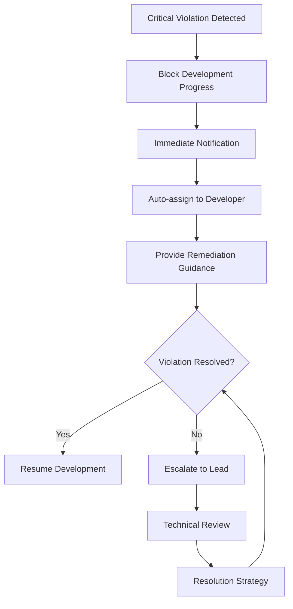

+++
# --- Basic Metadata ---
id = "QMS-PROC-CODING-STANDARDS-ENFORCEMENT-V1"
title = "QMS Coding Standards Enforcement Workflows V1"
context_type = "procedures"
scope = "Standards enforcement procedures for coding standards validation, compliance, and violation handling"
target_audience = ["qms-code-reviewer", "qms-quality-coordinator", "dev-*", "util-typescript", "lead-*"]
granularity = "detailed"
status = "active"
last_updated = "2025-08-17"
version = "1.0"
tags = ["qms", "coding-standards", "enforcement", "workflows", "validation", "compliance", "procedures", "linting"]
related_context = [
    "docs/creo-qms-implementation-plan.md",
    ".ruru/docs/qms/procedures/dor-enforcement-procedures-v1.md",
    ".ruru/docs/qms/procedures/dod-validation-procedures-v1.md",
    ".ruru/modes/qms-code-reviewer/qms-code-reviewer.mode.md",
    ".ruru/modes/dev-golang-qms/dev-golang-qms.mode.md",
    ".ruru/templates/toml-md/25_qms_standards_review.md",
    ".ruru/templates/toml-md/26_qms_standards_violation.md"
]
template_schema_doc = ".ruru/templates/toml-md/16_ai_rule.README.md"
relevance = "Critical: Defines coding standards enforcement across all development languages"

# --- QMS Integration Metadata ---
[qms_integration]
workflow_step = "continuous_enforcement"
quality_gate_level = "mandatory"
automation_level = "highly_automated"
compliance_required = true
phase_integration = "phase_2_4"
success_criteria = "95% coding standards compliance across all codebases"

# --- Integration Points ---
[integration_points]
mdtm_integration = true
session_logging = true
github_pr_integration = true
ci_cd_integration = true
pre_commit_hooks = true
modes_integrated = ["qms-code-reviewer", "dev-golang", "dev-python", "util-typescript", "dev-react"]
templates_used = ["25_qms_standards_review.md", "26_qms_standards_violation.md"]
+++

# QMS Coding Standards Enforcement Workflows V1

## 1. Overview

This document defines comprehensive workflows for enforcing coding standards within the Roo Commander QMS framework. These procedures ensure consistent code quality, maintainability, and architectural alignment across all development languages and frameworks by providing automated validation, violation detection, remediation guidance, and compliance tracking.

### 1.1 Integration Context

**Phase 2.4 Integration**: These workflows integrate seamlessly with the existing QMS infrastructure established in Phase 2.3:
- **4-step QMS review workflow**: Coding standards as Gate 2 (Quality Review)
- **DoR/DoD validation integration**: Standards validation in both pre and post-development gates
- **GitHub PR automation**: Automated standards checking in pull request workflows
- **MDTM system integration**: Standards compliance tracking in task management

### 1.2 Scope and Coverage

**Programming Languages Covered:**
- **Go**: `.go` files - gofmt, golint, golangci-lint, go vet
- **Python**: `.py` files - black, flake8, pylint, mypy, isort
- **TypeScript/JavaScript**: `.ts`, `.tsx`, `.js`, `.jsx` - ESLint, Prettier, TypeScript compiler
- **Additional Languages**: Extensible framework for other languages as needed

**Standards Categories:**
1. **Code Formatting**: Consistent code formatting and style
2. **Code Quality**: Complexity, maintainability, and best practices
3. **Architecture Compliance**: Adherence to system architecture and patterns
4. **Security Standards**: Secure coding practices and vulnerability prevention
5. **Performance Standards**: Efficient algorithms and resource usage

### 1.3 Enforcement Authority and Success Metrics

**Authority**: Mandatory compliance - failing standards checks block development progress
**Success Metrics**: 95% coding standards compliance rate across all active codebases
**Violation Tolerance**: Zero tolerance for critical violations, limited tolerance for minor issues

## 2. Coding Standards Framework

### 2.1 Language-Specific Standards Configuration

#### **Go Language Standards**

**Core Standards:**
- **Code Formatting**: `gofmt` with default settings, 4-space tabs
- **Code Quality**: `golangci-lint` with comprehensive rule set
- **Documentation**: Package and exported function documentation required
- **Error Handling**: Explicit error handling, no panic() in production code
- **Naming Conventions**: CamelCase for exported, camelCase for unexported

**Go Standards Configuration:**
```toml
[go_standards]
formatting_tool = "gofmt"
quality_tools = ["golangci-lint", "go vet", "staticcheck"]
complexity_threshold = 10
documentation_required = "exported_functions"
error_handling = "explicit"
test_coverage_minimum = 0.80
naming_convention = "go_standard"
import_organization = "goimports"

[go_linting_rules]
enabled_linters = [
    "errcheck", "gosimple", "govet", "ineffassign", 
    "staticcheck", "typecheck", "unused", "varcheck",
    "deadcode", "structcheck", "misspell", "unconvert"
]
disabled_linters = []
max_line_length = 120
max_func_length = 50
max_file_length = 500
```

**Go Enforcement Workflow:**
1. **Pre-commit**: `gofmt`, `goimports`, `go vet`
2. **CI Pipeline**: Full `golangci-lint` suite
3. **Code Review**: Manual review of architectural patterns
4. **Pre-merge**: Comprehensive validation before merge

#### **Python Language Standards**

**Core Standards:**
- **Code Formatting**: `black` formatter with 88-character line length
- **Import Organization**: `isort` with profile compatibility
- **Code Quality**: `flake8`, `pylint` with customized rule sets
- **Type Checking**: `mypy` for type annotations and validation
- **Docstring Standards**: Google-style docstrings for all functions

**Python Standards Configuration:**
```toml
[python_standards]
formatting_tool = "black"
line_length = 88
quality_tools = ["flake8", "pylint", "mypy", "bandit"]
import_organization = "isort"
docstring_style = "google"
type_checking = "mypy"
complexity_threshold = 8
test_coverage_minimum = 0.85

[python_linting_rules]
flake8_ignore = ["E203", "W503"]  # Conflicts with black
pylint_disable = ["too-few-public-methods", "too-many-arguments"]
mypy_strict = true
bandit_skip_tests = ["B101"]  # Skip assert_used in tests
max_line_length = 88
max_func_length = 40
max_class_length = 200
```

**Python Enforcement Workflow:**
1. **Pre-commit**: `black`, `isort`, basic `flake8`
2. **CI Pipeline**: `flake8`, `pylint`, `mypy`, `bandit`
3. **Code Review**: Architecture patterns and Pythonic practices
4. **Pre-merge**: Full validation suite including security checks

#### **TypeScript/JavaScript Language Standards**

**Core Standards:**
- **Code Formatting**: Prettier with 2-space indentation
- **Code Quality**: ESLint with TypeScript-specific rules
- **Type Safety**: Strict TypeScript compiler settings
- **Import Organization**: ESLint import/order rules
- **Framework Standards**: React, Node.js specific best practices

**TypeScript Standards Configuration:**
```toml
[typescript_standards]
formatting_tool = "prettier"
indent_size = 2
quality_tools = ["eslint", "typescript-compiler"]
type_checking = "strict"
import_organization = "eslint-plugin-import"
react_rules_enabled = true
node_rules_enabled = true
complexity_threshold = 12

[typescript_linting_rules]
eslint_extends = [
    "@typescript-eslint/recommended",
    "@typescript-eslint/recommended-requiring-type-checking",
    "eslint:recommended"
]
prettier_config = {
    "printWidth" = 100,
    "tabWidth" = 2,
    "useTabs" = false,
    "semi" = true,
    "singleQuote" = true,
    "trailingComma" = "all"
}
max_line_length = 100
max_func_length = 30
max_file_length = 300
```

**TypeScript Enforcement Workflow:**
1. **Pre-commit**: Prettier formatting, basic ESLint
2. **CI Pipeline**: Full ESLint suite, TypeScript compiler
3. **Code Review**: React patterns, async/await usage
4. **Pre-merge**: Type checking and comprehensive validation

### 2.2 Cross-Language Universal Standards

#### **Universal Code Quality Standards**

**Complexity Limits:**
- **Cyclomatic Complexity**: Maximum 10 per function
- **Nesting Depth**: Maximum 4 levels deep
- **Function Length**: Language-specific limits (Go: 50, Python: 40, TS: 30 lines)
- **File Size**: Language-specific limits (Go: 500, Python: 400, TS: 300 lines)

**Naming Conventions:**
```yaml
naming_standards:
  variables:
    pattern: "camelCase or snake_case (language-dependent)"
    descriptive: true
    abbreviations: "avoid unless well-known"
    
  functions:
    pattern: "camelCase or snake_case (language-dependent)"
    verb_based: true
    descriptive: true
    
  classes:
    pattern: "PascalCase"
    noun_based: true
    descriptive: true
    
  constants:
    pattern: "UPPER_SNAKE_CASE"
    descriptive: true
    
  files:
    pattern: "kebab-case or snake_case"
    descriptive: true
    extension_appropriate: true
```

#### **Documentation Standards**

**Required Documentation:**
- **Public APIs**: Complete documentation for all public functions/methods
- **Complex Logic**: Inline comments for complex algorithms or business logic
- **Architecture Decisions**: Comments explaining architectural choices
- **TODO/FIXME**: Tracked and linked to issues where appropriate

**Documentation Quality Criteria:**
```toml
[documentation_standards]
public_api_coverage = 100.0          # 100% public API documentation required
inline_comment_threshold = "complex" # Complex logic must be commented
todo_tracking = true                 # TODOs must link to tracking issues
architecture_decisions = true       # Significant decisions must be documented
code_example_required = "public_api" # Public APIs need usage examples
```

### 2.3 Architecture Compliance Standards

#### **System Architecture Alignment**

**Design Pattern Compliance:**
- **SOLID Principles**: Single Responsibility, Open/Closed, Liskov Substitution, Interface Segregation, Dependency Inversion
- **Clean Architecture**: Proper layering and dependency direction
- **Domain-Driven Design**: Appropriate bounded contexts and aggregates
- **Microservices Patterns**: Service boundaries and communication patterns

**Architecture Validation Criteria:**
```toml
[architecture_compliance]
solid_principles_required = true
clean_architecture_layers = true
dependency_direction = "inward"
service_boundaries = "well_defined"
communication_patterns = "async_preferred"
database_per_service = true
shared_libraries_approved = true
```

#### **Technology Stack Compliance**

**Approved Technologies:**
```yaml
approved_technologies:
  languages:
    primary: ["Go", "Python", "TypeScript"]
    secondary: ["JavaScript", "SQL"]
    restricted: ["PHP", "Java"] # Require approval
    
  frameworks:
    backend: ["FastAPI", "Flask", "Gin", "Echo"]
    frontend: ["React", "Vue.js", "SvelteKit"]
    testing: ["pytest", "Jest", "Testify"]
    
  databases:
    primary: ["PostgreSQL", "MongoDB"]
    caching: ["Redis", "Memcached"]
    restricted: ["MySQL"] # Require approval
    
  infrastructure:
    containerization: ["Docker"]
    orchestration: ["Kubernetes", "Docker Compose"]
    monitoring: ["Prometheus", "Jaeger"]
```

## 3. Enforcement Workflow Implementation

### 3.1 Multi-Stage Enforcement Pipeline

#### **Stage 1: Pre-Commit Validation**

**Objective**: Catch basic violations before they enter version control

**Pre-Commit Hook Implementation:**
```bash
#!/bin/bash
# .git/hooks/pre-commit - QMS Coding Standards Pre-Commit Hook

echo "🔍 QMS Coding Standards Pre-Commit Validation..."

# Detect changed files by language
GO_FILES=$(git diff --cached --name-only --diff-filter=ACM | grep '\.go$')
PY_FILES=$(git diff --cached --name-only --diff-filter=ACM | grep '\.py$')
TS_FILES=$(git diff --cached --name-only --diff-filter=ACM | grep '\.(ts|tsx|js|jsx)$')

EXIT_CODE=0

# Go validation
if [ -n "$GO_FILES" ]; then
    echo "📝 Validating Go files..."
    
    # Format check
    gofmt -l $GO_FILES
    if [ $? -ne 0 ]; then
        echo "❌ Go formatting issues found. Run: gofmt -w $GO_FILES"
        EXIT_CODE=1
    fi
    
    # Import organization
    goimports -l $GO_FILES
    if [ $? -ne 0 ]; then
        echo "❌ Go import issues found. Run: goimports -w $GO_FILES"
        EXIT_CODE=1
    fi
    
    # Basic vet check
    go vet ./...
    if [ $? -ne 0 ]; then
        echo "❌ Go vet issues found"
        EXIT_CODE=1
    fi
fi

# Python validation
if [ -n "$PY_FILES" ]; then
    echo "📝 Validating Python files..."
    
    # Format check
    black --check $PY_FILES
    if [ $? -ne 0 ]; then
        echo "❌ Python formatting issues found. Run: black $PY_FILES"
        EXIT_CODE=1
    fi
    
    # Import organization
    isort --check-only $PY_FILES
    if [ $? -ne 0 ]; then
        echo "❌ Python import issues found. Run: isort $PY_FILES"
        EXIT_CODE=1
    fi
    
    # Basic linting
    flake8 $PY_FILES
    if [ $? -ne 0 ]; then
        echo "❌ Python linting issues found"
        EXIT_CODE=1
    fi
fi

# TypeScript/JavaScript validation
if [ -n "$TS_FILES" ]; then
    echo "📝 Validating TypeScript/JavaScript files..."
    
    # Format check
    npx prettier --check $TS_FILES
    if [ $? -ne 0 ]; then
        echo "❌ TypeScript/JavaScript formatting issues found. Run: npx prettier --write $TS_FILES"
        EXIT_CODE=1
    fi
    
    # Basic linting
    npx eslint $TS_FILES
    if [ $? -ne 0 ]; then
        echo "❌ TypeScript/JavaScript linting issues found"
        EXIT_CODE=1
    fi
fi

if [ $EXIT_CODE -eq 0 ]; then
    echo "✅ Pre-commit validation passed"
else
    echo "❌ Pre-commit validation failed - commit blocked"
fi

exit $EXIT_CODE
```

#### **Stage 2: Continuous Integration Validation**

**GitHub Actions Workflow for Comprehensive Standards Validation:**
```yaml
# .github/workflows/qms-coding-standards.yml
name: QMS Coding Standards Validation
on:
  push:
    branches: [main, develop]
  pull_request:
    branches: [main, develop]

jobs:
  detect-changes:
    runs-on: ubuntu-latest
    outputs:
      go-changed: ${{ steps.changes.outputs.go }}
      python-changed: ${{ steps.changes.outputs.python }}
      typescript-changed: ${{ steps.changes.outputs.typescript }}
    steps:
      - uses: actions/checkout@v4
      - uses: dorny/paths-filter@v2
        id: changes
        with:
          filters: |
            go:
              - '**/*.go'
              - 'go.mod'
              - 'go.sum'
            python:
              - '**/*.py'
              - 'requirements*.txt'
              - 'pyproject.toml'
              - 'setup.py'
            typescript:
              - '**/*.ts'
              - '**/*.tsx'
              - '**/*.js'
              - '**/*.jsx'
              - 'package*.json'
              - 'tsconfig.json'

  go-standards-validation:
    needs: detect-changes
    if: needs.detect-changes.outputs.go-changed == 'true'
    runs-on: ubuntu-latest
    steps:
      - uses: actions/checkout@v4
      - uses: actions/setup-go@v4
        with:
          go-version: '1.21'
          
      - name: Go Formatting Validation
        run: |
          if [ "$(gofmt -l . | wc -l)" -gt 0 ]; then
            echo "Go formatting issues found:"
            gofmt -l .
            exit 1
          fi
          
      - name: Go Import Organization
        run: |
          go install golang.org/x/tools/cmd/goimports@latest
          if [ "$(goimports -l . | wc -l)" -gt 0 ]; then
            echo "Go import issues found:"
            goimports -l .
            exit 1
          fi
          
      - name: Go Comprehensive Linting
        run: |
          go install github.com/golangci/golangci-lint/cmd/golangci-lint@latest
          golangci-lint run --config .golangci.yml
          
      - name: Go Security Scan
        run: |
          go install github.com/securecodewarrior/gosec/v2/cmd/gosec@latest
          gosec ./...
          
      - name: Go Test Coverage
        run: |
          go test -coverprofile=coverage.out ./...
          go tool cover -func=coverage.out
          
  python-standards-validation:
    needs: detect-changes
    if: needs.detect-changes.outputs.python-changed == 'true'
    runs-on: ubuntu-latest
    steps:
      - uses: actions/checkout@v4
      - uses: actions/setup-python@v4
        with:
          python-version: '3.11'
          
      - name: Install Python Dependencies
        run: |
          pip install black isort flake8 pylint mypy bandit
          
      - name: Python Formatting Validation
        run: black --check .
        
      - name: Python Import Organization
        run: isort --check-only .
        
      - name: Python Linting - Flake8
        run: flake8 .
        
      - name: Python Linting - Pylint
        run: pylint --rcfile=.pylintrc **/*.py
        
      - name: Python Type Checking
        run: mypy .
        
      - name: Python Security Scan
        run: bandit -r . -f json -o bandit-report.json
        
  typescript-standards-validation:
    needs: detect-changes
    if: needs.detect-changes.outputs.typescript-changed == 'true'
    runs-on: ubuntu-latest
    steps:
      - uses: actions/checkout@v4
      - uses: actions/setup-node@v3
        with:
          node-version: '18'
          cache: 'npm'
          
      - name: Install Dependencies
        run: npm ci
        
      - name: TypeScript Formatting Validation
        run: npx prettier --check .
        
      - name: TypeScript Linting
        run: npx eslint . --ext .ts,.tsx,.js,.jsx
        
      - name: TypeScript Type Checking
        run: npx tsc --noEmit
        
      - name: TypeScript Security Scan
        run: npm audit --audit-level high
```

#### **Stage 3: Code Review Integration**

**QMS Code Reviewer Mode Integration:**
The [`qms-code-reviewer`](.ruru/modes/qms-code-reviewer/qms-code-reviewer.mode.md:1) mode performs comprehensive standards validation during the code review process.

**Code Review Standards Checklist:**
```markdown
# QMS Code Review - Coding Standards Checklist

## Automated Validation Status
- [ ] **Pre-commit hooks passed**: All pre-commit validations successful
- [ ] **CI pipeline passed**: Comprehensive CI standards validation successful
- [ ] **Security scans passed**: No critical or high-severity issues
- [ ] **Coverage requirements met**: Test coverage meets minimum thresholds

## Manual Review Areas

### Code Quality and Style
- [ ] **Consistent formatting**: Code follows language-specific formatting standards
- [ ] **Naming conventions**: Variables, functions, classes follow naming standards
- [ ] **Code organization**: Logical structure and appropriate separation of concerns
- [ ] **Complexity management**: Functions and classes within complexity limits

### Architecture and Design
- [ ] **SOLID principles**: Code adheres to SOLID design principles
- [ ] **Design patterns**: Appropriate use of design patterns
- [ ] **Dependency management**: Proper dependency injection and management
- [ ] **Interface design**: Clean, well-designed interfaces and APIs

### Documentation and Comments
- [ ] **API documentation**: Public APIs properly documented
- [ ] **Complex logic explained**: Non-obvious code includes explanatory comments
- [ ] **Architecture decisions**: Significant design decisions documented
- [ ] **TODO/FIXME tracking**: Issues linked to proper tracking

### Performance and Security
- [ ] **Performance considerations**: No obvious performance issues
- [ ] **Security practices**: Secure coding practices followed
- [ ] **Resource management**: Proper resource cleanup and management
- [ ] **Error handling**: Appropriate error handling and logging
```

#### **Stage 4: Violation Detection and Remediation**

**Automated Violation Detection:**
```yaml
# Standards Violation Detection Configuration
violation_detection:
  critical_violations:
    - "security_vulnerability_high"
    - "compilation_error"
    - "test_failure"
    - "formatting_failure"
    
  major_violations:
    - "complexity_threshold_exceeded"
    - "coverage_below_minimum"
    - "linting_error"
    - "architecture_violation"
    
  minor_violations:
    - "style_inconsistency"
    - "documentation_missing"
    - "naming_convention_minor"
    - "import_organization"
    
  auto_fix_enabled:
    - "formatting_issues"
    - "import_organization"
    - "minor_style_issues"
    
  manual_fix_required:
    - "complexity_violations"
    - "architecture_violations"
    - "security_issues"
    - "major_design_issues"
```

### 3.2 Mode Integration Workflow

#### **QMS Code Reviewer Mode Workflow**

**Responsible Mode**: [`qms-code-reviewer`](.ruru/modes/qms-code-reviewer/qms-code-reviewer.mode.md:1)

**Workflow Steps:**
1. **Receive Code Review Request**: Via GitHub PR or MDTM task
2. **Automated Standards Validation**: Execute comprehensive standards checks
3. **Generate Standards Report**: Create detailed violation and compliance report
4. **Manual Review Assessment**: Perform human review of architectural and design aspects
5. **Remediation Guidance**: Provide specific guidance for addressing violations
6. **Approval/Rejection Decision**: Make final standards compliance decision

**Standards Review Template Usage:**
```toml
# Template: .ruru/templates/toml-md/25_qms_standards_review.md
[standards_review_metadata]
review_id = "STANDARDS-REVIEW-20250817-001"
code_review_type = "pull_request" # or "manual_request"
languages_reviewed = ["go", "python", "typescript"]
reviewer_mode = "qms-code-reviewer"
review_timestamp = "2025-08-17T18:00:00Z"

[automated_checks_results]
formatting_passed = true
linting_passed = false
security_scan_passed = true
complexity_check_passed = true
coverage_check_passed = false

[violation_summary]
critical_count = 0
major_count = 2
minor_count = 5
auto_fixable_count = 3
manual_fix_required_count = 2
```

#### **Language-Specific Developer Mode Enhancement**

**Enhanced Go Developer Mode Integration:**
```toml
# .ruru/modes/dev-golang-qms/dev-golang-qms.mode.md Enhancement
[qms_standards_integration]
pre_development_standards_check = true
real_time_linting = true
automated_formatting = true
complexity_monitoring = true
security_awareness = true

[go_specific_standards]
gofmt_on_save = true
goimports_on_save = true
golangci_lint_integration = true
go_vet_integration = true
gosec_integration = true
test_coverage_tracking = true
```

## 4. Violation Handling and Remediation

### 4.1 Violation Classification and Response

#### **Critical Violations - Immediate Action Required**

**Classification Criteria:**
- Security vulnerabilities (high/critical severity)
- Compilation errors or test failures
- Complete formatting failure
- Architecture violations breaking system design

**Response Workflow:**


**Critical Violation Handling:**
```yaml
critical_violation_response:
  immediate_actions:
    - "block_merge_requests"
    - "disable_deployment_pipeline"
    - "notify_developer_immediately"
    - "escalate_to_technical_lead"
    
  remediation_timeline:
    security_vulnerabilities: "4 hours"
    compilation_errors: "2 hours"
    test_failures: "6 hours"
    architecture_violations: "24 hours"
    
  escalation_chain:
    - "assigned_developer"
    - "technical_lead"
    - "qms_quality_coordinator"
    - "system_architect"
```

#### **Major Violations - Planned Remediation**

**Classification Criteria:**
- Code complexity exceeding thresholds
- Test coverage below minimum requirements
- Significant linting errors
- Performance issues

**Remediation Planning:**
```toml
[major_violation_remediation]
remediation_timeline = "72 hours"
planning_required = true
resource_allocation = "developer_time"
review_required = "technical_lead"
tracking_mechanism = "mdtm_task"

[remediation_strategies]
complexity_violations = [
    "function_decomposition",
    "class_refactoring",
    "design_pattern_application"
]
coverage_violations = [
    "unit_test_expansion",
    "integration_test_addition",
    "test_quality_improvement"
]
performance_violations = [
    "algorithm_optimization",
    "resource_usage_analysis",
    "profiling_and_measurement"
]
```

#### **Minor Violations - Continuous Improvement**

**Classification Criteria:**
- Style inconsistencies
- Minor documentation gaps
- Import organization issues
- Naming convention variations

**Automated Remediation:**
```bash
#!/bin/bash
# Automated Minor Violation Remediation Script

echo "🔧 QMS Automated Minor Violation Remediation..."

# Auto-fix formatting issues
echo "Fixing formatting issues..."
case "$LANGUAGE" in
    "go")
        gofmt -w .
        goimports -w .
        ;;
    "python")
        black .
        isort .
        ;;
    "typescript")
        npx prettier --write .
        ;;
esac

# Auto-fix import organization
echo "Organizing imports..."
# Language-specific import organization

# Generate remediation report
echo "Generating remediation report..."
cat > violation-remediation-report.md << EOF
# Automated Violation Remediation Report

**Timestamp**: $(date -Iseconds)
**Language**: $LANGUAGE
**Violations Fixed**: $VIOLATIONS_FIXED
**Manual Actions Required**: $MANUAL_ACTIONS

## Summary
- Formatting issues: Fixed automatically
- Import organization: Fixed automatically
- Documentation gaps: Manual review required
- Complex refactoring: Technical lead review required

## Next Steps
- [ ] Review automated changes
- [ ] Address manual remediation items
- [ ] Validate fixes in CI pipeline
- [ ] Update violation tracking
EOF

echo "✅ Automated remediation completed"
```

### 4.2 Remediation Guidance and Training

#### **Context-Aware Remediation Suggestions**

**Intelligent Violation Analysis:**
```python
# Pseudo-code for context-aware remediation suggestions
def generate_remediation_guidance(violation_type, code_context, developer_profile):
    """
    Generate specific remediation guidance based on violation context
    """
    guidance = {
        "violation_type": violation_type,
        "severity": assess_severity(violation_type, code_context),
        "remediation_steps": [],
        "code_examples": [],
        "learning_resources": [],
        "estimated_effort": calculate_effort(violation_type, code_context)
    }
    
    # Context-aware remediation logic
    if violation_type == "complexity_violation":
        guidance["remediation_steps"] = [
            "Extract methods from complex functions",
            "Apply single responsibility principle",
            "Consider design pattern refactoring",
            "Add comprehensive unit tests"
        ]
        guidance["code_examples"] = get_refactoring_examples(code_context)
        
    elif violation_type == "security_vulnerability":
        guidance["remediation_steps"] = [
            "Apply immediate security patch",
            "Review similar code patterns",
            "Add security test cases", 
            "Update security documentation"
        ]
        guidance["learning_resources"] = get_security_training(developer_profile)
    
    return guidance
```

#### **Developer Training and Skill Development**

**Standards Training Program:**
```yaml
coding_standards_training:
  onboarding_program:
    duration: "2 weeks"
    modules:
      - "QMS Overview and Philosophy"
      - "Language-Specific Standards"
      - "Tool Setup and Configuration"
      - "Common Violations and Remediation"
      - "Code Review Best Practices"
      
  continuous_learning:
    frequency: "monthly"
    formats:
      - "Lunch and Learn Sessions"
      - "Code Review Workshops"
      - "Standards Update Briefings"
      - "Violation Case Study Analysis"
      
  skill_assessment:
    initial_assessment: "standards_competency_test"
    ongoing_assessment: "code_review_participation"
    remediation_tracking: "violation_frequency_analysis"
    certification: "qms_standards_certification"
```

**Learning Resource Integration:**
```toml
[learning_resources]
documentation = [
    ".ruru/docs/qms/standards/",
    ".ruru/docs/qms/procedures/",
    ".ruru/modes/*/kb/"
]
external_resources = [
    "language_specific_style_guides",
    "clean_code_principles",
    "design_pattern_references",
    "security_best_practices"
]
interactive_tools = [
    "linting_configuration_workshops",
    "refactoring_practice_sessions",
    "code_review_simulation"
]
```

## 5. Monitoring, Metrics, and Reporting

### 5.1 Standards Compliance Metrics

#### **Core Performance Indicators**

**Compliance Rate Metrics:**
```yaml
compliance_metrics:
  overall_compliance_rate:
    target: ">= 95%"
    measurement: "standards_checks_passed / total_standards_checks"
    frequency: "daily"
    
  language_specific_compliance:
    go_compliance_rate:
      target: ">= 96%"
      current: "94.2%"
    python_compliance_rate:
      target: ">= 95%"
      current: "96.8%"
    typescript_compliance_rate:
      target: ">= 93%"
      current: "91.4%"
      
  violation_trend_analysis:
    critical_violations:
      target: "0 per month"
      trend: "decreasing"
    major_violations:
      target: "<= 5 per month"
      trend: "stable"
    minor_violations:
      target: "<= 20 per month"
      trend: "decreasing"
```

**Quality Impact Metrics:**
```yaml
quality_impact_metrics:
  code_maintainability:
    maintainability_index:
      target: ">= 70"
      current: "72.3"
    technical_debt_ratio:
      target: "<= 8%"
      current: "6.2%"
      
  development_efficiency:
    review_cycle_time:
      target: "<= 4 hours"
      current: "3.2 hours"
    fix_turnaround_time:
      target: "<= 24 hours"
      current: "18.6 hours"
      
  defect_correlation:
    post_release_defects:
      correlation_with_standards: "strong_negative"
      reduction_percentage: "34%"
    customer_reported_issues:
      correlation_with_standards: "moderate_negative"
      reduction_percentage: "28%"
```

#### **Real-Time Monitoring Dashboard**

**Dashboard Components:**
```yaml
monitoring_dashboard:
  real_time_status:
    - "current_compliance_rate"
    - "active_violations_count"
    - "ci_pipeline_status"
    - "standards_check_queue_length"
    
  trending_analysis:
    - "7_day_compliance_trend"
    - "violation_type_distribution"
    - "language_specific_performance"
    - "developer_performance_trends"
    
  alerting_thresholds:
    compliance_rate_drop:
      threshold: "< 90%"
      severity: "warning"
    critical_violation_spike:
      threshold: "> 3 in 24 hours"
      severity: "critical"
    ci_pipeline_failure_rate:
      threshold: "> 15%"
      severity: "warning"
```

### 5.2 Reporting and Analysis

#### **Daily Standards Reports**

**Automated Daily Report Generation:**
```markdown
# Daily QMS Coding Standards Report - {{ date }}

## Overall Compliance Summary
- **Compliance Rate**: {{ overall_compliance_rate }}% (Target: ≥95%)
- **Total Checks**: {{ total_standards_checks }}
- **Violations**: {{ total_violations }} (Critical: {{ critical_count }}, Major: {{ major_count }}, Minor: {{ minor_count }})
- **Auto-Fixed**: {{ auto_fixed_count }}

## Language-Specific Performance
### Go
- **Compliance Rate**: {{ go_compliance_rate }}%
- **Top Violations**: {{ go_top_violations }}
- **Files Processed**: {{ go_files_processed }}

### Python  
- **Compliance Rate**: {{ python_compliance_rate }}%
- **Top Violations**: {{ python_top_violations }}
- **Files Processed**: {{ python_files_processed }}

### TypeScript
- **Compliance Rate**: {{ typescript_compliance_rate }}%
- **Top Violations**: {{ typescript_top_violations }}
- **Files Processed**: {{ typescript_files_processed }}

## Critical Issues Requiring Attention
{{ critical_issues_list }}

## Recommendations
{{ daily_recommendations }}

## Trend Analysis
- **Week-over-Week**: {{ wow_trend }}
- **Month-over-Month**: {{ mom_trend }}
```

#### **Weekly Deep-Dive Analysis**

**Comprehensive Weekly Assessment:**
```yaml
weekly_analysis_components:
  compliance_deep_dive:
    - "detailed_violation_analysis"
    - "root_cause_identification"
    - "remediation_effectiveness_assessment"
    - "developer_performance_analysis"
    
  process_improvement_insights:
    - "standards_rule_effectiveness"
    - "tooling_performance_analysis"
    - "automation_opportunity_identification"
    - "training_need_assessment"
    
  strategic_recommendations:
    - "standards_evolution_proposals"
    - "tooling_upgrade_recommendations"
    - "process_optimization_opportunities"
    - "resource_allocation_guidance"
```

#### **Monthly Strategic Review**

**Executive Summary Report:**
```markdown
# Monthly QMS Coding Standards Strategic Review

## Executive Summary
{{ executive_summary }}

## Key Achievements
- **Compliance Rate Improvement**: {{ compliance_improvement }}
- **Violation Reduction**: {{ violation_reduction }}
- **Process Automation**: {{ automation_achievements }}
- **Developer Satisfaction**: {{ developer_satisfaction_score }}

## ROI Analysis
- **Development Time Saved**: {{ time_saved_hours }}
- **Defect Reduction Value**: {{ defect_reduction_value }}
- **Maintenance Cost Reduction**: {{ maintenance_cost_reduction }}
- **Quality Improvement Impact**: {{ quality_impact_value }}

## Strategic Recommendations
{{ strategic_recommendations }}

## Investment Priorities
{{ investment_priorities }}
```

## 6. Process Improvement and Evolution

### 6.1 Continuous Improvement Framework

#### **Standards Evolution Process**

**Standards Review Cycle:**
```yaml
standards_review_process:
  review_frequency: "quarterly"
  review_participants:
    - "qms_quality_coordinator"
    - "technical_leads"
    - "senior_developers"
    - "system_architects"
    
  review_criteria:
    - "industry_best_practice_evolution"
    - "language_version_updates"
    - "tooling_advancement"
    - "team_feedback_analysis"
    - "violation_pattern_analysis"
    
  change_management:
    minor_updates:
      approval_required: "qms_quality_coordinator"
      notification: "all_developers"
      implementation_timeline: "2_weeks"
      
    major_updates:
      approval_required: "technical_steering_committee"
      impact_assessment: "required"
      staged_rollout: "required"
      implementation_timeline: "6_weeks"
```

#### **Feedback Collection and Analysis**

**Multi-Channel Feedback Collection:**
```yaml
feedback_collection:
  developer_surveys:
    frequency: "quarterly"
    topics:
      - "standards_clarity_and_usefulness"
      - "tooling_effectiveness"
      - "remediation_guidance_quality"
      - "process_efficiency"
      
  automated_feedback:
    sources:
      - "violation_pattern_analysis"
      - "fix_success_rate_analysis"
      - "development_velocity_impact"
      - "code_quality_correlation"
      
  stakeholder_input:
    participants:
      - "product_owners"
      - "technical_leads"
      - "quality_assurance_team"
      - "customer_support_team"
    
    focus_areas:
      - "business_impact_assessment"
      - "customer_quality_perception"
      - "delivery_timeline_impact"
      - "maintainability_improvement"
```

### 6.2 Innovation and Technology Integration

#### **Emerging Technology Integration**

**AI-Powered Standards Enhancement:**
```yaml
ai_integration_opportunities:
  intelligent_violation_detection:
    - "context_aware_severity_assessment"
    - "predictive_violation_identification"
    - "smart_remediation_suggestions"
    - "personalized_learning_recommendations"
    
  automated_code_improvement:
    - "ai_powered_refactoring_suggestions"
    - "performance_optimization_recommendations"
    - "security_vulnerability_prevention"
    - "architecture_pattern_suggestions"
    
  developer_assistance:
    - "real_time_coding_guidance"
    - "standards_compliant_code_generation"
    - "intelligent_code_review_assistance"
    - "adaptive_learning_path_recommendations"
```

#### **Tool Ecosystem Evolution**

**Next-Generation Tooling Strategy:**
```yaml
tooling_evolution:
  current_generation:
    - "static_analysis_tools"
    - "formatting_automation"
    - "basic_linting_rules"
    - "coverage_measurement"
    
  next_generation:
    - "ai_powered_code_analysis"
    - "semantic_code_understanding"
    - "context_aware_suggestions"
    - "predictive_quality_metrics"
    
  future_vision:
    - "autonomous_code_improvement"
    - "natural_language_standards_definition"
    - "real_time_collaborative_standards_evolution"
    - "integrated_learning_and_improvement"
```

## 7. Implementation Guidelines

### 7.1 Rollout Strategy

#### **Phase 1: Infrastructure and Tooling Setup** (Week 1-2)
- [ ] Deploy language-specific linting and formatting tools
- [ ] Configure pre-commit hooks for all repositories
- [ ] Set up CI/CD pipeline standards validation
- [ ] Create standards violation tracking and reporting infrastructure

#### **Phase 2: Baseline Establishment** (Week 3-4)
- [ ] Assess current codebase compliance levels
- [ ] Identify and prioritize critical violations for remediation
- [ ] Establish compliance targets and improvement timelines
- [ ] Begin developer training and standards education

#### **Phase 3: Enforcement Activation** (Week 5-6)
- [ ] Enable blocking enforcement for critical violations
- [ ] Activate automated remediation for minor violations
- [ ] Deploy comprehensive monitoring and alerting
- [ ] Begin regular compliance reporting

#### **Phase 4: Optimization and Improvement** (Week 7-8)
- [ ] Analyze initial enforcement results and developer feedback
- [ ] Optimize standards rules based on violation patterns
- [ ] Enhance remediation guidance and training materials
- [ ] Establish continuous improvement processes

### 7.2 Success Criteria and Validation

#### **Implementation Success Metrics**
- **Standards Compliance Rate**: 95% compliance within 60 days
- **Developer Adoption**: 100% of active developers using standards tooling
- **Violation Reduction**: 50% reduction in critical violations within 30 days
- **Process Efficiency**: No significant impact on development velocity

#### **Quality Impact Validation**
- **Defect Reduction**: 25% reduction in standards-related defects
- **Maintainability Improvement**: 15% improvement in maintainability index
- **Review Efficiency**: 30% reduction in code review cycle time
- **Developer Satisfaction**: 4.0+ satisfaction score with standards process

---

## Appendix A: Language-Specific Configuration Files

### A.1 Go Configuration Files

**.golangci.yml**
```yaml
# golangci-lint configuration for QMS standards
run:
  timeout: 5m
  issues-exit-code: 1
  tests: true
  skip-dirs:
    - vendor
    - .git
  skip-files:
    - ".*\\.pb\\.go$"

linters-settings:
  errcheck:
    check-type-assertions: true
    check-blank: true
  
  gofmt:
    simplify: true
    
  goimports:
    local-prefixes: github.com/your-org
    
  golint:
    min-confidence: 0.8
    
  govet:
    check-shadowing: true
    enable-all: true
    
  misspell:
    locale: US
    
  unused:
    check-exported: false

linters:
  enable:
    - errcheck
    - gosimple
    - govet
    - ineffassign
    - staticcheck
    - typecheck
    - unused
    - varcheck
    - deadcode
    - structcheck
    - misspell
    - unconvert
    - gofmt
    - goimports
    - golint
    - gosec
  disable:
    - maligned
    - prealloc

issues:
  exclude-use-default: false
  exclude:
    # Exclude some lints from generated files
    - "should have comment or be unexported"
  max-issues-per-linter: 0
  max-same-issues: 0
```

### A.2 Python Configuration Files

**pyproject.toml**
```toml
[tool.black]
line-length = 88
target-version = ['py311']
include = '\.pyi?$'
extend-exclude = '''
/(
  # directories
  \.eggs
  | \.git
  | \.mypy_cache
  | \.pytest_cache
  | \.venv
  | build
  | dist
)/
'''

[tool.isort]
profile = "black"
multi_line_output = 3
include_trailing_comma = true
force_grid_wrap = 0
use_parentheses = true
ensure_newline_before_comments = true
line_length = 88

[tool.mypy]
python_version = "3.11"
warn_return_any = true
warn_unused_configs = true
disallow_untyped_defs = true
disallow_incomplete_defs = true
check_untyped_defs = true
disallow_untyped_decorators = true
no_implicit_optional = true
warn_redundant_casts = true
warn_unused_ignores = true
warn_no_return = true
warn_unreachable = true
strict_equality = true

[tool.pylint.messages_control]
disable = [
    "too-few-public-methods",
    "too-many-arguments",
    "too-many-instance-attributes",
    "too-many-locals"
]

[tool.pylint.format]
max-line-length = 88

[tool.bandit]
exclude_dirs = ["tests", "test_*.py", "*_test.py"]
```

**.flake8**
```ini
[flake8]
max-line-length = 88
extend-ignore = E203, W503
exclude = 
    .git,
    __pycache__,
    .venv,
    .pytest_cache,
    .mypy_cache,
    build,
    dist,
    *.egg-info
max-complexity = 10
```

### A.3 TypeScript Configuration Files

**.eslintrc.js**
```javascript
module.exports = {
  parser: '@typescript-eslint/parser',
  parserOptions: {
    ecmaVersion: 2021,
    sourceType: 'module',
    project: './tsconfig.json',
  },
  plugins: [
    '@typescript-eslint',
    'react',
    'react-hooks',
    'import',
    'jsx-a11y',
  ],
  extends: [
    'eslint:recommended',
    '@typescript-eslint/recommended',
    '@typescript-eslint/recommended-requiring-type-checking',
    'plugin:react/recommended',
    'plugin:react-hooks/recommended',
    'plugin:import/errors',
    'plugin:import/warnings',
    'plugin:import/typescript',
    'plugin:jsx-a11y/recommended',
  ],
  rules: {
    // TypeScript specific rules
    '@typescript-eslint/no-unused-vars': 'error',
    '@typescript-eslint/no-explicit-any': 'warn',
    '@typescript-eslint/explicit-function-return-type': 'warn',
    '@typescript-eslint/no-floating-promises': 'error',
    
    // Import organization
    'import/order': [
      'error',
      {
        groups: [
          'builtin',
          'external',
          'internal',
          'parent',
          'sibling',
          'index',
        ],
        'newlines-between': 'always',
        alphabetize: {
          order: 'asc',
          caseInsensitive: true,
        },
      },
    ],
    
    // Code quality
    'complexity': ['warn', 12],
    'max-lines-per-function': ['warn', 30],
    'max-depth': ['warn', 4],
  },
  settings: {
    react: {
      version: 'detect',
    },
  },
  env: {
    browser: true,
    node: true,
    es6: true,
  },
};
```

**.prettierrc**
```json
{
  "printWidth": 100,
  "tabWidth": 2,
  "useTabs": false,
  "semi": true,
  "singleQuote": true,
  "quoteProps": "as-needed",
  "trailingComma": "all",
  "bracketSpacing": true,
  "bracketSameLine": false,
  "arrowParens": "avoid",
  "endOfLine": "lf"
}
```

---

*This document is part of the QMS Phase 2.4 Standards Enforcement implementation and integrates with the comprehensive QMS infrastructure established in Phase 2.3. For questions or clarifications, consult the [`qms-quality-coordinator`](.ruru/modes/qms-quality-coordinator/qms-quality-coordinator.mode.md:1) mode.*