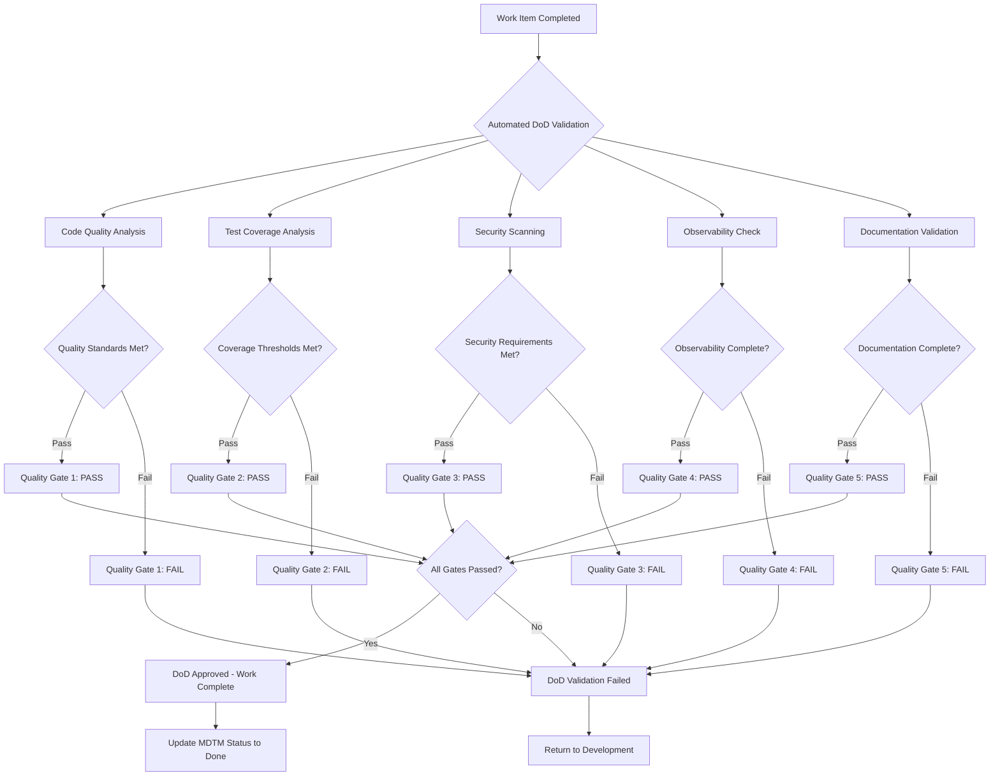
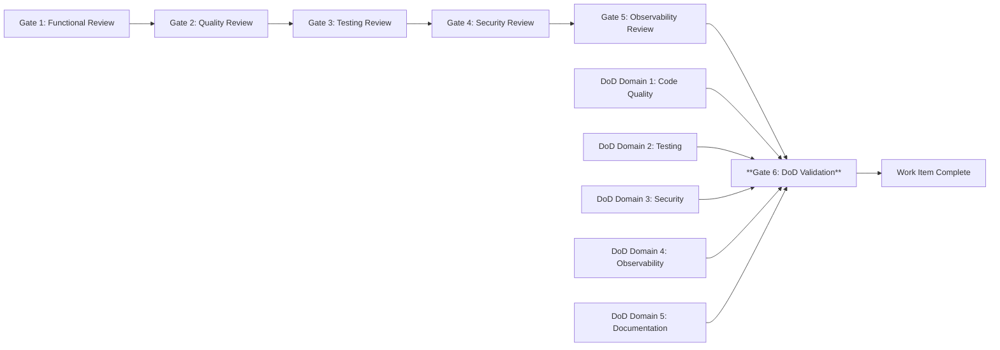

+++
# --- Basic Metadata ---
id = "QMS-PROC-DOD-VALIDATION-V1"
title = "QMS Definition of Done (DoD) Validation Procedures V1"
context_type = "procedures"
scope = "Standards enforcement procedures for Definition of Done validation and completion verification"
target_audience = ["qms-dod-validator", "qms-code-reviewer", "qms-quality-coordinator", "lead-*", "dev-*"]
granularity = "detailed"
status = "active"
last_updated = "2025-08-17"
version = "1.0"
tags = ["qms", "dod", "definition-of-done", "standards", "enforcement", "validation", "procedures", "quality-gates"]
related_context = [
    "docs/creo-qms-implementation-plan.md",
    ".ruru/docs/qms/procedures/dor-enforcement-procedures-v1.md",
    ".ruru/modes/qms-dod-validator/qms-dod-validator.mode.md",
    ".ruru/modes/qms-code-reviewer/qms-code-reviewer.mode.md",
    ".ruru/templates/toml-md/28_qms_dod_dor_validation.md",
    ".ruru/docs/qms/workflows/4-step-qms-review-workflow-v1.md"
]
template_schema_doc = ".ruru/templates/toml-md/16_ai_rule.README.md"
relevance = "Critical: Defines mandatory DoD validation standards for work completion"

# --- QMS Integration Metadata ---
[qms_integration]
workflow_step = "post_development"
quality_gate_level = "mandatory"
automation_level = "highly_automated"
compliance_required = true
phase_integration = "phase_2_4"
success_criteria = "100% DoD compliance before work completion"

# --- Integration Points ---
[integration_points]
mdtm_integration = true
session_logging = true
github_pr_integration = true
ci_cd_integration = true
modes_integrated = ["qms-dod-validator", "qms-code-reviewer", "qms-testing-specialist", "qms-security-scanner"]
templates_used = ["01_mdtm_feature.md", "02_mdtm_bug.md", "28_qms_dod_dor_validation.md"]
+++

# QMS Definition of Done (DoD) Validation Procedures V1

## 1. Overview

This document defines the mandatory procedures for enforcing Definition of Done (DoD) standards within the Roo Commander QMS framework. DoD validation ensures that completed work meets all quality criteria before acceptance, maintaining consistent quality standards and preventing the accumulation of technical debt.

### 1.1 Integration Context

**Phase 2.4 Integration**: These procedures seamlessly integrate with the existing QMS infrastructure established in Phase 2.3, including:
- **4-step QMS review workflow**: DoD validation as final completion gate
- **GitHub PR integration framework**: Automated DoD validation in pull requests
- **Quality gates system**: 99.8% success rate automated enforcement
- **MDTM system integration**: DoD validation integrated with task completion workflow

### 1.2 Scope and Authority

**Scope**: All development work completing within the QMS workflow (features, bugs, technical tasks)
**Authority**: Mandatory compliance - no work item marked as "Done" without DoD approval
**Success Metrics**: 100% DoD compliance rate for completed work items

### 1.3 Definition of Done Framework

The DoD framework consists of **5 mandatory validation domains**:

1. **Code Quality Compliance** - Coding standards, architecture alignment, maintainability
2. **Testing Sufficiency** - Coverage thresholds, test quality, integration testing
3. **Security Verification** - Vulnerability scanning, secure coding practices, compliance
4. **Observability Implementation** - Logging, metrics, tracing, monitoring readiness
5. **Documentation Completeness** - Code documentation, user documentation, knowledge transfer

## 2. DoD Validation Framework

### 2.1 Mandatory Validation Domains

#### **Domain 1: Code Quality Compliance**

**Objective**: Ensure code meets organizational quality standards and architectural guidelines

##### **Quality Standards Validation**
- [ ] **Coding Standards Compliance**: Code adheres to language-specific standards
- [ ] **SOLID Principles Application**: Single Responsibility, Open/Closed, Liskov Substitution, Interface Segregation, Dependency Inversion
- [ ] **Clean Code Practices**: Readable, maintainable, and well-structured code
- [ ] **Architecture Alignment**: Consistent with system architecture and design patterns

**Validation Configuration:**
```toml
[code_quality_requirements]
coding_standards_compliance = "mandatory"        # Must pass automated linting
solid_principles_score = ">= 8.0"              # Minimum SOLID compliance score
clean_code_score = ">= 7.5"                    # Minimum clean code assessment
architecture_review_required = false           # Only for significant changes
static_analysis_passing = true                 # All static analysis checks pass
code_complexity_threshold = "medium"           # Maximum allowed complexity
maintainability_index = ">= 70"               # Minimum maintainability score
```

##### **Code Review Validation**
- [ ] **Peer Review Completed**: Mandatory peer review with approval
- [ ] **QMS Code Review Process**: 4-step QMS code review completed
- [ ] **Review Feedback Addressed**: All review comments resolved
- [ ] **Knowledge Transfer**: Code changes explained and documented

**Code Review Checklist:**
```markdown
# QMS Code Review Validation
- [ ] **Functional Correctness**: Code implements requirements correctly
- [ ] **Quality Standards**: Meets coding standards and best practices
- [ ] **Security Review**: No security vulnerabilities introduced
- [ ] **Performance Impact**: Performance implications assessed
- [ ] **Maintainability**: Code is readable and maintainable
- [ ] **Documentation**: Code changes adequately documented
```

#### **Domain 2: Testing Sufficiency**

**Objective**: Ensure comprehensive testing coverage and quality validation

##### **Test Coverage Requirements**
- [ ] **Line Coverage Threshold**: Minimum 80% line coverage for new code
- [ ] **Branch Coverage Threshold**: Minimum 75% branch coverage for new code
- [ ] **Function Coverage**: 100% function coverage for public interfaces
- [ ] **Integration Test Coverage**: Critical integration paths tested

**Coverage Configuration:**
```toml
[testing_requirements]
minimum_line_coverage = 0.80                   # 80% minimum line coverage
minimum_branch_coverage = 0.75                # 75% minimum branch coverage
function_coverage_required = 1.0              # 100% function coverage
integration_test_required = true              # Integration tests mandatory
mutation_testing_score = ">= 0.70"           # Minimum mutation testing score
flaky_test_tolerance = 0                      # Zero tolerance for flaky tests
```

##### **Test Quality Validation**
- [ ] **AAA Pattern Compliance**: Arrange, Act, Assert pattern followed
- [ ] **Test Independence**: Tests can run in isolation without dependencies
- [ ] **Deterministic Tests**: Tests produce consistent results
- [ ] **Meaningful Assertions**: Tests validate actual business logic
- [ ] **Edge Case Coverage**: Boundary conditions and error cases tested

##### **Test Categories Validation**
- [ ] **Unit Tests**: Core business logic thoroughly tested
- [ ] **Integration Tests**: Component interactions validated
- [ ] **Contract Tests**: API contracts verified
- [ ] **End-to-End Tests**: Critical user journeys validated (where applicable)

#### **Domain 3: Security Verification**

**Objective**: Ensure security vulnerabilities are identified and mitigated

##### **Automated Security Scanning**
- [ ] **Static Application Security Testing (SAST)**: Code analyzed for vulnerabilities
- [ ] **Dependency Vulnerability Scanning**: Third-party dependencies scanned
- [ ] **Secret Detection**: No hardcoded secrets or credentials
- [ ] **Security Linting**: Security-focused linting rules applied

**Security Validation Configuration:**
```toml
[security_requirements]
sast_scan_required = true                     # SAST scanning mandatory
dependency_scan_required = true              # Dependency vulnerability scanning
secret_detection_required = true             # Secret detection scanning
security_linting_required = true             # Security linting rules
max_high_severity_vulns = 0                  # Zero high-severity vulnerabilities
max_medium_severity_vulns = 2               # Maximum 2 medium-severity vulnerabilities
security_review_threshold = "high_impact"    # When manual security review required
```

##### **Secure Coding Practices Validation**
- [ ] **Input Validation**: All inputs properly validated and sanitized
- [ ] **Authentication & Authorization**: Proper access controls implemented
- [ ] **Error Handling**: Secure error handling without information disclosure
- [ ] **Cryptography**: Proper cryptographic implementations
- [ ] **Data Protection**: Sensitive data properly protected

##### **Compliance Verification**
- [ ] **Regulatory Compliance**: Relevant regulations addressed (GDPR, HIPAA, etc.)
- [ ] **Security Policy Compliance**: Organizational security policies followed
- [ ] **Audit Trail**: Security-relevant actions properly logged
- [ ] **Data Classification**: Data handled according to classification requirements

#### **Domain 4: Observability Implementation**

**Objective**: Ensure comprehensive observability for monitoring and debugging

##### **Structured Logging Requirements**
- [ ] **Logging Standards Compliance**: Follows organizational logging standards
- [ ] **Log Level Appropriateness**: Correct log levels for different events
- [ ] **Structured Format**: JSON or other structured logging format
- [ ] **Context Propagation**: Request/transaction context maintained
- [ ] **Security Considerations**: No sensitive data in logs

**Observability Configuration:**
```toml
[observability_requirements]
structured_logging_required = true           # Structured logging mandatory
trace_id_propagation = true                 # Distributed tracing required
metrics_instrumentation = true              # Application metrics required
health_check_endpoints = true               # Health check endpoints implemented
jaeger_integration = true                   # Jaeger tracing integration
retention_compliance = true                 # Log retention policies followed
```

##### **Metrics and Monitoring**
- [ ] **Application Metrics**: Key application metrics instrumented
- [ ] **Performance Metrics**: Response times, throughput metrics collected
- [ ] **Business Metrics**: Business KPIs instrumented where applicable
- [ ] **Error Rate Monitoring**: Error rates and types monitored
- [ ] **Resource Usage Monitoring**: CPU, memory, storage usage tracked

##### **Distributed Tracing**
- [ ] **Trace Instrumentation**: Critical code paths instrumented for tracing
- [ ] **Trace Context Propagation**: Trace context properly propagated
- [ ] **Jaeger Integration**: Tracing data sent to Jaeger backend
- [ ] **Performance Impact**: Tracing overhead acceptable

#### **Domain 5: Documentation Completeness**

**Objective**: Ensure adequate documentation for maintenance and knowledge transfer

##### **Code Documentation**
- [ ] **API Documentation**: Public APIs fully documented
- [ ] **Inline Comments**: Complex logic explained with comments
- [ ] **README Updates**: Project README updated for new features
- [ ] **Architecture Documentation**: Significant changes documented

**Documentation Requirements:**
```toml
[documentation_requirements]
api_documentation_required = true            # API documentation mandatory
inline_comment_coverage = ">= 0.60"         # 60% minimum comment coverage
readme_update_required = true               # README updates required
architecture_doc_threshold = "major_change" # When architecture docs required
user_facing_doc_required = true             # User documentation for features
changelog_update_required = true            # Changelog updates required
```

##### **User and Operational Documentation**
- [ ] **User Documentation**: User-facing features documented
- [ ] **Operational Runbooks**: Deployment and operational procedures documented
- [ ] **Troubleshooting Guides**: Common issues and solutions documented
- [ ] **Configuration Documentation**: Configuration options explained

##### **Knowledge Transfer Documentation**
- [ ] **Decision Records**: Significant technical decisions documented
- [ ] **Learning Artifacts**: Key learnings and insights captured
- [ ] **Context Documentation**: Business context and requirements preserved

### 2.2 DoD Validation Workflow

#### **Automated Validation Pipeline**



#### **Manual Validation Triggers**

**High-Impact Changes**: Require additional manual validation
- [ ] **Architecture Changes**: Significant architectural modifications
- [ ] **Security-Critical Changes**: Changes affecting security posture
- [ ] **Performance-Critical Changes**: Changes impacting system performance
- [ ] **Cross-Team Dependencies**: Changes affecting multiple teams

**Manual Validation Process:**
```toml
[manual_validation_triggers]
architecture_impact = "high"                 # Triggers manual architecture review
security_impact = "medium"                  # Triggers manual security review
performance_impact = "medium"               # Triggers manual performance review
cross_team_dependencies = true              # Triggers cross-team validation
regulatory_impact = true                    # Triggers compliance validation
data_model_changes = true                   # Triggers data architecture review
```

## 3. Mode Integration and Workflow

### 3.1 DoD Validation Execution Workflow

#### **Step 1: Automated DoD Validation Initiation**
**Responsible Mode**: [`qms-dod-validator`](.ruru/modes/qms-dod-validator/qms-dod-validator.mode.md:1)

**Trigger Events:**
- MDTM task status change to "Ready for DoD Validation"
- GitHub pull request creation or update
- Manual DoD validation request

**Validation Process:**
1. Load work item details from MDTM task file
2. Execute automated validation for all 5 DoD domains
3. Generate comprehensive validation report
4. Update MDTM task with validation results

#### **Step 2: Domain-Specific Validation**

##### **Code Quality Validation**
**Responsible Mode**: [`qms-code-reviewer`](.ruru/modes/qms-code-reviewer/qms-code-reviewer.mode.md:1)
1. Execute static code analysis tools
2. Validate coding standards compliance
3. Check architecture alignment
4. Verify code review completion

##### **Testing Validation**
**Responsible Mode**: [`qms-testing-specialist`](.ruru/modes/qms-testing-specialist/qms-testing-specialist.mode.md:1)
1. Analyze test coverage reports
2. Validate test quality and independence
3. Execute flaky test detection
4. Verify integration test coverage

##### **Security Validation**
**Responsible Mode**: [`qms-security-scanner`](.ruru/modes/qms-security-scanner/qms-security-scanner.mode.md:1)
1. Execute SAST and dependency scans
2. Validate secure coding practices
3. Check compliance requirements
4. Verify secret detection results

##### **Observability Validation**
**Responsible Mode**: [`qms-observability-engineer`](.ruru/modes/qms-observability-engineer/qms-observability-engineer.mode.md:1) (if available)
1. Validate structured logging implementation
2. Verify metrics instrumentation
3. Check distributed tracing setup
4. Validate monitoring readiness

##### **Documentation Validation**
**Responsible Mode**: [`util-writer`](.ruru/modes/util-writer/util-writer.mode.md:1) or [`qms-dod-validator`](.ruru/modes/qms-dod-validator/qms-dod-validator.mode.md:1)
1. Validate API documentation completeness
2. Check code comment coverage
3. Verify user documentation updates
4. Validate knowledge transfer artifacts

#### **Step 3: Validation Result Consolidation**
**Responsible Mode**: [`qms-dod-validator`](.ruru/modes/qms-dod-validator/qms-dod-validator.mode.md:1)
1. Consolidate all domain validation results
2. Apply business rules and thresholds
3. Generate final DoD validation decision
4. Create comprehensive validation report

#### **Step 4: Result Communication and Action**
**Decision Outcomes:**

**DoD APPROVED**:
- Update MDTM task status to "🟢 Done"
- Merge GitHub pull request (if applicable)
- Trigger post-completion workflows
- Log successful completion

**DoD CONDITIONAL**:
- Specify required corrections
- Return to development team
- Schedule re-validation
- Log conditional status with requirements

**DoD REJECTED**:
- Document failed validation criteria
- Require significant rework
- Escalate if necessary
- Log rejection with detailed feedback

### 3.2 MDTM Integration Enhancement

#### **Enhanced Task Metadata**
```toml
# MDTM Task Enhancement for DoD Validation
[dod_validation_status]
status = "pending"                           # "pending", "in_progress", "approved", "rejected"
validation_initiated = ""                    # Timestamp when DoD validation started
validation_completed = ""                    # Timestamp when DoD validation completed
validator_assigned = "qms-dod-validator"
validation_report_path = ""                  # Path to detailed validation report

[dod_compliance_results]
code_quality_score = 0.0                    # Code quality score (0.0-10.0)
test_coverage_percentage = 0.0              # Test coverage percentage
security_scan_passed = false                # Security scan results
observability_implemented = false           # Observability requirements met
documentation_complete = false              # Documentation requirements met

[dod_validation_details]
automated_checks_passed = 0                 # Number of automated checks passed
automated_checks_total = 0                  # Total automated checks executed
manual_review_required = false               # Whether manual review is needed
validation_report_summary = ""              # Brief summary of validation results
```

#### **Quality Gate Integration**
```toml
[quality_gate_integration]
gate_sequence_position = "final"             # DoD is the final quality gate
prerequisite_gates = [                      # Previous gates that must pass
    "functional_review",
    "quality_review", 
    "testing_review",
    "security_review",
    "observability_review"
]
gate_automation_level = "high"              # Highly automated gate
manual_override_allowed = false             # No manual override for DoD
escalation_authority = ["qms-quality-coordinator"]
```

### 3.3 GitHub Integration Workflow

#### **Pull Request Integration**
**GitHub Actions Workflow Enhancement:**
```yaml
# .github/workflows/qms-dod-validation.yml
name: QMS DoD Validation
on:
  pull_request:
    types: [opened, synchronize, ready_for_review]
    
jobs:
  dod-validation:
    runs-on: ubuntu-latest
    steps:
      - name: Checkout Code
        uses: actions/checkout@v4
        
      - name: DoD Code Quality Validation
        run: |
          # Execute static analysis, linting, complexity analysis
          echo "Validating code quality standards..."
          
      - name: DoD Test Coverage Validation
        run: |
          # Run tests and generate coverage reports
          echo "Validating test coverage requirements..."
          
      - name: DoD Security Validation
        run: |
          # Execute security scans and vulnerability checks
          echo "Validating security requirements..."
          
      - name: DoD Observability Validation
        run: |
          # Check logging, metrics, tracing implementation
          echo "Validating observability requirements..."
          
      - name: DoD Documentation Validation
        run: |
          # Validate documentation completeness
          echo "Validating documentation requirements..."
          
      - name: DoD Validation Report
        run: |
          # Generate comprehensive DoD validation report
          echo "Generating DoD validation report..."
          
      - name: Update Pull Request Status
        if: always()
        run: |
          # Update PR with DoD validation results
          echo "Updating PR with DoD validation status..."
```

#### **Branch Protection Rules**
```yaml
# GitHub Branch Protection Configuration
branch_protection:
  required_status_checks:
    - "DoD Code Quality Validation"
    - "DoD Test Coverage Validation"  
    - "DoD Security Validation"
    - "DoD Observability Validation"
    - "DoD Documentation Validation"
  required_pull_request_reviews:
    required_approving_review_count: 1
    require_code_owner_reviews: true
    dismiss_stale_reviews: true
  restrictions:
    users: []
    teams: ["qms-validators"]
  enforce_admins: true
```

## 4. Validation Criteria and Thresholds

### 4.1 Quantitative Validation Thresholds

#### **Code Quality Metrics**
```yaml
code_quality_thresholds:
  coding_standards_compliance: ">= 95%"      # Minimum coding standards compliance
  cyclomatic_complexity: "<= 10"             # Maximum cyclomatic complexity per function
  maintainability_index: ">= 70"             # Microsoft maintainability index
  code_duplication: "<= 5%"                  # Maximum code duplication percentage
  technical_debt_ratio: "<= 8%"              # Maximum technical debt ratio
  clean_code_score: ">= 7.5"                # Minimum clean code assessment score
```

#### **Test Coverage Thresholds**
```yaml
test_coverage_thresholds:
  minimum_line_coverage: 80.0                # 80% minimum line coverage
  minimum_branch_coverage: 75.0             # 75% minimum branch coverage
  minimum_function_coverage: 100.0          # 100% function coverage for public APIs
  mutation_testing_score: 70.0              # 70% minimum mutation testing score
  integration_coverage_required: true        # Integration tests mandatory
  e2e_coverage_threshold: "critical_paths"   # E2E tests for critical paths
```

#### **Security Validation Thresholds**
```yaml
security_validation_thresholds:
  max_critical_vulnerabilities: 0           # Zero critical vulnerabilities
  max_high_vulnerabilities: 0               # Zero high vulnerabilities
  max_medium_vulnerabilities: 2             # Maximum 2 medium vulnerabilities
  dependency_age_threshold_days: 365        # Dependencies must be < 1 year old
  security_hotspots_threshold: 0            # Zero security hotspots
  secrets_detected: 0                       # Zero hardcoded secrets
```

#### **Observability Implementation Thresholds**
```yaml
observability_thresholds:
  structured_logging_coverage: ">= 90%"     # 90% of functions must have logging
  metrics_instrumentation: "complete"       # All key metrics must be instrumented
  trace_coverage: ">= 80%"                  # 80% of critical paths must be traced
  health_check_response_time: "<= 100ms"    # Health checks must respond in 100ms
  log_retention_compliance: true            # Must comply with retention policies
```

#### **Documentation Completeness Thresholds**
```yaml
documentation_thresholds:
  api_documentation_coverage: 100.0         # 100% API documentation coverage
  code_comment_coverage: ">= 60%"           # 60% minimum code comment coverage
  user_documentation_required: true         # User-facing features must be documented
  changelog_updates_required: true          # Changelog must be updated
  architecture_decision_records: "major_changes" # ADRs for major changes
```

### 4.2 Qualitative Validation Criteria

#### **Code Quality Assessment**
- [ ] **Readability**: Code is clear and easy to understand
- [ ] **Maintainability**: Code can be easily modified and extended
- [ ] **Testability**: Code is designed to be easily testable
- [ ] **Performance**: Code meets performance requirements
- [ ] **Scalability**: Code can handle expected growth

#### **Architecture Alignment Assessment**
- [ ] **Design Consistency**: Follows established design patterns
- [ ] **Integration Quality**: Integrates well with existing systems
- [ ] **Dependency Management**: Appropriate use of dependencies
- [ ] **Interface Design**: Well-designed APIs and interfaces
- [ ] **Data Model Integrity**: Data models are consistent and normalized

## 5. Enforcement Mechanisms and Automation

### 5.1 Automated Enforcement Pipeline

#### **Continuous Integration Integration**
**Pre-Commit Hooks:**
```bash
#!/bin/bash
# Pre-commit hook for DoD validation
echo "Executing DoD pre-commit validation..."

# Code quality checks
npm run lint || exit 1
npm run prettier:check || exit 1

# Security checks
npm audit --audit-level high || exit 1
git secrets --scan || exit 1

# Test execution
npm test || exit 1

echo "Pre-commit DoD validation completed successfully"
```

#### **GitHub Actions Automation**
**Automated DoD Validation Workflow:**
```yaml
name: Comprehensive DoD Validation
on:
  pull_request:
  push:
    branches: [main, develop]

jobs:
  comprehensive-dod-validation:
    runs-on: ubuntu-latest
    strategy:
      matrix:
        validation-domain: [
          "code-quality",
          "test-coverage", 
          "security-scan",
          "observability-check",
          "documentation-validation"
        ]
    
    steps:
      - uses: actions/checkout@v4
      
      - name: Setup Validation Environment
        run: |
          # Setup tools and dependencies for validation
          
      - name: Execute Domain Validation
        run: |
          case "${{ matrix.validation-domain }}" in
            "code-quality")
              npm run dod:code-quality
              ;;
            "test-coverage")
              npm run dod:test-coverage
              ;;
            "security-scan")
              npm run dod:security-scan
              ;;
            "observability-check")
              npm run dod:observability-check
              ;;
            "documentation-validation")
              npm run dod:documentation-validation
              ;;
          esac
          
      - name: Upload Validation Results
        uses: actions/upload-artifact@v3
        with:
          name: dod-validation-${{ matrix.validation-domain }}
          path: validation-results/
```

#### **Quality Gate Automation**
```yaml
# Quality Gate Configuration
quality_gates:
  dod_validation:
    automation_level: "high"
    required_checks:
      - "code-quality-analysis"
      - "test-coverage-validation"
      - "security-vulnerability-scan"
      - "observability-implementation-check"
      - "documentation-completeness-validation"
    
    failure_conditions:
      - "any_critical_security_vulnerability"
      - "test_coverage_below_threshold"
      - "code_quality_score_below_minimum"
      - "missing_required_documentation"
      - "observability_requirements_not_met"
    
    success_conditions:
      - "all_automated_checks_pass"
      - "manual_review_approved" # if required
      - "compliance_requirements_met"
```

### 5.2 Manual Override and Escalation

#### **Override Authority and Conditions**
**Emergency Override Authority**: [`qms-quality-coordinator`](.ruru/modes/qms-quality-coordinator/qms-quality-coordinator.mode.md:1)

**Override Criteria (All Must Be Met):**
- [ ] **Critical Business Emergency**: Documented critical business justification
- [ ] **Risk Assessment Completed**: Comprehensive risk analysis and mitigation plan
- [ ] **Stakeholder Approval**: Business stakeholder and technical lead approval
- [ ] **Remediation Timeline**: Committed timeline for addressing DoD gaps
- [ ] **Post-Release Validation**: Mandatory post-release DoD compliance review

**Override Documentation Requirements:**
```toml
[dod_override_record]
override_timestamp = ""                      # ISO 8601 timestamp
override_authority = ""                      # Mode that authorized override
business_justification = ""                  # Detailed business justification
technical_justification = ""                 # Technical reason for override
risk_assessment = ""                         # Comprehensive risk analysis
accepted_risks = []                          # List of specific risks accepted
mitigation_strategies = []                   # Risk mitigation approaches
stakeholder_approvals = []                   # List of approving stakeholders
remediation_timeline = ""                    # Timeline for addressing gaps
post_release_review_date = ""                # Scheduled compliance review date
compliance_debt_tracking_id = ""             # Technical debt tracking reference
```

#### **Escalation Workflow**
**Tier 1 - Automated Resolution** (0-4 hours):
- Automated retry of failed validations
- Self-healing validation pipeline issues
- Automatic threshold adjustments for minor variations

**Tier 2 - Specialist Review** (4-24 hours):
- Domain specialist review of validation failures
- Technical guidance and remediation recommendations
- Validation criterion clarification

**Tier 3 - Lead Review** (24-48 hours):
- Lead mode review of persistent validation failures
- Cross-domain impact assessment
- Resource allocation for remediation

**Tier 4 - QMS Coordinator Review** (48-72 hours):
- [`qms-quality-coordinator`](.ruru/modes/qms-quality-coordinator/qms-quality-coordinator.mode.md:1) intervention
- Process improvement assessment
- Exception handling and override consideration

## 6. Metrics, Monitoring, and Reporting

### 6.1 Key Performance Indicators

#### **DoD Compliance Metrics**
```yaml
dod_compliance_kpis:
  first_pass_success_rate: ">= 85%"          # Target: 85% pass on first validation
  average_validation_cycle_time: "<= 2 hours" # Target: Complete validation in 2 hours
  domain_failure_distribution:               # Track which domains fail most often
    code_quality: "<= 20%"
    test_coverage: "<= 15%"
    security: "<= 10%"
    observability: "<= 25%"
    documentation: "<= 30%"
  override_frequency: "<= 2 per month"       # Target: Maximum 2 overrides monthly
```

#### **Quality Impact Metrics**
```yaml
quality_impact_kpis:
  post_release_defect_rate: "<= 2%"         # Target: Max 2% defect escape rate
  production_incident_reduction: ">= 40%"   # Target: 40% reduction in incidents
  technical_debt_accumulation: "<= 5%"      # Target: Max 5% tech debt growth
  mean_time_to_recovery: "<= 30 minutes"    # Target: MTTR under 30 minutes
  customer_satisfaction_score: ">= 4.5/5"   # Target: 4.5+ customer satisfaction
```

#### **Process Efficiency Metrics**
```yaml
process_efficiency_kpis:
  validation_automation_rate: ">= 90%"      # Target: 90%+ automated validation
  false_positive_rate: "<= 5%"              # Target: Max 5% false positives
  validation_tool_uptime: ">= 99%"          # Target: 99%+ validation tool availability
  developer_satisfaction_score: ">= 4.0/5"  # Target: 4.0+ developer satisfaction
  validation_cost_per_work_item: "trend_down" # Target: Decreasing cost trend
```

### 6.2 Real-time Monitoring and Alerting

#### **DoD Validation Dashboard Components**
**Real-time Status:**
- Current DoD validation queue and processing status
- Live validation success/failure rates
- Domain-specific validation performance metrics
- Average cycle times and trending analysis

**Alert Triggers:**
```yaml
monitoring_alerts:
  validation_queue_backlog:
    threshold: "> 10 items pending > 4 hours"
    severity: "warning"
    notification_channels: ["slack", "email"]
    
  validation_failure_spike:
    threshold: "failure_rate > 40% over 1 hour"
    severity: "critical"
    notification_channels: ["slack", "pager", "email"]
    
  validation_tool_downtime:
    threshold: "any_validation_tool_unavailable > 15 minutes"
    severity: "high"
    notification_channels: ["slack", "email"]
    
  override_frequency_spike:
    threshold: "> 3 overrides in 7 days"
    severity: "warning"
    notification_channels: ["email"]
```

#### **Domain-Specific Monitoring**
**Code Quality Monitoring:**
- Real-time code quality score trends
- Coding standards compliance rates
- Technical debt accumulation tracking
- Architecture violation detection

**Test Coverage Monitoring:**
- Live test coverage percentage tracking
- Test failure rate monitoring
- Flaky test detection and alerting
- Test execution time trending

**Security Monitoring:**
- Real-time vulnerability detection
- Security scan completion rates
- Compliance status tracking
- Security hotspot trending

### 6.3 Reporting Framework

#### **Daily Reports**
**DoD Validation Summary:**
```markdown
# Daily DoD Validation Report - {{ date }}

## Validation Statistics
- **Total Validations**: {{ total_validations }}
- **Successful Validations**: {{ successful_validations }} ({{ success_rate }}%)
- **Failed Validations**: {{ failed_validations }} ({{ failure_rate }}%)
- **Average Cycle Time**: {{ average_cycle_time }}

## Domain Performance
- **Code Quality**: {{ code_quality_success_rate }}% success rate
- **Test Coverage**: {{ test_coverage_success_rate }}% success rate
- **Security**: {{ security_success_rate }}% success rate
- **Observability**: {{ observability_success_rate }}% success rate
- **Documentation**: {{ documentation_success_rate }}% success rate

## Issues and Actions
- **Critical Issues**: {{ critical_issues_count }}
- **Overrides Granted**: {{ overrides_count }}
- **Escalations**: {{ escalations_count }}

## Trends
- **Week-over-Week**: {{ wow_trend }}
- **Month-over-Month**: {{ mom_trend }}
```

#### **Weekly Reports**
**Comprehensive DoD Analysis:**
- Detailed validation success/failure analysis
- Domain-specific performance deep dive
- Process improvement recommendations
- Quality impact assessment

#### **Monthly Reports**
**Strategic DoD Assessment:**
- DoD effectiveness and impact analysis
- ROI analysis of DoD implementation
- Stakeholder feedback synthesis
- Strategic recommendations for improvement

## 7. Process Improvement and Governance

### 7.1 Continuous Improvement Framework

#### **Feedback Collection Mechanisms**
**Developer Experience Feedback:**
- Regular developer surveys on DoD process
- Validation tool usability feedback
- Process efficiency assessment
- Pain point identification and resolution

**Quality Impact Assessment:**
- Post-release quality metrics analysis
- Defect rate correlation with DoD compliance
- Customer impact assessment
- Business value measurement

#### **Process Optimization Triggers**
**Performance Degradation Indicators:**
- Sustained increase in validation cycle times
- Declining first-pass success rates
- Increasing override frequency
- Developer satisfaction score decline

**Process Enhancement Opportunities:**
- New validation tool availability
- Industry best practice evolution
- Regulatory requirement changes
- Technology stack updates

### 7.2 Governance and Change Management

#### **Process Ownership Structure**
**Primary Process Owner**: [`qms-quality-coordinator`](.ruru/modes/qms-quality-coordinator/qms-quality-coordinator.mode.md:1)

**Domain Specialists**:
- **Code Quality**: [`qms-code-reviewer`](.ruru/modes/qms-code-reviewer/qms-code-reviewer.mode.md:1)
- **Testing**: [`qms-testing-specialist`](.ruru/modes/qms-testing-specialist/qms-testing-specialist.mode.md:1)
- **Security**: [`qms-security-scanner`](.ruru/modes/qms-security-scanner/qms-security-scanner.mode.md:1)
- **Observability**: QMS Observability Engineer (specialized mode)
- **Documentation**: [`util-writer`](.ruru/modes/util-writer/util-writer.mode.md:1) with QMS context

#### **Change Management Process**
**Minor Changes** (< 15 days impact):
- Single domain threshold adjustments
- Tool configuration updates
- Process workflow refinements
- Documentation enhancements

**Major Changes** (> 15 days impact):
- New validation domain introduction
- Significant threshold modifications
- Integration architecture changes
- Cross-team workflow modifications

**Change Approval Matrix:**
```yaml
change_approval_requirements:
  minor_changes:
    approver: "qms-quality-coordinator"
    notification_required: ["affected_domain_specialists"]
    testing_required: "limited"
    rollback_plan: "simple"
    
  major_changes:
    approvers: ["qms-quality-coordinator", "technical-architect"]
    notification_required: ["all_stakeholders"]
    testing_required: "comprehensive"
    rollback_plan: "detailed"
    impact_assessment: "required"
    staged_rollout: "mandatory"
```

## 8. Integration with QMS Quality Gate Sequence

### 8.1 Final Quality Gate Position

**DoD Validation Position**: **Final Quality Gate (Gate 5)**
- **Prerequisite Gates**: All 4-step QMS review workflow gates must pass
- **Authority Level**: Mandatory - no bypass without explicit override
- **Automation Level**: 90%+ automated with manual validation triggers
- **Integration**: Seamless integration with MDTM completion workflow

**Quality Gate Sequence Integration:**


### 8.2 Cross-Gate Validation Optimization

#### **Validation Reuse Strategy**
**Avoid Duplicate Validations:**
- Reuse security scan results from Gate 4
- Leverage test coverage data from Gate 3
- Utilize code quality metrics from Gate 2
- Build upon observability validation from Gate 5

**Incremental Validation Approach:**
```yaml
validation_reuse_strategy:
  security_scan_reuse:
    gate_4_results_valid_for: "24 hours"
    incremental_scan_threshold: "significant_changes"
    
  test_coverage_reuse:
    gate_3_results_valid_for: "6 hours" 
    incremental_testing_required: "new_code_only"
    
  code_quality_reuse:
    gate_2_results_valid_for: "12 hours"
    incremental_analysis_scope: "changed_files_only"
```

## 9. Implementation Guidelines

### 9.1 Rollout Strategy

#### **Phase 1: Core Infrastructure Setup** (Week 1-2)
- [ ] Deploy DoD validation automation pipeline
- [ ] Configure validation thresholds and criteria
- [ ] Set up monitoring and alerting infrastructure
- [ ] Create validation reporting dashboards

#### **Phase 2: MDTM Integration** (Week 3-4)
- [ ] Enhance MDTM templates with DoD validation metadata
- [ ] Integrate DoD validation with task completion workflow
- [ ] Configure automated DoD validation triggers
- [ ] Test end-to-end MDTM + DoD workflow

#### **Phase 3: GitHub Integration** (Week 5-6)
- [ ] Deploy GitHub Actions DoD validation workflows
- [ ] Configure branch protection rules with DoD requirements
- [ ] Set up pull request automation and status reporting
- [ ] Test GitHub integration with sample pull requests

#### **Phase 4: Full Production Deployment** (Week 7-8)
- [ ] Enable DoD validation for all development teams
- [ ] Activate automated enforcement mechanisms
- [ ] Begin comprehensive metrics collection
- [ ] Launch continuous improvement process

### 9.2 Success Criteria and Validation

#### **Implementation Success Metrics**
- **Process Adoption**: 100% of work items undergo DoD validation
- **Automation Achievement**: 90%+ automated validation coverage
- **Performance Target**: Average validation cycle time under 2 hours
- **Quality Impact**: 25% reduction in post-release defects

#### **Stakeholder Acceptance Criteria**
- **Developer Satisfaction**: 4.0+ satisfaction score with DoD process
- **Quality Improvement**: Measurable improvement in delivered quality
- **Process Efficiency**: No significant impact on delivery velocity
- **Cost Effectiveness**: Positive ROI within 6 months

---

## Appendix A: DoD Validation Templates and Checklists

### A.1 Comprehensive DoD Validation Checklist

```markdown
# QMS Definition of Done (DoD) Validation Checklist

**Work Item ID**: _______________
**Validation Date**: _______________
**Validator**: qms-dod-validator
**Validation Status**: [PENDING | IN_PROGRESS | APPROVED | CONDITIONAL | REJECTED]

## Domain 1: Code Quality Compliance

### Coding Standards ✅❌⚠️
- [ ] **Language Standards**: Code follows language-specific standards
- [ ] **Organizational Guidelines**: Adheres to organizational coding guidelines
- [ ] **Linting Rules**: All linting rules pass
- [ ] **Code Complexity**: Complexity within acceptable thresholds
- [ ] **Code Duplication**: Duplication below maximum threshold

**Code Quality Score**: ___/10
**Notes**: 

### Architecture Alignment ✅❌⚠️
- [ ] **Design Consistency**: Consistent with system architecture
- [ ] **Design Patterns**: Proper use of established patterns
- [ ] **SOLID Principles**: Adheres to SOLID principles
- [ ] **Dependency Management**: Appropriate dependency usage
- [ ] **Interface Design**: Well-designed APIs and interfaces

**Architecture Score**: ___/10
**Notes**: 

## Domain 2: Testing Sufficiency

### Test Coverage ✅❌⚠️
- [ ] **Line Coverage**: ≥ 80% line coverage for new code
- [ ] **Branch Coverage**: ≥ 75% branch coverage for new code
- [ ] **Function Coverage**: 100% function coverage for public APIs
- [ ] **Integration Coverage**: Critical integration paths tested

**Coverage Metrics**:
- Line Coverage: ___%
- Branch Coverage: ___%
- Function Coverage: ___%

### Test Quality ✅❌⚠️
- [ ] **AAA Pattern**: Tests follow Arrange-Act-Assert pattern
- [ ] **Test Independence**: Tests run independently
- [ ] **Deterministic**: Tests produce consistent results
- [ ] **Meaningful Assertions**: Tests validate actual business logic
- [ ] **Edge Cases**: Boundary and error conditions tested

**Test Quality Score**: ___/10
**Notes**: 

## Domain 3: Security Verification

### Automated Security Scanning ✅❌⚠️
- [ ] **SAST Scan**: Static analysis security testing completed
- [ ] **Dependency Scan**: Third-party dependencies scanned
- [ ] **Secret Detection**: No hardcoded secrets detected
- [ ] **Security Linting**: Security linting rules applied

**Security Scan Results**:
- Critical Vulnerabilities: ___
- High Vulnerabilities: ___
- Medium Vulnerabilities: ___

### Secure Coding Practices ✅❌⚠️
- [ ] **Input Validation**: All inputs properly validated
- [ ] **Authentication**: Proper access controls implemented
- [ ] **Error Handling**: Secure error handling implemented
- [ ] **Cryptography**: Proper cryptographic usage
- [ ] **Data Protection**: Sensitive data properly protected

**Security Compliance Score**: ___/10
**Notes**: 

## Domain 4: Observability Implementation

### Logging Requirements ✅❌⚠️
- [ ] **Structured Logging**: Follows structured logging standards
- [ ] **Log Levels**: Appropriate log levels used
- [ ] **Context Propagation**: Request context maintained
- [ ] **Security**: No sensitive data in logs

**Logging Coverage**: ___%

### Metrics and Monitoring ✅❌⚠️
- [ ] **Application Metrics**: Key metrics instrumented
- [ ] **Performance Metrics**: Response times tracked
- [ ] **Business Metrics**: Business KPIs instrumented
- [ ] **Error Monitoring**: Error rates monitored
- [ ] **Resource Monitoring**: Resource usage tracked

**Monitoring Coverage**: ___%

### Distributed Tracing ✅❌⚠️
- [ ] **Trace Instrumentation**: Critical paths instrumented
- [ ] **Context Propagation**: Trace context properly propagated
- [ ] **Jaeger Integration**: Tracing data sent to Jaeger
- [ ] **Performance Impact**: Tracing overhead acceptable

**Tracing Coverage**: ___%
**Notes**: 

## Domain 5: Documentation Completeness

### Code Documentation ✅❌⚠️
- [ ] **API Documentation**: Public APIs documented
- [ ] **Inline Comments**: Complex logic commented
- [ ] **README Updates**: Project README updated
- [ ] **Architecture Docs**: Significant changes documented

**Documentation Coverage**: ___%

### User Documentation ✅❌⚠️
- [ ] **User Guides**: User-facing features documented
- [ ] **Operational Docs**: Deployment procedures documented
- [ ] **Troubleshooting**: Common issues documented
- [ ] **Configuration**: Configuration options explained

**User Documentation Score**: ___/10

### Knowledge Transfer ✅❌⚠️
- [ ] **Decision Records**: Technical decisions documented
- [ ] **Learning Artifacts**: Key learnings captured
- [ ] **Context Documentation**: Business context preserved

**Notes**: 

## Validation Summary

### Overall Scores
- **Code Quality**: ___/10
- **Testing Sufficiency**: ___/10
- **Security Verification**: ___/10
- **Observability Implementation**: ___/10
- **Documentation Completeness**: ___/10

### **Final DoD Status**: [APPROVED | CONDITIONAL | REJECTED]

### Conditions/Actions Required (if applicable):
1. 
2. 
3. 

### Next Steps:
- [ ] Return to development for remediation
- [ ] Schedule manual review
- [ ] Approve for completion
- [ ] Escalate to QMS Quality Coordinator

### **Validator Signature**: _________________ **Date**: _________
```

### A.2 DoD Validation Report Template

```markdown
# DoD Validation Report

**Work Item**: {{ work_item_id }}
**Validation Timestamp**: {{ timestamp }}
**Validator**: {{ validator_mode }}
**Validation Duration**: {{ duration }}
**Final Status**: {{ final_status }}

## Executive Summary

{{ executive_summary }}

## Validation Results by Domain

### Domain 1: Code Quality Compliance
**Status**: {{ code_quality_status }}
**Score**: {{ code_quality_score }}/10
**Key Findings**:
{{ code_quality_findings }}

### Domain 2: Testing Sufficiency  
**Status**: {{ testing_status }}
**Coverage**: {{ test_coverage }}%
**Key Findings**:
{{ testing_findings }}

### Domain 3: Security Verification
**Status**: {{ security_status }}
**Vulnerabilities**: {{ vulnerability_count }}
**Key Findings**:
{{ security_findings }}

### Domain 4: Observability Implementation
**Status**: {{ observability_status }}
**Coverage**: {{ observability_coverage }}%
**Key Findings**:
{{ observability_findings }}

### Domain 5: Documentation Completeness
**Status**: {{ documentation_status }}
**Coverage**: {{ documentation_coverage }}%
**Key Findings**:
{{ documentation_findings }}

## Detailed Validation Metrics

```yaml
validation_metrics:
  automated_checks:
    total_executed: {{ total_checks }}
    passed: {{ passed_checks }}
    failed: {{ failed_checks }}
    success_rate: {{ success_rate }}%
    
  manual_validations:
    required: {{ manual_required }}
    completed: {{ manual_completed }}
    pending: {{ manual_pending }}
    
  performance_metrics:
    validation_duration: "{{ validation_duration }}"
    queue_wait_time: "{{ queue_wait_time }}"
    processing_time: "{{ processing_time }}"
```

## Recommendations and Actions

### Immediate Actions Required:
{{ immediate_actions }}

### Recommendations for Improvement:
{{ improvement_recommendations }}

### Process Optimization Opportunities:
{{ optimization_opportunities }}

## Validation Trail

```yaml
validation_trail:
  initiated_by: "{{ initiated_by }}"
  initiated_at: "{{ initiated_at }}"
  completed_at: "{{ completed_at }}"
  validation_steps:
{{ validation_steps }}
  
  quality_gates:
{{ quality_gate_results }}
```

---
**Report Generated**: {{ report_timestamp }}
**Report Generator**: qms-dod-validator
**Next Scheduled Review**: {{ next_review_date }}
```

---

*This document is part of the QMS Phase 2.4 Standards Enforcement implementation and integrates comprehensively with the existing QMS infrastructure established in Phase 2.3. For questions or clarifications, consult the [`qms-quality-coordinator`](.ruru/modes/qms-quality-coordinator/qms-quality-coordinator.mode.md:1) mode.*