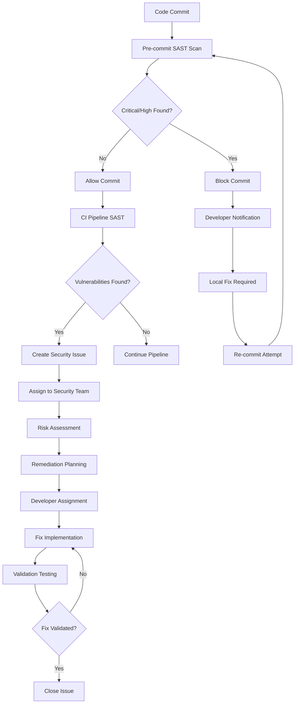
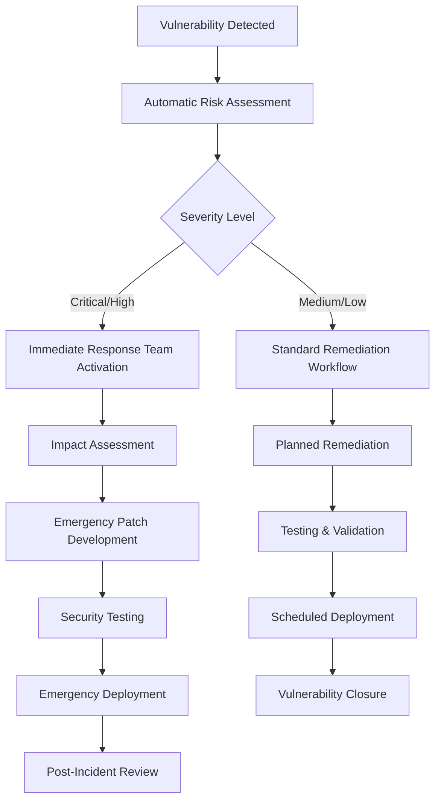

+++
# --- Basic Metadata ---
id = "QMS-PROC-SECURITY-REVIEW-COMPLIANCE-V1"
title = "QMS Security Review and Compliance Procedures V1"
context_type = "procedures"
scope = "Security review procedures for vulnerability management, compliance validation, and threat mitigation"
target_audience = ["qms-security-scanner", "qms-compliance-coordinator", "lead-security", "dev-*", "lead-*"]
granularity = "detailed"
status = "active"
last_updated = "2025-08-17"
version = "1.0"
tags = ["qms", "security", "compliance", "procedures", "vulnerability", "scanning", "review", "threat-mitigation"]
related_context = [
    "docs/creo-qms-implementation-plan.md",
    ".ruru/docs/qms/procedures/dor-enforcement-procedures-v1.md",
    ".ruru/docs/qms/procedures/dod-validation-procedures-v1.md",
    ".ruru/docs/qms/procedures/coding-standards-enforcement-v1.md",
    ".ruru/modes/qms-security-scanner/qms-security-scanner.mode.md",
    ".ruru/modes/qms-compliance-coordinator/qms-compliance-coordinator.mode.md",
    ".ruru/templates/toml-md/30_qms_security_review.md",
    ".ruru/templates/toml-md/29_qms_compliance_audit.md"
]
template_schema_doc = ".ruru/templates/toml-md/16_ai_rule.README.md"
relevance = "Critical: Defines security and compliance validation across all development activities"

# --- QMS Integration Metadata ---
[qms_integration]
workflow_step = "security_validation"
quality_gate_level = "mandatory"
automation_level = "highly_automated"
compliance_required = true
phase_integration = "phase_2_4"
success_criteria = "100% critical vulnerability remediation, 95% compliance validation"

# --- Integration Points ---
[integration_points]
mdtm_integration = true
session_logging = true
github_pr_integration = true
ci_cd_integration = true
automated_scanning = true
modes_integrated = ["qms-security-scanner", "qms-compliance-coordinator", "lead-security", "dev-*"]
templates_used = ["30_qms_security_review.md", "29_qms_compliance_audit.md"]
+++

# QMS Security Review and Compliance Procedures V1

## 1. Overview

This document defines comprehensive security review and compliance procedures within the Roo Commander QMS framework. These procedures ensure robust security validation, vulnerability management, threat mitigation, and regulatory compliance across all development activities by providing automated scanning, risk assessment, remediation workflows, and compliance tracking.

### 1.1 Integration Context

**Phase 2.4 Integration**: These procedures integrate seamlessly with the existing QMS infrastructure established in Phase 2.3:
- **4-step QMS review workflow**: Security review as Gate 3 (Security & Compliance Review)
- **DoR/DoD validation integration**: Security validation in both pre and post-development gates
- **GitHub PR automation**: Automated security scanning in pull request workflows
- **MDTM system integration**: Security compliance tracking in task management

### 1.2 Scope and Coverage

**Security Assessment Areas:**
- **Static Application Security Testing (SAST)**: Source code vulnerability analysis
- **Dynamic Application Security Testing (DAST)**: Runtime vulnerability detection
- **Software Composition Analysis (SCA)**: Third-party dependency vulnerability scanning
- **Infrastructure Security**: Container, cloud, and deployment security validation
- **Data Security**: Data protection, encryption, and privacy compliance

**Compliance Frameworks:**
- **OWASP Top 10**: Web application security risks
- **CIS Controls**: Center for Internet Security benchmarks
- **NIST Cybersecurity Framework**: Risk management and security controls
- **SOC 2**: Service organization control requirements
- **GDPR/CCPA**: Data privacy and protection regulations

### 1.3 Security Authority and Success Metrics

**Authority**: Mandatory security compliance - failing security checks block development progress
**Success Metrics**: 100% critical vulnerability remediation, 95% compliance validation rate
**Risk Tolerance**: Zero tolerance for high/critical vulnerabilities, managed tolerance for medium/low

## 2. Security Assessment Framework

### 2.1 Vulnerability Classification and Risk Matrix

#### **Critical Vulnerabilities (CVSS 9.0-10.0)**

**Classification Criteria:**
- Remote code execution (RCE) vulnerabilities
- SQL injection with data access/modification capability
- Authentication bypass allowing administrative access
- Insecure cryptographic implementations exposing sensitive data
- Directory traversal with system file access

**Risk Impact Assessment:**
```toml
[critical_vulnerability_impact]
business_impact = "severe" # Potential complete system compromise
data_exposure_risk = "high" # Sensitive data compromise likely
compliance_violation = "major" # Significant regulatory violations
reputation_damage = "high" # Severe brand and customer trust impact
financial_impact = "high" # Potential significant financial loss

[critical_response_requirements]
remediation_timeline = "4 hours" # Immediate action required
escalation_level = "executive" # C-level notification required
deployment_blocking = true # All deployments blocked until resolved
emergency_response = true # Security incident response activated
external_notification = "conditional" # Based on data exposure assessment
```

#### **High Vulnerabilities (CVSS 7.0-8.9)**

**Classification Criteria:**
- Cross-site scripting (XSS) with sensitive data access
- Insecure direct object references with privilege escalation
- Security misconfigurations exposing internal systems
- Weak authentication mechanisms allowing unauthorized access
- Insecure data transmission without encryption

**Risk Impact Assessment:**
```toml
[high_vulnerability_impact]
business_impact = "significant" # Major system functionality compromise
data_exposure_risk = "medium_high" # Some sensitive data at risk
compliance_violation = "moderate" # Potential regulatory concerns
reputation_damage = "medium" # Noticeable customer confidence impact
financial_impact = "medium" # Moderate financial exposure

[high_response_requirements]
remediation_timeline = "24 hours" # Urgent action required
escalation_level = "management" # VP/Director notification required
deployment_blocking = "conditional" # Based on exposure assessment
emergency_response = false # Standard security process
external_notification = "assessment_based" # Case-by-case evaluation
```

#### **Medium Vulnerabilities (CVSS 4.0-6.9)**

**Classification Criteria:**
- Information disclosure without sensitive data exposure
- Cross-site request forgery (CSRF) with limited impact
- Insufficient logging and monitoring capabilities
- Weak password policies and session management
- Minor security misconfigurations

**Risk Impact Assessment:**
```toml
[medium_vulnerability_impact]
business_impact = "limited" # Partial functionality or data impact
data_exposure_risk = "low_medium" # Limited sensitive data risk
compliance_violation = "minor" # Minimal regulatory impact
reputation_damage = "low" # Limited customer impact
financial_impact = "low" # Minimal financial exposure

[medium_response_requirements]
remediation_timeline = "72 hours" # Planned remediation required
escalation_level = "technical_lead" # Team lead notification
deployment_blocking = false # Does not block deployments
emergency_response = false # Standard workflow
external_notification = false # Internal handling only
```

#### **Low Vulnerabilities (CVSS 0.1-3.9)**

**Classification Criteria:**
- Informational findings without immediate security impact
- Best practice recommendations and hardening opportunities
- Code quality issues with potential security implications
- Documentation and configuration improvements
- Non-exploitable security findings

**Risk Impact Assessment:**
```toml
[low_vulnerability_impact]
business_impact = "minimal" # No immediate business impact
data_exposure_risk = "negligible" # No sensitive data risk
compliance_violation = "none" # No regulatory concerns
reputation_damage = "none" # No customer impact
financial_impact = "none" # No financial exposure

[low_response_requirements]
remediation_timeline = "30 days" # Planned maintenance window
escalation_level = "developer" # Developer notification only
deployment_blocking = false # Does not block deployments
emergency_response = false # Standard maintenance
external_notification = false # Internal tracking only
```

### 2.2 Security Scanning Technologies and Tools

#### **Static Application Security Testing (SAST)**

**Language-Specific SAST Tools:**
```yaml
sast_tools:
  go_language:
    primary_tools:
      - "gosec" # Go security scanner
      - "staticcheck" # Static analysis with security rules
      - "govulncheck" # Go vulnerability database scanner
    configuration:
      severity_threshold: "medium"
      rule_sets: ["gosec-rules", "cwe-rules", "owasp-rules"]
      scan_paths: ["./..."] # All packages
      exclude_paths: ["vendor/", "test/"]
      
  python_language:
    primary_tools:
      - "bandit" # Python security scanner
      - "safety" # Known vulnerability scanner
      - "semgrep" # Static analysis with security rules
    configuration:
      severity_threshold: "medium"
      rule_sets: ["bandit-rules", "python-security", "django-security"]
      scan_paths: ["**/*.py"]
      exclude_paths: ["tests/", "venv/", "__pycache__/"]
      
  typescript_javascript:
    primary_tools:
      - "eslint-plugin-security" # JavaScript security linting
      - "npm-audit" # NPM vulnerability scanner
      - "retire.js" # JavaScript library vulnerability scanner
    configuration:
      severity_threshold: "medium"
      rule_sets: ["security-rules", "react-security", "node-security"]
      scan_paths: ["src/**/*.{ts,tsx,js,jsx}"]
      exclude_paths: ["node_modules/", "dist/", "build/"]
```

**SAST Integration Workflow:**


#### **Dynamic Application Security Testing (DAST)**

**DAST Tool Configuration:**
```yaml
dast_configuration:
  tools:
    web_applications:
      - "OWASP ZAP" # Dynamic security scanner
      - "Burp Suite Professional" # Commercial security scanner
      - "Nuclei" # Vulnerability scanner with templates
    api_endpoints:
      - "Postman Security Tests" # API security validation
      - "REST Assured Security" # API testing framework
      - "OWASP API Security Testing" # API-specific tests
      
  scan_profiles:
    quick_scan:
      duration: "15_minutes"
      depth: "surface_level"
      coverage: "authentication_and_input_validation"
      
    comprehensive_scan:
      duration: "2_hours"
      depth: "deep_crawl"
      coverage: "full_application_security_assessment"
      
    compliance_scan:
      duration: "4_hours"
      depth: "exhaustive"
      coverage: "regulatory_compliance_validation"
      
  scheduling:
    pre_release: "comprehensive_scan"
    nightly_builds: "quick_scan"
    weekly_maintenance: "compliance_scan"
```

#### **Software Composition Analysis (SCA)**

**Dependency Vulnerability Management:**
```yaml
sca_configuration:
  tools:
    go_dependencies:
      - "govulncheck" # Official Go vulnerability scanner
      - "nancy" # Sonatype dependency scanner
      - "Snyk" # Commercial dependency scanner
      
    python_dependencies:
      - "safety" # Python package vulnerability scanner
      - "pip-audit" # Official Python audit tool
      - "Bandit" # Security linter with dependency checks
      
    nodejs_dependencies:
      - "npm audit" # Official NPM vulnerability scanner
      - "yarn audit" # Yarn dependency scanner
      - "Retire.js" # JavaScript library scanner
      
  vulnerability_databases:
    - "National Vulnerability Database (NVD)"
    - "GitHub Security Advisories"
    - "Sonatype OSS Index"
    - "Snyk Vulnerability Database"
    - "PyUp.io Safety DB"
    
  remediation_strategies:
    critical_high:
      action: "immediate_update_or_replacement"
      timeline: "24_hours"
      fallback: "vendor_patching_or_workaround"
      
    medium:
      action: "planned_update_in_next_sprint"
      timeline: "2_weeks"
      fallback: "risk_acceptance_with_mitigation"
      
    low:
      action: "scheduled_maintenance_update"
      timeline: "monthly_maintenance_window"
      fallback: "documented_risk_acceptance"
```

### 2.3 Infrastructure and Container Security

#### **Container Security Scanning**

**Container Security Framework:**
```yaml
container_security:
  base_image_scanning:
    tools:
      - "Trivy" # Vulnerability scanner for containers
      - "Clair" # Static analysis of container vulnerabilities
      - "Anchore" # Container security and compliance scanner
    policies:
      base_image_sources: "official_or_approved_only"
      vulnerability_threshold: "no_critical_or_high"
      update_frequency: "weekly_base_image_updates"
      
  runtime_security:
    tools:
      - "Falco" # Runtime security monitoring
      - "Sysdig" # Container runtime security
      - "Aqua Security" # Container protection platform
    monitoring:
      suspicious_process_execution: "enabled"
      file_system_changes: "monitored"
      network_anomaly_detection: "enabled"
      
  kubernetes_security:
    tools:
      - "kube-score" # Kubernetes object security analysis
      - "kube-bench" # CIS Kubernetes benchmark
      - "Polaris" # Kubernetes best practices validation
    policies:
      pod_security_standards: "restricted"
      network_policies: "required"
      rbac_enforcement: "strict"
      admission_controllers: "comprehensive"
```

#### **Cloud Infrastructure Security**

**Cloud Security Posture Management:**
```yaml
cloud_security:
  aws_security:
    tools:
      - "AWS Security Hub" # Central security findings
      - "AWS Config" # Configuration compliance
      - "AWS GuardDuty" # Threat detection
    compliance_frameworks:
      - "CIS AWS Foundations Benchmark"
      - "AWS Well-Architected Security Pillar"
      - "NIST Cybersecurity Framework"
      
  gcp_security:
    tools:
      - "Google Security Command Center" # Security findings
      - "Google Cloud Security Scanner" # Web app scanning
      - "Forseti Security" # Configuration monitoring
    compliance_frameworks:
      - "CIS Google Cloud Platform Benchmark"
      - "Google Cloud Security Best Practices"
      - "ISO 27001 Controls"
      
  azure_security:
    tools:
      - "Azure Security Center" # Unified security management
      - "Azure Sentinel" # Security information and event management
      - "Azure Policy" # Compliance and governance
    compliance_frameworks:
      - "CIS Microsoft Azure Benchmark"
      - "Azure Security Benchmark"
      - "Microsoft Cloud Adoption Framework"
```

## 3. Security Review Workflow Implementation

### 3.1 Multi-Stage Security Review Pipeline

#### **Stage 1: Pre-Development Security Review (Gate 0.5)**

**Objective**: Identify security requirements and potential threats during planning

**Pre-Development Security Assessment:**
```toml
[pre_development_security]
threat_modeling_required = true
security_requirements_defined = true
data_classification_completed = true
compliance_requirements_identified = true

[threat_modeling_process]
methodology = "STRIDE" # Spoofing, Tampering, Repudiation, Information Disclosure, DoS, Elevation
tools = ["Microsoft Threat Modeling Tool", "OWASP Threat Dragon"]
participants = ["security_architect", "lead_developer", "product_owner"]
deliverables = ["threat_model_diagram", "security_requirements", "mitigation_strategies"]

[security_requirements_categories]
authentication = "required_for_all_user_interactions"
authorization = "role_based_access_control"
data_protection = "encryption_at_rest_and_in_transit"
input_validation = "comprehensive_server_side_validation"
logging_monitoring = "security_event_logging_required"
```

#### **Stage 2: Development-Time Security Integration**

**Secure Development Practices:**
```yaml
secure_development:
  ide_integration:
    security_plugins:
      - "SonarLint" # Real-time security issue detection
      - "Snyk IDE Plugin" # Vulnerability detection in dependencies
      - "Checkmarx CxSAST" # IDE security scanning
    developer_training:
      - "OWASP Secure Coding Practices"
      - "Language-Specific Security Guidelines"
      - "Threat Modeling for Developers"
      
  code_review_security:
    security_focused_reviews: "mandatory_for_security_critical_code"
    automated_security_checks: "integrated_in_pr_process"
    security_expert_reviews: "required_for_authentication_authorization"
    
  secure_coding_standards:
    input_validation: "whitelist_based_validation_required"
    output_encoding: "context_appropriate_encoding_mandatory"
    authentication: "multi_factor_authentication_preferred"
    session_management: "secure_session_configuration_required"
    cryptography: "approved_algorithms_and_key_management_only"
```

#### **Stage 3: Continuous Integration Security Validation**

**CI/CD Security Pipeline:**
```yaml
# .github/workflows/qms-security-validation.yml
name: QMS Security Validation
on:
  push:
    branches: [main, develop]
  pull_request:
    branches: [main, develop]

jobs:
  security-scan:
    runs-on: ubuntu-latest
    steps:
      - uses: actions/checkout@v4
      
      - name: Setup Security Scanning Tools
        run: |
          # Install security scanners
          go install github.com/securecodewarrior/gosec/v2/cmd/gosec@latest
          python -m pip install bandit safety
          npm install -g retire @npmcli/arborist
          
      - name: Run SAST Scans
        run: |
          echo "🔒 Running Static Application Security Testing..."
          
          # Go security scan
          if find . -name "*.go" -type f | grep -q .; then
            echo "📝 Scanning Go files..."
            gosec -fmt json -out gosec-report.json ./...
            gosec -fmt sarif -out gosec-report.sarif ./...
          fi
          
          # Python security scan
          if find . -name "*.py" -type f | grep -q .; then
            echo "📝 Scanning Python files..."
            bandit -r . -f json -o bandit-report.json
            safety check --json --output safety-report.json
          fi
          
          # JavaScript/TypeScript security scan
          if find . -name "package.json" -type f | grep -q .; then
            echo "📝 Scanning Node.js dependencies..."
            npm audit --json > npm-audit-report.json
            retire --outputformat json --outputpath retire-report.json
          fi
          
      - name: Software Composition Analysis
        run: |
          echo "🔍 Running Software Composition Analysis..."
          
          # Check for known vulnerabilities in dependencies
          if command -v govulncheck &> /dev/null; then
            govulncheck ./...
          fi
          
          # Python dependency check
          if [ -f "requirements.txt" ]; then
            safety check -r requirements.txt
          fi
          
          # Node.js dependency check
          if [ -f "package.json" ]; then
            npm audit --audit-level high
          fi
          
      - name: Container Security Scan
        if: contains(github.event.head_commit.message, '[docker]') || contains(github.event.head_commit.message, '[container]')
        run: |
          echo "🐳 Running Container Security Scan..."
          
          # Install Trivy
          sudo apt-get update
          sudo apt-get install wget apt-transport-https gnupg lsb-release
          wget -qO - https://aquasecurity.github.io/trivy-repo/deb/public.key | sudo apt-key add -
          echo "deb https://aquasecurity.github.io/trivy-repo/deb $(lsb_release -sc) main" | sudo tee -a /etc/apt/sources.list.d/trivy.list
          sudo apt-get update
          sudo apt-get install trivy
          
          # Scan container images if Dockerfile exists
          if [ -f "Dockerfile" ]; then
            docker build -t security-test .
            trivy image --exit-code 1 --severity HIGH,CRITICAL security-test
          fi
          
      - name: Security Report Processing
        run: |
          echo "📊 Processing Security Scan Results..."
          
          # Process and combine security reports
          python - << 'EOF'
          import json
          import os
          from datetime import datetime
          
          # Combine all security findings
          security_findings = {
              "scan_timestamp": datetime.now().isoformat(),
              "repository": os.environ.get("GITHUB_REPOSITORY", "unknown"),
              "commit_sha": os.environ.get("GITHUB_SHA", "unknown"),
              "findings": {
                  "critical": [],
                  "high": [],
                  "medium": [],
                  "low": [],
                  "info": []
              },
              "summary": {
                  "total_findings": 0,
                  "critical_count": 0,
                  "high_count": 0,
                  "medium_count": 0,
                  "low_count": 0,
                  "info_count": 0
              }
          }
          
          # Process GoSec findings
          if os.path.exists("gosec-report.json"):
              with open("gosec-report.json", "r") as f:
                  gosec_data = json.load(f)
                  for issue in gosec_data.get("Issues", []):
                      severity = issue.get("severity", "INFO").lower()
                      security_findings["findings"][severity].append({
                          "tool": "gosec",
                          "rule_id": issue.get("rule_id", ""),
                          "file": issue.get("file", ""),
                          "line": issue.get("line", ""),
                          "description": issue.get("details", ""),
                          "severity": severity
                      })
          
          # Process Bandit findings  
          if os.path.exists("bandit-report.json"):
              with open("bandit-report.json", "r") as f:
                  bandit_data = json.load(f)
                  for result in bandit_data.get("results", []):
                      severity = result.get("issue_severity", "INFO").lower()
                      security_findings["findings"][severity].append({
                          "tool": "bandit",
                          "test_id": result.get("test_id", ""),
                          "file": result.get("filename", ""),
                          "line": result.get("line_number", ""),
                          "description": result.get("issue_text", ""),
                          "severity": severity
                      })
          
          # Calculate summary
          for severity in security_findings["findings"]:
              count = len(security_findings["findings"][severity])
              security_findings["summary"][f"{severity}_count"] = count
              security_findings["summary"]["total_findings"] += count
          
          # Save combined report
          with open("qms-security-report.json", "w") as f:
              json.dump(security_findings, f, indent=2)
          
          # Print summary
          summary = security_findings["summary"]
          print(f"🔒 Security Scan Summary:")
          print(f"  Total Findings: {summary['total_findings']}")
          print(f"  Critical: {summary['critical_count']}")
          print(f"  High: {summary['high_count']}")
          print(f"  Medium: {summary['medium_count']}")
          print(f"  Low: {summary['low_count']}")
          print(f"  Info: {summary['info_count']}")
          
          # Exit with error if critical or high severity findings
          if summary['critical_count'] > 0 or summary['high_count'] > 0:
              print("❌ Critical or High severity security issues found!")
              exit(1)
          else:
              print("✅ No critical or high severity security issues found")
          EOF
          
      - name: Upload Security Reports
        uses: actions/upload-artifact@v3
        if: always()
        with:
          name: security-reports
          path: |
            *-report.json
            *-report.sarif
            qms-security-report.json
          retention-days: 30
          
      - name: Security Issue Creation
        if: failure()
        run: |
          echo "🚨 Creating security issues for findings..."
          # This would integrate with GitHub Issues API to create
          # security issues automatically for critical/high findings
```

#### **Stage 4: Pre-Production Security Validation**

**Production Readiness Security Assessment:**
```yaml
pre_production_security:
  penetration_testing:
    scope: "full_application_security_assessment"
    methodology: "OWASP_Testing_Guide"
    tools: ["Burp Suite Professional", "OWASP ZAP", "Nessus"]
    duration: "5_business_days"
    deliverables: ["penetration_test_report", "executive_summary", "remediation_roadmap"]
    
  security_configuration_review:
    infrastructure_hardening: "CIS_benchmarks_compliance"
    network_security: "segmentation_and_firewall_rules"
    access_controls: "principle_of_least_privilege"
    monitoring_alerting: "security_event_detection"
    
  compliance_validation:
    regulatory_requirements: ["SOC2", "GDPR", "CCPA"]
    industry_standards: ["OWASP_Top_10", "NIST_Cybersecurity_Framework"]
    internal_policies: ["data_classification", "incident_response", "business_continuity"]
```

### 3.2 Security Incident Response Integration

#### **Vulnerability Response Workflow**

**Critical/High Vulnerability Response:**


**Incident Response Team Structure:**
```yaml
incident_response_team:
  tier_1_response:
    roles: ["security_analyst", "system_administrator"]
    responsibilities: ["initial_triage", "containment", "evidence_collection"]
    escalation_timeline: "30_minutes_if_unresolved"
    
  tier_2_response:
    roles: ["security_engineer", "senior_developer", "infrastructure_lead"]
    responsibilities: ["technical_analysis", "remediation_planning", "system_restoration"]
    escalation_timeline: "2_hours_if_unresolved"
    
  tier_3_response:
    roles: ["security_architect", "engineering_director", "cto"]
    responsibilities: ["strategic_decision_making", "external_communication", "business_continuity"]
    notification_required: "for_critical_incidents"
    
  external_resources:
    security_consultants: "on_retainer_for_critical_incidents"
    legal_counsel: "for_compliance_or_breach_issues"
    law_enforcement: "for_criminal_activity_or_nation_state_threats"
```

## 4. Compliance Management Framework

### 4.1 Regulatory Compliance Requirements

#### **GDPR (General Data Protection Regulation)**

**Data Protection Implementation:**
```toml
[gdpr_compliance]
data_processing_lawful_basis = "explicit_consent_or_legitimate_interest"
privacy_by_design = true
data_minimization = "collect_only_necessary_data"
purpose_limitation = "use_data_only_for_stated_purposes"
storage_limitation = "retention_policies_implemented"
accuracy_principle = "data_correction_mechanisms_available"
integrity_confidentiality = "encryption_and_access_controls"
accountability = "compliance_documentation_maintained"

[gdpr_technical_measures]
encryption_at_rest = "AES-256"
encryption_in_transit = "TLS 1.3"
pseudonymization = "implemented_for_analytics"
access_logging = "comprehensive_audit_trails"
data_breach_detection = "automated_monitoring_alerts"

[gdpr_data_subject_rights]
right_of_access = "self_service_data_export"
right_to_rectification = "profile_editing_capabilities"
right_to_erasure = "data_deletion_workflows"
right_to_portability = "machine_readable_data_export"
right_to_object = "opt_out_mechanisms"
rights_exercise_timeline = "30_days_maximum"
```

#### **SOC 2 (Service Organization Control 2)**

**SOC 2 Trust Services Criteria Implementation:**
```yaml
soc2_compliance:
  security_principle:
    access_controls: "multi_factor_authentication_required"
    logical_physical_access: "role_based_access_control"
    system_operations: "change_management_procedures"
    change_management: "formal_approval_processes"
    risk_mitigation: "regular_risk_assessments"
    
  availability_principle:
    performance_monitoring: "24_7_system_monitoring"
    online_monitoring: "real_time_alerting"
    backup_recovery: "automated_backup_procedures"
    
  processing_integrity_principle:
    data_validation: "input_output_validation_controls"
    error_handling: "comprehensive_error_logging"
    system_monitoring: "data_integrity_checks"
    
  confidentiality_principle:
    data_classification: "sensitive_data_identification"
    encryption: "end_to_end_encryption"
    secure_disposal: "secure_data_deletion_procedures"
    
  privacy_principle:
    notice_choice: "privacy_policy_transparency"
    collection_use: "data_minimization_practices"
    access_correction: "user_data_management_tools"
    retention_disposal: "automated_retention_policies"
    quality: "data_accuracy_maintenance"
    monitoring_enforcement: "privacy_compliance_auditing"
```

### 4.2 Compliance Monitoring and Reporting

#### **Automated Compliance Validation**

**Compliance Monitoring Dashboard:**
```yaml
compliance_monitoring:
  real_time_metrics:
    - "encryption_coverage_percentage"
    - "access_control_violations"
    - "data_retention_policy_adherence"
    - "security_patch_compliance"
    - "backup_recovery_test_results"
    
  compliance_reports:
    daily_reports:
      - "security_alert_summary"
      - "access_audit_log"
      - "backup_status_report"
      - "vulnerability_scan_summary"
      
    weekly_reports:
      - "compliance_posture_assessment"
      - "risk_register_updates"
      - "incident_response_metrics"
      - "policy_exception_tracking"
      
    monthly_reports:
      - "executive_compliance_dashboard"
      - "regulatory_requirement_status"
      - "third_party_risk_assessment"
      - "compliance_training_completion"
      
    quarterly_reports:
      - "comprehensive_compliance_audit"
      - "risk_assessment_update"
      - "compliance_program_effectiveness"
      - "regulatory_change_impact_analysis"
```

#### **Evidence Collection and Management**

**Compliance Evidence Framework:**
```yaml
evidence_management:
  automated_evidence_collection:
    log_retention: "7_years_for_audit_trails"
    configuration_snapshots: "monthly_compliance_baselines"
    security_assessments: "quarterly_vulnerability_scans"
    access_reviews: "monthly_access_certification"
    
  evidence_categories:
    design_evidence:
      - "security_architecture_documents"
      - "data_flow_diagrams"
      - "risk_assessment_reports"
      - "policy_procedure_documents"
      
    operating_effectiveness:
      - "security_monitoring_logs"
      - "incident_response_records"
      - "penetration_test_results"
      - "compliance_training_records"
      
  evidence_quality_controls:
    authenticity: "digital_signatures_and_timestamps"
    integrity: "hash_verification_and_checksums"
    completeness: "comprehensive_evidence_matrices"
    retention: "automated_retention_policy_enforcement"
```

## 5. Security Training and Awareness

### 5.1 Developer Security Training Program

#### **Secure Coding Training Curriculum**

**Core Security Training Modules:**
```yaml
security_training_curriculum:
  foundation_level:
    duration: "16_hours"
    modules:
      - "Introduction to Application Security"
      - "OWASP Top 10 Deep Dive"
      - "Secure Coding Principles"
      - "Threat Modeling Basics"
      - "Security Testing Fundamentals"
    assessment: "hands_on_secure_coding_exercises"
    certification: "secure_coding_foundation_certificate"
    
  intermediate_level:
    duration: "24_hours" 
    modules:
      - "Advanced Threat Modeling"
      - "Cryptography Implementation"
      - "API Security Design"
      - "Container Security"
      - "Cloud Security Patterns"
    assessment: "security_architecture_design_project"
    certification: "secure_development_practitioner"
    
  advanced_level:
    duration: "32_hours"
    modules:
      - "Security Architecture Design"
      - "Incident Response for Developers"
      - "Security Code Review"
      - "DevSecOps Implementation"
      - "Compliance and Privacy Engineering"
    assessment: "comprehensive_security_program_design"
    certification: "security_engineering_expert"
    
  specialized_tracks:
    language_specific:
      - "Go Security Best Practices"
      - "Python Security Development"
      - "TypeScript/JavaScript Security"
      - "React Security Patterns"
      
    domain_specific:
      - "Web Application Security"
      - "API Security Design"
      - "Mobile Application Security"
      - "Cloud-Native Security"
```

#### **Security Awareness and Culture**

**Security Culture Development:**
```yaml
security_culture:
  awareness_campaigns:
    frequency: "monthly_security_topics"
    delivery_methods:
      - "lunch_and_learn_sessions"
      - "security_newsletter"
      - "simulated_phishing_exercises"
      - "security_champion_program"
      
  gamification_elements:
    security_challenges: "monthly_coding_challenges_with_security_themes"
    bug_bounty_program: "internal_vulnerability_disclosure_rewards"
    security_competitions: "capture_the_flag_events"
    recognition_program: "security_hero_awards"
    
  continuous_learning:
    micro_learning: "daily_security_tips_and_best_practices"
    community_of_practice: "security_guild_meetups"
    knowledge_sharing: "security_incident_case_studies"
    mentorship: "security_buddy_system_for_new_developers"
```

### 5.2 Security Champion Program

#### **Security Champion Network**

**Champion Program Structure:**
```yaml
security_champion_program:
  selection_criteria:
    technical_expertise: "demonstrated_security_knowledge"
    communication_skills: "ability_to_educate_and_influence_peers"
    leadership_qualities: "proactive_security_advocacy"
    time_commitment: "4_hours_per_month_minimum"
    
  responsibilities:
    team_advocacy: "promote_security_best_practices_within_team"
    knowledge_transfer: "conduct_security_training_sessions"
    incident_response: "first_line_security_incident_triage"
    continuous_improvement: "identify_security_process_improvements"
    
  support_structure:
    training: "advanced_security_training_and_certification"
    resources: "access_to_security_tools_and_documentation"
    networking: "monthly_security_champion_meetings"
    recognition: "career_advancement_and_public_recognition"
    
  metrics:
    effectiveness_indicators:
      - "security_incident_reduction_in_champion_teams"
      - "security_training_engagement_levels"
      - "proactive_security_issue_identification"
      - "security_culture_survey_scores"
```

## 6. Security Metrics and Reporting

### 6.1 Key Security Performance Indicators (KPIs)

#### **Technical Security Metrics**

**Vulnerability Management KPIs:**
```yaml
vulnerability_management_kpis:
  discovery_metrics:
    mean_time_to_detection: "average_time_from_vulnerability_introduction_to_discovery"
    vulnerability_density: "vulnerabilities_per_1000_lines_of_code"
    false_positive_rate: "percentage_of_false_positive_security_findings"
    coverage_metrics: "percentage_of_code_scanned_for_security_issues"
    
  response_metrics:
    mean_time_to_remediation:
      critical_vulnerabilities: "4_hours_target"
      high_vulnerabilities: "24_hours_target"
      medium_vulnerabilities: "72_hours_target"
      low_vulnerabilities: "30_days_target"
      
    remediation_effectiveness:
      first_fix_success_rate: "percentage_of_vulnerabilities_resolved_on_first_attempt"
      recurrence_rate: "percentage_of_vulnerabilities_reintroduced_after_remediation"
      backlog_age: "average_age_of_unresolved_vulnerabilities"
      
  compliance_metrics:
    policy_compliance_rate: "percentage_of_systems_meeting_security_policies"
    audit_finding_resolution: "percentage_of_audit_findings_resolved_on_time"
    certification_maintenance: "status_of_required_security_certifications"
```

#### **Business Impact Security Metrics**

**Security ROI and Business Metrics:**
```yaml
business_security_metrics:
  financial_impact:
    security_investment_roi: "cost_savings_from_prevented_incidents"
    cost_per_prevented_incident: "security_program_cost_per_prevented_breach"
    compliance_cost_efficiency: "cost_of_compliance_per_regulated_system"
    
  operational_metrics:
    security_incident_frequency: "number_of_security_incidents_per_quarter"
    business_continuity_impact: "hours_of_service_disruption_due_to_security_incidents"
    customer_trust_metrics: "customer_satisfaction_scores_related_to_security"
    
  risk_metrics:
    risk_exposure_reduction: "percentage_reduction_in_identified_security_risks"
    third_party_risk_score: "aggregate_risk_score_from_vendor_security_assessments"
    security_maturity_score: "overall_security_program_maturity_assessment"
```

### 6.2 Security Reporting and Dashboard

#### **Executive Security Dashboard**

**Executive Security Reporting:**
```yaml
executive_security_dashboard:
  key_metrics_summary:
    security_posture_score: "aggregate_security_health_score_0_to_100"
    critical_vulnerabilities: "count_of_unresolved_critical_vulnerabilities"
    compliance_status: "percentage_compliance_across_all_frameworks"
    incident_trends: "month_over_month_security_incident_comparison"
    
  risk_indicators:
    threat_landscape: "current_threat_level_and_emerging_risks"
    vulnerability_exposure: "organization_exposure_to_current_threats"
    compliance_gaps: "significant_compliance_deficiencies_requiring_attention"
    
  business_impact:
    financial_exposure: "estimated_financial_impact_of_current_risks"
    operational_impact: "potential_business_disruption_from_security_risks"
    reputation_risk: "brand_and_customer_trust_implications"
    
  strategic_initiatives:
    security_program_investments: "planned_security_capability_enhancements"
    compliance_roadmap: "upcoming_regulatory_requirements_and_preparations"
    risk_mitigation_progress: "status_of_major_risk_reduction_initiatives"
```

## 7. Implementation Guidelines

### 7.1 Deployment Strategy

#### **Phase 1: Foundation Security Infrastructure** (Week 1-3)
- [ ] Deploy core security scanning tools (SAST, DAST, SCA)
- [ ] Configure CI/CD security integration
- [ ] Establish vulnerability management processes
- [ ] Create security incident response procedures

#### **Phase 2: Compliance Framework Implementation** (Week 4-6)
- [ ] Implement regulatory compliance monitoring
- [ ] Deploy compliance evidence collection systems
- [ ] Establish compliance reporting and dashboards
- [ ] Begin compliance training and awareness programs

#### **Phase 3: Advanced Security Capabilities** (Week 7-9)
- [ ] Deploy container and infrastructure security scanning
- [ ] Implement advanced threat detection and monitoring
- [ ] Establish security champion program
- [ ] Begin penetration testing and security assessments

#### **Phase 4: Optimization and Maturation** (Week 10-12)
- [ ] Optimize security processes based on initial results
- [ ] Enhance security training and culture programs
- [ ] Implement advanced security analytics and reporting
- [ ] Establish continuous improvement processes

### 7.2 Success Criteria and Validation

#### **Implementation Success Metrics**
- **Critical Vulnerability Resolution**: 100% of critical vulnerabilities resolved within 4 hours
- **Compliance Coverage**: 95% compliance validation across all regulatory frameworks
- **Security Training Completion**: 100% of developers complete foundation security training
- **Incident Response Time**: Mean time to security incident response under 30 minutes

#### **Quality Impact Validation**
- **Vulnerability Reduction**: 60% reduction in security vulnerabilities within 90 days
- **Compliance Improvement**: 25% improvement in compliance audit scores
- **Security Culture**: 4.5+ security culture survey scores from development teams
- **Business Risk Reduction**: 40% reduction in overall security risk exposure

---

*This document is part of the QMS Phase 2.4 Standards Enforcement implementation and integrates with the comprehensive QMS infrastructure established in Phase 2.3. For questions or clarifications, consult the [`qms-security-scanner`](.ruru/modes/qms-security-scanner/qms-security-scanner.mode.md:1) or [`qms-compliance-coordinator`](.ruru/modes/qms-compliance-coordinator/qms-compliance-coordinator.mode.md:1) modes.*