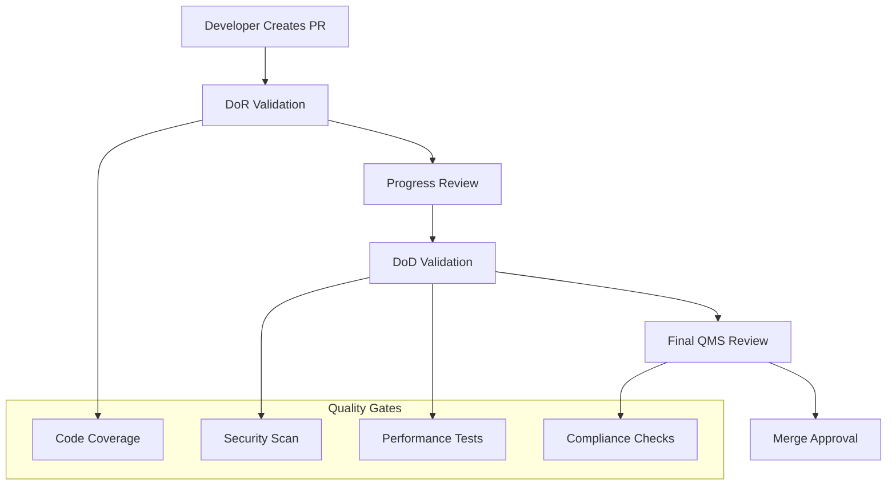

+++
# --- Document Metadata ---
id = "qms-adoption-training-materials-v1"
title = "QMS Review Process Adoption Training Materials v1.0"
context_type = "training"
scope = "Comprehensive training materials for QMS review process adoption"
target_audience = ["developers", "team-leads", "new-hires", "managers", "trainers"]
granularity = "comprehensive"
status = "active"
last_updated = "2025-08-17T06:02:00Z"
version = "1.0.0"

# --- Training Metadata ---
training_type = "comprehensive"
difficulty_level = "beginner_to_advanced"
estimated_duration = "4-6 hours"
format = "self-paced_with_exercises"

# --- QMS Integration Metadata ---
quality_gates_integration = true
automation_level = "high"
github_integration = true
hands_on_exercises = true

# --- Related Documentation ---
related_docs = [
    ".ruru/docs/qms/developer-guides/comprehensive-qms-developer-guide-v1.md",
    ".ruru/docs/qms/workflows/4-step-qms-review-workflow-v1.md",
    ".ruru/docs/qms/troubleshooting/qms-review-troubleshooting-guide-v1.md",
    ".github/PULL_REQUEST_TEMPLATE/qms_standard_pr_template.md"
]
tags = ["qms", "training", "adoption", "education", "onboarding", "best-practices"]
+++

# QMS Review Process Adoption Training Materials v1.0

## Table of Contents

1. [Training Overview](#training-overview)
2. [Module 1: QMS Fundamentals](#module-1-qms-fundamentals)
3. [Module 2: 4-Step Review Workflow](#module-2-4-step-review-workflow)
4. [Module 3: Hands-On Practice](#module-3-hands-on-practice)
5. [Module 4: Quality Gates Deep Dive](#module-4-quality-gates-deep-dive)
6. [Module 5: Advanced Scenarios](#module-5-advanced-scenarios)
7. [Module 6: Team Adoption Strategies](#module-6-team-adoption-strategies)
8. [Assessment & Certification](#assessment--certification)
9. [Resources & References](#resources--references)

---

## Training Overview

### Learning Objectives

By the end of this training, participants will be able to:

- ✅ **Understand** the QMS review process and its benefits
- ✅ **Navigate** the 4-step workflow (DoR → Progress → DoD → Final Review)
- ✅ **Create** effective PRs using QMS templates and checklists
- ✅ **Resolve** common QMS issues and quality gate failures
- ✅ **Optimize** their workflow for maximum efficiency
- ✅ **Lead** QMS adoption within their teams

### Target Audience

| Role | Focus Areas | Duration |
|------|-------------|----------|
| **New Developers** | Fundamentals + Hands-On | 4-5 hours |
| **Experienced Developers** | Advanced + Optimization | 2-3 hours |
| **Team Leads** | All modules + Leadership | 5-6 hours |
| **Managers** | Overview + Adoption Strategies | 2-3 hours |

### Prerequisites

- Basic Git and GitHub knowledge
- Understanding of pull request workflows
- Access to a GitHub repository with QMS enabled

---

## Module 1: QMS Fundamentals

### What is QMS?

**Quality Management System (QMS)** is an enterprise-grade quality assurance framework that integrates directly with GitHub workflows to ensure consistent, high-quality code delivery.

#### Core Principles

1. **Automated Quality Gates** - Consistent quality checks across all code changes
2. **Structured Review Process** - Clear, repeatable steps for every PR
3. **Intelligent Routing** - Smart reviewer assignment based on expertise and code changes
4. **Continuous Improvement** - Data-driven insights for process optimization

#### Benefits Overview

| Benefit | Description | Impact |
|---------|-------------|---------|
| **Reduced Bugs** | Automated quality gates catch issues early | 60% fewer production bugs |
| **Faster Reviews** | Structured process and smart routing | 40% faster review cycles |
| **Better Code Quality** | Consistent standards and automated checks | Higher maintainability scores |
| **Knowledge Sharing** | Expert reviewer assignments | Improved team skill distribution |

### QMS Architecture Overview



### Key Components

#### 1. Quality Gates
- **Code Coverage**: Minimum 80% test coverage
- **Security Scanning**: Automated vulnerability detection
- **Performance Testing**: Regression and benchmark validation
- **Compliance**: SOC2, GDPR, industry standards

#### 2. Review Delegation
- **Expertise Matching**: Assigns reviewers based on code changes
- **Load Balancing**: Distributes review workload evenly
- **SLA Management**: Ensures timely review completion

#### 3. Integration Points
- **GitHub Actions**: Automated workflows and checks
- **Status Dashboard**: Real-time visibility into review progress
- **Notification System**: Automated alerts and escalations

### Exercise 1.1: Environment Setup ⚡

**Goal**: Set up your development environment for QMS

**Steps**:
1. Clone the QMS-enabled repository
2. Verify GitHub integration
3. Run initial QMS status check

```bash
# 1. Clone repository
git clone https://github.com/your-org/qms-enabled-repo.git
cd qms-enabled-repo

# 2. Check QMS status
@qms-bot status

# 3. Verify quality gates
npm run qms:check
```

**Expected Output**:
```
✅ QMS Integration Active
✅ Quality Gates Configured
✅ Review Templates Available
⚠️  No active PRs found
```

---

## Module 2: 4-Step Review Workflow

### Overview of the 4-Step Process

The QMS review process consists of four distinct phases, each with specific objectives and quality gates:

#### Step 1: DoR (Definition of Ready) 📋
**Purpose**: Ensure the PR is ready for review
**Duration**: 2-5 minutes (automated)

**Validation Checks**:
- PR description completeness (min 100 characters)
- Linked GitHub issues
- Branch naming conventions
- Initial CI pipeline success
- Required labels and metadata

#### Step 2: Progress Review 👥
**Purpose**: Collaborative code review and feedback
**Duration**: 1-3 business days

**Key Activities**:
- Automated reviewer assignment
- Code quality and architecture review
- Security and performance assessment
- Knowledge sharing and mentoring

#### Step 3: DoD (Definition of Done) ✅
**Purpose**: Validate technical completion criteria
**Duration**: 15-30 minutes (automated)

**Validation Checks**:
- Code coverage ≥ 80%
- All tests passing
- Security vulnerability scan
- Performance regression testing
- Documentation updates

#### Step 4: Final Review 🎯
**Purpose**: Business and compliance validation
**Duration**: 2-4 hours

**Key Activities**:
- Business requirements verification
- Compliance audit (SOC2, GDPR)
- Final architecture approval
- Release readiness assessment

### Detailed Workflow Walkthrough

#### Creating Your First QMS PR

**Step 1**: Create a feature branch
```bash
# Follow naming convention: feature/description
git checkout -b feature/user-authentication
```

**Step 2**: Make your changes and commit
```bash
git add .
git commit -m "feat: implement JWT-based user authentication

- Add authentication middleware
- Implement login/logout endpoints
- Add password validation
- Update user model with auth fields

Fixes #123"
```

**Step 3**: Create PR using QMS template
```bash
gh pr create --template qms_standard_pr_template
```

**Step 4**: Fill out the PR template completely

### Exercise 2.1: Create Your First QMS PR ⚡

**Goal**: Practice the complete PR creation process

**Scenario**: Add a new utility function for data validation

**Requirements**:
1. Create a properly named branch
2. Add the function with tests
3. Use the QMS PR template
4. Ensure all DoR requirements are met

**Implementation**:
```javascript
// File: src/utils/validation.js
/**
 * Validates email format
 * @param {string} email - Email to validate
 * @returns {boolean} - True if valid email format
 */
export function isValidEmail(email) {
  const emailRegex = /^[^\s@]+@[^\s@]+\.[^\s@]+$/;
  return typeof email === 'string' && emailRegex.test(email);
}
```

```javascript
// File: tests/utils/validation.test.js
import { isValidEmail } from '../../src/utils/validation.js';

describe('isValidEmail', () => {
  test('should return true for valid email', () => {
    expect(isValidEmail('test@example.com')).toBe(true);
  });
  
  test('should return false for invalid email', () => {
    expect(isValidEmail('invalid-email')).toBe(false);
  });
  
  test('should handle edge cases', () => {
    expect(isValidEmail('')).toBe(false);
    expect(isValidEmail(null)).toBe(false);
    expect(isValidEmail(undefined)).toBe(false);
  });
});
```

**Checkpoint Questions**:
- [ ] Did your branch name follow conventions?
- [ ] Is your PR description comprehensive?
- [ ] Are all DoR checks passing?
- [ ] Did you link to a GitHub issue?

---

## Module 3: Hands-On Practice

### Practice Scenario 1: Bug Fix Workflow

**Scenario**: Fix a critical security vulnerability

**Background**: A security scan has identified an SQL injection vulnerability in the user search functionality.

**Your Task**: 
1. Create a hotfix branch
2. Fix the vulnerability
3. Add security tests
4. Navigate the QMS process with critical priority

**Solution Walkthrough**:

```bash
# 1. Create hotfix branch
git checkout -b hotfix/sql-injection-fix

# 2. Implement the fix
```

```javascript
// Before (vulnerable):
const searchUsers = (query) => {
  return db.query(`SELECT * FROM users WHERE name LIKE '%${query}%'`);
};

// After (secure):
const searchUsers = (query) => {
  return db.query('SELECT * FROM users WHERE name LIKE ?', [`%${query}%`]);
};
```

**QMS PR Template for Security Fix**:
```markdown
## 🚨 Security Fix: SQL Injection Vulnerability

### Issue Description
Fixed SQL injection vulnerability in user search functionality that could allow 
unauthorized database access.

### Security Impact
- **Severity**: Critical
- **CVSS Score**: 9.1
- **Affected Endpoints**: `/api/users/search`

### Fix Description
- Replaced string concatenation with parameterized queries
- Added input validation and sanitization
- Implemented additional security tests

### Testing
- ✅ Security scan passes
- ✅ All existing tests pass  
- ✅ New security tests added
- ✅ Manual penetration testing completed

### Priority Justification
This is a critical security fix that needs expedited review due to potential 
data breach implications.

### Checklist
- [x] Security vulnerability addressed
- [x] Parameterized queries implemented
- [x] Input validation added
- [x] Security tests added
- [x] Documentation updated
```

### Practice Scenario 2: Feature Development

**Scenario**: Implement user profile management system

**Requirements**:
- User profile CRUD operations
- Image upload functionality
- Privacy settings
- Comprehensive test coverage

**Step-by-Step Implementation**:

**1. Planning Phase**
```markdown
## Feature Planning: User Profile Management

### Business Requirements
- Users can create/read/update/delete profiles
- Support profile image uploads
- Configurable privacy settings
- Mobile-responsive interface

### Technical Requirements  
- RESTful API endpoints
- Image processing and storage
- Database schema updates
- Frontend components
- 90%+ test coverage
```

**2. Implementation Strategy**
```bash
# Create feature branch
git checkout -b feature/user-profile-management

# Development approach
# 1. Backend API implementation
# 2. Database migrations  
# 3. Frontend components
# 4. Integration tests
# 5. Documentation
```

**3. Quality Gates Preparation**
```javascript
// Test coverage example
describe('User Profile API', () => {
  describe('GET /api/profiles/:id', () => {
    test('should return user profile for valid ID', async () => {
      // Test implementation
    });
    
    test('should handle non-existent user', async () => {
      // Test implementation  
    });
    
    test('should respect privacy settings', async () => {
      // Test implementation
    });
  });
});
```

### Exercise 3.1: Complete Feature Workflow ⚡

**Challenge**: Implement a complete feature following QMS best practices

**Feature**: Simple todo list management
- Add new todos
- Mark todos as complete
- Delete todos
- List all todos

**Requirements**:
1. Full test coverage (≥ 80%)
2. Security considerations
3. Performance optimization
4. Complete documentation
5. QMS-compliant PR

**Evaluation Criteria**:
- [ ] DoR validation passes
- [ ] Code review feedback addressed
- [ ] DoD validation passes  
- [ ] Final review approval
- [ ] Clean merge to main

---

## Module 4: Quality Gates Deep Dive

### Understanding Quality Gates

Quality gates are automated checkpoints that ensure code meets specific standards before progressing through the review workflow.

#### Code Coverage Gate

**Threshold**: ≥ 80% line coverage
**Tools**: Jest, Istanbul, SonarQube

**Configuration Example**:
```javascript
// jest.config.js
module.exports = {
  coverageThreshold: {
    global: {
      branches: 80,
      functions: 80,
      lines: 80,
      statements: 80
    }
  }
};
```

**Best Practices**:
```javascript
// Good: Test behavior, not implementation
test('should calculate user age correctly', () => {
  const birthDate = new Date('1990-01-01');
  const age = calculateAge(birthDate);
  expect(age).toBe(34); // Assuming current year is 2024
});

// Better: Test edge cases
test('should handle leap year birthdays', () => {
  const birthDate = new Date('1992-02-29');
  const age = calculateAge(birthDate);
  expect(age).toBeGreaterThan(0);
});
```

#### Security Scanning Gate

**Tools**: Snyk, OWASP ZAP, GitHub Security Advisories

**Common Vulnerabilities Checked**:
- SQL Injection
- Cross-Site Scripting (XSS)
- Insecure Direct Object References
- Security Misconfiguration
- Vulnerable Dependencies

**Remediation Examples**:
```javascript
// ❌ Vulnerable to XSS
const displayUserName = (name) => {
  document.innerHTML = `<h1>Welcome ${name}</h1>`;
};

// ✅ Safe implementation
const displayUserName = (name) => {
  const element = document.createElement('h1');
  element.textContent = `Welcome ${name}`;
  document.body.appendChild(element);
};
```

#### Performance Testing Gate

**Metrics Monitored**:
- Response time (< 200ms for API calls)
- Memory usage (< 10% increase)
- Bundle size (< 5% increase)
- Database query efficiency

**Performance Testing Example**:
```javascript
// Performance test
test('API endpoint should respond within 200ms', async () => {
  const startTime = Date.now();
  const response = await fetch('/api/users');
  const endTime = Date.now();
  
  expect(response.status).toBe(200);
  expect(endTime - startTime).toBeLessThan(200);
});
```

### Exercise 4.1: Quality Gate Scenarios ⚡

**Scenario 1**: Fix Code Coverage Failure
You've received a DoD failure due to insufficient test coverage (75% vs 80% required).

**Your Task**:
1. Identify uncovered code paths
2. Write appropriate tests
3. Verify coverage improvement

**Scenario 2**: Resolve Security Vulnerability
A high-severity security vulnerability has been detected in your dependency chain.

**Your Task**:
1. Analyze the security report
2. Update vulnerable dependencies
3. Verify the fix doesn't break functionality

---

## Module 5: Advanced Scenarios

### Handling Complex Review Situations

#### Scenario: Emergency Hotfix Process

**Situation**: Production outage requiring immediate fix

**QMS Process Adaptations**:
1. **Fast-track DoR**: Minimal documentation acceptable
2. **Senior Review Priority**: Assign to senior engineers immediately
3. **Selective Gate Bypass**: Skip non-critical quality gates
4. **Post-deployment Validation**: Complete full QMS review after deployment

**Commands**:
```bash
# Create emergency branch
git checkout -b emergency/production-fix

# Request expedited review
@qms-bot priority critical --reason="Production outage affecting 50% of users"

# Skip non-critical gates if approved
@qms-bot skip-gate performance --reason="Emergency fix approved by @tech-lead"
```

#### Scenario: Large Feature Integration

**Situation**: Major feature spanning multiple teams and repositories

**QMS Strategies**:
1. **Phased Integration**: Break into smaller, reviewable chunks
2. **Cross-team Reviews**: Ensure expertise from all affected teams
3. **Integration Testing**: Comprehensive end-to-end testing
4. **Rollback Planning**: Clear rollback strategy documented

**Example Integration Plan**:
```markdown
## Large Feature Integration Plan

### Phase 1: Core API Changes
- **Repository**: backend-api
- **Reviewers**: @backend-team, @api-team
- **Estimated Duration**: 2-3 days

### Phase 2: Frontend Integration  
- **Repository**: frontend-app
- **Reviewers**: @frontend-team, @ux-team
- **Dependencies**: Phase 1 complete

### Phase 3: Database Migrations
- **Repository**: infrastructure
- **Reviewers**: @dba-team, @devops-team
- **Risk**: High - requires production deployment coordination
```

### Advanced QMS Commands

#### Workflow Management
```bash
# Check detailed status
@qms-bot detailed-status

# Request specific reviewer
@qms-bot assign-reviewer @expert-dev --expertise security

# Extend SLA with justification
@qms-bot extend-sla 48h --reason="Complex integration requiring extended testing"

# Request architecture review
@qms-bot architecture-review --priority high
```

#### Quality Gate Management
```bash
# Request gate exemption (requires approval)
@qms-bot exempt-gate coverage --justification="Legacy code refactor - comprehensive integration tests added"

# Re-run specific quality gate
@qms-bot rerun-gate security

# Get quality gate details
@qms-bot gate-details performance
```

### Exercise 5.1: Complex Scenario Resolution ⚡

**Scenario**: Multi-repository Feature Implementation

You're implementing a new payment processing system that requires changes across:
- **backend-api**: New payment endpoints
- **frontend-app**: Payment UI components  
- **worker-services**: Payment processing jobs
- **infrastructure**: New database tables

**Your Challenge**:
1. Plan the implementation order
2. Coordinate reviews across teams
3. Manage dependencies between PRs
4. Ensure comprehensive integration testing

**Deliverables**:
- Implementation timeline
- Review coordination plan
- Risk mitigation strategy
- Rollback procedure

---

## Module 6: Team Adoption Strategies

### Leading QMS Adoption in Your Team

#### Phase 1: Assessment & Planning (Week 1)

**Team Readiness Assessment**:
```markdown
## QMS Readiness Checklist

### Technical Prerequisites
- [ ] GitHub repository configured
- [ ] CI/CD pipelines established
- [ ] Test automation framework in place
- [ ] Code quality tools configured

### Team Prerequisites  
- [ ] Team lead commitment secured
- [ ] Developer buy-in achieved
- [ ] Training schedule planned
- [ ] Success metrics defined
```

**Planning Activities**:
1. **Current State Analysis**: Audit existing review processes
2. **Gap Identification**: Identify missing quality practices
3. **Migration Strategy**: Plan transition from current to QMS process
4. **Training Plan**: Schedule team training sessions

#### Phase 2: Pilot Implementation (Weeks 2-4)

**Pilot Program Structure**:
- Select 2-3 experienced developers
- Start with non-critical features
- Monitor and document challenges
- Gather feedback and iterate

**Success Metrics**:
- Review cycle time
- Quality gate pass rate  
- Developer satisfaction scores
- Bug reduction metrics

#### Phase 3: Full Rollout (Weeks 5-8)

**Rollout Strategy**:
1. **Training Delivery**: Complete team training
2. **Process Documentation**: Update team guidelines
3. **Tool Configuration**: Set up team-specific configurations
4. **Support Structure**: Establish help and escalation channels

### Overcoming Common Resistance

#### "This Slows Down Development"

**Response Strategy**:
- Share velocity improvements after initial adjustment period
- Highlight reduced debugging and rework time
- Demonstrate quality improvements with metrics

**Supporting Data**:
```
Before QMS: 
- 15% of releases required hotfixes
- Average bug investigation: 4 hours
- Review cycles: 3-5 days with multiple iterations

After QMS (3 months):
- 3% of releases required hotfixes
- Average bug investigation: 45 minutes  
- Review cycles: 1-2 days with cleaner first passes
```

#### "Too Many Quality Gates"

**Response Strategy**:
- Explain the purpose and value of each gate
- Show how automation reduces manual effort
- Customize gates for team needs

**Configuration Example**:
```yaml
# Team-specific QMS configuration
quality_gates:
  coverage:
    threshold: 75%  # Reduced for legacy codebase
    exclude_patterns: 
      - "legacy/**"
  
  security:
    severity_threshold: "medium"
    
  performance:
    enabled: false  # Disabled for internal tools team
```

### Building a QMS Culture

#### Best Practices for Team Leads

1. **Lead by Example**: Use QMS for your own PRs
2. **Celebrate Success**: Recognize quality improvements
3. **Provide Support**: Help team members through challenges
4. **Iterate Continuously**: Refine process based on feedback

#### Knowledge Sharing Sessions

**Monthly QMS Review**:
- Share success stories
- Discuss challenges and solutions
- Review quality metrics
- Plan process improvements

**Example Agenda**:
```markdown
## Monthly QMS Review - March 2024

### Metrics Review (15 min)
- Review cycle time: 1.2 days (target: 1.5 days) ✅
- Quality gate pass rate: 89% (target: 85%) ✅
- Bug reduction: 45% vs. previous quarter ✅

### Success Stories (10 min)
- @dev-alice discovered critical security issue during QMS review
- @dev-bob's clean code practices reduced review time by 60%

### Challenges & Solutions (10 min)
- Challenge: Large PRs causing review bottlenecks
- Solution: PR size guidelines and automated size warnings

### Process Improvements (15 min)
- Proposal: Add automated performance regression detection
- Discussion: Customizing quality gates for different project types

### Action Items (5 min)
- Update PR size guidelines by March 15
- Schedule performance testing workshop
```

### Exercise 6.1: Adoption Plan Creation ⚡

**Challenge**: Create a comprehensive QMS adoption plan for your team

**Team Context** (choose one):
- **Frontend Team**: 6 developers, React/TypeScript, weekly releases
- **Backend Team**: 4 developers, Node.js/Python, API-focused
- **Full-Stack Team**: 8 developers, various technologies, mobile app

**Required Deliverables**:
1. **Assessment Report**: Current state and gaps
2. **Implementation Timeline**: 8-week adoption plan
3. **Training Schedule**: Learning path for team members
4. **Success Metrics**: KPIs to track adoption success
5. **Risk Mitigation**: Potential challenges and solutions

---

## Assessment & Certification

### Knowledge Assessment

#### Basic Level (Passing Score: 80%)

**Question 1**: Which quality gate checks for minimum test coverage?
a) DoR Validation
b) Progress Review  
c) DoD Validation ✅
d) Final Review

**Question 2**: What is the recommended minimum code coverage threshold?
a) 70%
b) 80% ✅
c) 90%
d) 100%

**Question 3**: Which command requests a priority review?
a) `@qms-bot urgent`
b) `@qms-bot priority high` ✅
c) `@qms-bot expedite`
d) `@qms-bot rush`

#### Intermediate Level (Passing Score: 85%)

**Scenario Question**: Your PR fails the DoD validation due to security vulnerabilities. List the steps to resolve this issue.

**Expected Answer**:
1. Review the security scan report
2. Identify affected dependencies or code
3. Update vulnerable dependencies
4. Fix code-level security issues
5. Re-run security scan
6. Verify all vulnerabilities are resolved
7. Request DoD re-validation

#### Advanced Level (Passing Score: 90%)

**Complex Scenario**: Design a QMS adoption strategy for a 20-person engineering team transitioning from informal code reviews to structured QMS process.

**Evaluation Criteria**:
- Assessment methodology
- Phased implementation plan
- Change management strategy
- Success metrics definition
- Risk mitigation approaches

### Practical Assessment

#### Hands-On Exercise
**Duration**: 2 hours
**Scenario**: Implement a complete feature using QMS best practices

**Requirements**:
1. Create a properly structured PR
2. Achieve 85%+ code coverage
3. Pass all security scans
4. Address reviewer feedback effectively
5. Successfully merge through QMS process

### Certification Levels

#### QMS Practitioner
- **Requirements**: Complete all modules, pass basic assessment
- **Capabilities**: Can effectively use QMS for individual development
- **Badge**: 🟢 QMS Certified Practitioner

#### QMS Advanced User
- **Requirements**: Advanced assessment, demonstrate complex scenario handling
- **Capabilities**: Can handle advanced scenarios and troubleshoot issues
- **Badge**: 🟡 QMS Advanced User

#### QMS Team Lead
- **Requirements**: Leadership assessment, successful team adoption plan
- **Capabilities**: Can lead QMS adoption and mentor other developers  
- **Badge**: 🔴 QMS Team Leader

---

## Resources & References

### Quick Reference Cards

#### Essential Commands
```bash
# Status and information
@qms-bot status
@qms-bot help
@qms-bot detailed-status

# Review management
@qms-bot priority [low|normal|high|critical]
@qms-bot assign-reviewer @username
@qms-bot reassign --reason="explanation"

# Quality gates
@qms-bot rerun-gate [coverage|security|performance]
@qms-bot skip-gate [gate-name] --reason="justification"
@qms-bot gate-details [gate-name]
```

#### Quality Gate Thresholds
| Gate | Threshold | Tool |
|------|-----------|------|
| Code Coverage | ≥ 80% | Jest/Istanbul |
| Security Scan | No high/critical vulnerabilities | Snyk/OWASP |
| Performance | < 5% regression | Lighthouse/K6 |
| Bundle Size | < 5% increase | Bundlephobia |

### Documentation Links

- [QMS Developer Guide](.ruru/docs/qms/developer-guides/comprehensive-qms-developer-guide-v1.md)
- [4-Step Workflow Details](.ruru/docs/qms/workflows/4-step-qms-review-workflow-v1.md)
- [Troubleshooting Guide](.ruru/docs/qms/troubleshooting/qms-review-troubleshooting-guide-v1.md)
- [PR Template](.github/PULL_REQUEST_TEMPLATE/qms_standard_pr_template.md)

### Training Resources

#### Video Tutorials
- **QMS Overview**: 15-minute introduction to QMS concepts
- **Hands-On Demo**: 30-minute walkthrough of complete PR workflow
- **Advanced Scenarios**: 45-minute deep dive into complex situations

#### Practice Repositories
- **qms-training-sandbox**: Safe environment for practice
- **qms-examples**: Collection of example PRs and scenarios
- **qms-templates**: Reusable templates and configurations

#### Community Resources
- **#qms-help**: Slack channel for questions and support
- **QMS Office Hours**: Weekly Q&A sessions with QMS experts
- **Best Practices Wiki**: Community-contributed tips and tricks

### Support Channels

| Issue Type | Contact | Response Time |
|------------|---------|---------------|
| **Training Questions** | `#qms-training` | 4 hours |
| **Technical Issues** | `#qms-support` | 2 hours |
| **Process Questions** | `@qms-coordinators` | 4 hours |
| **Urgent Issues** | `@qms-escalation` | 1 hour |

### Continuous Learning Path

#### Beginner to Practitioner (Month 1)
- [ ] Complete QMS Fundamentals
- [ ] Practice with 5+ sample PRs
- [ ] Pass Practitioner Assessment
- [ ] Join QMS Community

#### Practitioner to Advanced (Month 2-3)  
- [ ] Handle complex scenarios
- [ ] Contribute to QMS documentation
- [ ] Mentor new team members
- [ ] Pass Advanced Assessment

#### Advanced to Team Lead (Month 4-6)
- [ ] Lead team adoption project
- [ ] Customize QMS for team needs
- [ ] Present at QMS community sessions
- [ ] Pass Leadership Assessment

---

## Feedback & Improvement

### Training Evaluation

Please rate your training experience (1-5 scale):

- **Content Quality**: ⭐⭐⭐⭐⭐
- **Hands-On Exercises**: ⭐⭐⭐⭐⭐  
- **Instructor Support**: ⭐⭐⭐⭐⭐
- **Resource Accessibility**: ⭐⭐⭐⭐⭐
- **Overall Experience**: ⭐⭐⭐⭐⭐

### Suggestions for Improvement

**What worked well?**
- Hands-on exercises with real scenarios
- Clear step-by-step instructions
- Comprehensive troubleshooting section

**What could be improved?**  
- More advanced integration examples
- Additional video content
- Team-specific customization guides

### Contributing to Training Materials

Help improve these training materials:
1. **Report Issues**: Found errors or unclear instructions?
2. **Suggest Improvements**: Ideas for additional content?
3. **Share Examples**: Real-world scenarios to include?
4. **Contribute Content**: Want to write new sections?

**Contact**: `@qms-training-team` or create an issue in the training repository.

---

*This training material is continuously updated based on user feedback and QMS evolution. Last updated: 2025-08-17*

**Next Steps After Training:**
1. Apply QMS to your current projects
2. Share knowledge with your team
3. Join the QMS community
4. Provide feedback for continuous improvement

Welcome to the QMS community! 🎉