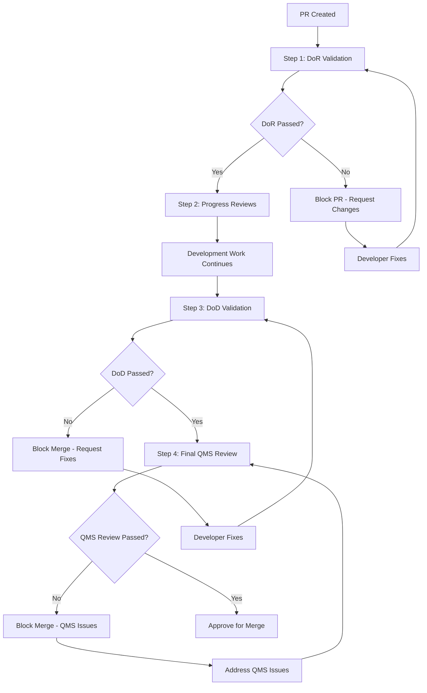

+++
# --- Basic Metadata ---
id = "qms-4-step-review-workflow-v1"
title = "4-Step QMS Review Workflow Design"
context_type = "design"
scope = "QMS Phase 2.3 - Comprehensive GitHub PR integration workflow"
target_audience = ["devops", "qms", "development-leads", "security"]
granularity = "detailed"
status = "draft"
created_date = "2025-08-16T21:27:00Z"
updated_date = "2025-08-16T21:27:00Z"
author = "lead-devops"
version = "1.0"
tags = ["qms", "github", "pr-workflow", "devops", "ci-cd", "quality-gates", "automation"]
related_context = [
    ".ruru/tasks/QMS_PHASE2/TASK-QMS-20250816-212102.md",
    ".ruru/modes/qms-dor-validator/qms-dor-validator.mode.md", 
    ".ruru/modes/qms-dod-validator/qms-dod-validator.mode.md",
    ".ruru/modes/qms-code-reviewer/qms-code-reviewer.mode.md",
    ".ruru/modes/qms-quality-coordinator/qms-quality-coordinator.mode.md"
]
relevance = "Critical: Defines the core QMS review process for GitHub PR integration"
+++

# 4-Step QMS Review Workflow Design v1.0

## Overview

This document defines the comprehensive 4-Step QMS Review Workflow that integrates Quality Management System processes with GitHub Pull Request automation, providing automated quality gates, intelligent review delegation, and comprehensive compliance tracking.

## Architecture Overview

### 4-Step Process Flow



## Step 1: Definition of Ready (DoR) Validation

### Purpose
Ensure that incoming pull requests meet minimum readiness criteria before development work can proceed.

### Trigger Events
- Pull Request creation
- Pull Request updates (commits, title, description changes)
- Manual re-validation request

### Automated Validations

#### 1. PR Metadata Validation
- **Title Format**: Must follow conventional commit format (feat/fix/docs/etc.)
- **Description Requirements**: Minimum description length, issue links, acceptance criteria
- **Labels**: Required QMS tracking labels present
- **Milestone/Project**: Associated with active milestone or project board

#### 2. Branch Strategy Compliance
- **Source Branch**: Follows naming conventions (feature/, bugfix/, hotfix/)
- **Target Branch**: Appropriate target (main, develop, release/*)
- **Branch Protection**: Source branch follows protection rules

#### 3. Initial Code Quality Checks
- **Syntax Validation**: Code compiles without syntax errors
- **Linting**: Passes automated linting rules
- **Security Scan**: Initial security vulnerability scan (SAST)
- **Dependency Check**: No known vulnerable dependencies

#### 4. QMS Template Compliance
- **Code Review Template**: Uses required QMS code review template
- **Testing Evidence**: Initial test plan or testing approach documented
- **Impact Assessment**: Business impact and risk assessment completed

### Quality Gates
- **Required Status Checks**: All automated validations must pass
- **Manual Override**: QMS Quality Coordinator can override with justification
- **Blocking Conditions**: PR cannot proceed to development without DoR approval

### GitHub Integration
```yaml
# .github/workflows/qms-dor-validation.yml
name: QMS DoR Validation
on:
  pull_request:
    types: [opened, edited, synchronize]
    
jobs:
  dor-validation:
    runs-on: ubuntu-latest
    steps:
      - name: DoR Metadata Check
        uses: ./.github/actions/qms-dor-validator
      - name: Code Quality Gates
        uses: ./.github/actions/qms-code-quality
      - name: Update QMS Status
        uses: ./.github/actions/qms-status-update
```

## Step 2: Progress Reviews

### Purpose
Continuous quality monitoring during active development with automated and human oversight.

### Trigger Events
- New commits pushed to PR branch
- Scheduled periodic reviews (daily/weekly based on PR age)
- Manual progress review request
- Significant file changes or architectural modifications

### Automated Progress Monitoring

#### 1. Continuous Integration Checks
- **Build Status**: All builds passing across target environments
- **Test Coverage**: Maintaining or improving test coverage metrics
- **Performance Impact**: Performance regression testing
- **Integration Tests**: End-to-end test execution results

#### 2. Code Quality Trends
- **Code Complexity**: Cyclomatic complexity tracking
- **Technical Debt**: SonarQube/CodeClimate metrics
- **Documentation**: Code documentation coverage
- **Refactoring Impact**: Code churn and stability metrics

#### 3. Security Monitoring
- **Dynamic Analysis**: DAST scanning for web applications
- **Container Security**: Container image vulnerability scanning
- **Secrets Detection**: Prevent credential leakage
- **Compliance Drift**: Infrastructure compliance monitoring

### Human Review Checkpoints
- **Architecture Review**: For significant structural changes
- **Security Review**: For security-sensitive modifications
- **Performance Review**: For performance-critical changes
- **UX Review**: For user-facing feature changes

### Review Delegation Logic
```python
# Intelligent reviewer assignment algorithm
def assign_reviewers(pr_context):
    reviewers = []
    
    # Code ownership based assignment
    if pr_context.files_modified:
        reviewers.extend(get_code_owners(pr_context.files_modified))
    
    # Expertise-based assignment  
    if pr_context.has_security_changes:
        reviewers.append(get_security_lead())
    
    if pr_context.has_performance_impact:
        reviewers.append(get_performance_expert())
        
    # Load balancing
    reviewers = balance_review_load(reviewers)
    
    # QMS quality coordinator always involved
    reviewers.append(get_qms_coordinator())
    
    return reviewers
```

## Step 3: Definition of Done (DoD) Validation

### Purpose
Comprehensive validation that all completion criteria are met before final review.

### Trigger Events
- Developer marks PR as "Ready for Review"
- All required status checks passing
- Manual DoD validation request

### Comprehensive Validation Checks

#### 1. Code Completion Criteria
- **Feature Completeness**: All acceptance criteria implemented
- **Test Coverage**: Minimum test coverage thresholds met (unit: 80%, integration: 70%)
- **Documentation**: Code documentation, README updates, API docs complete
- **Error Handling**: Proper error handling and logging implemented

#### 2. Quality Assurance Validation
- **Manual Testing**: QA sign-off for functional testing
- **Accessibility**: WCAG compliance for UI changes
- **Cross-browser/Platform**: Compatibility testing results
- **Performance**: Performance benchmarks within acceptable limits

#### 3. Security and Compliance
- **Security Review**: Security team approval for security-relevant changes
- **Compliance Check**: Regulatory compliance validation (GDPR, SOX, etc.)
- **Data Privacy**: Data handling compliance verification
- **Audit Trail**: Complete audit log for changes

#### 4. Deployment Readiness
- **Migration Scripts**: Database migrations tested and reviewed
- **Configuration**: Environment configuration changes documented
- **Rollback Plan**: Deployment rollback strategy defined
- **Monitoring**: Monitoring and alerting updates implemented

### Quality Gates Configuration
```json
{
  "doD_requirements": {
    "code_coverage": {
      "unit_tests": 80,
      "integration_tests": 70,
      "e2e_tests": 50
    },
    "security_scan": {
      "critical_vulnerabilities": 0,
      "high_vulnerabilities": 0,
      "medium_vulnerabilities": 5
    },
    "performance": {
      "response_time_degradation": "5%",
      "memory_usage_increase": "10%"
    },
    "documentation": {
      "api_docs_coverage": 95,
      "code_comments_ratio": 15
    }
  }
}
```

## Step 4: Final QMS Review

### Purpose
Comprehensive quality management system review ensuring enterprise-grade quality and compliance.

### Trigger Events
- All DoD validations passed
- QMS Quality Coordinator review requested
- Pre-merge final approval workflow

### QMS Review Dimensions

#### 1. Quality Assessment Matrix
- **Code Quality Score**: Aggregated quality metrics (1-10 scale)
- **Risk Assessment**: Business and technical risk evaluation
- **Maintainability Index**: Long-term maintenance considerations
- **Architecture Alignment**: Consistency with system architecture

#### 2. Compliance Verification
- **Regulatory Compliance**: Industry-specific requirements (HIPAA, SOX, PCI-DSS)
- **Internal Policy**: Company coding standards and policies
- **License Compliance**: Open source license compatibility
- **Data Governance**: Data classification and handling compliance

#### 3. Process Compliance
- **Change Management**: Proper change approval process followed
- **Documentation Standards**: All required documentation complete
- **Training Requirements**: Developer training and certification validation
- **Audit Requirements**: Audit trail completeness and accuracy

#### 4. Business Impact Analysis
- **Feature Value**: Business value delivery assessment
- **User Impact**: End-user experience impact evaluation
- **Operational Impact**: Production operations impact assessment
- **Strategic Alignment**: Alignment with business objectives

### Final Approval Workflow
```yaml
# Final QMS Review Process
qms_final_review:
  sequential_approvals:
    - qms_quality_coordinator: required
    - security_lead: required_if_security_changes
    - architecture_lead: required_if_architectural_changes
    - product_owner: required_if_feature_changes
  
  automated_checks:
    - compliance_scan: required
    - final_security_scan: required
    - performance_regression: required
    - documentation_completeness: required
  
  override_conditions:
    - emergency_hotfix: requires_cto_approval
    - business_critical: requires_vp_engineering_approval
```

## State Transitions and Decision Points

### PR Status States
1. **Draft** - Initial development, DoR not yet validated
2. **DoR Review** - DoR validation in progress
3. **In Progress** - Active development with progress monitoring
4. **DoD Review** - DoD validation in progress  
5. **QMS Review** - Final QMS review in progress
6. **Approved** - Ready for merge
7. **Blocked** - Issues require resolution
8. **Merged** - Successfully merged to target branch

### Automated State Transitions
```python
class QMSWorkflowStateMachine:
    def __init__(self):
        self.states = {
            'draft': ['dor_review'],
            'dor_review': ['in_progress', 'blocked'],
            'in_progress': ['dod_review', 'blocked'],
            'dod_review': ['qms_review', 'blocked'],
            'qms_review': ['approved', 'blocked'],
            'approved': ['merged'],
            'blocked': ['dor_review', 'in_progress', 'dod_review', 'qms_review'],
            'merged': []
        }
    
    def transition(self, current_state, trigger_event):
        # Implement state transition logic
        pass
```

## Integration Points

### GitHub Actions Workflows
- **DoR Validation Workflow**: `.github/workflows/qms-dor-validation.yml`
- **Progress Monitoring Workflow**: `.github/workflows/qms-progress-monitoring.yml`
- **DoD Validation Workflow**: `.github/workflows/qms-dod-validation.yml`
- **Final Review Workflow**: `.github/workflows/qms-final-review.yml`

### Branch Protection Rules
```json
{
  "protection_rules": {
    "main": {
      "required_status_checks": [
        "qms/dor-validation",
        "qms/dod-validation", 
        "qms/final-review"
      ],
      "required_reviews": {
        "required_approving_review_count": 2,
        "dismiss_stale_reviews": true,
        "require_code_owner_reviews": true
      },
      "enforce_admins": true,
      "restrictions": {
        "users": [],
        "teams": ["qms-coordinators", "senior-developers"]
      }
    }
  }
}
```

### Webhook Integration
- **PR Events**: Create, update, ready_for_review, review_requested
- **Status Check Events**: Status check completion, failure
- **Review Events**: Review submitted, approved, changes_requested
- **Merge Events**: Merge completed, merge blocked

## Metrics and Monitoring

### Key Performance Indicators
- **Review Cycle Time**: Average time from PR creation to merge
- **Quality Gate Pass Rate**: Percentage of PRs passing each quality gate
- **Defect Escape Rate**: Production defects from merged PRs
- **Review Effectiveness**: Issues caught per review stage

### Dashboards and Reporting
- **Real-time QMS Dashboard**: Current PR status across all repositories
- **Quality Trends Report**: Historical quality metrics and trends
- **Compliance Report**: Regulatory and policy compliance status
- **Team Performance Metrics**: Individual and team review performance

## Configuration Management

### Environment-Specific Configurations
- **Development**: Relaxed thresholds, faster feedback
- **Staging**: Production-like validation, full test suite
- **Production**: Maximum security, compliance validation

### Repository-Specific Customization
- **Quality Thresholds**: Per-repository quality requirements
- **Review Requirements**: Different reviewer requirements by repository
- **Compliance Rules**: Repository-specific compliance requirements
- **Automation Level**: Configurable automation vs manual review balance

## Rollout and Adoption Strategy

### Phase 1: Pilot Implementation
- Select 2-3 high-impact repositories
- Basic automation with manual fallbacks
- Team training and feedback collection

### Phase 2: Enhanced Automation  
- Full automation implementation
- Advanced delegation algorithms
- Integration with existing tools

### Phase 3: Organization-wide Deployment
- All repositories migrated
- Advanced analytics and reporting
- Continuous optimization and improvement

## Success Metrics

### Quality Improvements
- **Defect Reduction**: 40% reduction in production defects
- **Security Vulnerabilities**: 60% reduction in security issues
- **Code Coverage**: Consistent 80%+ unit test coverage
- **Documentation**: 95%+ API documentation coverage

### Process Efficiency
- **Review Cycle Time**: 50% reduction in average review time
- **Reviewer Load**: Balanced review distribution across team
- **Automation Rate**: 80% of quality checks automated
- **Compliance Rate**: 99%+ regulatory compliance adherence

## Risk Mitigation

### Technical Risks
- **Tool Integration Failures**: Robust error handling and fallbacks
- **Performance Impact**: Optimized workflows and parallel execution
- **False Positives**: Tunable thresholds and manual override capabilities

### Process Risks  
- **Team Adoption**: Comprehensive training and gradual rollout
- **Review Bottlenecks**: Load balancing and escalation procedures
- **Quality Regression**: Continuous monitoring and adjustment

## Conclusion

The 4-Step QMS Review Workflow provides a comprehensive, automated, and scalable approach to quality management in software development. By integrating with GitHub's native PR workflow and providing intelligent automation with human oversight, this system ensures consistent quality while maintaining development velocity.

The workflow's flexible configuration options and gradual rollout strategy ensure successful adoption across different teams and repositories while maintaining compliance with enterprise quality and regulatory requirements.